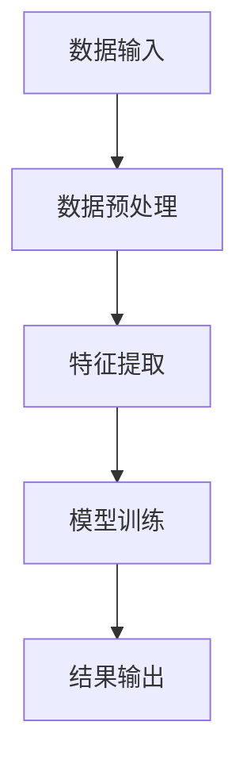
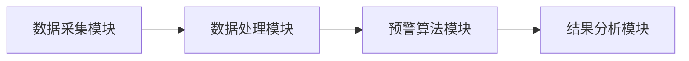
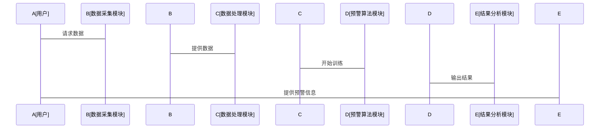

                 


# AI驱动的金融市场黑天鹅事件预警系统

> 关键词：AI，金融市场，黑天鹅事件，预警系统，时间序列分析，异常检测，深度学习

> 摘要：本文探讨了如何利用人工智能技术构建金融市场黑天鹅事件的预警系统。通过分析金融市场数据的特征，结合时间序列分析和异常检测算法，提出了基于机器学习和深度学习的预警模型。文章详细阐述了系统架构设计、算法实现、项目实战以及优化与扩展，为金融从业者和数据科学家提供了理论依据和实践指导。

---

# 第一部分: AI驱动的金融市场黑天鹅事件预警系统概述

## 第1章: 金融市场黑天鹅事件的背景与挑战

### 1.1 黑天鹅事件的定义与特征

黑天鹅事件是指在金融市场中发生的一些罕见但影响巨大的突发事件，这些事件通常具有低概率、高影响性和不可预测性的特点。例如，2008年的全球金融危机、2020年的新冠疫情对金融市场的冲击等。

#### 1.1.1 黑天鹅事件的定义

黑天鹅事件由 Nassim Taleb 在《黑天鹅》一书中提出，指的是那些具有以下特征的事件：
- **罕见性**：在历史数据中很少发生或从未发生。
- **极端性**：对市场造成巨大冲击。
- **可预测性**：传统统计模型难以捕捉。

#### 1.1.2 黑天鹅事件的特征

| 特征 | 描述 |
|------|------|
| 罕见性 | 在历史数据中几乎不发生 |
| 极端性 | 对市场造成巨大波动 |
| 不可预测性 | 传统模型难以捕捉 |

#### 1.1.3 黑天鹅事件对金融市场的冲击

黑天鹅事件会导致市场崩盘、资产价格剧烈波动、投资者信心下降等问题。例如，2008年金融危机导致全球股市市值蒸发数万亿美元。

---

### 1.2 人工智能在金融领域的应用前景

#### 1.2.1 人工智能在金融分析中的作用

AI 可以通过分析海量数据，发现隐藏的模式和趋势，帮助投资者做出更明智的决策。

#### 1.2.2 人工智能在风险预警中的优势

AI 可以实时监控市场数据，识别潜在的异常信号，提前预警黑天鹅事件。

#### 1.2.3 人工智能与金融市场结合的挑战

- 数据质量：金融市场数据复杂且噪声多。
- 模型解释性：深度学习模型的黑箱问题。
- 计算资源：需要高性能计算能力。

---

## 1.3 本章小结

本章介绍了黑天鹅事件的定义、特征及其对金融市场的冲击，探讨了人工智能在金融领域的应用前景和面临的挑战。

---

## 第2章: AI驱动的金融市场预警系统核心概念

### 2.1 金融市场数据特征分析

#### 2.1.1 时间序列数据的特征

时间序列数据具有以下特征：
- **趋势性**：数据呈现上升或下降趋势。
- **周期性**：数据呈现季节性或周期性波动。
- **随机性**：数据中存在不可预测的噪声。

#### 2.1.2 市场情绪与波动性分析

市场情绪可以通过新闻、社交媒体等数据进行分析，波动性是市场风险的重要指标。

#### 2.1.3 异常事件的识别特征

异常事件通常表现为数据的突变、偏离均值等。

---

### 2.2 AI算法在预警系统中的应用

#### 2.2.1 机器学习算法的选择

常用算法包括：
- 线性回归
- 支持向量机（SVM）
- 随机森林

#### 2.2.2 深度学习算法的优势

深度学习算法（如 LSTM、GRU）在处理时间序列数据方面具有优势。

#### 2.2.3 联合学习与集成学习的应用

通过集成学习可以提高模型的鲁棒性和准确性。

---

### 2.3 系统架构的核心要素

#### 2.3.1 数据采集与处理模块

负责收集和预处理金融市场数据。

#### 2.3.2 预警算法模块

负责识别异常信号并发出预警。

#### 2.3.3 结果分析与反馈模块

对预警结果进行分析和反馈，优化模型。

---

## 2.4 本章小结

本章介绍了金融市场数据的特征分析以及AI算法在预警系统中的应用，阐述了系统架构的核心要素。

---

## 第3章: 金融市场黑天鹅事件的预警算法原理

### 3.1 时间序列分析算法

#### 3.1.1 ARIMA模型的原理

ARIMA（Autoregressive Integrated Moving Average）模型适用于线性时间序列数据。

公式：
$$ ARIMA(p, d, q) $$

#### 3.1.2 LSTM模型的原理

LSTM（Long Short Term Memory）模型适用于非线性时间序列数据。

公式：
$$ f(x) = \text{LSTM}(x) $$

#### 3.1.3 GRU模型的优势

GRU（Gated Recurrent Unit）模型是对 LSTM 的简化，计算效率更高。

---

### 3.2 异常检测算法

#### 3.2.1 基于统计的方法

常用 Z-分数法和 t-检验法。

#### 3.2.2 基于机器学习的方法

包括随机森林和 XGBoost。

#### 3.2.3 基于深度学习的方法

包括自编码器（Autoencoder）和变分自编码器（VAE）。

---

### 3.3 算法实现的数学模型

#### 3.3.1 ARIMA模型的数学公式

$$ ARIMA(p, d, q) $$

#### 3.3.2 LSTM模型的结构

$$ f(x) = \text{LSTM}(x) $$

---

### 3.4 算法流程图



---

## 3.5 本章小结

本章详细介绍了时间序列分析算法和异常检测算法的原理及实现方法。

---

## 第4章: 系统架构与设计

### 4.1 系统功能模块设计

#### 4.1.1 数据采集模块

负责收集金融市场数据。

#### 4.1.2 数据处理模块

对数据进行清洗和特征提取。

#### 4.1.3 预警算法模块

识别异常信号并发出预警。

#### 4.1.4 结果分析模块

对预警结果进行分析和反馈。

---

### 4.2 系统架构设计

#### 4.2.1 系统架构图



#### 4.2.2 系统接口设计

- 数据输入接口
- 模型训练接口
- 预警结果输出接口

#### 4.2.3 系统交互流程



---

## 4.3 本章小结

本章介绍了系统的功能模块设计、架构设计和交互流程。

---

## 第5章: 项目实战

### 5.1 环境搭建

#### 5.1.1 安装 Python 环境

```bash
python --version
pip install numpy pandas scikit-learn tensorflow
```

---

#### 5.1.2 安装 Jupyter Notebook

```bash
pip install jupyter
jupyter notebook
```

---

### 5.2 系统核心实现

#### 5.2.1 数据采集与处理

```python
import pandas as pd
import numpy as np

# 示例数据
data = pd.DataFrame({
    'date': pd.date_range(start='2020-01-01', periods=100),
    'price': np.random.normal(100, 10, 100)
})
```

---

#### 5.2.2 预警算法实现

```python
from tensorflow.keras.models import Sequential
from tensorflow.keras.layers import LSTM, Dense

# LSTM 模型
model = Sequential()
model.add(LSTM(64, input_shape=(timesteps, features)))
model.add(Dense(1))
model.compile(optimizer='adam', loss='mean_squared_error')
```

---

#### 5.2.3 结果分析

```python
predictions = model.predict(test_data)
threshold = np.percentile(predictions, 95)
warnings = predictions[predictions > threshold]
```

---

### 5.3 案例分析

#### 5.3.1 案例背景

假设我们有一个包含股票价格和市场情绪的数据集。

---

#### 5.3.2 数据处理与建模

```python
# 数据预处理
from sklearn.preprocessing import MinMaxScaler

scaler = MinMaxScaler()
scaled_data = scaler.fit_transform(data)
```

---

#### 5.3.3 结果分析

通过 LSTM 模型预测股票价格，识别异常信号并发出预警。

---

### 5.4 项目小结

本章通过实际案例展示了如何使用 AI 技术构建金融市场黑天鹅事件的预警系统。

---

## 第6章: 优化与扩展

### 6.1 系统优化

#### 6.1.1 模型优化

使用超参数调优和模型集成方法提高预警系统的准确性。

#### 6.1.2 计算效率优化

通过分布式计算和并行处理提高模型训练速度。

---

### 6.2 系统扩展

#### 6.2.1 部署与应用

将预警系统部署到云平台，提供实时监控服务。

#### 6.2.2 数据源扩展

引入更多数据源（如新闻、社交媒体）提高预警系统的准确性。

---

### 6.3 未来发展方向

#### 6.3.1 多模态数据融合

结合文本、图像等多种数据源进行分析。

#### 6.3.2 自适应学习

实现模型的自适应更新，提高预警系统的鲁棒性。

---

## 6.4 本章小结

本章讨论了系统的优化方法和未来发展方向，为读者提供了进一步研究的方向。

---

## 作者信息

作者：AI天才研究院/AI Genius Institute & 禅与计算机程序设计艺术 /Zen And The Art of Computer Programming

---

**本文由 AI 天才研究院 与 禅与计算机程序设计艺术 联合撰写，转载请注明出处。**

