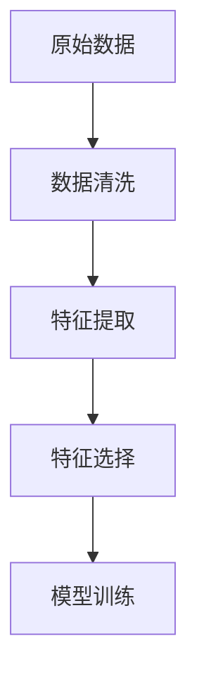
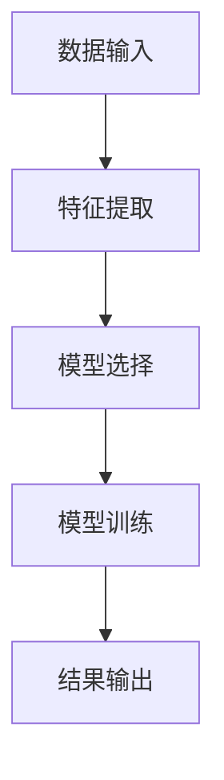
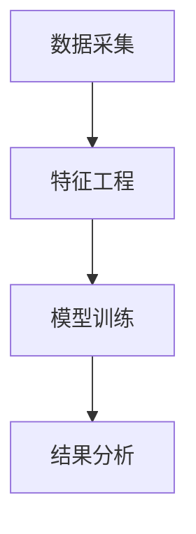

                 


# AI驱动的金融欺诈检测系统

**关键词**：AI，金融欺诈，机器学习，数据预处理，特征工程，深度学习，系统架构

**摘要**：  
随着金融行业的数字化转型，金融欺诈问题日益复杂化和多样化。传统的欺诈检测方法已难以应对新型欺诈手段。基于人工智能（AI）的金融欺诈检测系统通过机器学习、深度学习等技术，能够高效识别异常交易和潜在欺诈行为，显著提升了金融系统的安全性。本文将系统地探讨AI驱动的金融欺诈检测系统的背景、核心概念、算法原理、系统架构以及实际应用，并通过案例分析展示其实际价值。

---

## 第一部分: 金融欺诈检测的背景与挑战

### 第1章: 金融欺诈的定义与类型

#### 1.1 金融欺诈的定义与类型
金融欺诈是指通过欺骗性手段非法获取或占用他人或机构的财产、信息或信用的行为。金融欺诈的表现形式多样，包括信用卡欺诈、网络诈骗、洗钱、虚假交易等。这些行为不仅损害了金融机构的利益，还威胁到用户的财务安全和社会经济秩序。

#### 1.2 AI在金融欺诈检测中的作用
传统的金融欺诈检测方法主要依赖规则引擎和基于统计的分析，但这些方法在面对复杂和隐蔽的欺诈行为时显得力不从心。AI技术的引入，特别是机器学习和深度学习算法，能够从海量数据中发现隐藏的模式和异常行为，从而实现更精准的欺诈检测。

#### 1.3 金融欺诈检测的核心价值
AI驱动的金融欺诈检测系统能够实时分析交易数据，快速识别潜在的欺诈行为，并通过反馈机制优化检测模型。这不仅提高了检测效率，还降低了金融机构的损失。

---

## 第二部分: AI驱动的金融欺诈检测系统的核心概念与技术

### 第2章: 数据预处理与特征工程

#### 2.1 数据预处理
数据预处理是金融欺诈检测系统的基础步骤，主要包括以下内容：
- **数据清洗**：去除噪声数据、填补缺失值。
- **数据标准化**：将数据归一化到统一范围内。
- **数据增强**：通过生成虚拟数据增强训练集。

#### 2.2 特征工程
特征工程是将原始数据转化为对模型友好的特征表示的过程，包括：
- **特征选择**：筛选出对欺诈检测最有影响力的特征。
- **特征提取**：利用主成分分析（PCA）等方法提取特征。
- **特征组合**：将多个特征组合成新的特征。

#### 2.3 数据流图


#### 2.4 本章小结
数据预处理和特征工程是构建高效欺诈检测系统的关键步骤，能够显著提升模型的性能。

---

### 第3章: 金融欺诈检测的算法原理

#### 3.1 常见的机器学习算法
- **支持向量机（SVM）**：适用于小规模数据的分类任务。
- **随机森林（Random Forest）**：能够处理高维数据，具有较强的抗过拟合能力。
- **神经网络（Neural Networks）**：适用于复杂模式的识别。

#### 3.2 基于深度学习的欺诈检测
- **循环神经网络（RNN）**：适用于时间序列数据的分析。
- **卷积神经网络（CNN）**：适用于图像和高维数据的特征提取。
- **长短期记忆网络（LSTM）**：适合处理序列数据中的长距离依赖关系。

#### 3.3 算法流程图


#### 3.4 数学公式
- **逻辑回归的损失函数**：
  $$ L = -\frac{1}{m} \sum_{i=1}^{m} [y_i \ln a_i + (1 - y_i)\ln(1 - a_i)] $$
  其中，$a_i$ 是预测概率，$y_i$ 是真实标签。

#### 3.5 本章小结
机器学习和深度学习算法为金融欺诈检测提供了强大的工具，能够处理不同类型的数据和复杂场景。

---

## 第三部分: 金融欺诈检测系统的架构设计

### 第4章: 系统功能设计

#### 4.1 数据采集模块
- 负责从数据库中获取交易数据。
- 支持多种数据源的接入。

#### 4.2 特征工程模块
- 执行数据预处理和特征提取。
- 生成适合模型输入的特征向量。

#### 4.3 模型训练模块
- 使用训练数据训练欺诈检测模型。
- 支持多种算法的集成训练。

#### 4.4 结果分析模块
- 输出欺诈检测结果。
- 提供可视化报告。

#### 4.5 系统架构图


---

## 第四部分: 项目实战与案例分析

### 第5章: 项目实战

#### 5.1 环境安装
- 安装Python、NumPy、Scikit-learn等依赖库。
- 配置开发环境。

#### 5.2 核心代码实现
```python
import pandas as pd
from sklearn.ensemble import RandomForestClassifier
from sklearn.metrics import accuracy_score

# 数据加载
data = pd.read_csv('fraud_data.csv')

# 数据预处理
data['Age'].fillna(data['Age'].mean(), inplace=True)
data = data.dropna()

# 特征工程
X = data.drop(columns=['fraud'])
y = data['fraud']

# 模型训练
model = RandomForestClassifier()
model.fit(X, y)

# 模型评估
y_pred = model.predict(X)
print("Accuracy:", accuracy_score(y, y_pred))
```

#### 5.3 案例分析
- 使用真实数据集训练模型。
- 分析模型在不同场景下的表现。

---

## 第五部分: 总结与展望

### 第6章: 总结与展望

#### 6.1 本章小结
AI驱动的金融欺诈检测系统通过先进的算法和工程化方法，显著提升了欺诈检测的效率和准确性。

#### 6.2 未来展望
- 结合联邦学习和边缘计算，提升数据隐私保护。
- 研究多模态数据融合技术，增强检测能力。

---

**作者**：AI天才研究院 & 禅与计算机程序设计艺术

