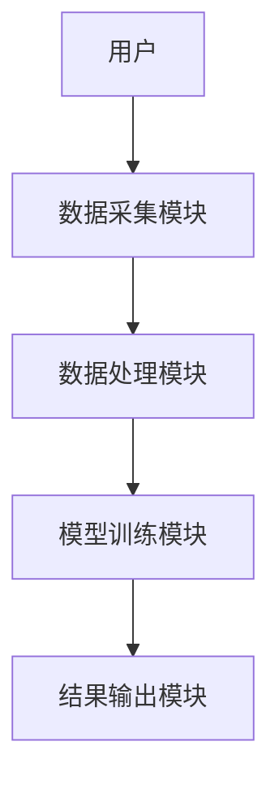
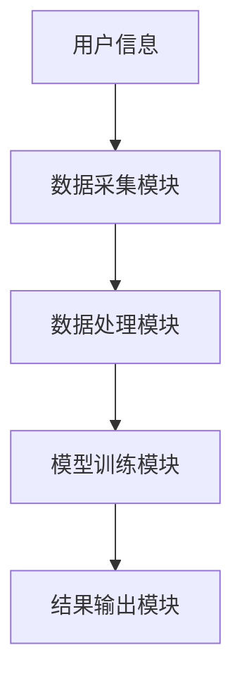

                 


# AI驱动的风险偏好评估系统

## 关键词：AI, 风险偏好, 机器学习, 系统架构, 项目实战

## 摘要：本文将详细介绍AI驱动的风险偏好评估系统的构建与应用。通过分析风险偏好评估的核心概念、算法原理、系统架构设计及实际项目案例，为读者提供从理论到实践的全面指导。

---

## 第一部分: AI驱动的风险偏好评估系统概述

### 第1章: AI与风险偏好评估系统概述

#### 1.1 风险偏好评估的基本概念

##### 1.1.1 风险偏好评估的定义
风险偏好评估是指通过对个体或机构在面对不确定性时的行为模式和决策偏好进行建模和分析，以量化其对风险的承受能力和态度。传统的风险偏好评估方法依赖于主观判断和经验分析，而AI技术的引入使得这一过程更加客观、高效和精准。

##### 1.1.2 风险偏好评估的核心要素
- **输入数据**：包括历史行为数据、市场数据、个体特征等。
- **模型构建**：通过机器学习算法构建风险偏好模型。
- **评估输出**：生成风险偏好评分、风险承受能力报告等。

##### 1.1.3 AI在风险偏好评估中的作用
AI技术通过大数据分析、特征提取和模型优化，显著提升了风险偏好评估的准确性和效率。AI能够从海量数据中发现潜在模式，并实时更新模型以适应动态变化的环境。

---

#### 1.2 AI驱动的风险偏好评估系统的优势

##### 1.2.1 提高评估效率
AI系统能够快速处理大量数据，显著缩短评估周期。

##### 1.2.2 增强评估准确性
通过机器学习算法，AI能够捕捉到传统方法难以发现的复杂关系，提升评估结果的准确性。

##### 1.2.3 实现个性化评估
AI驱动的系统能够根据个体的特征和行为模式，提供个性化的风险偏好评估结果。

---

#### 1.3 本章小结

本章介绍了AI驱动的风险偏好评估系统的定义、核心要素及其优势，为后续章节的深入分析奠定了基础。

---

## 第二部分: 风险偏好评估的核心概念与原理

### 第2章: 风险偏好评估的核心概念

#### 2.1 风险偏好评估的理论基础

##### 2.1.1 风险偏好理论概述
风险偏好理论研究个体在面对风险时的决策行为。常见的理论包括 prospect theory、mean-variance utility 等。

##### 2.1.2 风险偏好的分类与特征
- **风险中性**：对风险和收益无特殊偏好。
- **风险厌恶**：倾向于选择确定性收益而非高风险高回报。
- **风险寻求**：倾向于选择高风险高回报的选项。

---

#### 2.2 AI驱动的风险偏好评估模型

##### 2.2.1 数据驱动的模型
基于大数据分析，利用机器学习算法构建风险偏好模型。

##### 2.2.2 规则驱动的模型
根据专家经验制定规则，结合数据进行评估。

##### 2.2.3 混合驱动的模型
结合数据驱动和规则驱动的优势，构建混合模型。

---

#### 2.3 风险偏好评估的数据需求

##### 2.3.1 数据的来源与类型
- **历史数据**：包括过去的交易记录、投资行为等。
- **实时数据**：包括当前市场波动、用户行为等。
- **特征数据**：包括年龄、性别、职业等用户特征。

##### 2.3.2 数据的预处理与清洗
- 数据清洗：去除噪声数据和异常值。
- 特征提取：提取对风险偏好影响较大的特征。

##### 2.3.3 数据的质量评估
- 数据完整性：确保数据无缺失。
- 数据一致性：确保数据格式统一。
- 数据相关性：评估数据的相关性。

---

#### 2.4 本章小结

本章详细探讨了风险偏好评估的理论基础、模型类型及数据需求，为后续算法设计提供了理论依据。

---

## 第三部分: AI驱动的风险偏好评估系统的算法原理

### 第3章: 基于机器学习的风险偏好评估算法

#### 3.1 机器学习在风险偏好评估中的应用

##### 3.1.1 监督学习的应用
- **回归模型**：用于预测风险偏好评分。
- **分类模型**：用于将用户分为不同的风险偏好类别。

##### 3.1.2 非监督学习的应用
- **聚类分析**：将用户按照风险偏好相似性分组。

##### 3.1.3 强化学习的应用
- **策略优化**：通过强化学习优化风险偏好评估策略。

---

#### 3.2 常见的机器学习算法

##### 3.2.1 线性回归模型
线性回归用于预测连续型风险偏好评分。

##### 3.2.2 支持向量机（SVM）
SVM用于将用户分为不同的风险偏好类别。

##### 3.2.3 随机森林与梯度提升树
随机森林和梯度提升树常用于处理高维数据和复杂关系。

##### 3.2.4 神经网络模型
神经网络模型用于捕捉非线性关系和复杂模式。

---

#### 3.3 基于深度学习的风险偏好评估模型

##### 3.3.1 卷积神经网络（CNN）
CNN用于处理图像和序列数据中的特征。

##### 3.3.2 循环神经网络（RNN）
RNN用于处理时间序列数据。

##### 3.3.3 Transformer架构
Transformer架构用于处理长序列数据。

---

#### 3.4 算法选择与优化策略

##### 3.4.1 算法选择的依据
- 数据类型
- 问题类型
- 计算资源

##### 3.4.2 超参数优化方法
- 网格搜索
- 随机搜索
- 湖北优化

##### 3.4.3 模型评估与验证
- 交叉验证
- 准确率、召回率、F1分数等评估指标

---

#### 3.5 本章小结

本章详细介绍了机器学习和深度学习算法在风险偏好评估中的应用，并讨论了算法选择和优化策略。

---

## 第四部分: AI驱动的风险偏好评估系统的架构设计

### 第4章: 系统架构与设计

#### 4.1 系统功能模块划分

##### 4.1.1 数据采集模块
- 数据来源：数据库、API接口等。
- 数据类型：结构化数据、非结构化数据。

##### 4.1.2 数据处理模块
- 数据清洗：去除噪声数据。
- 特征提取：提取关键特征。

##### 4.1.3 模型训练模块
- 选择算法：基于数据和问题类型选择合适的算法。
- 训练模型：使用训练数据训练模型。

##### 4.1.4 结果输出模块
- 风险偏好评分
- 风险承受能力报告

---

#### 4.2 系统架构设计

##### 4.2.1 系统架构图


##### 4.2.2 数据流图


---

#### 4.3 接口设计与交互流程

##### 4.3.1 系统接口设计
- 数据接口：与数据库交互。
- 模型接口：与前端交互。

##### 4.3.2 交互流程
1. 用户输入数据。
2. 数据采集模块接收数据。
3. 数据处理模块清洗数据。
4. 模型训练模块训练模型。
5. 结果输出模块生成报告。

---

#### 4.4 本章小结

本章详细探讨了AI驱动的风险偏好评估系统的架构设计，包括功能模块划分、系统架构图和交互流程。

---

## 第五部分: 项目实战

### 第5章: 项目实战

#### 5.1 环境搭建

##### 5.1.1 安装Python
```bash
python --version
```

##### 5.1.2 安装依赖库
```bash
pip install numpy pandas scikit-learn
```

---

#### 5.2 系统核心实现

##### 5.2.1 数据预处理
```python
import pandas as pd

# 加载数据
data = pd.read_csv('risk_preference.csv')

# 数据清洗
data.dropna(inplace=True)

# 特征提取
features = data[['age', 'income', 'investment_history']]
```

##### 5.2.2 模型训练
```python
from sklearn.ensemble import RandomForestClassifier
from sklearn.metrics import accuracy_score

# 训练模型
model = RandomForestClassifier()
model.fit(features, labels)

# 预测结果
predictions = model.predict(new_features)
```

---

#### 5.3 代码实现与解读

##### 5.3.1 代码实现
```python
import numpy as np
import pandas as pd
from sklearn.model_selection import train_test_split
from sklearn.ensemble import RandomForestClassifier
from sklearn.metrics import accuracy_score

# 加载数据
data = pd.read_csv('risk_preference.csv')

# 数据清洗
data.dropna(inplace=True)

# 特征提取
features = data[['age', 'income', 'investment_history']]
labels = data['risk_preference']

# 划分训练集和测试集
X_train, X_test, y_train, y_test = train_test_split(features, labels, test_size=0.2)

# 训练模型
model = RandomForestClassifier()
model.fit(X_train, y_train)

# 预测结果
y_pred = model.predict(X_test)

# 评估准确率
print(accuracy_score(y_test, y_pred))
```

##### 5.3.2 代码解读
- 数据加载：使用pandas读取CSV文件。
- 数据清洗：删除缺失值。
- 特征提取：选择相关特征。
- 模型训练：使用随机森林分类器训练模型。
- 模型预测：对测试集进行预测。
- 模型评估：计算准确率。

---

#### 5.4 实际案例分析

##### 5.4.1 案例背景
某金融机构希望通过AI驱动的风险偏好评估系统，对客户进行风险分类。

##### 5.4.2 数据分析
通过对客户数据的分析，发现高收入客户更倾向于风险中性或厌恶。

##### 5.4.3 模型优化
调整模型参数，提升准确率。

---

#### 5.5 项目小结

本章通过实际项目案例，详细讲解了AI驱动的风险偏好评估系统的实现过程，包括环境搭建、代码实现和案例分析。

---

## 第六部分: 最佳实践与总结

### 第6章: 最佳实践与总结

#### 6.1 实际应用案例

##### 6.1.1 金融领域
- 风险评估：评估客户的信用风险。
- 投资建议：根据风险偏好推荐投资组合。

##### 6.1.2 医疗领域
- 风险评估：评估患者的风险偏好。
- 治疗方案：根据风险偏好推荐治疗方案。

##### 6.1.3 教育领域
- 风险评估：评估学生的学习风险。
- 教学策略：根据风险偏好制定教学策略。

---

#### 6.2 系统优化与扩展

##### 6.2.1 系统优化
- 模型优化：使用更先进的算法提升准确率。
- 数据优化：增加数据来源，提升数据质量。

##### 6.2.2 系统扩展
- 功能扩展：增加更多风险偏好评估维度。
- 应用扩展：拓展到更多领域。

---

#### 6.3 小结与注意事项

##### 6.3.1 小结
AI驱动的风险偏好评估系统在多个领域具有广泛的应用潜力，能够显著提升评估效率和准确性。

##### 6.3.2 注意事项
- 数据隐私：确保数据的安全和隐私。
- 模型解释性：提升模型的可解释性。
- 持续优化：定期更新模型，适应环境变化。

---

## 第七部分: 总结与展望

### 第7章: 总结与展望

#### 7.1 总结

本文详细介绍了AI驱动的风险偏好评估系统的构建与应用，从理论基础到实际项目案例，为读者提供了全面的指导。

#### 7.2 展望

未来，随着AI技术的不断发展，风险偏好评估系统将更加智能化和个性化。同时，多模态数据的应用和可解释性AI的发展，将进一步提升系统的评估能力和应用范围。

---

## 作者信息

作者：AI天才研究院/AI Genius Institute & 禅与计算机程序设计艺术 /Zen And The Art of Computer Programming

---

以上是《AI驱动的风险偏好评估系统》的完整目录大纲和文章内容。希望对您有所帮助！

