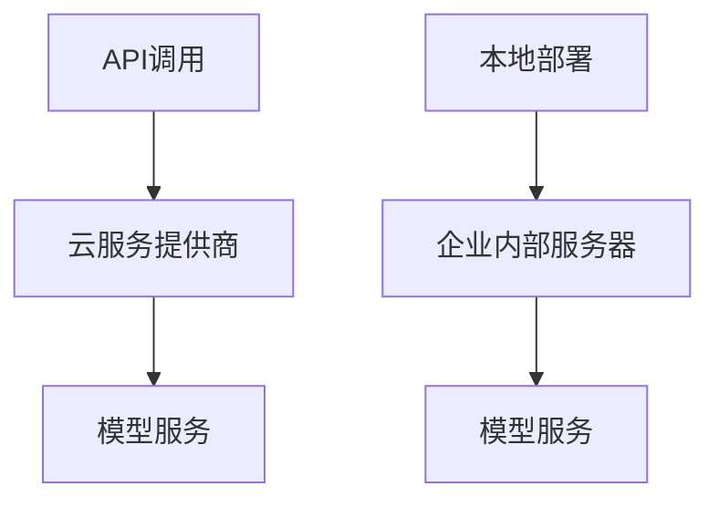
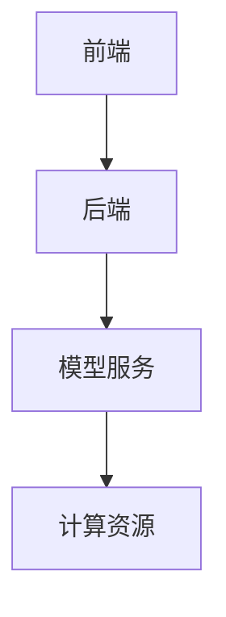

                 


# API调用还是本地部署？LLM使用策略对比

> 关键词：LLM，API调用，本地部署，云计算，人工智能，模型部署

> 摘要：本文对比分析了大语言模型（LLM）的两种使用策略：通过API调用和本地部署。从技术原理、成本效益、安全性、性能等多个维度进行详细分析，帮助读者选择适合自身需求的策略。

---

## 第一部分: LLM使用策略背景与核心概念

### 第1章: LLM使用策略的核心问题与背景

#### 1.1 LLM的基本概念与技术背景
- **1.1.1 大语言模型（LLM）的定义**
  大语言模型（Large Language Model, LLM）是指经过大量文本数据训练的深度学习模型，能够理解并生成人类语言。常见的LLM包括GPT系列、BERT系列等。

- **1.1.2 LLM的核心技术原理**
  LLM通常基于Transformer架构，通过自注意力机制和前馈网络处理序列数据。模型通过大量数据训练，能够捕捉语言的上下文关系，实现自然语言处理任务。

- **1.1.3 LLM的应用场景与价值**
  LLM广泛应用于文本生成、机器翻译、问答系统、情感分析等领域。其价值在于能够提供高效的自然语言处理能力，帮助企业提高效率、降低成本。

#### 1.2 API调用与本地部署的对比背景
- **1.2.1 云计算与AI技术的结合**
  云计算的发展为AI技术的应用提供了弹性计算资源，使得通过API调用模型成为可能。企业可以通过云服务提供商（如AWS、Azure、Google Cloud）获取LLM服务。

- **1.2.2 企业对LLM技术的需求变化**
  随着LLM技术的成熟，企业对高性能、高可用性的自然语言处理能力需求增加。部分企业选择本地部署以确保数据安全和性能优化。

- **1.2.3 两种部署方式的兴起与对比**
  API调用和本地部署各有优劣，企业需根据自身需求选择合适的方式。API调用方便快捷，但依赖第三方服务；本地部署灵活性高，但需要较高的技术投入。

#### 1.3 本章小结
- **1.3.1 LLM技术的核心价值**
  LLM通过强大的语言处理能力，帮助企业实现自动化、智能化的目标。

- **1.3.2 API调用与本地部署的主要区别**
  API调用依赖外部服务，适合快速部署和小规模使用；本地部署适合需要高性能和数据安全的企业。

- **1.3.3 选择合适策略的重要性**
  正确选择部署方式可以提高效率、降低成本，同时满足企业对性能和安全的需求。

---

## 第2章: API调用与本地部署的核心概念对比

### 2.1 核心概念的原理分析
- **2.1.1 API调用的实现机制**
  API调用通过HTTP请求访问云服务提供商的模型服务，返回生成的结果。这种方式简单易用，但依赖网络和第三方服务的稳定性。

- **2.1.2 本地部署的技术架构**
  本地部署需要在企业内部服务器上部署LLM模型，配置计算资源（如GPU）进行推理。这种方式灵活性高，但需要较高的技术投入。

- **2.1.3 两种方式的优缺点对比**
  | 对比维度       | API调用                     | 本地部署                   |
  |----------------|-----------------------------|-----------------------------|
  | 成本           | 按使用付费，初期投入低       | 需投入硬件和维护成本         |
  | 性能           | 取决于云服务提供商的资源     | 可优化性能，但需要较高配置    |
  | 安全性         | 数据可能存储在第三方服务器     | 数据安全，符合企业隐私需求   |
  | 维护成本       | 无                          | 需内部维护和更新             |

### 2.2 核心概念的属性特征对比
- **2.2.1 性能对比**
  - API调用性能依赖云服务提供商，可能存在排队和延迟。
  - 本地部署性能可根据硬件配置优化，减少延迟。

- **2.2.2 成本对比**
  - API调用按使用付费，适合小规模和偶尔使用的场景。
  - 本地部署初期投入高，但长期使用成本可能更低。

- **2.2.3 安全性对比**
  - API调用依赖第三方服务，数据可能面临泄露风险。
  - 本地部署数据在内部服务器，隐私和安全更有保障。

- **2.2.4 维护成本对比**
  - API调用无需维护，但需考虑网络依赖。
  - 本地部署需要定期维护和更新模型。

### 2.3 实体关系图（ER图）架构


### 2.4 本章小结
- **2.4.1 核心概念的对比总结**
  API调用和本地部署各有优劣，企业需根据自身需求选择。

- **2.4.2 选择策略的关键因素**
  数据安全、成本效益、性能需求是选择部署方式的关键因素。

- **2.4.3 两种方式的适用场景**
  API调用适合快速部署和小规模使用，本地部署适合需要高性能和数据安全的企业。

---

## 第3章: LLM的算法原理与实现方式

### 3.1 LLM的基本算法原理
- **3.1.1 Transformer架构**
  Transformer由编码器和解码器组成，通过自注意力机制捕捉序列关系。编码器将输入序列转换为固定长度向量，解码器生成目标序列。

- **3.1.2 注意力机制**
  注意力机制通过计算输入序列中每个词与其他词的相关性，决定每个词对最终输出的贡献程度。公式如下：
  $$ \text{Attention}(Q, K, V) = \text{softmax}\left(\frac{QK^T}{\sqrt{d_k}}\right)V $$

### 3.2 API调用与本地部署的算法实现
- **3.2.1 API调用的实现流程**
  1. 发起HTTP请求，携带输入参数。
  2. 云服务提供商接收请求，调用预训练好的模型进行推理。
  3. 返回生成的结果。

- **3.2.2 本地部署的实现流程**
  1. 本地服务器接收输入请求。
  2. 加载预训练好的模型，进行推理。
  3. 返回结果。

### 3.3 算法原理的数学模型
- **3.3.1 编码器-解码器结构**
  编码器将输入序列转换为隐藏状态：
  $$ \text{Encoder}(x) = h $$
  解码器根据编码器输出生成目标序列：
  $$ \text{Decoder}(h) = y $$

- **3.3.2 自注意力机制**
  查询（Q）、键（K）、值（V）向量通过矩阵相乘计算注意力权重：
  $$ Q = W_q h, K = W_k h, V = W_v h $$
  注意力权重计算：
  $$ \text{Attention}(Q, K, V) = \text{softmax}\left(\frac{QK^T}{\sqrt{d_k}}\right)V $$

### 3.4 本章小结
- **3.4.1 LLM的基本算法原理**
  Transformer架构通过自注意力机制实现高效的序列处理。

- **3.4.2 API调用与本地部署的算法实现**
  两种方式的算法实现相似，但API调用依赖云服务，本地部署依赖内部计算资源。

---

## 第4章: LLM的数学模型与算法实现

### 4.1 LLM的数学模型
- **4.1.1 模型训练**
  模型通过大量文本数据训练，目标是最小化预测错误。损失函数通常采用交叉熵损失：
  $$ \mathcal{L} = -\sum_{i=1}^{n} \log p(y_i|x_i) $$

- **4.1.2 模型推理**
  推理阶段，模型根据输入生成输出。生成策略包括贪心搜索和随机采样。

### 4.2 API调用与本地部署的数学实现
- **4.2.1 API调用的数学实现**
  API调用中，云服务提供商负责模型推理，用户只需处理输入输出。

- **4.2.2 本地部署的数学实现**
  本地部署中，模型加载到内存，通过计算资源进行推理。

### 4.3 本章小结
- **4.3.1 LLM的数学模型**
  训练和推理过程涉及复杂的数学计算，确保模型性能。

- **4.3.2 API调用与本地部署的数学实现**
  两种方式的数学实现相同，但部署方式不同。

---

## 第5章: 系统分析与架构设计方案

### 5.1 系统分析与设计
- **5.1.1 系统功能设计**
  系统需要实现模型部署、输入处理、结果输出等功能。

- **5.1.2 系统架构设计**
  本地部署架构包括前端、后端、模型服务和计算资源。API调用架构依赖云服务提供商的架构。

### 5.2 系统架构图


### 5.3 系统接口设计
- **API接口设计**
  ```python
  def api_call(prompt):
      response = requests.post('https://api.example.com/v1/generate', json={'prompt': prompt})
      return response.json()['result']
  ```

- **本地部署接口设计**
  ```python
  def local_call(prompt):
      model = load_model()
      result = model.generate(prompt)
      return result
  ```

### 5.4 系统交互流程
- **API调用流程**
  1. 前端发送请求到后端。
  2. 后端调用API接口，获取结果。
  3. 返回结果到前端。

- **本地部署流程**
  1. 前端发送请求到后端。
  2. 后端调用本地模型进行推理。
  3. 返回结果到前端。

### 5.5 本章小结
- **5.5.1 系统分析与设计**
  系统需要根据部署方式设计不同的架构和接口。

- **5.5.2 系统架构图**
  本地部署和API调用的架构图展示了不同的依赖关系。

---

## 第6章: 项目实战与案例分析

### 6.1 项目实战
- **6.1.1 项目介绍**
  实现一个本地部署的LLM系统，用于企业内部的问答系统。

- **6.1.2 环境搭建**
  - 安装Python、TensorFlow、Keras等库。
  - 配置GPU资源。

- **6.1.3 模型训练**
  使用公开数据集训练模型，调整超参数以优化性能。

- **6.1.4 接口开发**
  开发RESTful API，实现模型推理接口。

### 6.2 案例分析
- **API调用案例**
  使用云服务提供商的API接口，快速搭建问答系统。

- **本地部署案例**
  在企业内部服务器部署模型，实现高性能问答系统。

### 6.3 对比分析
- **成本对比**
  API调用按使用付费，本地部署初期投入高。

- **性能对比**
  本地部署性能更优，但依赖硬件配置。

### 6.4 本章小结
- **6.4.1 项目实战经验**
  本地部署需要较高的技术投入，但性能更优。

- **6.4.2 API调用与本地部署的对比总结**
  选择合适的部署方式，可以提高效率、降低成本。

---

## 第7章: 最佳实践与未来展望

### 7.1 最佳实践
- **选择部署方式的考虑因素**
  - 数据安全：本地部署更优。
  - 成本：API调用适合小规模使用。
  - 性能：本地部署适合高性能需求。

- **维护与优化**
  - 定期更新模型，优化性能。
  - 监控系统运行状态，及时处理问题。

- **团队协作**
  - API调用适合开发团队较小的企业。
  - 本地部署需要较强的技术团队。

### 7.2 未来展望
- **技术发展**
  大语言模型的性能将不断提升，本地部署的技术门槛可能降低。

- **行业趋势**
  本地部署和API调用将并存，企业根据需求选择合适的方式。

### 7.3 本章小结
- **7.3.1 最佳实践**
  根据企业需求选择部署方式，注重数据安全和性能优化。

- **7.3.2 未来展望**
  技术发展将提供更多选择，企业需灵活应对。

---

## 作者

作者：AI天才研究院/AI Genius Institute & 禅与计算机程序设计艺术 /Zen And The Art of Computer Programming

---

以上是《API调用还是本地部署？LLM使用策略对比》的技术博客文章的详细目录大纲，按照要求逐步展开，确保内容完整且符合技术博客的专业要求。

