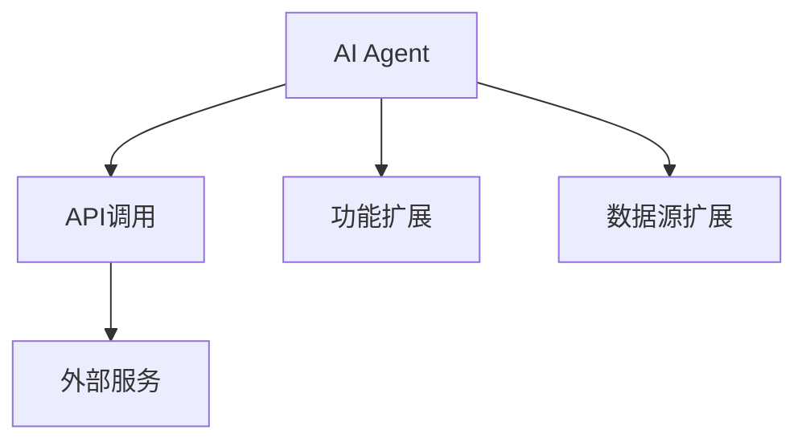
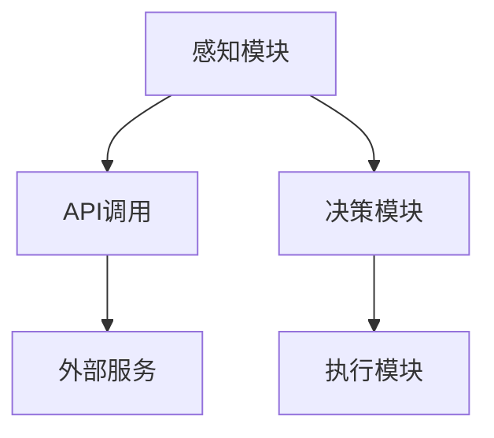

                 


# API集成：扩展AI Agent的功能与数据源

## 关键词：API集成，AI Agent，数据源扩展，功能扩展，系统架构，项目实战

## 摘要：  
本文详细探讨了如何通过API集成来扩展AI Agent的功能与数据源。从API集成的基础知识到AI Agent的工作原理，从功能扩展的具体方法到系统架构的设计，再到实际项目案例的分析，本文为读者提供了全面的指导。通过本文，读者将能够理解并掌握如何利用API来增强AI Agent的能力，从而在实际应用中实现更强大的智能化系统。

---

## 第一章：API集成与AI Agent的背景介绍

### 1.1 问题背景与描述

#### 1.1.1 当前AI Agent的发展趋势
随着人工智能技术的快速发展，AI Agent（智能代理）在各个领域的应用日益广泛。AI Agent能够通过感知环境、执行任务和与用户交互来提供智能化服务。然而，单靠内部算法和数据，AI Agent的功能和数据源往往有限。通过API集成，AI Agent可以扩展其功能和数据源，从而实现更强大的能力。

#### 1.1.2 API在AI Agent中的作用
API（应用程序编程接口）是连接不同系统和服务的桥梁。通过API集成，AI Agent可以调用外部服务（如天气数据、地图服务、支付接口等）来增强其功能。例如，一个聊天机器人可以通过API集成实时天气数据，为用户提供更精准的服务。

#### 1.1.3 问题解决：API如何扩展AI功能
传统的AI Agent往往依赖于本地数据和算法，功能受限。通过API集成，AI Agent可以：
- **扩展功能**：调用外部NLP（自然语言处理）服务进行更精准的语义分析。
- **增强数据源**：通过API获取实时数据，如社交媒体数据、市场动态等。
- **提升性能**：利用分布式计算资源，通过API调用高性能计算服务。

#### 1.1.4 边界与外延
API集成的边界在于API调用的范围和方式，而外延则包括通过API实现跨系统协作和数据共享。AI Agent的API集成不仅限于单个API，还可以通过组合多个API来构建复杂的功能。

#### 1.1.5 概念结构与核心要素组成
以下是AI Agent与API集成的概念结构图：



---

## 第二章：API集成基础知识

### 2.1 API的核心概念与术语说明

#### 2.1.1 什么是API
API（应用程序编程接口）是一组定义了不同软件组件之间如何交互的接口。它允许开发者通过编写代码来调用外部服务的功能，而无需了解其内部实现。

#### 2.1.2 RESTful API的结构
REST（Representational State Transfer）是一种常用的API设计风格。典型的RESTful API包括以下组成部分：
- **资源**：API提供的数据或服务，如用户信息、天气数据等。
- **资源标识符**：通过URL（统一资源定位符）表示资源，例如`/api/users`。
- **动词**：用于操作资源的方法，如GET、POST、PUT、DELETE。
- **媒体类型**：数据的格式，如JSON、XML等。

#### 2.1.3 API文档与设计原则
良好的API设计应遵循以下原则：
- **简洁性**：API接口和功能应尽可能简单。
- **可扩展性**：API应支持未来的扩展。
- **文档清晰**：提供详细的API文档，包括请求格式、响应格式和错误处理。

### 2.2 AI Agent的基本原理

#### 2.2.1 AI Agent的定义
AI Agent是一种能够感知环境、自主决策并执行任务的智能实体。它可以基于感知的信息做出决策，并通过执行动作与环境交互。

#### 2.2.2 AI Agent的结构
AI Agent通常由以下几个模块组成：
- **感知模块**：通过传感器或API获取环境信息。
- **决策模块**：基于感知信息进行分析和决策。
- **执行模块**：根据决策结果执行动作。

#### 2.2.3 AI Agent的工作流程
AI Agent的工作流程可以分为以下几个步骤：
1. **感知环境**：通过API或其他方式获取环境信息。
2. **分析信息**：利用算法对信息进行处理和分析。
3. **做出决策**：基于分析结果生成决策。
4. **执行动作**：根据决策结果执行相应动作。

---

## 第三章：AI Agent的功能扩展与API集成

### 3.1 自然语言处理（NLP）的API集成

#### 3.1.1 什么是NLP
NLP（Natural Language Processing）是研究如何让计算机理解、处理和生成人类语言的学科。通过API集成NLP服务，AI Agent可以实现更智能的语义分析和对话交互。

#### 3.1.2 NLP API的功能
- **文本分类**：识别文本的情感倾向或主题类别。
- **实体识别**：从文本中提取命名实体（如人名、地名等）。
- **语义理解**：理解文本的深层含义。

#### 3.1.3 NLP API的集成示例
以下是一个使用NLP API进行情感分析的示例：

```python
import requests

# API调用示例
url = "https://api.example.com/nlp/sentiment"
data = {
    "text": "The product is great!"
}
response = requests.post(url, json=data)
print(response.json())
```

---

## 第四章：数据源的集成与数据处理

### 4.1 数据源的分类与选择

#### 4.1.1 数据源的分类
- **结构化数据**：如数据库中的表格数据。
- **非结构化数据**：如文本、图像等。
- **实时数据**：如传感器数据、实时市场数据。

#### 4.1.2 数据源的选择
选择数据源时，需要考虑以下因素：
- **数据的可用性**：数据源是否稳定且易于访问。
- **数据的质量**：数据是否准确、完整。
- **数据的成本**：获取数据的经济成本和技术成本。

### 4.2 数据的获取与处理

#### 4.2.1 数据清洗
数据清洗是数据处理的重要步骤，包括：
- **去重**：去除重复的数据。
- **填充缺失值**：处理缺失的数据。
- **格式转换**：将数据转换为适合分析的格式。

#### 4.2.2 数据预处理
数据预处理包括：
- **特征提取**：从数据中提取有用的特征。
- **数据标准化**：将数据标准化到统一的范围。

---

## 第五章：API集成的系统架构设计

### 5.1 系统架构设计

#### 5.1.1 系统模块划分
一个典型的AI Agent系统可以划分为以下几个模块：
- **感知模块**：负责获取环境信息。
- **决策模块**：负责分析信息并做出决策。
- **执行模块**：负责执行决策结果。

#### 5.1.2 模块之间的交互
模块之间的交互可以通过API来实现。例如，感知模块可以通过API调用外部服务获取环境信息，然后将信息传递给决策模块。

#### 5.1.3 系统架构图
以下是系统的架构图：



---

## 第六章：项目实战与案例分析

### 6.1 项目实战

#### 6.1.1 项目背景
假设我们正在开发一个智能客服系统，该系统需要通过API集成多种功能，如自然语言理解、实时数据查询等。

#### 6.1.2 系统设计
系统设计包括以下几个部分：
- **用户界面**：提供与用户的交互界面。
- **API集成**：集成NLP API、实时数据库查询API等。

#### 6.1.3 实现细节
以下是系统的核心实现代码：

```python
import requests

def get_weather(city):
    url = f"https://api.example.com/weather?city={city}"
    response = requests.get(url)
    return response.json()

def main():
    city = input("请输入城市名：")
    weather = get_weather(city)
    print(f"{city}的天气情况：{weather['temperature']}℃，{weather['condition']}")

if __name__ == "__main__":
    main()
```

---

## 第七章：最佳实践与总结

### 7.1 最佳实践

#### 7.1.1 API设计原则
- **简洁性**：API接口应尽可能简单。
- **可扩展性**：API应支持未来的扩展。
- **文档清晰**：提供详细的API文档。

#### 7.1.2 集成注意事项
- **安全性**：确保API调用的安全性。
- **错误处理**：处理API调用中的错误和异常。

### 7.2 小结

通过本文的介绍，读者可以了解到如何通过API集成来扩展AI Agent的功能与数据源。API集成不仅可以增强AI Agent的能力，还可以提高系统的灵活性和可扩展性。

### 7.3 展望

未来，随着AI技术的不断发展，API集成将在AI Agent中发挥越来越重要的作用。通过API集成，AI Agent将能够实现更复杂的功能，并在更多领域得到应用。

---

## 作者信息

作者：AI天才研究院/AI Genius Institute & 禅与计算机程序设计艺术 /Zen And The Art of Computer Programming

