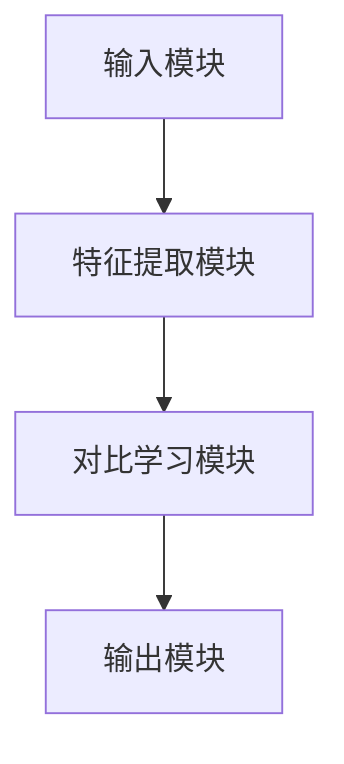

                 


# CLIP模型：实现AI Agent的跨模态理解

> 关键词：多模态、对比学习、跨模态理解、CLIP架构、AI Agent、图像文本交互

> 摘要：本文深入探讨了CLIP模型在实现AI Agent跨模态理解中的应用。从CLIP模型的背景到核心概念，再到算法原理、系统架构、项目实战，最后总结与展望，全面解析了CLIP模型的原理和应用，帮助读者理解如何在AI Agent中实现跨模态交互。

---

# 目录大纲：《CLIP模型：实现AI Agent的跨模态理解》

## 第一部分：CLIP模型概述

### 第1章：CLIP模型的背景与应用

#### 1.1 CLIP模型的背景

- **多模态AI的发展历程**  
  多模态AI技术近年来取得了显著进展，尤其是在自然语言处理和计算机视觉领域。CLIP模型的出现，标志着AI技术在跨模态理解方面的重要突破。

- **CLIP模型的提出背景**  
  CLIP模型由OpenAI团队提出，旨在解决文本和图像之间的跨模态理解问题。它通过对比学习的方式，使模型能够同时理解和生成文本和图像。

- **CLIP模型的核心目标**  
  CLIP模型的目标是实现跨模态数据的高效理解和生成，为AI Agent提供强大的跨模态交互能力。

#### 1.2 CLIP模型的应用场景

- **图像与文本的联合检索**  
  CLIP模型可以用于跨模态检索，例如根据图像内容生成描述文本，或者根据文本描述检索相关图像。

- **AI Agent中的跨模态交互**  
  在AI Agent中，CLIP模型可以实现文本和图像的联合理解，增强Agent的感知和交互能力。

- **实际应用案例分析**  
  例如在电子商务中，CLIP模型可以用于商品推荐，结合商品图像和描述文本，提升推荐的准确性和用户体验。

---

## 第二部分：CLIP模型的核心概念与原理

### 第2章：CLIP模型的核心概念

#### 2.1 CLIP模型的架构

- **文本编码器**  
  CLIP的文本编码器通常基于Transformer架构，用于将文本转化为固定长度的向量表示。

- **图像编码器**  
  图像编码器通常使用基于CNN的模型，将图像转化为向量表示。

- **对比学习模块**  
  对比学习模块用于将文本和图像的特征向量对齐，通过最大化相似度来学习跨模态的表示。

#### 2.2 跨模态对比学习

- **对比学习的基本原理**  
  对比学习通过最大化正样本的相似度和最小化负样本的相似度，实现特征向量的对齐。

- **文本与图像的特征对齐**  
  CLIP模型通过对比学习，将文本和图像的特征向量对齐，使它们可以在同一空间中进行比较。

- **跨模态损失函数**  
  CLIP模型使用对比损失函数来衡量文本和图像特征之间的相似度。

---

## 第三部分：CLIP模型的算法原理

### 第3章：CLIP模型的算法详解

#### 3.1 对比学习的数学模型

- **余弦相似度公式**  
  $$\text{sim}(x, y) = \frac{x \cdot y}{\|x\| \|y\|}$$  
  其中，\(x\) 和 \(y\) 分别是文本和图像的特征向量。

- **损失函数**  
  $$\text{Loss} = \text{CE}(\text{logit}(x,y))$$  
  其中，CE表示交叉熵损失，logit表示对相似度的转换。

#### 3.2 CLIP模型的训练流程

- **前向传播**  
  输入文本和图像，分别经过文本编码器和图像编码器，得到特征向量。

- **损失计算**  
  根据对比学习的损失函数，计算文本和图像特征之间的损失。

- **反向传播与优化**  
  使用优化算法（如Adam）更新模型参数，以最小化损失。

---

## 第四部分：CLIP模型的系统架构与设计

### 第4章：CLIP模型的系统架构

#### 4.1 系统架构设计

- **输入模块**  
  接收文本和图像输入，分别进行预处理。

- **特征提取模块**  
  文本和图像分别经过编码器，提取特征向量。

- **对比学习模块**  
  对比学习模块将文本和图像的特征向量对齐，计算相似度。

- **输出模块**  
  输出文本和图像的相似度或匹配结果。

#### 4.2 系统架构图



---

## 第五部分：CLIP模型的项目实战

### 第5章：CLIP模型的项目实战

#### 5.1 项目背景与目标

- **项目背景**  
  实现一个基于CLIP模型的图像和文本跨模态检索系统。

- **项目目标**  
  使用CLIP模型，实现根据文本描述检索相关图像的功能。

#### 5.2 项目实现

- **环境配置**  
  安装必要的库，如Python、TensorFlow、Keras等。

- **代码实现**  
  下面是一个简单的CLIP模型实现示例：

```python
import tensorflow as tf
from tensorflow.keras.layers import Input, Dense, GlobalAveragePooling2D, Conv2D, MaxPooling2D, Flatten, Dense, Dropout, LSTM, Bidirectional
from tensorflow.keras.models import Model
from tensorflow.keras.applications import VGG16
from tensorflow.keras.preprocessing.text import Tokenizer
from tensorflow.keras.preprocessing.image import ImageDataGenerator

# 定义文本编码器
def text_encoder(input_shape, vocab_size):
    inputs = Input(shape=(input_shape,))
    x = Embedding(vocab_size, 128)(inputs)
    x = Bidirectional(LSTM(64, return_sequences=False))(x)
    x = Dense(256, activation='relu')(x)
    x = Dropout(0.2)(x)
    outputs = Dense(512, activation='relu')(x)
    return Model(inputs=inputs, outputs=outputs)

# 定义图像编码器
def image_encoder(input_shape):
    inputs = Input(shape=(input_shape[0], input_shape[1], input_shape[2]))
    base_model = VGG16(weights='imagenet', include_top=False)(inputs)
    x = GlobalAveragePooling2D()(base_model)
    x = Dense(512, activation='relu')(x)
    x = Dropout(0.2)(x)
    outputs = Dense(512, activation='relu')(x)
    return Model(inputs=inputs, outputs=outputs)

# 定义对比学习模块
def contrastive_loss(y_true, y_pred, margin=1.0):
    positive = tf.einsum('ij,ij->i', y_pred, y_pred)
    negative = tf.einsum('ij,kj->ik', y_pred, y_pred)
    loss = tf.maximum(margin - positive + negative, 0.0)
    return tf.reduce_mean(loss)

# 定义CLIP模型
text_input = Input(shape=(vocab_size,))
text_features = text_encoder(512, vocab_size)(text_input)
image_input = Input(shape=(224, 224, 3))
image_features = image_encoder(224)(image_input)
similarity = tf.keras.layers.Dot(axes=1)([text_features, image_features])
model = Model(inputs=[text_input, image_input], outputs=similarity)

# 编译模型
model.compile(optimizer='adam', loss=contrastive_loss, metrics=['accuracy'])
```

- **代码解读**  
  上述代码定义了一个简单的CLIP模型，包括文本编码器、图像编码器和对比学习模块。文本编码器使用双向LSTM提取文本特征，图像编码器基于VGG16提取图像特征，对比学习模块计算文本和图像特征的相似度。

- **项目小结**  
  通过本项目，读者可以了解如何使用CLIP模型进行跨模态检索，并能够实际操作代码实现相关功能。

---

## 第六部分：总结与展望

### 第6章：总结与展望

#### 6.1 总结

- **CLIP模型的优势**  
  CLIP模型通过对比学习，实现了文本和图像的跨模态对齐，具有强大的跨模态理解能力。

- **CLIP模型的应用领域**  
  CLIP模型广泛应用于图像检索、文本生成、跨模态交互等领域，为AI Agent提供了强大的技术支持。

#### 6.2 未来展望

- **模型优化**  
  未来可以进一步优化CLIP模型，提升其在不同场景下的性能。

- **多模态扩展**  
  研究CLIP模型在更多模态（如音频、视频）中的应用，扩展其跨模态理解能力。

#### 6.3 最佳实践 tips

- **数据预处理**  
  在使用CLIP模型之前，需要对文本和图像数据进行预处理，确保数据的一致性和可比性。

- **模型调优**  
  根据具体任务需求，对模型参数进行调优，提升模型性能。

- **结果分析**  
  对模型的输出结果进行分析，找出可能的优化点，进一步提升模型的准确性和效率。

---

## 作者：AI天才研究院/AI Genius Institute & 禅与计算机程序设计艺术 /Zen And The Art of Computer Programming

---

通过以上内容，我们系统地介绍了CLIP模型的基本概念、算法原理、系统架构以及实际应用。希望读者能够通过本文，深入了解CLIP模型的核心思想和实现方法，并能够将其应用于实际的AI Agent开发中。

