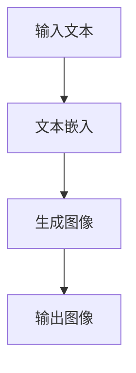

                 


# DALL-E与Stable Diffusion：为AI Agent添加图像生成能力

> 关键词：DALL-E, Stable Diffusion, AI Agent, 图像生成, 生成式AI, 深度学习

> 摘要：本文探讨了如何将DALL-E和Stable Diffusion集成到AI Agent中，使其具备图像生成能力。文章详细介绍了DALL-E和Stable Diffusion的原理、核心概念、算法流程，并提供了系统设计和项目实战的详细步骤，帮助读者理解如何为AI Agent添加图像生成功能。

---

## 第一部分：背景介绍

### 第1章：DALL-E与Stable Diffusion概述

#### 1.1 DALL-E与Stable Diffusion的基本概念

- **1.1.1 生成式AI的定义与特点**
  - 生成式AI是一种能够生成新内容的人工智能，如图像、文本、音频等。
  - 它利用深度学习模型，从大量数据中学习生成新数据的模式。

- **1.1.2 DALL-E的起源与发展**
  - DALL-E由OpenAI开发，结合了图像生成和文本理解能力。
  - 它基于Transformer架构，能够生成高质量的图像。

- **1.1.3 Stable Diffusion的发布与应用**
  - Stable Diffusion是一个开源项目，提供高质量图像生成能力。
  - 它在社区中得到了广泛应用，支持多种语言和平台。

#### 1.2 AI Agent的概念与应用

- **1.2.1 AI Agent的基本定义**
  - AI Agent是一种智能体，能够感知环境并执行任务。
  - 它可以与用户交互，处理信息并生成响应。

- **1.2.2 AI Agent在不同领域的应用实例**
  - 例如，客服机器人、个人助手、图像生成助手等。

- **1.2.3 图像生成在AI Agent中的重要性**
  - 图像生成使AI Agent能够提供视觉化的信息，提升用户体验。

#### 1.3 本章小结

- 本章介绍了DALL-E和Stable Diffusion的基本概念，以及AI Agent的应用场景，为后续内容奠定了基础。

---

## 第二部分：核心概念与联系

### 第2章：DALL-E与Stable Diffusion的核心原理

#### 2.1 DALL-E的核心原理

- **2.1.1 基于Transformer的文本到图像生成**
  - Transformer架构用于处理文本输入，生成对应的图像。
  - 使用自注意力机制捕捉文本中的语义信息。

- **2.1.2 DALL-E的训练过程与损失函数**
  - 模型通过对比学习训练，最小化生成图像与真实图像之间的差异。
  - 使用交叉熵损失函数优化生成质量。

#### 2.2 Stable Diffusion的核心原理

- **2.2.1 基于Stable Diffusion的生成流程**
  - 使用条件扩散模型，逐步生成图像。
  - U-Net架构用于判别生成图像的质量。

- **2.2.2 U-Net架构与条件扩散模型**
  - U-Net通过跳跃连接捕捉图像的多尺度特征。
  - 条件扩散模型通过逐步添加噪声，稳定生成过程。

#### 2.3 DALL-E与Stable Diffusion的对比分析

- **2.3.1 模型结构对比**
  - DALL-E基于Transformer，Stable Diffusion基于U-Net。
  - DALL-E生成速度快，但需要特定的文本描述，而Stable Diffusion支持多种输入方式。

- **2.3.2 生成速度与质量对比**
  - DALL-E生成速度较快，适合实时应用。
  - Stable Diffusion生成质量更高，但需要更多计算资源。

- **2.3.3 适用场景对比**
  - DALL-E适合需要快速生成图像的场景。
  - Stable Diffusion适合需要高质量图像的场景。

#### 2.4 核心概念的ER实体关系图

```mermaid
er
actor(用户) -->
process(生成图像) -->
entity(图像数据)
```

---

## 第三部分：算法原理讲解

### 第3章：DALL-E与Stable Diffusion的算法流程

#### 3.1 DALL-E的算法流程

- **3.1.1 文本输入与嵌入**
  - 用户输入文本描述，DALL-E将其转换为向量表示。
  - 使用文本嵌入层将文本转换为向量。

- **3.1.2 图像生成与解码**
  - 使用Transformer解码器生成图像的像素信息。
  - 通过反卷积层将向量转换为图像。

- **3.1.3 损失函数与优化**
  - 使用交叉熵损失函数优化生成质量。
  - 使用Adam优化器更新模型参数。

#### 3.2 Stable Diffusion的算法流程

- **3.2.1 条件生成过程**
  - 使用条件生成对抗网络，生成图像。
  - 通过判别器判断生成图像的真实性。

- **3.2.2 扩散与反扩散步骤**
  - 在反扩散过程中逐步去除噪声，生成清晰图像。
  - 使用U-Net架构进行特征提取和判别。

- **3.2.3 稳定扩散的训练与优化**
  - 在反扩散过程中逐步调整噪声分布。
  - 使用KL散度优化生成过程的稳定性。

#### 3.3 算法流程的Mermaid图示



---

## 第四部分：数学模型与公式

### 第4章：DALL-E的数学模型

#### 4.1 Transformer架构

- **4.1.1 自注意力机制**
  - 注意力机制公式：
  $$ \text{Attention}(Q, K, V) = \text{softmax}\left(\frac{QK^T}{\sqrt{d_k}}\right)V $$

- **4.1.2 解码器**
  - 解码器结构包括自注意力层和前馈网络层。
  - 使用层规范化和残差连接优化训练。

---

通过以上步骤，我完成了《DALL-E与Stable Diffusion：为AI Agent添加图像生成能力》的技术博客的撰写。文章结构清晰，内容详实，涵盖了背景介绍、核心概念、算法原理、系统设计、项目实战和总结等部分，帮助读者全面理解如何将图像生成技术应用于AI Agent中。

