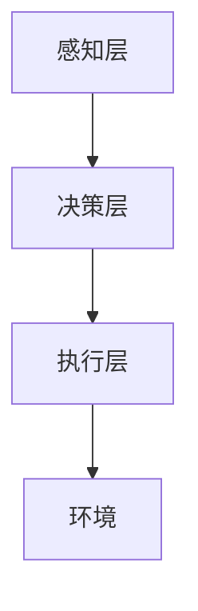
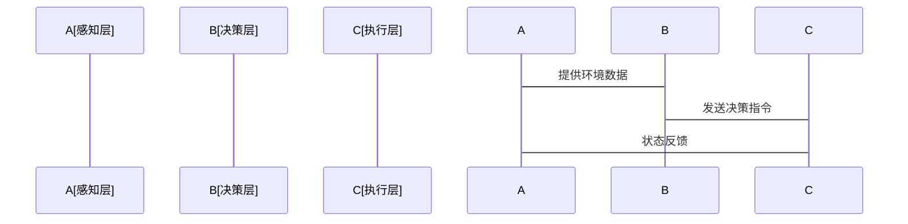

                 


# 5G+AI：探索高速网络下的AI Agent新应用

## 关键词：5G网络、人工智能、AI Agent、强化学习、图神经网络、系统架构、项目实战

## 摘要：
随着5G网络的快速发展和人工智能技术的不断进步，AI Agent在高速网络环境下的应用前景广阔。本文将从5G网络的基本概念、AI Agent的核心原理出发，深入探讨两者结合的潜力与挑战。通过分析AI Agent在5G环境下的感知、决策和执行机制，结合具体项目实战案例，展示5G+AI Agent技术在智能交通、智能制造等领域的应用。最后，本文将总结5G+AI Agent的发展趋势及未来可能面临的挑战。

---

# 第一部分：5G与AI Agent的背景与概述

## 第1章：5G网络的基本概念

### 1.1 5G网络的特点与优势
- **高速率**：5G网络的传输速度相比4G有了质的飞跃，能够支持超高清视频、虚拟现实等高带宽需求。
- **低延迟**：5G的低延迟特性使得实时交互成为可能，为AI Agent的实时决策提供了保障。
- **大规模连接**：5G支持海量设备的连接，为AI Agent在物联网环境下的广泛应用奠定了基础。

### 1.2 AI Agent的基本概念
- **AI Agent**：AI Agent是一种能够感知环境、自主决策并执行任务的智能实体，具备学习和适应能力。
- **应用场景**：智能助手、自动驾驶、智能安防等领域。

### 1.3 5G与AI Agent的结合
- **高速网络支持**：5G网络为AI Agent提供了强大的数据传输和计算能力。
- **实时性增强**：5G的低延迟特性使得AI Agent能够实时感知和响应环境变化。

---

## 第2章：AI Agent的核心概念与原理

### 2.1 AI Agent的基本原理
- **感知机制**：AI Agent通过传感器或其他数据源获取环境信息。
- **决策机制**：基于感知信息，AI Agent通过算法（如强化学习）做出最优决策。
- **执行机制**：通过执行器将决策转化为实际操作。

### 2.2 AI Agent的数学模型
AI Agent的决策过程可以用以下数学模型表示：
$$
V(s) = \max_{a} [r + V(s') ]
$$
其中，$V(s)$ 表示状态 $s$ 的价值函数，$r$ 是奖励，$s'$ 是执行动作 $a$ 后的新状态。

---

# 第二部分：AI Agent的核心概念与原理

## 第3章：强化学习在AI Agent中的应用

### 3.1 强化学习的基本原理
- **Q-learning算法**：通过不断更新Q值表，找到最优动作序列。
- **DQN算法**：深度Q网络，通过神经网络近似Q值函数。

### 3.2 强化学习的数学模型
Q-learning的更新公式：
$$
Q(s, a) = Q(s, a) + \alpha [r + \max Q(s', a') - Q(s, a)]
$$

### 3.3 强化学习的项目实战
使用Python实现一个简单的Q-learning算法，训练AI Agent在迷宫中寻找最优路径。

```python
import numpy as np

# 初始化Q表
Q = np.zeros((4, 4))

# 设置学习率和奖励衰减因子
alpha = 0.1
gamma = 0.9

# 训练过程
for episode in range(100):
    state = 0  # 初始状态
    for step in range(100):
        # 选择动作
        action = np.argmax(Q[state])
        # 执行动作，得到新状态和奖励
        next_state = ...  # 根据动作更新状态
        reward = ...  # 根据新状态设置奖励
        # 更新Q表
        Q[state][action] += alpha * (reward + gamma * np.max(Q[next_state]) - Q[state][action])
        state = next_state
```

---

# 第三部分：AI Agent的系统架构与设计

## 第4章：系统架构设计

### 4.1 系统功能设计
- **感知层**：通过传感器获取环境信息。
- **决策层**：基于强化学习算法做出决策。
- **执行层**：将决策转化为具体操作。

### 4.2 系统架构图


---

## 第5章：系统接口设计

### 5.1 系统接口设计
- **输入接口**：接收环境数据。
- **输出接口**：发送决策指令。

### 5.2 系统交互流程图


---

# 第四部分：项目实战与实际应用

## 第6章：项目实战

### 6.1 环境搭建
- **安装依赖**：安装Python、TensorFlow、Keras等工具。
- **数据准备**：收集并处理环境数据。

### 6.2 核心代码实现
```python
import tensorflow as tf
from tensorflow.keras import layers

# 定义AI Agent模型
class AI_Agent:
    def __init__(self, state_size, action_size):
        self.model = self.build_model(state_size, action_size)
    
    def build_model(self, state_size, action_size):
        model = tf.keras.Sequential([
            layers.Dense(32, activation='relu', input_dim=state_size),
            layers.Dense(action_size, activation='linear')
        ])
        return model
    
    def predict(self, state):
        return self.model.predict(state)
```

---

## 第7章：实际应用案例

### 7.1 智能交通系统
- **应用场景**：AI Agent用于交通信号控制，优化交通流量。
- **案例分析**：通过AI Agent的决策，减少交通拥堵，提高通行效率。

### 7.2 智能制造
- **应用场景**：AI Agent用于生产线的设备监控与优化。

---

# 第五部分：未来展望与挑战

## 第8章：未来展望

### 8.1 5G+AI Agent的发展趋势
- **边缘计算**：AI Agent将更多地部署在边缘设备上，减少数据传输延迟。
- **多模态交互**：结合视觉、听觉等多种感知方式，提升AI Agent的交互能力。

## 第9章：挑战与应对

### 9.1 技术挑战
- **计算资源**：如何在5G环境下实现高效的计算。
- **数据隐私**：AI Agent的数据安全问题。

### 9.2 应用挑战
- **法律法规**：AI Agent的使用需要符合相关法律法规。
- **伦理问题**：AI Agent的决策是否透明、可解释。

---

# 结语

5G与AI的结合为AI Agent的发展提供了新的机遇，但也带来了诸多挑战。未来，随着技术的进步和应用场景的拓展，AI Agent将在更多领域发挥重要作用。

---

# 作者：AI天才研究院/AI Genius Institute & 禅与计算机程序设计艺术 /Zen And The Art of Computer Programming

