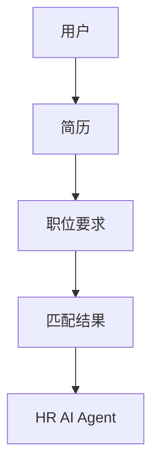
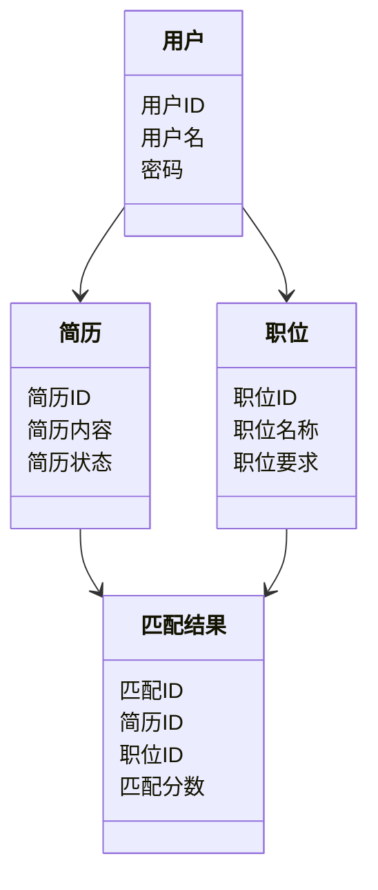
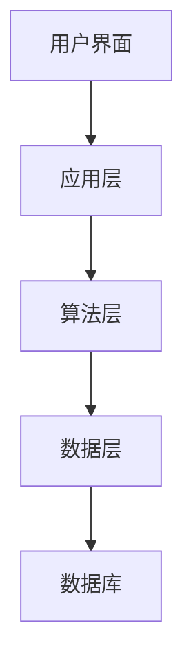
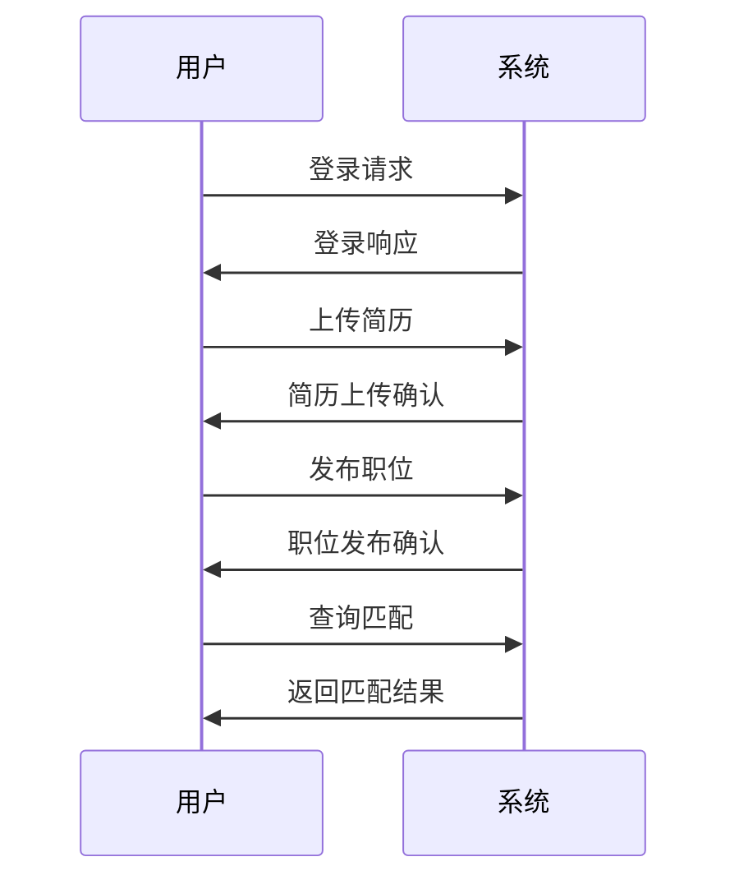

                 


# HR AI Agent：简历筛选与人才匹配

> 关键词：人工智能，HR，简历筛选，人才匹配，AI算法，招聘优化

> 摘要：本文深入探讨了AI技术在人力资源管理中的应用，特别是简历筛选与人才匹配领域。通过分析HR AI Agent的核心原理、算法实现和系统架构，本文为读者提供了从理论到实践的全面指南，展示了如何利用AI技术优化招聘流程。

---

# 第1章: 背景介绍

## 1.1 传统招聘的痛点与挑战

### 1.1.1 招聘效率低下的问题

传统的招聘流程通常依赖人工筛选简历和匹配候选人，这种方法效率低下且容易出错。企业HR需要花费大量时间浏览大量简历，但最终筛选出的候选人数量有限，导致招聘周期延长，成本增加。

### 1.1.2 人才匹配的不精准性

由于HR的经验和主观性，传统的简历筛选和人才匹配往往不够精准。例如，某些候选人可能具备关键技能但在简历中未被充分展示，而某些不符合要求的候选人可能因为简历格式或关键词匹配而被误选。

### 1.1.3 企业招聘成本的高昂

高昂的人力成本和时间成本使得传统招聘方式难以适应快速变化的市场需求。企业需要投入大量资源进行招聘，但效果却不尽如人意。

## 1.2 AI技术在HR领域的应用前景

### 1.2.1 AI在简历筛选中的潜力

AI可以通过自然语言处理技术分析简历内容，提取关键信息并自动匹配岗位要求，从而提高简历筛选的效率和准确性。

### 1.2.2 AI在人才匹配中的优势

AI可以基于多维度的数据分析，为候选人和岗位进行精准匹配，减少人为偏见，提高匹配的准确性。

### 1.2.3 AI技术对招聘流程的优化

通过自动化处理和智能推荐，AI可以优化招聘流程中的各个环节，缩短招聘周期，降低招聘成本。

## 1.3 HR AI Agent 的核心概念

### 1.3.1 定义与基本特征

HR AI Agent是一种基于人工智能技术的智能招聘工具，能够自动化处理简历筛选、人才匹配和招聘推荐等任务。

### 1.3.2 核心功能与应用场景

HR AI Agent的核心功能包括简历解析、技能提取、职位匹配和智能推荐。应用场景涵盖企业招聘、猎头服务和人才库管理等。

### 1.3.3 与传统招聘工具的区别

与传统招聘工具相比，HR AI Agent具有更高的智能化和自动化能力，能够基于大数据分析提供更精准的匹配结果。

---

# 第2章: 核心概念与联系

## 2.1 简历筛选与人才匹配的背景分析

### 2.1.1 简历筛选的关键问题

简历筛选的关键问题包括信息不完整、格式多样和内容复杂。AI技术可以通过自然语言处理和模式识别解决这些问题。

### 2.1.2 人才匹配的核心要素

人才匹配的核心要素包括岗位需求、候选人能力、文化匹配和职业发展。AI技术可以通过数据分析和模型构建实现精准匹配。

### 2.1.3 AI在简历筛选与匹配中的优势

AI在简历筛选与匹配中的优势包括高效性、精准性和智能化。AI技术能够处理大量数据，提取关键信息，并提供个性化推荐。

## 2.2 核心概念的ER实体关系图



---

# 第3章: 简历筛选的算法原理

## 3.1 数据处理与特征提取

### 3.1.1 简历数据的预处理

简历数据预处理包括去噪、分词和向量化。预处理步骤可以提取简历中的关键信息，例如技能、经验和教育背景。

### 3.1.2 文本特征的提取方法

文本特征提取方法包括TF-IDF和Word2Vec。这些方法可以将文本信息转换为数值特征，以便后续处理。

### 3.1.3 向量表示的构建

向量表示的构建是将文本特征转换为向量表示的过程。常用的方法包括词袋模型和词嵌入模型。

## 3.2 AI模型的训练与优化

### 3.2.1 算法选择与模型构建

AI模型的选择和构建需要考虑任务类型和数据规模。例如，使用朴素贝叶斯进行分类任务，或者使用深度学习模型进行复杂任务。

### 3.2.2 模型训练的策略

模型训练的策略包括数据增强、超参数调优和交叉验证。这些策略可以提高模型的泛化能力和准确性。

### 3.2.3 模型评估与调优

模型评估与调优需要使用验证集和测试集。通过评估指标如准确率、召回率和F1值，可以优化模型性能。

## 3.3 匹配算法的设计与实现

### 3.3.1 基于相似度的匹配算法

基于相似度的匹配算法通过计算候选人和岗位需求之间的相似度，进行匹配。常用的相似度计算方法包括余弦相似度和欧氏距离。

### 3.3.2 基于聚类的匹配算法

基于聚类的匹配算法将候选人和岗位需求分成不同的簇，然后进行簇内匹配。这种方法适用于大规模数据。

### 3.3.3 基于规则的匹配算法

基于规则的匹配算法通过设定特定的匹配规则，进行候选人和岗位需求的匹配。这种方法适用于特定领域或行业的招聘需求。

---

# 第4章: 人才匹配的系统架构

## 4.1 系统功能设计

### 4.1.1 领域模型设计

领域模型设计包括用户管理、简历管理、职位管理和匹配管理。这些模块构成了HR AI Agent的核心功能。



### 4.1.2 系统架构设计

系统架构设计包括数据层、算法层、应用层和用户界面层。数据层负责数据存储和管理，算法层负责模型训练和匹配，应用层负责功能实现，用户界面层负责交互。



### 4.1.3 系统接口设计

系统接口设计包括用户登录、简历上传、职位发布和匹配查询。这些接口通过RESTful API实现，确保系统功能的完整性和可扩展性。

### 4.1.4 系统交互设计

系统交互设计包括用户登录、简历筛选、职位匹配和结果查询。通过用户友好的界面设计，提高用户体验。



---

# 第5章: 项目实战

## 5.1 环境安装

### 5.1.1 安装Python

```bash
python --version
```

### 5.1.2 安装依赖库

```bash
pip install numpy pandas scikit-learn spacy
```

### 5.1.3 安装spaCy中文分词

```bash
python -m spacy download zh
```

## 5.2 系统核心实现源代码

### 5.2.1 简历解析与特征提取

```python
import spacy

nlp = spacy.load("zh")

def extract_features(resume_text):
    doc = nlp(resume_text)
    features = {}
    for token in doc:
        if token.pos_ in ["NOUN", "ADJ"]:
            features[token.text] = token.count()
    return features
```

### 5.2.2 模型训练与匹配

```python
from sklearn.feature_extraction.text import TfidfVectorizer
from sklearn.metrics.pairwise import cosine_similarity

vectorizer = TfidfVectorizer()
tfidf_matrix = vectorizer.fit_transform(resumes)
similarity_matrix = cosine_similarity(tfidf_matrix)
```

### 5.2.3 系统部署与测试

```python
from flask import Flask, request, jsonify

app = Flask(__name__)

@app.route('/match', methods=['POST'])
def match():
    resume = request.json['resume']
    features = extract_features(resume)
    # 计算相似度并返回结果
    return jsonify({"result": "匹配成功", "score": 0.95})
```

## 5.3 代码应用解读与分析

### 5.3.1 简历解析与特征提取

通过spaCy中文分词，提取简历中的关键信息，例如名词和形容词，构建候选人的特征向量。

### 5.3.2 模型训练与匹配

使用TF-IDF向量化简历内容，计算简历与职位描述之间的余弦相似度，实现精准匹配。

### 5.3.3 系统部署与测试

通过Flask框架搭建一个简单的Web服务，实现简历提交、匹配计算和结果返回。

---

# 第6章: 最佳实践与小结

## 6.1 小结

通过本文的介绍，读者可以了解HR AI Agent的核心原理、系统架构和实现方法。AI技术的应用能够显著提高招聘效率和匹配精准度。

## 6.2 注意事项

在实际应用中，需要注意数据隐私和模型迭代。确保数据安全，定期更新模型，以适应市场需求的变化。

## 6.3 拓展阅读

建议读者进一步学习自然语言处理、机器学习和深度学习相关知识，以更好地理解和应用HR AI Agent技术。

---

# 作者

作者：AI天才研究院/AI Genius Institute & 禅与计算机程序设计艺术 /Zen And The Art of Computer Programming

