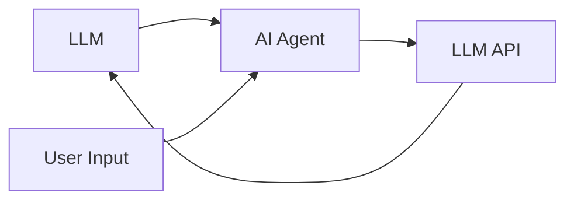

                 

# LLM在AI Agent中的few-shot学习应用

## 关键词：大语言模型, AI Agent, few-shot学习, 人机交互, 人工智能

## 摘要：本文深入探讨了大语言模型（LLM）在AI代理中的应用，特别是其在few-shot学习中的应用。通过分析LLM和AI Agent的核心概念，详细讲解了few-shot学习的算法原理，并通过实际案例展示了如何将这些技术应用于实际场景。文章内容涵盖背景介绍、核心概念、算法原理、系统架构、项目实战、最佳实践及未来展望。

---

# 第1章: LLM与AI Agent的背景介绍

## 1.1 LLM的基本概念

### 1.1.1 大语言模型的定义
大语言模型（LLM）是指基于大量数据训练的大型神经网络模型，具有强大的自然语言处理能力，能够理解并生成人类语言。

### 1.1.2 LLM的核心特点
- **大规模训练数据**：使用数百万条数据进行训练。
- **深度学习架构**：通常基于Transformer架构。
- **多任务能力**：能够处理多种NLP任务。

### 1.1.3 LLM与传统NLP模型的区别
传统NLP模型通常针对特定任务训练，而LLM是通用模型，适用于多种任务。

## 1.2 AI Agent的基本概念

### 1.2.1 AI Agent的定义
AI Agent是一种智能体，能够感知环境、执行任务并做出决策，通常通过人机交互与用户进行互动。

### 1.2.2 AI Agent的核心功能
- **感知**：通过传感器或用户输入获取信息。
- **决策**：基于获取的信息做出判断。
- **执行**：执行具体任务，如发送邮件、安排日程。

### 1.2.3 AI Agent的应用场景
- **个人助手**：如Siri、Alexa。
- **企业级代理**：用于自动化业务流程。
- **智能客服**：提供24/7的客户支持。

## 1.3 few-shot学习的定义与优势

### 1.3.1 few-shot学习的定义
few-shot学习是指在仅有少量样本的情况下，模型能够快速学习并完成任务。

### 1.3.2 few-shot学习的特点
- **数据需求少**：仅需少量样本即可训练。
- **任务通用性高**：适用于多种任务。

### 1.3.3 few-shot学习的优势
- **节省数据成本**：减少数据收集和标注成本。
- **提升模型泛化能力**：能够在新任务中表现良好。

## 1.4 LLM在AI Agent中的应用前景

### 1.4.1 LLM在AI Agent中的潜在应用领域
- **自然语言理解**：提高对话质量。
- **任务自动化**：通过LLM执行复杂任务。
- **实时反馈**：快速响应用户需求。

### 1.4.2 LLM在AI Agent中的优势
- **强大的语言理解能力**：能够处理复杂的用户需求。
- **快速学习能力**：通过few-shot学习快速适应新任务。

### 1.4.3 LLM在AI Agent中的挑战与机遇
- **挑战**：模型训练成本高、数据隐私问题。
- **机遇**：提升AI Agent的智能化水平。

---

## 本章小结
本章介绍了大语言模型（LLM）和AI Agent的基本概念，并重点讲解了few-shot学习的定义、特点及优势。同时，探讨了LLM在AI Agent中的应用前景及其面临的挑战与机遇。

---

# 第2章: LLM与AI Agent的核心概念与联系

## 2.1 LLM的核心原理

### 2.1.1 大语言模型的训练过程
LLM通过监督学习和无监督学习相结合的方式进行训练，通常采用Transformer架构。

### 2.1.2 大语言模型的推理机制
模型通过编码输入文本并生成输出，能够处理序列数据。

### 2.1.3 大语言模型的评估指标
常用指标包括准确率、BLEU、ROUGE等。

## 2.2 AI Agent的核心原理

### 2.2.1 AI Agent的感知与决策过程
AI Agent通过传感器或用户输入获取信息，基于感知结果做出决策。

### 2.2.2 AI Agent的执行与反馈机制
AI Agent根据决策结果执行任务，并通过反馈机制进行调整。

### 2.2.3 AI Agent的自适应能力
AI Agent能够根据环境变化调整自身行为，提高适应性。

## 2.3 few-shot学习的核心原理

### 2.3.1 few-shot学习的定义与特点
few-shot学习通过少量样本快速学习，适用于新任务。

### 2.3.2 few-shot学习的数学模型
模型通常采用元学习框架，如MAML（Meta-Automated Learning）。

### 2.3.3 few-shot学习的实现方法
- **元学习**：通过预训练模型快速适应新任务。
- **迁移学习**：将已有知识迁移到新任务。

## 2.4 LLM与AI Agent的实体关系图

## 2.5 本章小结
本章深入分析了大语言模型和AI Agent的核心原理，并通过实体关系图展示了它们之间的联系，重点讲解了few-shot学习的数学模型和实现方法。

---

## 本章小结
本章深入分析了大语言模型和AI Agent的核心原理，并通过实体关系图展示了它们之间的联系，重点讲解了few-shot学习的数学模型和实现方法。

---

通过以上两章的背景介绍和核心概念分析，接下来将从算法原理、系统架构、项目实战等多个角度展开详细讲解。

---

感谢您的耐心阅读，欢迎继续关注后续章节内容！

