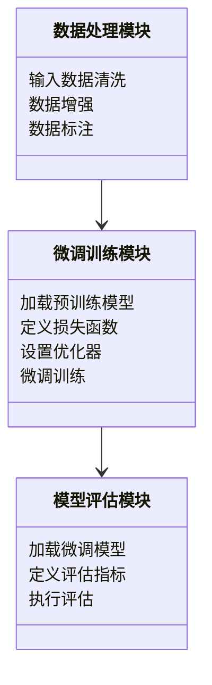
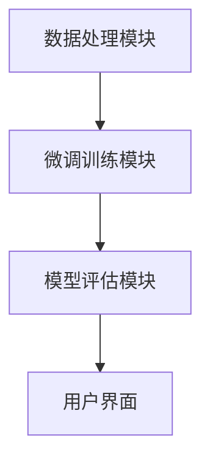
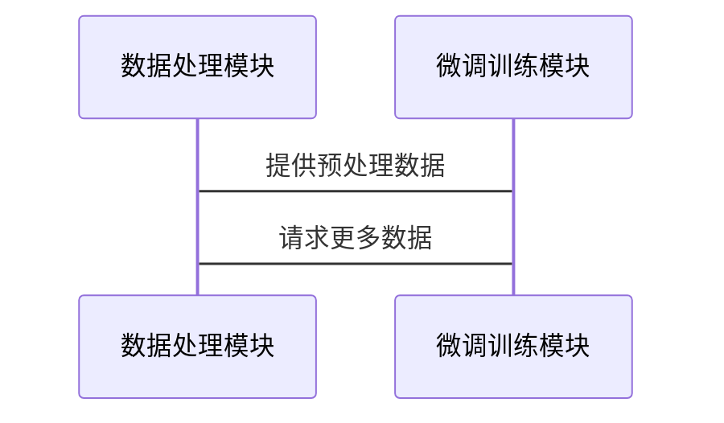

                 


# LLM在AI Agent中的微调技术：适应特定领域需求

## 关键词：LLM，AI Agent，微调技术，特定领域，适应性训练

## 摘要：本文系统地探讨了大语言模型（LLM）在AI Agent中的微调技术，分析其在特定领域中的应用需求。通过背景介绍、核心概念、算法原理、系统架构设计、项目实战和最佳实践，深入剖析了如何通过微调技术提升LLM在AI Agent中的性能，使其更好地适应特定领域的需求。

---

## 第1章：LLM与AI Agent概述

### 1.1 LLM的基本概念

1.1.1 大语言模型的定义与发展  
大语言模型（LLM）是指经过大量数据训练的大型神经网络模型，如GPT、BERT等。这些模型具有强大的自然语言处理能力，能够生成、理解和分析文本。

1.1.2 LLM在AI Agent中的作用  
AI Agent（智能体）通过LLM处理复杂任务，如对话生成、信息检索和决策支持。LLM为AI Agent提供了强大的语言理解与生成能力。

1.1.3 微调技术的必要性  
微调技术通过在特定领域数据上的训练，调整模型参数，使其适应具体任务需求，提升性能。

### 1.2 AI Agent的基本概念

1.2.1 AI Agent的定义与分类  
AI Agent是通过感知环境、执行任务的智能系统，分为简单反射型、基于模型型等类型。

1.2.2 AI Agent的核心功能与应用场景  
核心功能包括感知、决策和执行，应用场景广泛，如智能助手、自动驾驶等。

1.2.3 微调技术在AI Agent中的应用价值  
微调技术使AI Agent在特定领域表现出色，如医疗诊断、法律咨询等。

---

## 第2章：微调技术的核心概念

### 2.1 微调技术的原理

2.1.1 模型参数调整的基本原理  
微调涉及调整模型的参数，使其适应特定任务。模型在新数据上微调，更新参数，提升任务表现。

2.1.2 数据预处理的作用  
数据预处理包括清洗、增强和标注，确保输入数据的质量和适用性，提升微调效果。

2.1.3 适应特定领域的关键点  
识别领域特定特征，选择合适的微调策略，确保模型在特定任务中表现良好。

### 2.2 微调技术与LLM的关系

2.2.1 LLM的可塑性分析  
LLM具有强大的适应性，可通过微调技术应用于不同领域。

2.2.2 微调技术如何优化LLM性能  
微调通过领域数据调整参数，提升LLM在特定任务中的准确性。

2.2.3 微调与迁移学习的对比  
微调更关注参数调整，迁移学习更广泛，微调是迁移学习的一种形式。

---

## 第3章：微调算法的数学模型

### 3.1 损失函数

微调过程中，交叉熵损失函数用于衡量预测与真实标签的差异：

$$L = -\sum_{i=1}^{n} y_i \log p(y_i|x_i)$$

### 3.2 优化器

Adam优化器结合动量和自适应学习率，优化模型参数：

$$\theta_{t+1} = \theta_t - \eta \frac{\rho_1 \nabla L + (1-\rho_1)(\nabla L)_t}{\sqrt{\rho_2 \nabla^2 L + (1-\rho_2)(\nabla L)_t^2 + \epsilon}$$}

---

## 第4章：系统分析与架构设计方案

### 4.1 项目背景

开发一个特定领域的AI Agent，解决医疗诊断中的常见问题。

### 4.2 系统功能设计

设计功能模块，如数据处理、微调训练、模型评估，用Mermaid类图表示。



### 4.3 系统架构设计

采用微服务架构，用Mermaid架构图展示模块交互。



### 4.4 系统接口设计

定义数据预处理接口和模型训练接口，展示交互过程。

### 4.5 系统交互

用Mermaid序列图展示数据处理模块调用微调训练模块的过程。



---

## 第5章：项目实战

### 5.1 环境安装

安装Python、TensorFlow、Hugging Face库等。

### 5.2 核心代码实现

```python
from transformers import AutoModelForMaskedLM, AutoTokenizer
import torch

# 加载预训练模型
model = AutoModelForMaskedLM.from_pretrained('bert-base-uncased')
tokenizer = AutoTokenizer.from_pretrained('bert-base-uncased')

# 定义数据集
class MyDataset(torch.utils.data.Dataset):
    def __init__(self, texts, tokenizer):
        self.texts = texts
        self.tokenizer = tokenizer
    def __len__(self):
        return len(self.texts)
    def __getitem__(self, idx):
        text = self.texts[idx]
        encoding = self.tokenizer.encode_plus(
            text,
            add_special_tokens=True,
            return_token_type_ids=False,
            padding='max_length',
            truncation=True,
            max_length=128,
            return_attention_mask=True,
            return_tensors='pt',
        )
        return {
            'input_ids': encoding['input_ids'].flatten(),
            'attention_mask': encoding['attention_mask'].flatten(),
            'labels': encoding['input_ids'].flatten()
        }

# 微调训练
optimizer = torch.optim.Adam(model.parameters(), lr=1e-5)
criterion = nn.CrossEntropyLoss()

# 训练循环
for epoch in range(num_epochs):
    for batch in dataloader:
        inputs = batch['input_ids'].to(device)
        masks = batch['attention_mask'].to(device)
        labels = batch['labels'].to(device)
        outputs = model(inputs, attention_mask=masks)
        loss = criterion(outputs.logits, labels)
        loss.backward()
        optimizer.step()
        optimizer.zero_grad()
```

### 5.3 案例分析

在医疗领域进行微调，分析模型在诊断中的应用，总结经验教训。

---

## 第6章：最佳实践

### 6.1 小结

总结全书内容，强调微调技术的重要性。

### 6.2 注意事项

避免过拟合，注意数据泄漏，确保数据质量。

### 6.3 拓展阅读

推荐相关书籍和论文，如《Deep Learning》。

---

## 作者：AI天才研究院 & 禅与计算机程序设计艺术

---

这本书详细讲解了LLM在AI Agent中的微调技术，帮助读者理解并掌握如何在特定领域中应用这些技术。通过理论与实践相结合，读者可以提升AI Agent的性能，适应不同场景的需求。

