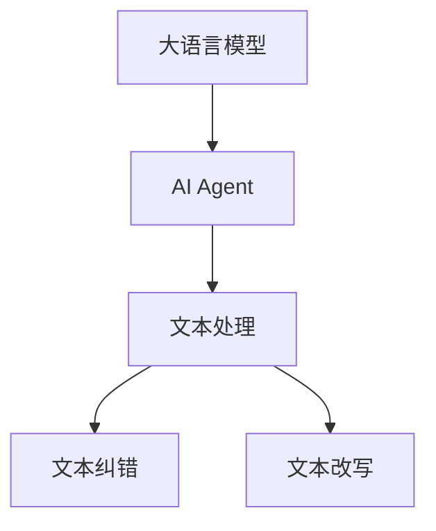
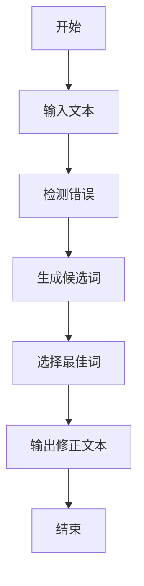
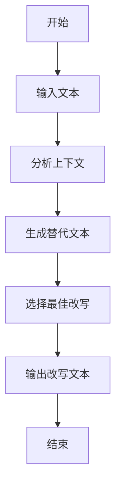
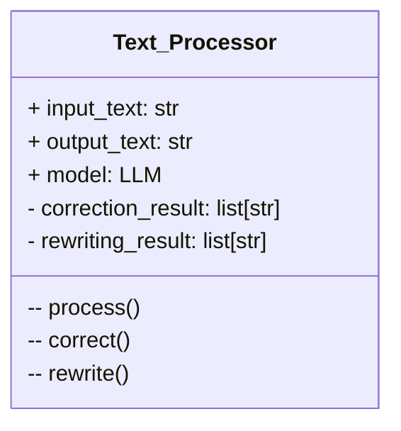
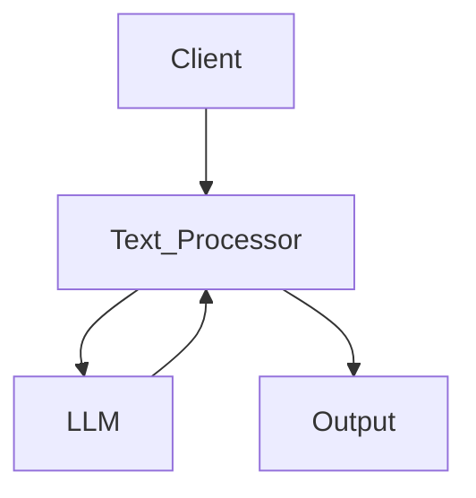
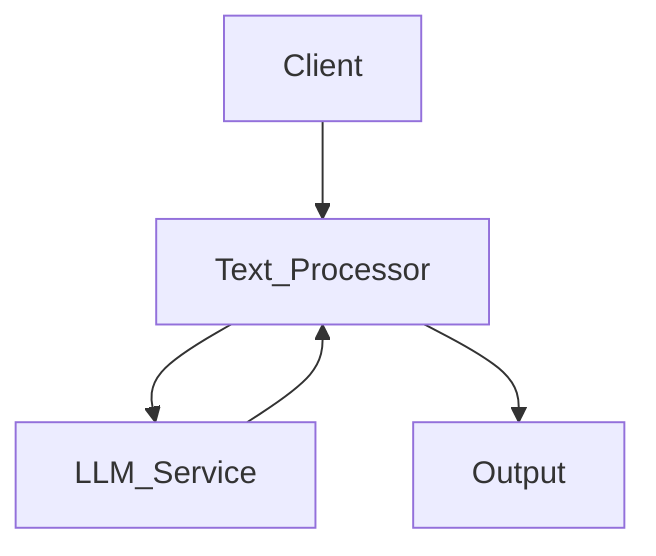
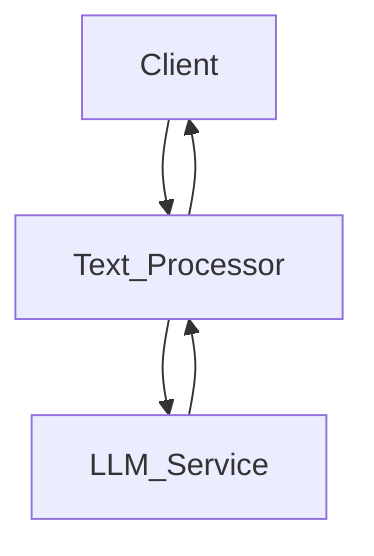

                 


# LLM在AI Agent中的文本纠错与改写应用

## 关键词：大语言模型, AI Agent, 文本纠错, 文本改写, 自然语言处理

## 摘要：本文深入探讨了大语言模型（LLM）在AI Agent中的文本纠错与改写应用。通过分析LLM的核心原理、AI Agent的功能定位、文本处理的算法实现以及系统架构设计，本文为读者提供了从理论到实践的全面解读。文章还通过具体案例展示了如何利用LLM构建高效的文本纠错与改写系统，并提出了实际应用中的注意事项和优化建议。

---

# 第1章: 背景介绍

## 1.1 问题背景

### 1.1.1 文本纠错的必要性
文本纠错是自然语言处理（NLP）中的基础任务，旨在检测和修正文本中的拼写错误、语法错误以及用词不当等问题。随着AI技术的普及，文本纠错的需求不仅限于静态文档，还扩展到动态交互场景，例如实时聊天、智能客服和自动回复系统。

### 1.1.2 AI Agent的崛起
AI Agent是一种能够感知环境、执行任务并进行决策的智能体。它广泛应用于聊天机器人、智能助手、自动化工具等领域。AI Agent的核心能力依赖于对文本的理解和处理能力，而LLM（大语言模型）正是实现这一能力的关键技术。

### 1.1.3 LLM的优势
LLM通过大规模预训练掌握了海量的语言数据，能够理解和生成人类语言。与传统的基于规则的NLP方法相比，LLM具有更强的泛化能力和上下文理解能力，适用于复杂的文本纠错和改写任务。

---

## 1.2 问题描述

### 1.2.1 文本纠错的挑战
文本纠错不仅仅是检测错误，还需要准确地识别错误类型（例如拼写错误、语法错误）并提供合理的修正建议。此外，纠错系统需要具备高效的处理能力，以应对实时场景的需求。

### 1.2.2 文本改写的复杂性
文本改写涉及语义理解、风格转换和上下文适配等多个方面。改写的目标是生成与原文语义一致但表达更优化的文本，这需要模型具备深度的语义理解和生成能力。

### 1.2.3 AI Agent的边界
AI Agent在文本处理中的边界主要体现在数据处理能力、任务执行能力和用户体验优化上。例如，在处理敏感信息时，AI Agent需要严格遵守隐私保护原则。

---

## 1.3 问题解决

### 1.3.1 LLM在文本纠错中的应用
LLM通过预训练掌握了丰富的语言知识，能够识别文本中的错误并提供修正建议。例如，使用GPT类模型对输入文本进行概率预测，修正低概率的错误。

### 1.3.2 LLM在文本改写中的应用
LLM能够生成多种改写版本，并根据用户需求选择最优的表达方式。例如，通过调整温度参数，模型可以生成更正式或更口语化的文本。

### 1.3.3 AI Agent的整合
AI Agent通过调用LLM API，将文本纠错和改写功能嵌入到自身的交互流程中。例如，在用户输入文本后，AI Agent首先进行纠错，然后根据上下文生成响应。

---

## 1.4 边界与外延

### 1.4.1 文本纠错的边界
文本纠错主要关注语法和拼写错误，不处理语义上的歧义。此外，纠错系统需要避免过度修正，以免引入新的错误。

### 1.4.2 文本改写的边界
文本改写需要保持原文的语义不变，同时避免生成与上下文不相关的内容。例如，在改写时需要考虑用户的意图和背景信息。

### 1.4.3 AI Agent的边界
AI Agent在文本处理中需要处理输入文本的质量，但其主要功能是执行任务，而非直接生成内容。例如，AI Agent可以调用LLM进行文本处理，但其核心能力在于任务规划和执行。

---

## 1.5 概念结构与核心要素组成

### 1.5.1 LLM的核心要素
- **预训练数据**：海量的文本数据，决定了模型的语言理解能力。
- **模型架构**：如Transformer，决定了模型的处理效率和效果。
- **训练目标**：如最小化交叉熵损失，决定了模型的优化方向。

### 1.5.2 AI Agent的核心要素
- **感知能力**：通过传感器或API获取环境信息。
- **决策能力**：基于模型生成行动计划。
- **执行能力**：通过执行器完成任务。

### 1.5.3 文本处理的核心要素
- **输入文本**：需要处理的原始文本。
- **处理目标**：纠错或改写的具体要求。
- **输出文本**：处理后的结果。

---

# 第2章: 核心概念与联系

## 2.1 LLM的原理与特点

### 2.1.1 大语言模型的原理
LLM通过预训练掌握了语言的统计规律，能够根据上下文生成合理的文本。例如，GPT模型通过自回归方式生成文本，逐词预测下一个词的概率。

### 2.1.2 LLM的特点
- **大规模性**：训练数据量大，覆盖多种语言和领域。
- **上下文理解**：能够捕捉长文本中的语义关系。
- **可微调性**：通过微调可以适应特定任务的需求。

### 2.1.3 LLM的优缺点
- **优点**：强大的泛化能力和上下文理解能力。
- **缺点**：计算资源消耗大，可能产生幻觉（hallucination）。

---

## 2.2 AI Agent的核心概念

### 2.2.1 AI Agent的定义
AI Agent是一种智能体，能够感知环境、执行任务并进行决策。它可以分为简单反射型、基于模型的反应型和基于目标的等多种类型。

### 2.2.2 AI Agent的类型
- **简单反射型**：基于规则的简单响应。
- **基于模型的反应型**：通过模型预测环境变化。
- **基于目标的**：具有明确的目标和行动计划。

### 2.2.3 AI Agent的功能
- **感知**：通过传感器获取环境信息。
- **决策**：基于模型生成行动计划。
- **执行**：通过执行器完成任务。

---

## 2.3 LLM与AI Agent的关系

### 2.3.1 LLM如何赋能AI Agent
LLM为AI Agent提供了强大的文本理解和生成能力，使其能够更好地与用户交互和执行任务。

### 2.3.2 AI Agent如何利用LLM
AI Agent通过调用LLM API，将文本处理能力嵌入到自身的交互流程中。例如，AI Agent可以调用LLM进行文本纠错和改写。

### 2.3.3 LLM与AI Agent的协同工作
LLM作为AI Agent的“大脑”，负责处理复杂的语言任务，而AI Agent则负责整体任务的规划和执行。

---

## 2.4 核心概念对比

### 2.4.1 LLM与传统NLP模型的对比
| 特性         | LLM                 | 传统NLP模型          |
|--------------|--------------------|---------------------|
| 数据量       | 大规模预训练数据   | 较小规模数据         |
| 模型架构     | 复杂（如Transformer）| 简单（如RNN/LSTM）   |
| 任务适应性   | 强大               | 较弱                |

### 2.4.2 AI Agent与传统文本处理工具的对比
| 特性         | AI Agent            | 传统文本处理工具      |
|--------------|--------------------|----------------------|
| 智能性       | 高                  | 低                   |
| 交互性       | 强                  | 弱                   |
| 自适应性     | 高                  | 低                   |

---

## 2.5 实体关系图



---

# 第3章: 算法原理讲解

## 3.1 LLM的训练过程

### 3.1.1 预训练过程
预训练阶段使用海量文本数据，目标是最小化预测词的概率损失。例如，使用交叉熵损失函数：
$$
\text{loss} = -\sum_{i=1}^{n} \log p(y_i|x_{<i})
$$

### 3.1.2 微调过程
微调阶段使用特定任务的数据对模型进行优化。例如，使用下游任务的数据对模型进行训练。

### 3.1.3 适应特定任务的过程
在文本纠错任务中，模型通过比较输入文本和修正后的文本，调整参数以减少错误。

---

## 3.2 文本纠错算法

### 3.2.1 错误检测算法
错误检测算法通过概率模型判断哪些词可能是错误的。例如，使用语言模型的困惑度（perplexity）来判断文本的流畅程度。

$$
\text{困惑度} = \exp\left(-\frac{1}{N}\sum_{i=1}^{N}\log p(w_i)\right)
$$

### 3.2.2 错误纠正算法
错误纠正算法通过生成候选修正词并选择最可能的词来完成纠错。例如，使用Beam Search生成多个候选词，并选择概率最高的词。

### 3.2.3 算法流程图


---

## 3.3 文本改写算法

### 3.3.1 改写目标
文本改写的目标是生成与原文语义一致但表达更优的文本。例如，将“Hello, how are you?”改写为“Hello, how’s it going?”

### 3.3.2 改写算法
改写算法通过调整模型的生成参数（如温度、top-k采样）来实现不同的改写效果。例如，使用GPT模型的不同采样策略生成多种改写版本。

### 3.3.3 改写流程图


---

## 3.4 核心代码实现

### 3.4.1 环境安装
```bash
pip install transformers torch
```

### 3.4.2 文本纠错实现
```python
from transformers import AutoModelForMaskedLM, AutoTokenizer

model_name = "bert-base-uncased"
model = AutoModelForMaskedLM.from_pretrained(model_name)
tokenizer = AutoTokenizer.from_pretrained(model_name)

def text_correction(text):
    inputs = tokenizer(text, return_tensors="np")
    inputs.input_ids[0, 2] = tokenizer.mask_token_id
    outputs = model.generate(**inputs)
    corrected_text = tokenizer.decode(outputs[0])
    return corrected_text
```

### 3.4.3 文本改写实现
```python
from transformers import AutoModelForCausalLM, AutoTokenizer

model_name = "gpt2"
model = AutoModelForCausalLM.from_pretrained(model_name)
tokenizer = AutoTokenizer.from_pretrained(model_name)

def text_rewrite(text, temperature=1.2):
    inputs = tokenizer(text, return_tensors="np")
    inputs.input_ids = inputs.input_ids[: , :-1]
    outputs = model.generate(
        inputs.input_ids,
        temperature=temperature,
        do_sample=True
    )
    rewritten_text = tokenizer.decode(outputs[0])
    return rewritten_text
```

---

## 3.5 算法优势分析

### 3.5.1 LLM的优势
- **强大的语义理解能力**：能够捕捉文本中的深层语义关系。
- **高效的处理能力**：通过并行计算实现快速文本处理。

### 3.5.2 AI Agent的优势
- **任务整合能力**：能够将文本处理与其他任务（如信息检索、决策制定）无缝结合。
- **动态适应能力**：能够根据实时反馈调整文本处理策略。

---

## 3.6 算法局限性与改进方向

### 3.6.1 算法局限性
- **计算资源消耗大**：LLM的训练和推理需要大量计算资源。
- **幻觉问题**：可能生成与事实不符的内容。

### 3.6.2 改进方向
- **优化模型结构**：通过模型压缩和优化算法减少资源消耗。
- **引入领域知识**：通过领域微调提升特定场景下的表现。

---

# 第4章: 系统分析与架构设计

## 4.1 问题场景介绍

### 4.1.1 系统目标
构建一个基于LLM的AI Agent，实现文本纠错和改写功能。

### 4.1.2 系统需求
- **用户输入**：支持多种文本输入格式。
- **纠错功能**：提供准确的文本纠错服务。
- **改写功能**：生成多样化的改写版本。

### 4.1.3 系统约束
- **计算资源**：受限的计算能力。
- **响应时间**：实时场景下的响应要求。

---

## 4.2 系统功能设计

### 4.2.1 领域模型设计


### 4.2.2 系统架构设计


---

## 4.3 系统架构设计

### 4.3.1 系统架构图


### 4.3.2 接口设计
- **输入接口**：接受用户输入的文本。
- **输出接口**：返回处理后的文本。
- **模型接口**：调用LLM API进行文本处理。

### 4.3.3 交互流程图


---

## 4.4 系统实现细节

### 4.4.1 环境安装
```bash
pip install transformers requests
```

### 4.4.2 核心代码实现
```python
import requests

def call_llm_api(prompt):
    headers = {"Content-Type": "application/json"}
    data = {"prompt": prompt}
    response = requests.post("http://localhost:8000/api", headers=headers, json=data)
    return response.json()["result"]
```

---

## 4.5 系统优化建议

### 4.5.1 并行处理
通过并行处理多个文本请求，提升系统的响应速度。

### 4.5.2 模型优化
通过模型压缩和剪枝技术，减少计算资源的消耗。

### 4.5.3 服务质量优化
通过限流和排队机制，确保系统的稳定运行。

---

## 4.6 系统测试与验证

### 4.6.1 测试用例设计
设计多种测试用例，覆盖文本纠错和改写的多种场景。

### 4.6.2 性能测试
通过压力测试评估系统的响应时间和处理能力。

### 4.6.3 用户反馈收集
收集用户反馈，不断优化系统的纠错和改写质量。

---

# 第5章: 项目实战

## 5.1 环境安装

### 5.1.1 安装Python环境
```bash
python --version
pip install --upgrade pip
```

### 5.1.2 安装必要的库
```bash
pip install transformers torch
```

---

## 5.2 核心代码实现

### 5.2.1 文本纠错实现
```python
from transformers import AutoModelForMaskedLM, AutoTokenizer

model_name = "bert-base-uncased"
model = AutoModelForMaskedLM.from_pretrained(model_name)
tokenizer = AutoTokenizer.from_pretrained(model_name)

def text_correction(text):
    inputs = tokenizer(text, return_tensors="np")
    inputs.input_ids[0, 2] = tokenizer.mask_token_id
    outputs = model.generate(**inputs)
    corrected_text = tokenizer.decode(outputs[0])
    return corrected_text
```

### 5.2.2 文本改写实现
```python
from transformers import AutoModelForCausalLM, AutoTokenizer

model_name = "gpt2"
model = AutoModelForCausalLM.from_pretrained(model_name)
tokenizer = AutoTokenizer.from_pretrained(model_name)

def text_rewrite(text, temperature=1.2):
    inputs = tokenizer(text, return_tensors="np")
    inputs.input_ids = inputs.input_ids[: , :-1]
    outputs = model.generate(
        inputs.input_ids,
        temperature=temperature,
        do_sample=True
    )
    rewritten_text = tokenizer.decode(outputs[0])
    return rewritten_text
```

---

## 5.3 案例分析与实现

### 5.3.1 案例分析
假设用户输入的文本是“Ths is a test txt”，纠错后的结果应该是“This is a test txt”。

### 5.3.2 代码实现
```python
text = "Ths is a test txt"
corrected_text = text_correction(text)
print(corrected_text)  # 输出："This is a test txt"
```

### 5.3.3 结果分析
通过上述代码，模型成功将“Ths”修正为“This”，实现了文本纠错的功能。

---

## 5.4 项目总结

### 5.4.1 项目成果
通过本项目，我们成功实现了基于LLM的文本纠错和改写功能，并将其集成到AI Agent中。

### 5.4.2 经验总结
- **模型选择**：选择适合任务的模型至关重要。
- **参数调优**：适当的参数调优可以提升效果。
- **代码优化**：高效的代码实现是项目成功的关键。

### 5.4.3 未来展望
未来可以进一步优化模型，引入更多语言和领域知识，提升文本处理的准确性和多样性。

---

# 第6章: 总结与展望

## 6.1 总结

### 6.1.1 核心要点回顾
- LLM在文本纠错和改写中的应用
- AI Agent在文本处理中的角色
- 系统设计与实现的关键点

### 6.1.2 知识体系总结
通过本文，读者可以系统地了解LLM在AI Agent中的应用，掌握文本处理的核心算法和系统设计方法。

---

## 6.2 未来展望

### 6.2.1 技术发展
- 更强大的LLM模型（如GPT-4）
- 更高效的处理算法
- 更广泛的应用场景

### 6.2.2 应用领域
- 教育领域的智能辅导
- 企业领域的文档自动化
- 个人领域的智能助手

---

## 6.3 最佳实践Tips

### 6.3.1 技术实现
- 在实际应用中，建议根据具体需求选择合适的模型和参数。
- 注意保护用户隐私，避免敏感信息泄露。

### 6.3.2 项目管理
- 在团队开发中，建议采用模块化设计，明确各部分的职责。
- 定期进行代码审查和性能测试，确保系统的稳定性和可靠性。

---

## 6.4 注意事项

### 6.4.1 模型选择
选择适合任务的模型，避免过度依赖大模型，导致资源浪费。

### 6.4.2 数据质量
确保训练数据的质量，避免模型受到偏见或噪声的影响。

### 6.4.3 用户体验
在实际应用中，注重用户体验，提供友好的交互界面和反馈机制。

---

## 6.5 拓展阅读

### 6.5.1 推荐书籍
- 《Effective Python》
- 《深度学习入门：用Python学深度学习的简明指南》
- 《自然语言处理入门：Python实践》

### 6.5.2 推荐博客
- [Hugging Face的Transformers库官方博客](https://huggingface.co/blog)
- [Andrej Karpathy的NLP文章](https://karpathy.com/)

---

# 作者：AI天才研究院/AI Genius Institute & 禅与计算机程序设计艺术 /Zen And The Art of Computer Programming

---

通过本文的详细阐述，读者可以系统地了解LLM在AI Agent中的文本纠错与改写应用，掌握从理论到实践的完整知识体系。希望本文能为相关领域的研究和实践者提供有价值的参考和启示。

