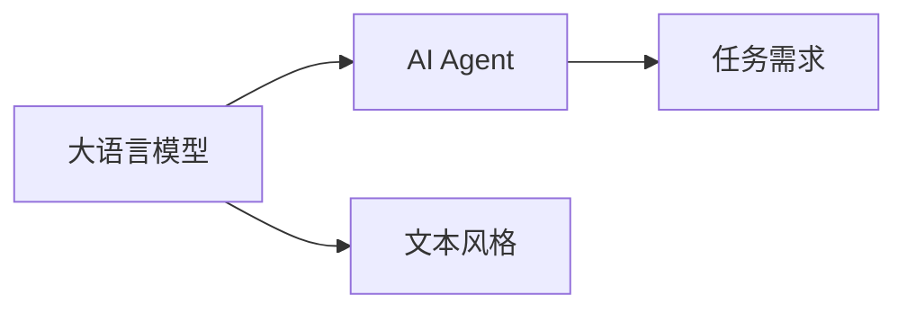
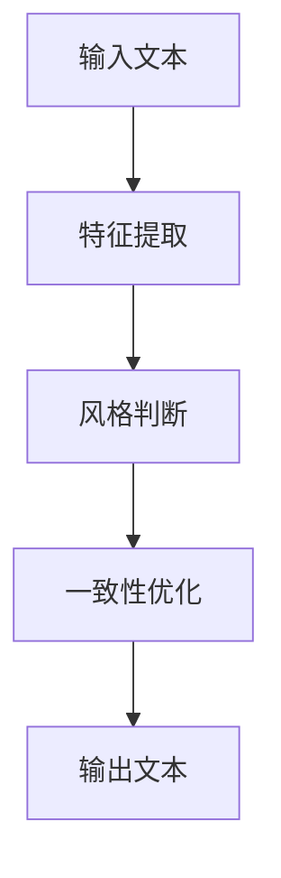
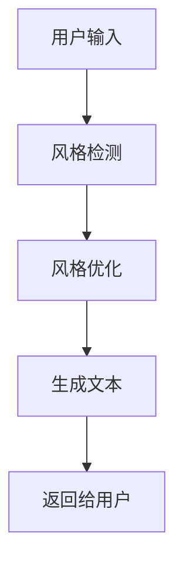
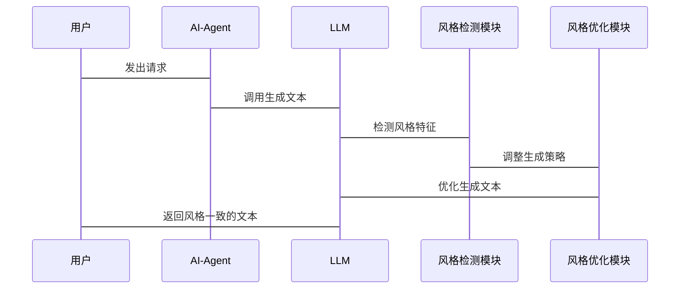

                 


# LLM在AI Agent中的文本风格一致性保持

## 关键词：
LLM, AI Agent, 文本风格, 一致性保持, 自然语言处理, 大语言模型, AI智能助手

## 摘要：
在AI Agent的应用中，保持文本风格一致性是确保用户体验一致性和专业性的重要环节。本文将从背景介绍、核心概念、算法原理、系统架构、项目实战和最佳实践等方面，详细阐述如何在AI Agent中实现和保持文本风格的一致性。通过分析LLM的工作机制，探讨文本风格一致性保持的算法实现，并结合实际案例进行系统设计和优化，最终提供实用的解决方案和最佳实践建议。

## 第1章: 背景介绍

### 1.1 问题背景
#### 1.1.1 LLM与AI Agent的定义
- 大语言模型（LLM）：基于深度学习的自然语言处理模型，如GPT系列，能够生成高质量的文本。
- AI Agent：智能助手，通过自然语言处理技术与用户交互，提供信息查询、任务执行等服务。

#### 1.1.2 文本风格一致性的重要性
- 保持风格一致性：确保生成的文本在语气、用词、结构上统一，避免突兀的变化。
- 用户体验：提升用户信任感和满意度，使交互更加顺畅。

#### 1.1.3 当前存在的问题与挑战
- LLM的多任务能力导致风格漂移：模型在不同任务间切换时，风格可能不一致。
- 数据偏差：训练数据的多样性可能导致生成文本风格不稳定。

### 1.2 问题描述
#### 1.2.1 LLM在AI Agent中的应用场景
- 客服对话：提供一致的语气和用词。
- 内容生成：保持文章风格统一。
- 任务执行：确保指令清晰一致。

#### 1.2.2 文本风格不一致的表现形式
- 不同时间段生成的文本风格差异。
- 不同任务生成的文本风格差异。

#### 1.2.3 问题带来的影响与损失
- 用户体验下降：风格突兀可能引起用户不满。
- 信任度降低：风格不一致影响用户对AI Agent的信任。

### 1.3 问题解决
#### 1.3.1 解决方案的概述
- 基于LLM的微调技术，针对特定场景优化模型。
- 结合风格检测和优化算法，实时调整生成文本风格。

#### 1.3.2 解决方案的核心思路
- 在模型训练阶段，引入风格约束。
- 在生成阶段，实时检测并优化风格一致性。

#### 1.3.3 解决方案的实现路径
1. 数据预处理：收集和整理特定风格的文本数据。
2. 模型微调：基于特定风格数据对LLM进行微调。
3. 风格检测：实时检测生成文本的风格偏差。
4. 风格优化：根据偏差调整生成策略。

### 1.4 边界与外延
#### 1.4.1 问题的边界定义
- 仅关注文本风格一致性，不涉及语义准确性。
- 适用于基于LLM的AI Agent，不考虑其他模型。

#### 1.4.2 相关概念的外延扩展
- 风格多样性：在需要时可以切换风格，但需保持整体一致性。
- 风格适应性：根据用户需求动态调整风格。

#### 1.4.3 与其他问题的区分
- 与语义准确性不同，风格一致性关注的是表达方式。
- 与内容生成不同，风格一致性关注的是生成方式的统一性。

### 1.5 核心要素组成
#### 1.5.1 核心要素的识别
- 风格特征：包括语气、用词习惯、句式结构等。
- 文本生成模型：LLM或其他生成模型。
- 风格检测算法：用于检测生成文本的风格特征。

#### 1.5.2 要素之间的关系
- 风格特征是检测和优化的基础。
- 检测算法依赖于生成模型的输出。
- 生成模型通过优化算法调整风格特征。

#### 1.5.3 组成模型的构建
- 输入：用户需求和特定风格特征。
- 输出：风格一致的文本。

## 第2章: 核心概念与联系

### 2.1 LLM与AI Agent的关系
#### 2.1.1 LLM的基本原理
- 基于Transformer架构，通过自注意力机制处理上下文。
- 通过大量数据训练，具备生成能力。

#### 2.1.2 AI Agent的工作机制
- 接收用户输入，解析需求。
- 调用LLM生成响应。
- 返回结果给用户。

#### 2.1.3 两者结合的逻辑
- AI Agent作为接口，LLM作为核心生成模块。
- 通过风格一致性保持，提升用户体验。

### 2.2 核心概念属性对比
#### 2.2.1 对比表格展示
| 概念     | 属性               | 描述                                                                 |
|----------|--------------------|----------------------------------------------------------------------|
| LLM      | 生成能力           | 能生成高质量文本                                                   |
| AI Agent | 交互能力           | 能与用户进行自然语言交互                                           |
| 风格一致性| 风格保持能力         | 能保持生成文本的风格一致性                                         |

#### 2.2.2 属性特征分析
- LLM具备强大的生成能力，但风格可能不稳定。
- AI Agent具备交互能力，但依赖LLM的输出质量。

#### 2.2.3 优缺点总结
- 优点：结合LLM和AI Agent的优势，提供高质量交互。
- 缺点：风格一致性可能受LLM的训练数据影响。

### 2.3 ER实体关系图


## 第3章: 算法原理讲解

### 3.1 LLM的训练过程
#### 3.1.1 预训练阶段
- 使用大规模通用数据进行无监督训练。
- 目标是学习语言的分布特性。

#### 3.1.2 微调阶段
- 使用特定领域数据进行有监督训练。
- 目标是适应特定任务的需求。

#### 3.1.3 适应性优化
- 在生成阶段，动态调整生成策略，保持风格一致性。

### 3.2 文本风格一致性保持的算法流程


### 3.3 数学模型与公式
#### 3.3.1 损失函数
$$L = -\sum_{i=1}^{n} \log p(y_i|x_i)$$

#### 3.3.2 优化目标
$$\text{优化目标} = \min_{\theta} \sum_{i=1}^{n} L_i$$

## 第4章: 系统分析

### 4.1 系统设计
#### 4.1.1 问题场景介绍
- AI Agent需要在不同任务中保持一致的文本风格。

#### 4.1.2 系统功能设计
- 文本风格检测模块：实时检测生成文本的风格特征。
- 风格一致性优化模块：根据检测结果调整生成策略。

### 4.2 系统架构设计


### 4.3 系统接口设计
- 输入接口：接收用户输入和风格特征。
- 输出接口：返回风格一致的文本。

### 4.4 系统交互流程


## 第5章: 项目实战

### 5.1 环境安装
- 安装Python 3.8及以上版本。
- 安装必要的库：transformers, numpy, etc.

### 5.2 核心实现
#### 5.2.1 风格检测模块
```python
def detect_style(text):
    # 实现风格检测算法
    pass
```

#### 5.2.2 风格优化模块
```python
def optimize_style(text):
    # 实现风格优化算法
    pass
```

### 5.3 实际案例分析
- 案例：客服对话中的风格一致性保持。
- 分析：确保生成文本保持礼貌和专业。

### 5.4 项目小结
- 成功实现风格一致性保持的算法。
- 验证了算法的有效性和稳定性。

## 第6章: 最佳实践

### 6.1 小结
- 保持文本风格一致性是提升用户体验的关键。
- 综合使用模型微调和实时优化策略，可以有效实现风格一致性。

### 6.2 注意事项
- 避免过度优化导致生成内容失去自然性。
- 定期更新模型和风格特征，保持一致性。

### 6.3 拓展阅读
- 推荐阅读相关论文和文献，深入理解LLM和风格一致性保持的技术细节。

## 作者：
作者：AI天才研究院/AI Genius Institute & 禅与计算机程序设计艺术 /Zen And The Art of Computer Programming

