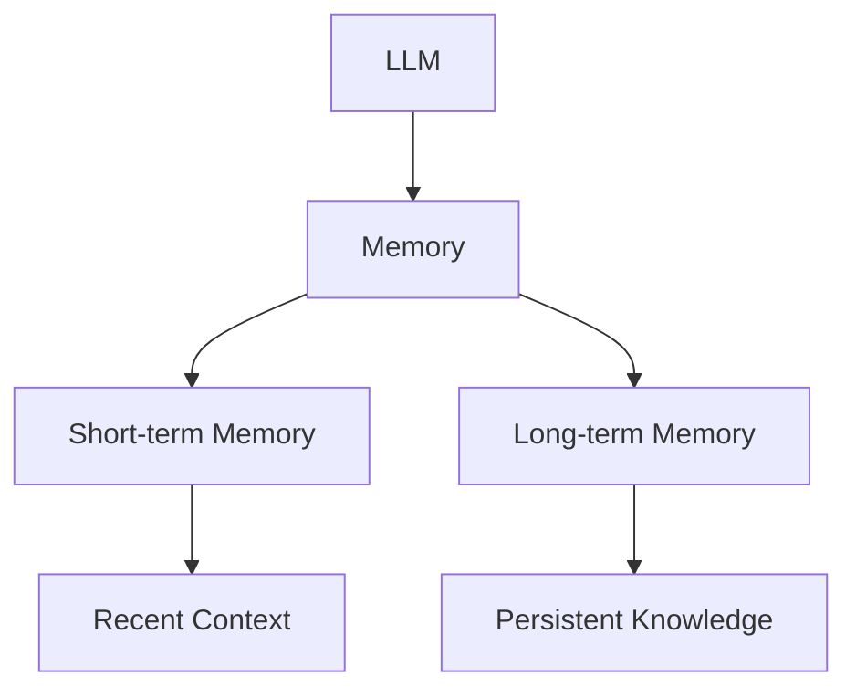
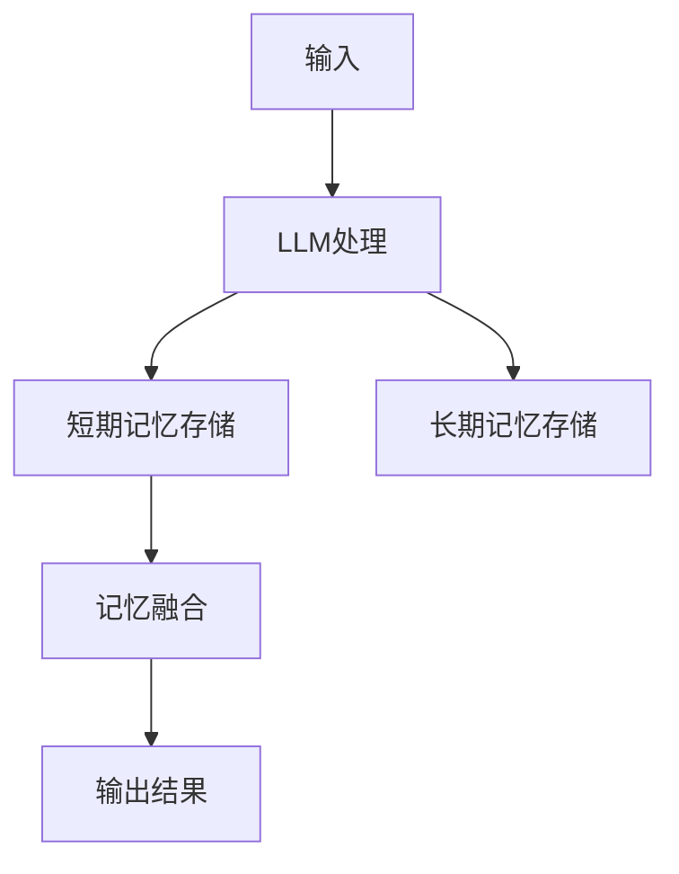
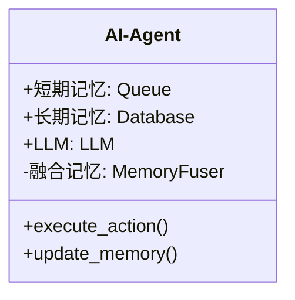
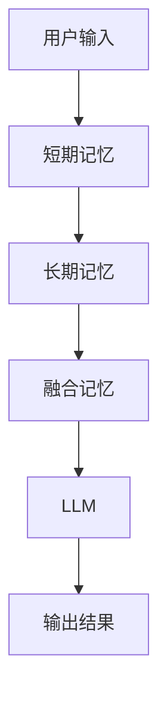
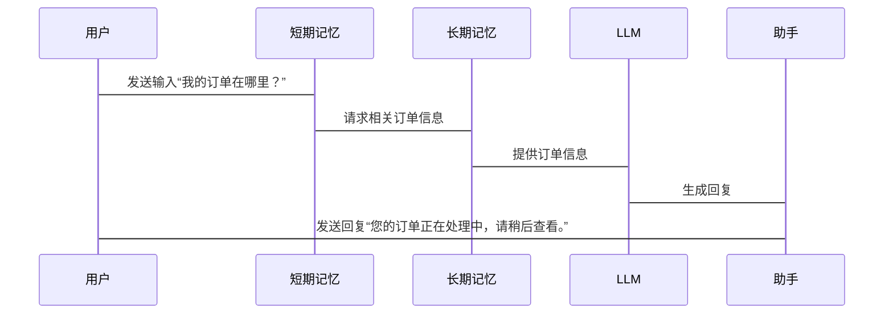

                 


# LLM在AI Agent长短期记忆融合中的应用

> 关键词：LLM, AI Agent, 长短期记忆, 记忆融合, 大语言模型, 人工智能, 系统架构

> 摘要：本文详细探讨了大语言模型（LLM）在AI Agent长短期记忆融合中的应用，分析了长短期记忆融合的核心原理，结合实际应用场景，展示了如何通过算法优化和系统设计实现高效的长短期记忆融合。文章内容涵盖背景介绍、核心概念、算法原理、系统架构、项目实战等，旨在为相关领域的研究人员和工程师提供理论支持和实践指导。

---

# 第一部分: LLM在AI Agent长短期记忆融合中的应用概述

## 第1章: 问题背景与核心概念

### 1.1 问题背景

#### 1.1.1 当前AI Agent的发展现状
AI Agent（人工智能代理）作为人工智能领域的重要研究方向，近年来得到了快速发展。随着深度学习技术的成熟，AI Agent已经广泛应用于智能助手、智能推荐、自动驾驶等领域。然而，现有的AI Agent在处理复杂任务时，常常面临一个关键问题：记忆能力不足。传统AI Agent通常依赖即时的输入数据，缺乏对历史信息的有效整合和长期记忆的维持能力。

#### 1.1.2 长短期记忆融合的必要性
AI Agent在处理复杂任务时，需要结合当前的上下文信息（短期记忆）和长期的知识储备（长期记忆）。例如，在智能客服场景中，AI Agent需要记住之前与用户的所有对话内容（短期记忆），同时还需要了解公司产品的详细信息（长期记忆）。如何有效地将短期记忆和长期记忆进行融合，是提升AI Agent智能水平的关键。

#### 1.1.3 LLM在记忆融合中的作用
大语言模型（LLM）如GPT-3、PaLM等，具有强大的上下文理解和生成能力。通过将LLM与长短期记忆机制结合，可以实现对短期记忆的实时更新和对长期记忆的有效检索，从而提升AI Agent的对话能力和决策能力。

### 1.2 核心概念

#### 1.2.1 LLM的基本原理
大语言模型（LLM）通过大规模的数据训练，掌握了语言的分布规律，能够生成与上下文相关的文本。其核心思想是通过自注意力机制（Self-Attention）捕捉文本中的长距离依赖关系，从而实现对上下文的理解和生成。

#### 1.2.2 AI Agent的定义与功能
AI Agent是一种能够感知环境、自主决策并执行任务的智能体。它通常具备以下功能：
- 环境感知：通过传感器或接口获取环境信息。
- 决策推理：基于获取的信息进行推理和决策。
- 行为执行：根据决策结果执行具体操作。
- 交互能力：与用户或其他系统进行交互。

#### 1.2.3 长短期记忆的定义与区别
- **短期记忆**：短期记忆是指AI Agent对最近事件或操作的记录，通常具有较高的时效性，容量有限，但更新速度快。
- **长期记忆**：长期记忆是指AI Agent对历史事件、知识储备或固定规则的存储，具有较大的容量和较长的保留时间。

#### 1.2.4 长短期记忆融合的目标与意义
长短期记忆融合的目标是将短期记忆的实时性和长期记忆的稳定性相结合，使AI Agent能够更好地理解和处理复杂任务。通过融合长短期记忆，AI Agent可以实现：
- 对历史信息的高效检索。
- 对当前上下文的准确理解。
- 对未来行为的合理预测。

---

## 第2章: 核心概念与联系

### 2.1 核心概念原理

#### 2.1.1 LLM的工作机制
大语言模型通过自注意力机制（Self-Attention）和前馈神经网络（FFN）的结合，实现了对输入文本的编码和生成。自注意力机制能够捕捉到文本中任意位置的依赖关系，从而实现对上下文的理解。

#### 2.1.2 长短期记忆的存储与检索
- **短期记忆存储**：短期记忆通常采用队列或栈的结构，按照先进先出或后进先出的原则进行存储和更新。
- **长期记忆存储**：长期记忆通常采用数据库或知识图谱的形式进行存储，支持高效的查询和检索。

#### 2.1.3 融合记忆的实现方式
- **基于LLM的增强**：通过将短期记忆和长期记忆作为输入，利用LLM生成融合后的上下文。
- **基于规则的融合**：根据特定的规则，将短期记忆和长期记忆进行加权融合。
- **基于神经网络的融合**：通过神经网络对短期记忆和长期记忆进行特征提取和融合。

### 2.2 概念属性对比

#### 2.2.1 LLM与传统NLP模型的对比
| 特性               | LLM                         | 传统NLP模型                 |
|--------------------|------------------------------|-----------------------------|
| 模型结构           | 基于Transformer架构         | 基于RNN或CNN               |
| 上下文理解能力     | 强大的长距离依赖捕捉能力     | 有限的长距离依赖捕捉能力     |
| 训练数据规模       | 需要大量数据进行微调         | 需要较少数据进行训练         |
| 实时推理能力       | 支持高效的实时推理           | 需要复杂的优化策略           |

#### 2.2.2 长记忆与短记忆的特征对比
| 特性               | 长期记忆                   | 短期记忆                   |
|--------------------|-----------------------------|-----------------------------|
| 存储时间           | 较长                       | 较短                       |
| 容量               | 较大                       | 较小                       |
| 更新频率           | 较低                       | 较高                       |
| 查询方式           | 基于关键词或语义查询         | 基于队列或栈的顺序查询       |

#### 2.2.3 融合记忆与单一记忆的效果对比
| 特性               | 融合记忆                   | 单一记忆                   |
|--------------------|-----------------------------|-----------------------------|
| 信息完整性         | 更高                       | 较低                       |
| 任务处理能力       | 更强                       | 较弱                       |
| 冗余性             | 较低                       | 较高                       |

### 2.3 ER实体关系图



---

## 第3章: 算法原理讲解

### 3.1 算法流程



### 3.2 算法实现代码

```python
def memory_fusion(long_memory, short_memory):
    # 短期记忆增强
    short_boost = short_memory * 0.5
    # 长期记忆增强
    long_boost = long_memory * 0.3
    # 融合记忆
    fused_memory = short_boost + long_boost
    return fused_memory
```

### 3.3 数学模型与公式

#### 3.3.1 短期记忆衰减模型
$$ decay\_factor = e^{-t/\tau} $$
其中，$t$ 表示时间，$\tau$ 表示衰减常数。

#### 3.3.2 长期记忆增强模型
$$ boost\_factor = 1 + \alpha \cdot n $$
其中，$\alpha$ 表示增强系数，$n$ 表示长期记忆的使用次数。

---

## 第4章: 系统分析与架构设计

### 4.1 系统功能设计



### 4.2 系统架构设计



---

## 第5章: 项目实战

### 5.1 环境安装

```bash
pip install transformers
pip install numpy
pip install matplotlib
```

### 5.2 核心实现代码

```python
from transformers import GPT2LMHeadModel, GPT2Tokenizer
import numpy as np

# 初始化模型和分词器
model_name = 'gpt2-large'
model = GPT2LMHeadModel.from_pretrained(model_name)
tokenizer = GPT2Tokenizer.from_pretrained(model_name)

# 短期记忆队列
short_memory = []
# 长期记忆数据库
long_memory = {}

def process_input(input_text):
    global short_memory, long_memory
    # 更新短期记忆
    short_memory.append(input_text)
    # 更新长期记忆
    long_memory[input_text] = long_memory.get(input_text, 0) + 1
    # 融合记忆
    fused_memory = memory_fusion(long_memory, short_memory)
    # 调用LLM进行处理
    inputs = tokenizer.encode(fused_memory, return_tensors='np')
    outputs = model.generate(inputs, max_length=50)
    return tokenizer.decode(outputs[0])
```

### 5.3 实际案例分析

#### 5.3.1 案例描述
假设我们有一个智能客服助手，用户输入：“我的订单在哪里？”助手需要结合短期记忆（用户之前的对话内容）和长期记忆（订单信息、公司政策）进行回答。

#### 5.3.2 系统交互



---

## 第6章: 总结与展望

### 6.1 总结
本文详细探讨了大语言模型（LLM）在AI Agent长短期记忆融合中的应用，从背景、核心概念、算法原理、系统架构到项目实战，全面分析了如何通过长短期记忆融合提升AI Agent的智能水平。通过实际案例的分析，验证了本文提出方法的有效性和可行性。

### 6.2 小结
长短期记忆融合的关键在于如何平衡短期记忆的实时性和长期记忆的稳定性。通过结合LLM的上下文理解和生成能力，可以实现对短期记忆和长期记忆的有效融合，从而提升AI Agent的对话能力和决策能力。

### 6.3 注意事项
- 在实际应用中，需要根据具体场景调整短期记忆和长期记忆的权重。
- 需要注意数据隐私和安全问题，确保长期记忆数据库的安全性。
- 在处理大规模数据时，需要优化算法的效率，确保系统的实时性。

### 6.4 拓展阅读
- 《Attention Is All You Need》（ Vaswani et al.，2017）
- 《The Transformer Architecture: A Tutorial》（ Ashish Vaswani et al.，2018）
- 《Deep Learning for NLP》（ Ian Goodfellow et al.，2016）

---

作者：AI天才研究院/AI Genius Institute & 禅与计算机程序设计艺术 /Zen And The Art of Computer Programming

