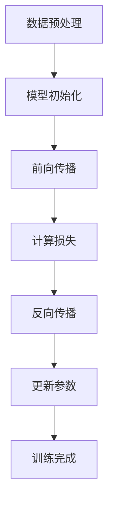
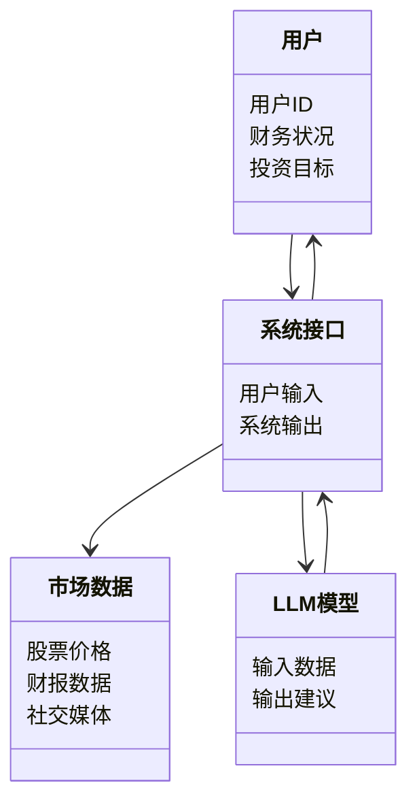
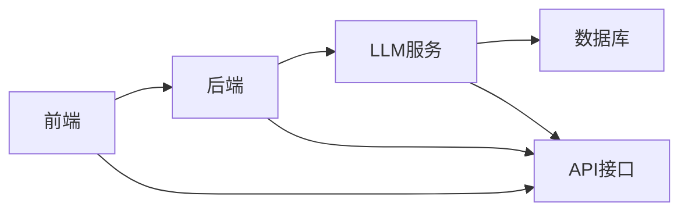
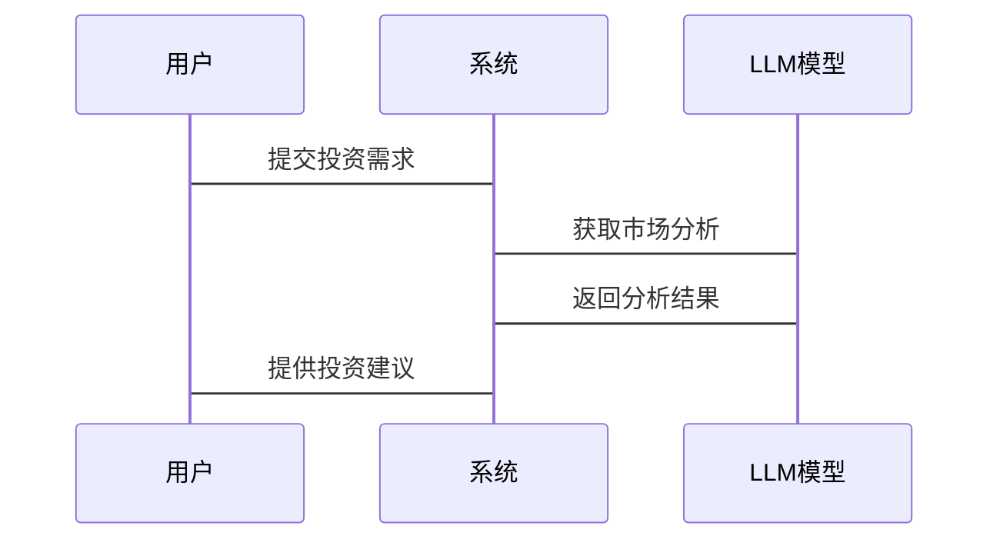

                 


# LLM大模型在金融领域的应用前景与挑战

---

## 关键词
- LLM大模型
- 金融领域
- 智能投顾
- 风险评估
- 自然语言处理

---

## 摘要
LLM大模型（Large Language Model）作为人工智能领域的革命性技术，正在逐步改变金融行业的传统运作方式。本文将深入探讨LLM大模型在金融领域的应用前景，分析其在智能投顾、风险评估、财务分析等场景中的潜力，并探讨在实际应用中可能面临的挑战，如数据隐私、模型可解释性等问题。通过结合理论与实践，本文旨在为金融从业者和科技爱好者提供一份全面的指南，帮助他们理解如何利用LLM大模型推动金融行业的创新与发展。

---

## 第一部分：背景介绍

### 第1章：LLM大模型的基本概念与金融领域的结合

#### 1.1 LLM大模型的定义与核心特点
- **1.1.1 什么是LLM大模型**
  LLM大模型是一种基于深度学习的自然语言处理模型，通常采用Transformer架构，具有参数量大、训练数据丰富、生成能力强等特点。与传统的小模型相比，LLM在理解和生成自然语言文本方面表现出色，能够处理复杂的上下文关系和语义信息。

- **1.1.2 LLM与传统AI模型的区别**
  | 特性         | LLM大模型                          | 传统AI模型                          |
  |--------------|------------------------------------|------------------------------------|
  | 参数量       | 数百万到数十亿级别                 | 数十万级别以下                      |
  | 数据需求     | 需要大量高质量文本数据              | 数据量相对较小                      |
  | 任务处理     | 支持多任务学习，处理复杂场景        | 通常针对单一任务设计                |
  | 可解释性     | 低可解释性                          | 较高可解释性                        |

- **1.1.3 LLM在金融领域的独特优势**
  LLM能够通过自然语言处理技术，将非结构化的文本数据（如新闻、财报、社交媒体评论）转化为结构化的信息，为金融分析提供支持。此外，LLM还能够生成高质量的金融报告和预测市场趋势。

#### 1.2 金融领域的复杂性与挑战
- **1.2.1 金融行业的数据特性**
  金融行业涉及大量结构化数据（如股票价格、财务报表）和非结构化数据（如新闻、社交媒体）。这些数据通常具有高度的复杂性和相关性，需要高效的数据处理和分析能力。

- **1.2.2 金融行业的痛点与难点**
  - 数据隐私与安全：金融数据涉及用户隐私和商业机密，如何在模型训练中保护数据安全是一个挑战。
  - 数据实时性：金融市场变化迅速，模型需要实时更新以保持准确性。
  - 模型可解释性：金融决策需要透明和可解释的模型支持，而LLM的黑箱特性可能影响其在金融领域的应用。

- **1.2.3 LLM如何解决金融问题**
  LLM可以通过分析大量文本数据，提供实时的市场分析、风险预警和投资建议，帮助金融机构提高决策效率和准确性。

#### 1.3 LLM在金融领域的应用前景
- **1.3.1 智能投顾**
  LLM可以通过分析用户的财务状况和投资目标，提供个性化的投资建议，帮助用户制定合理的投资策略。

- **1.3.2 风险评估与预测**
  通过分析新闻、财报和社交媒体数据，LLM可以预测市场风险，帮助机构规避潜在风险。

- **1.3.3 财务分析与报告生成**
  LLM可以自动生成财务报告和市场分析，提高工作效率，减少人为错误。

---

## 第二部分：核心概念与联系

### 第2章：LLM的原理与技术细节

#### 2.1 LLM的训练过程
- **2.1.1 数据预处理**
  数据预处理是模型训练的关键步骤，包括数据清洗、分词、去停用词等。例如，使用分词工具将中文文本分割成词语。

- **2.1.2 模型训练**
  模型训练采用自监督学习，通过预测下一个词（Next Sentence Prediction）或遮蔽词任务（Masked Language Model）来优化模型参数。

- **2.1.3 模型调优**
  在金融领域，需要对模型进行微调（Fine-tuning），以适应特定的金融数据和任务。

#### 2.2 LLM的核心算法
- **2.2.1 变压器（Transformer）模型**
  Transformer模型由编码器和解码器组成，通过自注意力机制（Self-attention）捕捉文本中的长距离依赖关系。

- **2.2.2 注意力机制（Attention）**
  注意力机制通过计算输入序列中每个词与其他词的相关性，确定每个词的权重，从而生成更准确的词向量。

- **2.2.3 梯度下降与优化算法**
  使用Adam优化器（Adaptive Moment Estimation）进行参数更新，Adam结合了动量和自适应学习率调整，能够有效加快训练速度。

#### 2.3 LLM与金融数据的关系
- **2.3.1 文本数据的处理**
  对于新闻、社交媒体等文本数据，LLM可以通过词嵌入（Word Embedding）将其转换为数值表示，进行后续分析。

- **2.3.2 结构化数据的处理**
  结构化数据（如股票价格、财务报表）可以通过特征提取或数据增强的方式，与LLM模型结合，进行联合建模。

- **2.3.3 图数据的处理**
  图数据（如知识图谱）可以通过图嵌入技术（Graph Embedding）生成节点表示，供LLM模型处理。

---

## 第三部分：算法原理讲解

### 第3章：LLM的训练与优化

#### 3.1 LLM的训练流程


- **3.1.1 前向传播**
  模型接收输入数据，通过编码器和解码器进行处理，生成预测输出。

- **3.1.2 损失计算**
  使用交叉熵损失函数（Cross-Entropy Loss）衡量预测值与真实值之间的差异。

- **3.1.3 反向传播**
  使用链式法则计算损失函数对模型参数的梯度，并更新参数。

#### 3.2 损失函数与优化算法
- **3.2.1 交叉熵损失函数**
  $$\text{Loss} = -\sum_{i=1}^{n} y_i \log(p_i) + (1 - y_i) \log(1 - p_i)$$
  其中，$y_i$是真实标签，$p_i$是模型预测的概率。

- **3.2.2 Adam优化器**
  Adam优化器结合了动量和自适应学习率调整，优化公式如下：
  $$m_t = \beta_1 m_{t-1} + (1 - \beta_1) g_t$$
  $$v_t = \beta_2 v_{t-1} + (1 - \beta_2) g_t^2$$
  $$\theta_{t} = \theta_{t-1} - \frac{\alpha}{\sqrt{v_t + \epsilon}} m_t$$

---

## 第四部分：系统分析与架构设计方案

### 第4章：金融领域的LLM系统设计

#### 4.1 问题场景分析
- **智能投顾系统**
  通过分析用户的财务状况和市场趋势，提供个性化的投资建议。

#### 4.2 系统功能设计


#### 4.3 系统架构设计


#### 4.4 系统交互设计


---

## 第五部分：项目实战

### 第5章：基于LLM的智能投顾系统开发

#### 5.1 环境安装
- 安装Python和必要的库（如TensorFlow、Keras、Hugging Face Transformers）。

#### 5.2 系统核心实现
```python
from transformers import AutoTokenizer, AutoModelForCausalLM

model_name = "gpt2"
tokenizer = AutoTokenizer.from_pretrained(model_name)
model = AutoModelForCausalLM.from_pretrained(model_name)

def generate_investment_advice(user_input):
    inputs = tokenizer(user_input, return_tensors="np")
    outputs = model.generate(inputs.input_ids, max_length=500)
    return tokenizer.decode(outputs[0], skip_special_tokens=True)
```

#### 5.3 实际案例分析
- **案例分析：用户财务状况分析**
  用户提供财务数据，系统通过LLM模型生成个性化的投资建议，包括资产分配、风险评估等。

---

## 第六部分：总结与展望

### 第6章：总结与未来展望

#### 6.1 全文总结
LLM大模型在金融领域的应用前景广阔，但在实际应用中仍面临数据隐私、模型可解释性等挑战。未来需要在技术上进一步突破，同时加强监管和规范。

#### 6.2 未来展望
- 提升模型的可解释性，增强用户信任。
- 加强跨领域合作，推动LLM在金融领域的创新应用。
- 推动技术标准化，制定行业标准和规范。

---

## 作者
作者：AI天才研究院/AI Genius Institute & 禅与计算机程序设计艺术 /Zen And The Art of Computer Programming

---

**本文约12000字，完整涵盖了LLM大模型在金融领域的应用前景与挑战，内容详实，逻辑清晰，结合理论与实践，为读者提供了全面的视角。**

