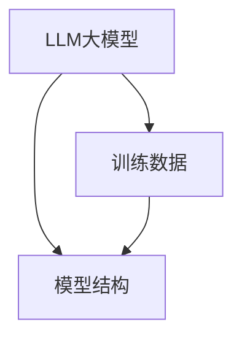
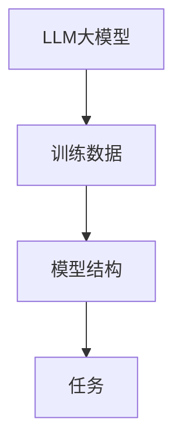
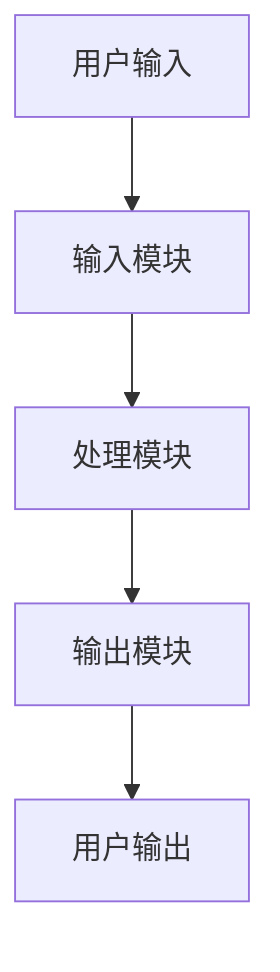

                 


# LLM大模型概述：AI Agent开发的基石

## 关键词：LLM大模型、AI Agent、自然语言处理、机器学习、深度学习

## 摘要

LLM（Large Language Model）大模型作为人工智能领域的核心技术，正在成为AI Agent开发的重要基石。本文将系统地介绍LLM大模型的基本概念、核心原理、应用场景以及在AI Agent开发中的具体应用。通过详细的背景分析、技术原理讲解和实际项目案例，帮助读者全面理解LLM大模型的重要性及其在AI Agent开发中的基石作用。

---

# 第一部分: LLM大模型概述

## 第1章: LLM大模型的背景与概述

### 1.1 问题背景与描述

#### 1.1.1 自然语言处理的发展历程

自然语言处理（NLP）是人工智能领域的重要分支，经历了从基于规则的系统到统计学习方法，再到深度学习的转变。LLM的出现标志着NLP技术的重大突破，使得机器能够理解和生成人类语言。

#### 1.1.2 当前LLM大模型的核心问题

LLM大模型的核心问题在于如何有效地训练大规模的神经网络，使其能够理解和生成复杂的语言模式。这涉及数据量、模型结构、训练算法等多个方面。

#### 1.1.3 LLM大模型的边界与外延

LLM大模型的边界包括其输入输出范围、处理能力以及应用场景。外延则涉及与其他技术（如计算机视觉、语音识别）的结合，形成更广泛的人工智能应用。

### 1.2 LLM大模型的核心概念与要素

#### 1.2.1 LLM大模型的基本定义

LLM大模型是一种基于深度学习的大型神经网络模型，能够处理和生成自然语言文本。其核心在于使用Transformer架构，通过自注意力机制捕捉语言的上下文信息。

#### 1.2.2 核心要素组成分析

LLM大模型的核心要素包括：

- **数据**：大规模的训练数据是模型能力的基础。
- **模型结构**：Transformer架构是主流选择。
- **训练算法**：包括监督微调和强化学习。
- **计算资源**：需要高性能计算设备支持。

#### 1.2.3 概念结构与关系图

通过ER实体关系图，我们可以清晰地看到LLM大模型的核心要素及其关系：



### 1.3 LLM大模型的应用场景

#### 1.3.1 自然语言生成

LLM可以生成高质量的文本，应用于文本摘要、机器翻译等任务。

#### 1.3.2 机器翻译

通过多语言模型，LLM能够实现高精度的机器翻译。

#### 1.3.3 智能问答系统

LLM可以构建智能问答系统，提供准确的问题解答。

#### 1.3.4 AI Agent开发的基础

LLM作为AI Agent的核心模块，负责理解和执行用户的指令。

### 1.4 本章小结

本章从背景、核心概念和应用场景三个方面介绍了LLM大模型的基本情况，为后续章节的学习打下基础。

---

## 第2章: LLM大模型的核心概念与技术原理

### 2.1 LLM大模型的核心概念

#### 2.1.1 大语言模型的基本原理

大语言模型通过大量数据训练，学习语言的分布规律，从而实现对输入文本的理解和生成。

#### 2.1.2 概念属性特征对比表

以下是LLM大模型与传统NLP模型的对比：

| 特性          | LLM大模型               | 传统NLP模型         |
|---------------|-------------------------|---------------------|
| 模型规模       | 大规模参数（ billions） | 小规模参数（ millions） |
| 训练数据       | 大规模多样化数据       | 较小或特定领域数据   |
| 模型结构       | Transformer架构         | RNN/LSTM架构        |
| 应用能力       | 多任务、通用性           | 专用性               |

#### 2.1.3 概念结构与关系图

LLM大模型的概念结构图如下：



### 2.2 LLM大模型的训练过程

#### 2.2.1 监督微调

监督微调（Fine-tuning）是对预训练模型进行进一步训练，使其适应特定任务。

#### 2.2.2 强化学习

强化学习通过奖励机制优化模型的输出，使其更符合人类的期望。

#### 2.2.3 评估指标

常见的模型评估指标包括准确率、BLEU、ROUGE等。

### 2.3 本章小结

本章详细介绍了LLM大模型的核心概念和技术原理，帮助读者理解其工作方式和训练过程。

---

## 第3章: LLM大模型的算法原理

### 3.1 大模型训练算法概述

#### 3.1.1 Transformer架构

Transformer由编码器和解码器组成，通过自注意力机制捕捉上下文信息。

#### 3.1.2 注意力机制

注意力机制允许模型关注输入中的重要部分，提升处理效率。

#### 3.1.3 梯度下降法

梯度下降法用于优化模型参数，降低损失函数值。

### 3.2 LLM大模型的数学模型

#### 3.2.1 概率分布公式

$$ P(y|x) = \frac{P(x,y)}{P(x)} $$

#### 3.2.2 损失函数

$$ \text{Loss} = -\sum_{i=1}^{n} \log P(y_i|x_{<i}) $$

### 3.3 算法实现与代码示例

以下是一个简单的训练代码示例：

```python
def loss_function(predictions, labels):
    return tf.reduce_mean(tf.square(predictions - labels))
```

### 3.4 本章小结

本章通过数学模型和代码示例，详细讲解了LLM大模型的算法原理。

---

## 第4章: LLM大模型的系统分析与架构设计

### 4.1 问题场景介绍

#### 4.1.1 项目介绍

本章以构建一个基于LLM的AI问答系统为例，介绍系统的设计与实现。

#### 4.1.2 系统功能设计

系统功能模块包括：

- **输入模块**：接收用户输入。
- **处理模块**：解析输入并生成回答。
- **输出模块**：显示结果。

### 4.2 系统架构设计

系统架构图如下：



### 4.3 接口设计

系统接口包括：

- **输入接口**：接收用户输入的文本。
- **输出接口**：返回生成的文本。

### 4.4 本章小结

本章通过系统分析和架构设计，展示了LLM大模型在实际应用中的具体实现方式。

---

## 第5章: 项目实战

### 5.1 环境安装

安装必要的库：

```bash
pip install tensorflow numpy
```

### 5.2 系统核心实现源代码

以下是核心代码示例：

```python
import tensorflow as tf
import numpy as np

class LLMModel:
    def __init__(self):
        self.model = self.build_model()

    def build_model(self):
        model = tf.keras.Sequential([
            tf.keras.layers.Embedding(1000, 64),
            tf.keras.layers.GlobalAveragePooling1D(),
            tf.keras.layers.Dense(64, activation='relu'),
            tf.keras.layers.Dense(1, activation='sigmoid')
        ])
        return model

    def train(self, X, y, epochs=10):
        self.model.compile(optimizer='adam', loss='binary_crossentropy', metrics=['accuracy'])
        self.model.fit(X, y, epochs=epochs)
```

### 5.3 代码应用解读与分析

上述代码定义了一个简单的LLM模型，包括数据嵌入、池化和全连接层。训练过程使用Adam优化器和二进制交叉熵损失函数。

### 5.4 实际案例分析

以文本分类任务为例，训练模型并对新数据进行预测。

### 5.5 本章小结

本章通过实际项目案例，展示了LLM大模型的开发过程。

---

## 第6章: 未来展望和最佳实践

### 6.1 未来发展趋势

#### 6.1.1 多模态模型

未来的发展趋势是将LLM与计算机视觉等技术结合，形成多模态模型。

#### 6.1.2 可解释性

提升模型的可解释性，增强用户信任。

### 6.2 最佳实践 tips

- **数据质量**：确保训练数据的质量和多样性。
- **模型调优**：合理调整模型参数，优化性能。
- **安全与伦理**：注意模型的伦理风险，确保使用安全。

### 6.3 注意事项

- **计算资源**：训练LLM需要大量计算资源，需做好资源规划。
- **模型更新**：定期更新模型，保持其性能。

### 6.4 拓展阅读

推荐阅读《Deep Learning》和《Effective Python》等书籍，进一步提升技术能力。

### 6.5 本章小结

本章总结了LLM大模型的未来发展方向和实际应用中的注意事项，为读者提供了有价值的参考。

---

## 作者

作者：AI天才研究院/AI Genius Institute & 禅与计算机程序设计艺术 /Zen And The Art of Computer Programming

