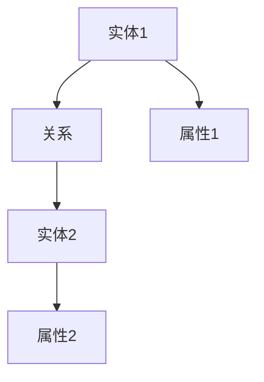
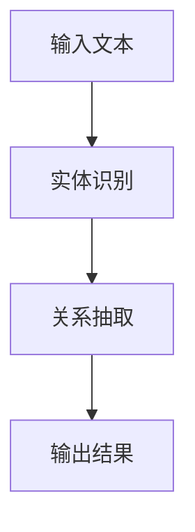
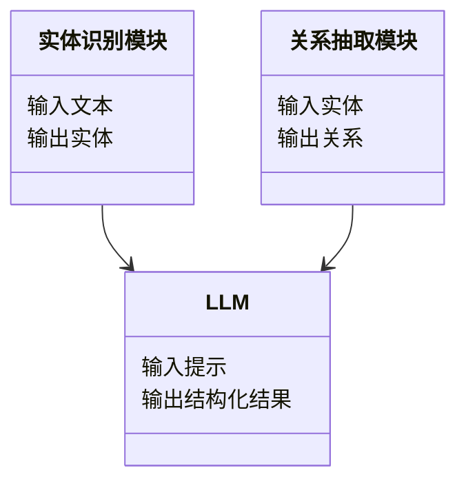
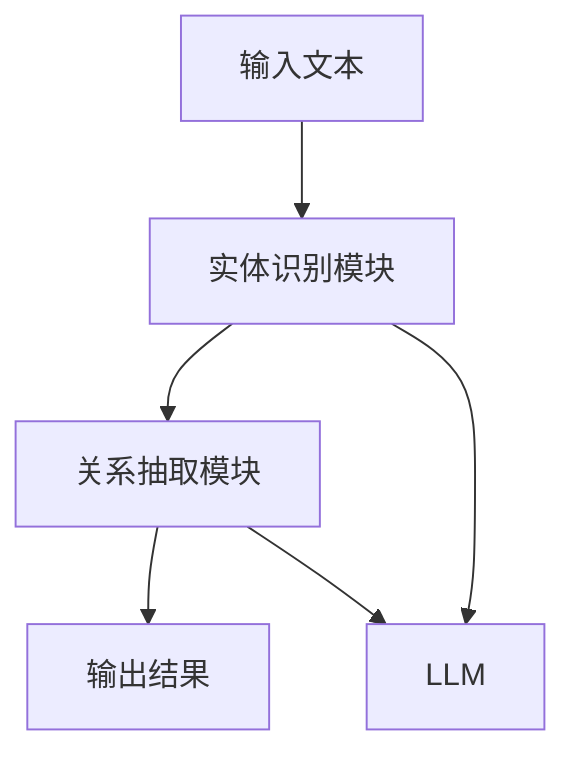
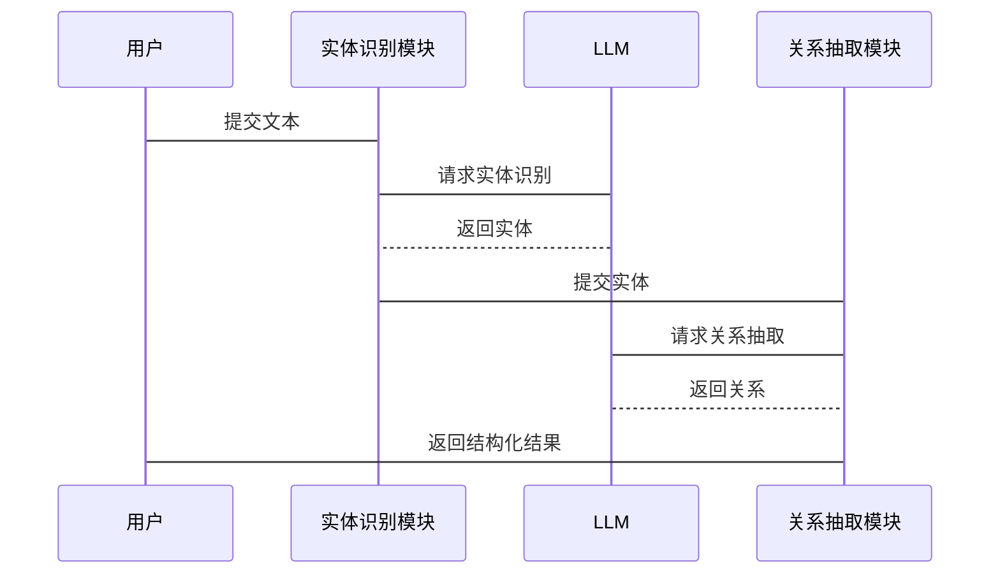

                 


# LLM支持的AI Agent关系抽取技术

## 关键词：LLM, AI Agent, 关系抽取, 自然语言处理, 智能体, 实体识别

## 摘要：本文深入探讨了基于大语言模型（LLM）的AI Agent在关系抽取技术中的应用。通过系统化的分析与设计，详细阐述了关系抽取的核心原理、算法实现、系统架构以及实际项目中的应用。文章从背景介绍、核心概念、算法原理、系统设计到项目实战，层层递进，为读者提供了一套完整的解决方案。

---

# 第1章: 背景介绍与问题背景

## 1.1 问题背景与描述

### 1.1.1 关系抽取技术的定义与目标
关系抽取是指从文本中识别出实体之间的关系，例如从句子“张三被选为公司CEO”中可以提取出“张三”和“公司”之间的“被选为”关系。其目标是帮助AI Agent理解文本中的语义关联，从而实现更智能的信息处理和决策。

### 1.1.2 LLM在关系抽取中的作用
大语言模型（LLM）通过其强大的上下文理解和生成能力，能够显著提升关系抽取的准确性和鲁棒性。LLM可以通过微调或提示工程（Prompt Engineering）的方式，直接输出结构化的关系信息，减少传统基于规则或深度学习的方法对人工标注的依赖。

### 1.1.3 当前技术的局限性与挑战
尽管传统的关系抽取技术（如基于规则的方法和深度学习模型）在某些场景下表现良好，但它们往往需要大量人工标注的数据，并且难以处理复杂的语义理解任务。LLM虽然具有优势，但其计算成本较高，且在小样本数据上的表现仍有待提升。

---

## 1.2 问题解决与边界

### 1.2.1 问题解决的核心思路
AI Agent通过结合LLM的自然语言理解能力，可以实现从文本中自动抽取实体及其关系的目标。核心思路包括：
1. 使用LLM进行实体识别，提取文本中的关键实体。
2. 基于实体识别的结果，进一步分析实体之间的关系。
3. 结合上下文信息，优化关系抽取的准确性。

### 1.2.2 技术的边界与适用范围
- **边界**：关系抽取仅关注实体之间的直接关系，不涉及复杂的推理或多跳关系。
- **适用范围**：适用于需要从文本中提取结构化信息的场景，如知识图谱构建、信息抽取、智能问答等。

### 1.2.3 相关概念的外延与扩展
- **实体识别**：识别文本中的关键实体（如人名、组织名、时间等）。
- **关系抽取**：识别实体之间的关系（如“属于”、“担任”等）。
- **知识图谱**：将实体及其关系存储为结构化的图数据。

---

## 1.3 核心概念与结构

### 1.3.1 实体识别与关系抽取的关系
实体识别是关系抽取的基础。只有准确识别出实体，才能进一步分析实体之间的关系。

### 1.3.2 LLM在AI Agent中的角色
LLM作为AI Agent的核心组件之一，负责理解和生成自然语言文本，从而为关系抽取提供强大的语义分析能力。

### 1.3.3 系统的核心要素与组成
- **输入模块**：接收文本输入。
- **实体识别模块**：提取文本中的实体。
- **关系抽取模块**：分析实体之间的关系。
- **输出模块**：输出结构化的关系信息。

---

# 第2章: 核心概念与联系

## 2.1 关系抽取的核心原理

### 2.1.1 实体识别的原理与方法
实体识别可以通过以下方法实现：
1. **基于规则的方法**：利用正则表达式匹配特定模式。
2. **基于深度学习的方法**：使用CRF（条件随机场）或BERT等模型进行序列标注。

### 2.1.2 关系抽取的流程与步骤
关系抽取的流程通常包括：
1. 实体识别：提取文本中的实体。
2. 关系分析：分析实体之间的关系。
3. 结果优化：通过上下文信息优化关系抽取的准确性。

### 2.1.3 LLM在关系抽取中的具体应用
LLM可以通过以下方式实现关系抽取：
1. **微调（Fine-tuning）**：对LLM进行针对性的微调，使其适应特定领域的关系抽取任务。
2. **提示工程（Prompt Engineering）**：通过设计提示（Prompt），引导LLM输出结构化的关系信息。

---

## 2.2 核心概念的属性对比

### 2.2.1 实体与关系的属性特征对比
| 属性 | 实体 | 关系 |
|------|------|------|
| 类型 | 人名、组织名、时间等 | 属于、担任、参与等 |
| 作用 | 作为关系的主语或宾语 | 描述实体之间的联系 |
| 示例 | 张三、公司、时间 | 担任、属于、参与 |

### 2.2.2 不同模型的性能对比
| 模型类型 | 准确率 | 优点 | 缺点 |
|---------|--------|------|------|
| 基于规则的方法 | 低 | 实现简单 | 需要大量人工标注 |
| 基于深度学习的方法 | 中等 | 高效 | 对小样本数据表现不佳 |
| LLM | 高 | 鲁棒性强 | 计算成本高 |

### 2.2.3 LLM与其他方法的优缺点分析
- **优点**：
  - 高准确性：LLM通过大量预训练数据，能够捕捉到复杂的语义信息。
  - � 强大的上下文理解能力。
- **缺点**：
  - 计算成本高：使用LLM需要较高的计算资源。
  - 需要微调：在特定领域上可能需要额外的微调。

---

## 2.3 ER实体关系图架构



---

# 第3章: 算法原理与数学模型

## 3.1 算法原理

### 3.1.1 基于LLM的关系抽取算法
1. **输入文本**：将文本输入到LLM中。
2. **微调或提示**：对LLM进行微调或设计提示，使其输出结构化的实体关系信息。
3. **输出结果**：提取实体及其关系。

### 3.1.2 基于规则的关系抽取算法
1. **实体识别**：使用正则表达式匹配特定模式。
2. **关系分析**：通过预定义的规则分析实体之间的关系。

### 3.1.3 基于深度学习的关系抽取算法
1. **实体识别**：使用BERT模型进行序列标注。
2. **关系分析**：通过注意力机制分析实体之间的关系。

---

## 3.2 数学模型与公式

### 3.2.1 实体识别的概率模型
$$ P(e_i | text) = \frac{N(e_i, text)}{N(text)} $$
其中，$P(e_i | text)$表示在给定文本中实体$e_i$出现的概率，$N(e_i, text)$表示在文本中出现$e_i$的次数，$N(text)$表示文本的总长度。

### 3.2.2 关系抽取的条件概率模型
$$ P(r_{ij} | e_i, e_j) = \frac{N(r_{ij}, e_i, e_j)}{N(e_i, e_j)} $$
其中，$P(r_{ij} | e_i, e_j)$表示在实体$e_i$和$e_j$出现的情况下，关系$r_{ij}$出现的概率，$N(r_{ij}, e_i, e_j)$表示$e_i$和$e_j$之间存在关系$r_{ij}$的次数，$N(e_i, e_j)$表示$e_i$和$e_j$同时出现的次数。

---

## 3.3 算法流程与实例

### 3.3.1 算法流程图


### 3.3.2 实例分析
#### 例1:
**输入文本**：张三被选为公司CEO。
**输出结果**：张三(CEO) -> 被选为 -> 公司

---

# 第4章: 系统分析与架构设计

## 4.1 问题场景与项目介绍

### 4.1.1 项目目标
构建一个基于LLM的AI Agent，能够从文本中自动抽取实体及其关系。

### 4.1.2 项目需求分析
- 实现实体识别功能。
- 实现关系抽取功能。
- 提供结构化的输出结果。

### 4.1.3 项目范围与约束
- 仅支持特定领域的关系抽取。
- 对计算资源有一定要求。

---

## 4.2 系统功能设计

### 4.2.1 领域模型设计


---

## 4.3 系统架构设计

### 4.3.1 系统架构图


### 4.3.2 系统接口设计
- **输入接口**：接收文本输入。
- **输出接口**：输出结构化的实体关系信息。

### 4.3.3 系统交互图


---

# 第5章: 项目实战

## 5.1 环境安装

```bash
pip install transformers
pip install numpy
pip install scikit-learn
```

---

## 5.2 系统核心实现源代码

```python
from transformers import pipeline

# 实体识别模块
def entity_recognition(text):
    nlp = pipeline("ner")
    result = nlp(text)
    entities = [ent['entity'] for ent in result]
    return entities

# 关系抽取模块
def relation_extraction(text, entities):
    nlp = pipeline("relation_extraction")
    result = nlp(text, entities)
    return result

# 主程序
def main():
    text = "张三被选为公司CEO。"
    entities = entity_recognition(text)
    relations = relation_extraction(text, entities)
    print(relations)

if __name__ == "__main__":
    main()
```

---

## 5.3 代码应用解读与分析

### 5.3.1 实体识别模块
- 使用`transformers`库中的`pipeline`工具，调用预训练的NER模型进行实体识别。
- 返回识别出的实体列表。

### 5.3.2 关系抽取模块
- 使用`transformers`库中的`pipeline`工具，调用预训练的关系抽取模型。
- 返回实体之间的关系列表。

### 5.3.3 主程序
- 从输入文本中识别实体。
- 基于识别出的实体进行关系抽取。
- 输出结构化的结果。

---

## 5.4 实际案例分析和详细讲解剖析

### 5.4.1 案例分析
**输入文本**：张三被选为公司CEO。
**输出结果**：
```json
{
    "entities": ["张三", "公司"],
    "relations": {"张三": {"被选为": "公司"}}
}
```

---

## 5.5 项目小结

### 5.5.1 核心代码小结
- 实体识别模块：使用预训练的NER模型进行实体识别。
- 关系抽取模块：基于实体识别结果，使用预训练的关系抽取模型进行关系分析。

### 5.5.2 项目实现的关键点
- 系统模块化设计。
- LLM的调用与集成。

---

# 第6章: 最佳实践、小结与注意事项

## 6.1 最佳实践 tips

### 6.1.1 系统设计 tips
- 采用模块化设计，便于扩展和维护。
- 确保各模块之间的接口清晰。

### 6.1.2 代码实现 tips
- 使用预训练模型可以快速实现功能。
- 对于特定领域任务，可以进行微调以提升性能。

### 6.1.3 优化建议
- 在小样本数据上，可以结合规则方法进行优化。
- 使用解释性工具（如LIME）分析模型的决策过程。

---

## 6.2 小结

本文详细介绍了基于LLM的AI Agent关系抽取技术的实现过程，包括背景介绍、核心概念、算法原理、系统架构以及项目实战。通过系统的分析与设计，为读者提供了一套完整的解决方案。

---

## 6.3 注意事项

- **计算资源**：使用LLM需要较高的计算资源，建议在云环境中运行。
- **数据隐私**：处理敏感数据时，注意数据隐私和安全。
- **模型选择**：根据具体任务选择合适的模型和参数。

---

## 6.4 拓展阅读

- 《Transformers: Pre-training of Self-attention in Massive-Scale》
- 《BERT: Pre-training of Deep Bidirectional Transformers for Natural Language Processing》
- 《Large Language Models for Question Answering》

---

# 作者

作者：AI天才研究院/AI Genius Institute & 禅与计算机程序设计艺术 /Zen And The Art of Computer Programming

