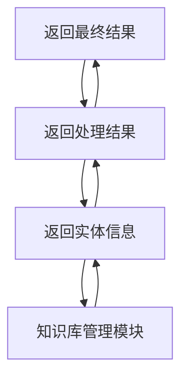

                 


# LLM支持的AI Agent命名实体识别

> 关键词：LLM、AI Agent、命名实体识别、自然语言处理、深度学习、人工智能  
> 摘要：本文探讨如何利用大语言模型（LLM）提升AI Agent的命名实体识别（NER）能力。通过分析NER的核心原理、算法实现以及系统架构设计，结合实际项目案例，详细阐述LLM在AI Agent中的应用，并提供最佳实践和小结。

---

## 第一部分：背景介绍

### 第1章：LLM与AI Agent概述

#### 1.1 LLM的基本概念
- **1.1.1 大语言模型的定义**
  大语言模型（Large Language Model，LLM）是指经过大量文本数据训练的深度学习模型，能够理解和生成人类语言。LLM通过神经网络结构捕捉语言的上下文信息，实现多种自然语言处理任务。

- **1.1.2 LLM的核心特点**
  - **大规模数据训练**：LLM通常使用海量文本数据进行训练，如书籍、网页和其他资源。
  - **深度神经网络**：采用Transformer架构，具备强大的序列建模能力。
  - **多任务能力**：LLM可以处理多种任务，如文本生成、翻译、问答等。

- **1.1.3 LLM的应用领域**
  - 自然语言处理（NLP）
  - 机器翻译
  - 问答系统
  - 聊天机器人

#### 1.2 AI Agent的基本概念
- **1.2.1 AI Agent的定义**
  AI Agent是一种智能体，能够感知环境、执行任务并做出决策。它可以与用户交互，理解需求并提供服务，例如虚拟助手、智能客服等。

- **1.2.2 AI Agent的类型**
  - **简单规则型**：基于预定义规则执行任务。
  - **基于模型型**：使用机器学习模型进行复杂决策。
  - **人机协作型**：结合人类反馈和自动化系统。

- **1.2.3 AI Agent的应用场景**
  - 虚拟助手（如Siri、Alexa）
  - 智能客服
  - 个性化推荐系统

#### 1.3 命名实体识别（NER）的背景
- **1.3.1 NER的定义**
  命名实体识别（Named Entity Recognition，NER）是NLP任务之一，旨在从文本中识别出命名实体，如人名、地名、组织名等。

- **1.3.2 NER的重要性**
  NER在信息抽取、问答系统、机器翻译等领域具有重要作用，能够帮助AI Agent准确理解文本内容。

- **1.3.3 LLM与NER的结合**
  LLM的强大上下文理解和生成能力，使其成为NER任务的理想工具。通过LLM，AI Agent能够更准确地识别实体。

---

## 第二部分：命名实体识别的核心概念

### 第2章：命名实体识别的核心原理

#### 2.1 NER的核心原理
- **2.1.1 序列标注模型**
  NER任务通常采用序列标注模型，如HMM、CRF和Transformer。这些模型通过分析上下文信息，为每个词打上实体标签。

- **2.1.2 基于上下文的特征提取**
  NER依赖于特征工程，提取如词性、上下文词、位置信息等特征，帮助模型准确分类。

#### 2.2 LLM在NER中的作用
- **2.2.1 LLM的上下文理解能力**
  LLM能够理解上下文关系，帮助模型在长文本中准确识别实体。

- **2.2.2 LLM的生成能力在NER中的应用**
  LLM可以通过生成上下文信息，辅助模型进行实体识别，尤其是在处理模糊或不完整的信息时表现优异。

---

## 第三部分：算法原理讲解

### 第3章：NER的算法原理

#### 3.1 基于HMM的NER算法
- **3.1.1 HMM的基本原理**
  隐马尔可夫模型（HMM）是一种统计模型，假设观测数据与状态转移之间的关系，适用于序列数据的建模。

- **3.1.2 HMM在NER中的应用**
  HMM通过观察词序列，推断出对应的实体标签序列。然而，HMM在处理长距离依赖关系时表现有限。

#### 3.2 基于CRF的NER算法
- **3.2.1 CRF的基本原理**
  条件随机场（CRF）是一种概率模型，用于序列标注任务。CRF通过考虑全局特征，能够捕捉长距离依赖关系。

- **3.2.2 CRF在NER中的优势**
  CRF在处理NER任务时，能够利用词性、位置等全局特征，提高识别准确率。

#### 3.3 基于Transformer的NER算法
- **3.3.1 Transformer的基本原理**
  Transformer模型通过自注意力机制，捕捉文本中的全局依赖关系，适用于长文本处理。

- **3.3.2 BERT在NER中的应用**
  BERT模型通过预训练，能够理解上下文信息，广泛应用于NER任务。使用BERT进行NER可以通过微调模型，直接从文本中提取实体。

- **3.3.3 Transformer的数学模型**
  Transformer的自注意力机制公式如下：
  $$\text{Attention}(Q, K, V) = \text{softmax}\left(\frac{QK^T}{\sqrt{d_k}}\right)V$$
  其中，$Q$、$K$、$V$分别为查询、键、值向量，$d_k$为键的维度。

---

## 第四部分：系统分析与架构设计

### 第4章：LLM支持的AI Agent系统架构

#### 4.1 系统功能模块设计
- **4.1.1 NLP处理模块**
  - 输入文本预处理（分词、去停用词）
  - 实体识别
  - 情感分析

- **4.1.2 实体识别模块**
  - 基于LLM的实体识别
  - 实体链接（将实体映射到知识库）

- **4.1.3 知识库管理模块**
  - 存储和管理实体信息
  - 提供实体查询接口

#### 4.2 系统架构设计
- **4.2.1 模块之间的关系**
  - NLP处理模块接收输入，调用实体识别模块进行识别。
  - 实体识别模块利用知识库管理模块进行实体链接。

- **4.2.2 系统的输入输出流程**
  - 输入：用户查询文本
  - 输出：识别的实体及其相关信息

#### 4.3 系统架构图（Mermaid）


---

## 第五部分：项目实战

### 第5章：项目实战

#### 5.1 环境安装
- **Python安装**
  - 安装Python 3.8或更高版本。
- **依赖库安装**
  - 使用pip安装：`pip install transformers torch numpy`

#### 5.2 系统核心实现

##### 5.2.1 数据预处理
```python
import pandas as pd
import numpy as np

def preprocess_data(data):
    sentences = data['text'].tolist()
    labels = data['label'].tolist()
    return sentences, labels
```

##### 5.2.2 模型训练
```python
from transformers import BertTokenizer, BertForTokenClassification
from torch.utils.data import Dataset, DataLoader

class NERDataset(Dataset):
    def __init__(self, sentences, labels, tokenizer):
        self.tokenizer = tokenizer
        self.sentences = sentences
        self.labels = labels

    def __len__(self):
        return len(self.sentences)

    def __getitem__(self, idx):
        sentence = self.sentences[idx]
        label = self.labels[idx]
        encoding = self.tokenizer(sentence, padding=True, truncation=True, return_tensors='pt')
        return {
            'input_ids': encoding['input_ids'].flatten(),
            'attention_mask': encoding['attention_mask'].flatten(),
            'labels': label
        }

def train_model(train_dataset, model, optimizer, criterion, epochs=3):
    for epoch in range(epochs):
        for step, batch in enumerate(train_loader):
            model.train()
            optimizer.zero_grad()
            input_ids = batch['input_ids'].to(device)
            attention_mask = batch['attention_mask'].to(device)
            labels = batch['labels'].to(device)
            outputs = model(input_ids, attention_mask=attention_mask)
            loss = criterion(outputs.logits, labels)
            loss.backward()
            optimizer.step()
```

##### 5.2.3 模型部署
```python
def ner_predict(model, tokenizer, sentence):
    inputs = tokenizer(sentence, padding=True, truncation=True, return_tensors='pt')
    input_ids = inputs['input_ids'].to(device)
    attention_mask = inputs['attention_mask'].to(device)
    outputs = model(input_ids, attention_mask=attention_mask)
    predicted_labels = outputs.logits.argmax(dim=2).tolist()[0]
    entities = []
    for i, label in enumerate(predicted_labels):
        if label == 0:  # 实体标签对应的索引
            entities.append(sentence[i])
    return entities
```

#### 5.3 实际案例分析
- **案例：识别公司名称**
  - 输入文本：`"Apple Inc. 是一家科技公司，总部位于美国。"`
  - 输出：`['Apple Inc.', '美国']`

#### 5.4 项目小结
- 本项目实现了基于BERT的NER系统，展示了如何利用LLM提升AI Agent的实体识别能力。
- 实践中需要注意数据质量、模型调优和系统集成等问题。

---

## 第六部分：最佳实践与小结

### 第6章：最佳实践

#### 6.1 实体识别的挑战
- 数据质量：标注数据的准确性和多样性。
- 模型调优：选择合适的模型参数和优化策略。
- 实体链接：将识别的实体映射到知识库。

#### 6.2 小结
- LLM为NER任务提供了强大的支持，但实际应用中仍需考虑数据和模型的优化。
- AI Agent的实体识别能力是其智能水平的重要组成部分。

#### 6.3 注意事项
- 确保数据隐私和安全。
- 定期更新模型以适应新数据和任务需求。

#### 6.4 拓展阅读
- 推荐书籍：《深度学习》（Deep Learning，Ian Goodfellow）
- 推荐论文：《BERT: Pre-training of Deep Bidirectional Transformers for NLP》

---

## 作者信息

作者：AI天才研究院/AI Genius Institute & 禅与计算机程序设计艺术 /Zen And The Art of Computer Programming

