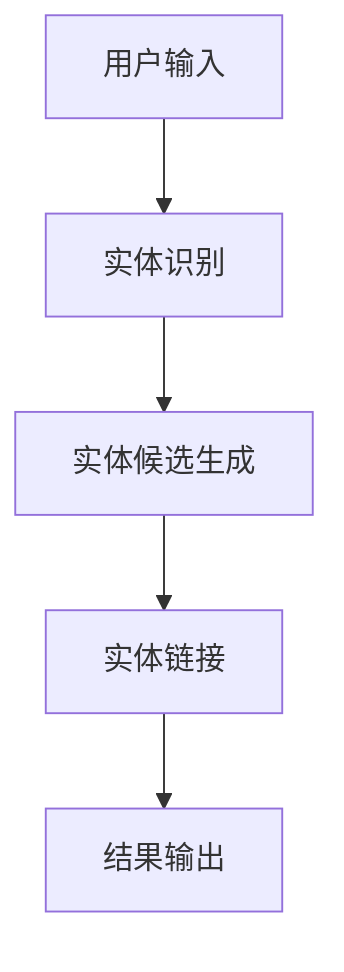
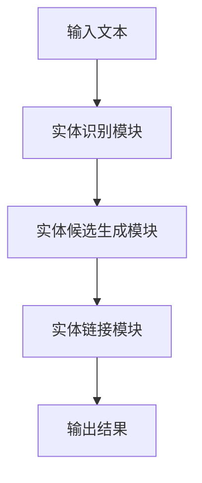
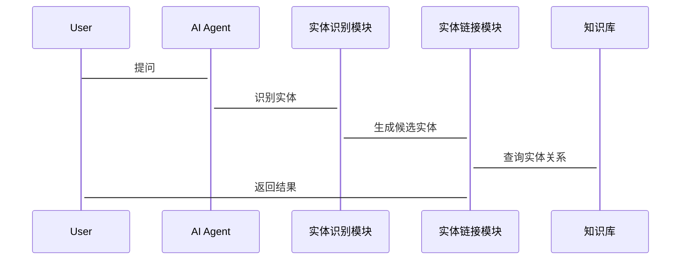

                 


# LLM支持的AI Agent实体链接技术

> 关键词：LLM, AI Agent, 实体链接, 知识图谱, 自然语言处理

> 摘要：本文详细探讨了LLM（大语言模型）支持的AI Agent实体链接技术。文章首先介绍了实体链接技术的背景与概念，接着深入分析了实体链接的核心原理与算法实现，特别是基于LLM的实体链接方法。随后，文章从系统架构与设计的角度，详细阐述了如何构建支持实体链接的AI Agent系统，并通过项目实战展示了具体的实现过程与应用案例。最后，文章总结了LLM支持的实体链接技术的优势与挑战，并提出了未来的发展方向。

---

## 第一部分: 实体链接技术的背景与概念

### 第1章: 实体链接技术的背景

#### 1.1 问题背景与挑战
实体链接（Entity Linking）是一种自然语言处理技术，旨在将文本中的实体（如人名、地名、组织名等）与知识库中的实体进行映射。随着AI Agent（智能体）的广泛应用，实体链接技术的重要性日益凸显。AI Agent需要通过理解用户输入的自然语言文本，识别其中的实体并将其与知识库中的实体进行关联，以便更好地理解和执行用户的意图。

#### 1.2 实体链接技术的定义与目标
实体链接的目标是将文本中的实体识别并链接到一个全局的知识库中，例如维基百科、知识图谱等。通过实体链接，AI Agent可以将输入的文本转换为结构化的知识表示，从而支持后续的任务，如问答、推理和生成。

#### 1.3 LLM在实体链接中的作用
大语言模型（LLM）具有强大的文本理解和生成能力，可以辅助AI Agent完成实体链接任务。LLM可以通过上下文理解实体之间的关系，并通过生成文本的方式进行实体匹配和链接。

### 第2章: AI Agent与实体链接的关系

#### 2.1 AI Agent的基本概念
AI Agent是一种智能系统，能够感知环境、理解用户输入，并通过执行任务来满足用户的请求。AI Agent的核心能力包括自然语言理解、知识表示和推理。

#### 2.2 实体链接在AI Agent中的应用
在AI Agent中，实体链接技术主要用于将用户的输入文本中的实体识别并映射到知识库中的实体。例如，当用户询问“谁是苹果公司的CEO？”时，AI Agent需要识别“苹果公司”和“CEO”这两个实体，并将它们与知识库中的实体进行关联。

#### 2.3 LLM支持的AI Agent的优势
LLM支持的AI Agent可以通过大语言模型的强大能力，实现更准确的实体识别和链接。LLM不仅可以理解实体的表面形式，还可以理解实体的语义含义和上下文关系。

---

## 第二部分: 实体链接技术的核心概念与原理

### 第3章: 实体识别与链接的核心原理

#### 3.1 实体识别的定义与方法
实体识别（Entity Recognition）是实体链接的第一步，旨在从文本中识别出所有可能的实体。常用的方法包括基于规则的识别、统计模型和深度学习模型。

#### 3.2 实体链接的核心原理
实体链接的核心是将识别出的实体与知识库中的实体进行匹配。匹配过程通常基于实体的名称、上下文语义和知识图谱中的关系。

#### 3.3 LLM在实体链接中的角色
LLM在实体链接中的作用主要体现在以下几个方面：
1. 提供实体识别的能力。
2. 基于上下文理解实体之间的关系。
3. 通过生成文本的方式辅助实体匹配。

### 第4章: 实体链接的关键算法与模型

#### 4.1 实体识别算法
- **基于规则的实体识别**：通过预定义的规则和模式匹配来识别实体。
- **基于统计的实体识别**：利用统计语言模型和条件随机场（CRF）进行实体识别。
- **基于深度学习的实体识别**：使用卷积神经网络（CNN）或循环神经网络（RNN）进行实体识别。

#### 4.2 实体链接算法
- **基于知识图谱的链接算法**：利用知识图谱中的实体关系进行匹配。
- **基于语义相似度的链接算法**：通过计算实体名称的语义相似度进行匹配。
- **基于LLM的链接算法**：利用大语言模型的语义理解能力进行实体匹配。

---

## 第三部分: LLM支持的实体链接技术实现

### 第5章: LLM在实体链接中的应用

#### 5.1 LLM的文本理解能力
大语言模型具有强大的文本理解能力，可以捕捉实体之间的语义关系。例如，LLM可以通过上下文理解“苹果公司”和“CEO”之间的关系。

#### 5.2 LLM的实体识别与链接能力
LLM可以通过生成文本的方式辅助实体识别和链接。例如，LLM可以生成实体的候选列表，并通过排序的方式选择最相关的实体。

#### 5.3 LLM与知识图谱的结合
通过将LLM与知识图谱结合，可以实现更准确的实体链接。知识图谱提供了丰富的实体关系，而LLM提供了强大的语义理解能力。

### 第6章: 基于LLM的实体链接算法实现

#### 6.1 算法流程图


#### 6.2 算法实现的Python代码示例
```python
def entity_linking(text):
    # 实体识别
    entities = recognize_entities(text)
    # 实体候选生成
    candidates = generate_candidates(entities)
    # 实体链接
    linked_entities = link_entities(candidates)
    return linked_entities
```

#### 6.3 算法的优化与调优
优化实体链接算法的关键在于提高实体匹配的准确率。可以通过引入更多的上下文信息、优化相似度计算方法以及结合知识图谱进行优化。

---

## 第四部分: 实体链接技术的系统架构与设计

### 第7章: 系统架构设计

#### 7.1 系统功能模块划分
- **实体识别模块**：识别文本中的实体。
- **实体候选生成模块**：生成实体候选列表。
- **实体链接模块**：将实体候选链接到知识库中的实体。
- **结果输出模块**：输出最终的实体链接结果。

#### 7.2 系统架构图


#### 7.3 模块之间的交互关系
- 实体识别模块将输入文本转换为实体列表。
- 实体候选生成模块基于实体列表生成候选实体。
- 实体链接模块将候选实体与知识库中的实体进行匹配。
- 输出模块将最终结果返回给用户。

### 第8章: 系统接口设计

#### 8.1 系统接口设计
- **输入接口**：接收用户输入的文本。
- **输出接口**：输出实体链接的结果。
- **知识库接口**：与知识图谱进行交互，获取实体关系。

#### 8.2 系统交互设计


---

## 第五部分: 项目实战

### 第9章: 环境安装与系统实现

#### 9.1 环境安装
- 安装Python和必要的库（如spaCy、networkx、py2neo）。
- 安装大语言模型（如GPT-3、PaLM）。

#### 9.2 系统核心实现源代码
```python
import spacy
from py2neo import Graph, Node, Relationship

def recognize_entities(text):
    nlp = spacy.load("en_core_web_sm")
    doc = nlp(text)
    entities = [ent.text for ent in doc.ents]
    return entities

def generate_candidates(entities):
    # 假设我们有一个知识图谱数据库
    graph = Graph("http://localhost:7474", auth=("neo4j", "password"))
    candidates = []
    for entity in entities:
        query = f"MATCH (n:{entity}) RETURN n"
        results = graph.run(query).to_list()
        candidates.extend([result[0].labels for result in results])
    return candidates

def link_entities(candidates):
    # 假设我们有一个实体映射表
    entity_map = {
        "苹果公司": "Apple",
        "CEO": "Chief Executive Officer"
    }
    linked = []
    for candidate in candidates:
        if candidate in entity_map:
            linked.append(entity_map[candidate])
        else:
            linked.append(candidate)
    return linked

text = "谁是苹果公司的CEO?"
entities = recognize_entities(text)
candidates = generate_candidates(entities)
linked_entities = link_entities(candidates)
print(linked_entities)
```

#### 9.3 代码应用解读与分析
- **recognize_entities**：使用spaCy进行实体识别。
- **generate_candidates**：通过Neo4j查询知识图谱，生成实体候选。
- **link_entities**：将候选实体映射到知识图谱中的实体。

### 第10章: 实际案例分析

#### 10.1 案例分析
输入文本：“谁是苹果公司的CEO？”
- 实体识别：["苹果公司", "CEO"]
- 实体候选生成：["苹果公司", "CEO"]
- 实体链接：["Apple", "Chief Executive Officer"]

#### 10.2 应用解读
通过实体链接技术，AI Agent可以准确地将用户的输入文本中的实体映射到知识图谱中的实体，从而更好地理解和执行用户的意图。

---

## 第六部分: 总结与展望

### 第11章: 总结

#### 11.1 最佳实践Tips
- 使用大语言模型可以显著提高实体链接的准确率。
- 结合知识图谱可以进一步增强实体链接的能力。

#### 11.2 小结
本文详细探讨了LLM支持的AI Agent实体链接技术，从背景、原理到实现，全面分析了该技术的核心内容和应用价值。

### 第12章: 注意事项与拓展阅读

#### 12.1 注意事项
- 实体链接的结果可能受到知识图谱的覆盖范围和数据质量的影响。
- 需要注意实体链接的性能优化，特别是在大规模数据下。

#### 12.2 拓展阅读
- 《大语言模型与知识图谱的结合》
- 《基于深度学习的实体识别与链接技术》

---

## 作者信息

作者：AI天才研究院/AI Genius Institute  
& 禅与计算机程序设计艺术 /Zen And The Art of Computer Programming

