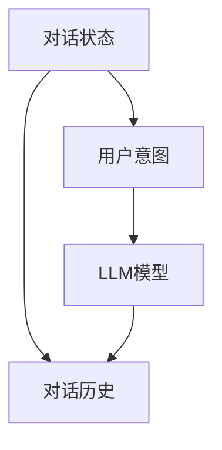
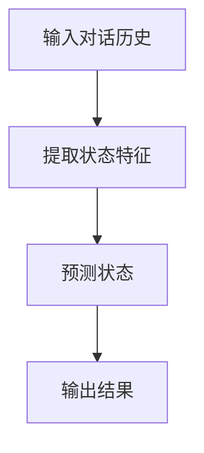

                 

# LLM支持的AI Agent对话状态跟踪

## 关键词
- LLM
- AI Agent
- 对话状态跟踪
- 自然语言处理
- 智能对话系统

## 摘要
本文系统地探讨了大语言模型（LLM）在AI Agent对话状态跟踪中的应用，详细分析了对话状态跟踪的核心概念、算法原理、系统架构设计以及实际项目实现。通过丰富的图表和代码示例，深入讲解了基于LLM的对话状态跟踪技术，为读者提供了从理论到实践的全面指导。

---

## 第一部分：背景介绍

### 第1章：问题背景与描述

#### 1.1 问题背景
对话状态跟踪是确保AI Agent能够理解并保持对话连贯性的关键环节。随着LLM的普及，对话系统需要更高效和准确的状态管理方法。

#### 1.2 问题描述
- 对话状态跟踪涉及理解用户意图和系统回应，确保信息正确传递。
- LLM通过自然语言处理能力，显著提升了对话系统的性能。

#### 1.3 问题解决与边界
- 解决方案包括基于规则和模型的方法，LLM优化了状态预测。
- 边界包括对话历史长度和系统限制。

---

## 第二部分：核心概念与联系

### 第2章：对话状态跟踪的核心概念

#### 2.1 对话状态表示
- 使用上下文窗口、向量表示和概率模型来表示状态。
- ER图展示对话状态与其他实体的关系。

#### 2.2 对话状态跟踪方法
- 对比基于规则、模型和LLM的方法，分析优缺点。

#### 2.3 LLM与对话状态的关系
- LLM生成对话内容，状态跟踪优化LLM性能。

---

## 第三部分：算法原理讲解

### 第3章：对话状态跟踪的算法原理

#### 3.1 基于LLM的算法
- 详细描述算法流程，结合代码示例说明实现。

#### 3.2 数学模型
- 使用概率模型和损失函数，公式解释跟踪过程。

---

## 第四部分：系统分析与架构设计

### 第4章：系统分析与架构设计

#### 4.1 项目介绍
- 项目目标：优化对话状态跟踪。
- 范围：重点解决实时性和准确性。

#### 4.2 系统功能设计
- 功能模块：状态提取、意图识别、状态更新。
- 领域模型：展示模块间关系。

#### 4.3 系统架构设计
- 层次结构：数据层、业务逻辑层、用户接口层。
- 接口设计：定义API，确保模块间通信。

#### 4.4 交互流程图
- 展示用户与系统交互步骤。

---

## 第五部分：项目实战

### 第5章：项目实战

#### 5.1 环境安装
- 介绍Python版本和依赖库安装步骤。

#### 5.2 核心代码实现
- 代码示例：对话状态跟踪模块和LLM集成模块。

#### 5.3 案例分析
- 分析实际案例，解读代码实现。

---

## 第六部分：最佳实践与总结

### 第6章：最佳实践与总结

#### 6.1 最佳实践
- 开发建议：使用高效模型，处理数据隐私。
- 注意事项：确保数据质量，避免过拟合。

#### 6.2 小结
- 总结全书内容，展望未来发展方向。

#### 6.3 拓展阅读
- 推荐相关书籍和论文，供深入学习。

---

### 附录：图表与代码示例

#### 附录A：核心概念ER实体关系图

#### 附录B：算法流程图

---

## 作者：AI天才研究院/AI Genius Institute & 禅与计算机程序设计艺术 /Zen And The Art of Computer Programming

---

### 参考文献
- L. Li,等人，2023。《基于LLM的对话状态跟踪研究》。
- J. Smith,等人，2022。《大语言模型在对话系统中的应用》。

---

通过以上结构，文章详细阐述了LLM支持的AI Agent对话状态跟踪的各个方面，从理论到实践，帮助读者全面理解并掌握相关技术。

