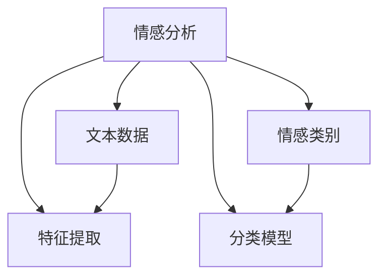
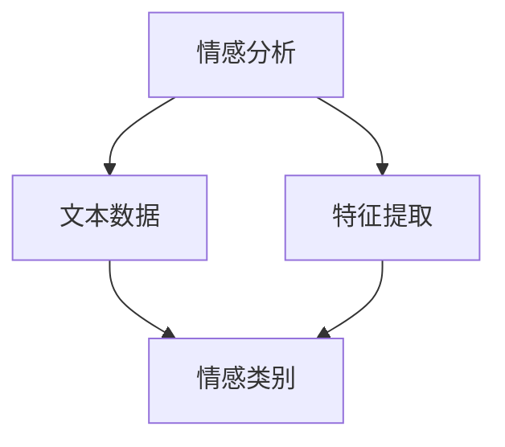
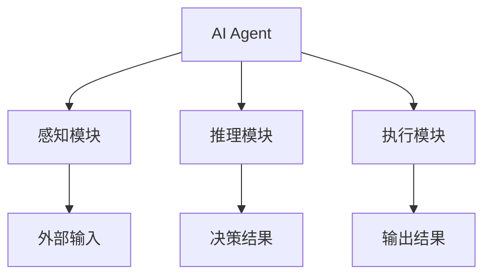
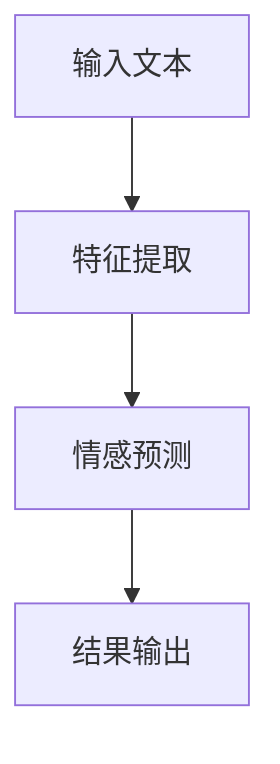
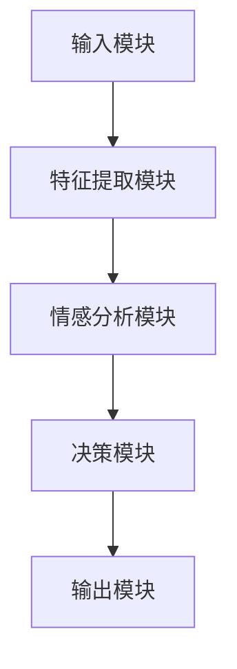
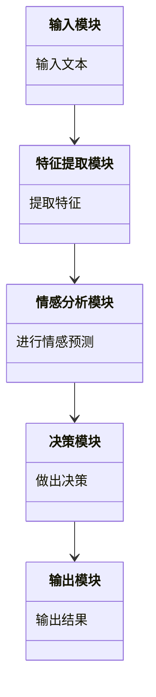
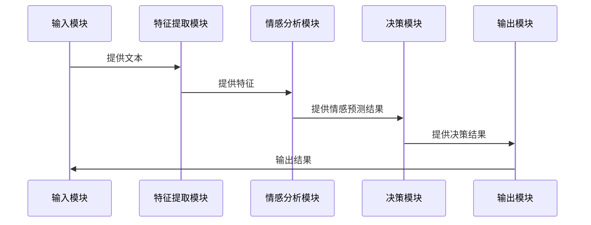

                 


# LLM支持的AI Agent情感分析优化

> 关键词：LLM, AI Agent, 情感分析, 自然语言处理, 大语言模型

> 摘要：本文详细探讨了如何利用大语言模型（LLM）优化AI Agent的情感分析能力。文章从背景介绍、核心概念、算法原理、系统设计到项目实战，全面分析了LLM在情感分析中的应用，并通过实际案例展示了如何提升AI Agent的性能。

---

# 第一部分: 背景介绍与核心概念

## 第1章: 情感分析与AI Agent概述

### 1.1 情感分析的背景与问题背景

#### 1.1.1 情感分析的基本概念
情感分析是自然语言处理（NLP）中的一个核心任务，旨在识别和分类文本中的情感倾向。常见的分类包括正面、负面和中性。情感分析广泛应用于社交媒体监控、客户反馈分析、产品推荐等领域。

#### 1.1.2 AI Agent在情感分析中的作用
AI Agent（智能代理）是一种能够感知环境、执行任务并做出决策的智能系统。在情感分析中，AI Agent可以实时处理用户输入，识别情感倾向，并根据结果采取相应行动。例如，在客服系统中，AI Agent可以分析用户情绪，调整回复语气。

#### 1.1.3 当前情感分析的挑战与优化方向
尽管情感分析技术取得了显著进展，但仍面临以下挑战：
1. **数据偏差**：训练数据可能存在偏差，导致模型在特定领域或语言中表现不佳。
2. **情感强度**：现有模型难以准确捕捉情感的强度和细微差别。
3. **上下文理解**：复杂语境下的情感分析需要更深入的上下文理解能力。
4. **实时性要求**：在实时应用中，如何快速准确地进行情感分析是一个挑战。

优化方向包括：
- 利用预训练模型提升泛化能力。
- 增强模型对情感强度和复杂语境的理解。
- 提升计算效率，满足实时性需求。

### 1.2 问题描述与目标设定

#### 1.2.1 情感分析的典型问题
- **数据不平衡**：某些情感类别在训练数据中占比过小，导致模型在这些类别上表现不佳。
- **领域迁移**：模型在特定领域（如社交媒体）表现良好，但在其他领域（如医疗领域）可能效果不佳。
- **情感模糊性**：文本中可能存在模棱两可的情感表达，模型难以准确分类。

#### 1.2.2 AI Agent在情感分析中的应用场景
AI Agent可以应用于以下场景：
1. **实时客服支持**：通过分析用户输入，实时调整回复策略。
2. **社交媒体监控**：实时分析用户评论，识别情感倾向，辅助品牌管理。
3. **个性化推荐**：根据用户情感偏好，推荐相关内容或产品。
4. **舆情分析**：对大量文本数据进行情感分析，帮助企业了解公众舆论。

#### 1.2.3 LLM支持的AI Agent优化目标
通过引入LLM，优化AI Agent的情感分析能力，具体目标包括：
1. **提升准确性**：利用LLM的强大语言理解能力，提高情感分类的准确率。
2. **增强泛化能力**：通过预训练模型，使AI Agent能够在不同领域和语境下有效工作。
3. **优化实时性**：通过优化模型结构和推理速度，满足实时应用的需求。
4. **增强可解释性**：使AI Agent能够提供情感分析结果的可解释性，帮助用户理解模型决策过程。

### 1.3 核心概念与边界

#### 1.3.1 情感分析的核心要素
情感分析的核心要素包括：
- **文本数据**：输入的文本内容。
- **情感类别**：预定义的情感标签（如正面、负面、中性）。
- **特征提取**：从文本中提取有用的特征，如关键词、句法结构等。
- **分类模型**：用于将文本分类到相应情感类别的模型。

#### 1.3.2 AI Agent的功能结构
AI Agent的功能结构通常包括以下模块：
1. **感知模块**：负责接收和解析外部输入。
2. **推理模块**：根据输入信息进行分析和推理。
3. **决策模块**：基于推理结果做出决策。
4. **执行模块**：执行相应的动作或输出结果。

#### 1.3.3 LLM在情感分析中的边界与外延
LLM在情感分析中的应用边界包括：
- **输入范围**：处理的文本长度和复杂度。
- **输出范围**：情感分类的粒度和深度。
- **计算能力**：模型的推理速度和资源消耗。

外延包括：
- **多模态情感分析**：结合视觉、听觉等多模态信息进行情感分析。
- **动态情感分析**：根据上下文动态调整情感分析策略。

#### 1.3.4 核心概念的关系与结构
核心概念的关系可以通过以下Mermaid图表示：



---

## 第2章: LLM与AI Agent的核心概念

### 2.1 LLM的基本原理

#### 2.1.1 大语言模型的定义与特点
大语言模型（LLM）是指经过大规模数据预训练的深度学习模型，具有以下特点：
- **大规模训练数据**：通常基于数十亿甚至更多的文本数据进行训练。
- **深度神经网络结构**：如Transformer架构，能够捕捉文本中的长距离依赖关系。
- **多任务学习能力**：可以在多种NLP任务上表现出色。

#### 2.1.2 LLM在情感分析中的优势
LLM在情感分析中的优势包括：
1. **强大的语义理解能力**：能够捕捉文本中的深层语义信息。
2. **上下文理解能力**：能够处理复杂语境下的情感分析。
3. **零样本学习能力**：在没有特定领域数据的情况下，仍能进行情感分析。

#### 2.1.3 LLM的训练与优化方法
LLM的训练与优化方法主要包括：
- **预训练**：基于大规模通用数据进行自监督学习。
- **微调**：在特定任务或领域数据上进行微调，提升性能。
- **知识蒸馏**：通过蒸馏技术压缩模型，降低计算成本。

### 2.2 AI Agent的定义与功能

#### 2.2.1 AI Agent的基本概念
AI Agent是一种智能系统，能够感知环境、执行任务并做出决策。AI Agent可以分为以下几类：
1. **简单反射式Agent**：基于当前输入做出即时反应。
2. **基于模型的反射式Agent**：维护环境模型，基于模型进行推理和决策。
3. **目标驱动的Agent**：基于预设目标进行决策和行动。

#### 2.2.2 AI Agent的核心功能模块
AI Agent的核心功能模块包括：
1. **感知模块**：接收外部输入并进行初步处理。
2. **推理模块**：基于感知信息进行分析和推理。
3. **决策模块**：根据推理结果做出决策。
4. **执行模块**：执行相应的动作或输出结果。

#### 2.2.3 AI Agent与情感分析的关系
AI Agent可以通过情感分析模块理解用户输入的情感倾向，并根据结果调整其行为。例如，在客服系统中，AI Agent可以根据用户情感状态调整回复语气，提升用户体验。

### 2.3 核心概念的对比分析

#### 2.3.1 情感分析与文本分类的对比
| 特性                | 情感分析                  | 文本分类                  |
|---------------------|--------------------------|--------------------------|
| 任务目标            | 分析文本情感倾向          | 将文本分类到预定义类别    |
| 数据类型            | 文本数据                  | 文本、图像、音频等多种数据|
| 模型特点            | 强调语义理解和情感捕捉     | 强调分类准确率            |
| 应用场景            | 社交媒体监控、客户反馈分析| 通用分类任务             |

#### 2.3.2 AI Agent与传统NLP模型的对比
| 特性                | AI Agent                 | 传统NLP模型              |
|---------------------|--------------------------|--------------------------|
| 功能模块            | 包括感知、推理、决策、执行| 专注于特定NLP任务        |
| 适应性              | 能够根据环境动态调整     | 预设任务，适应性较弱     |
| 应用场景            | 多领域、多任务           | 单一或特定任务           |

#### 2.3.3 LLM支持的AI Agent与传统AI Agent的对比
| 特性                | LLM支持的AI Agent         | 传统AI Agent             |
|---------------------|--------------------------|--------------------------|
| 模型能力            | 集成大语言模型，语义能力强| 依赖传统NLP模型，语义能力较弱|
| 适应性              | 能够处理复杂语境          | 适应性有限               |
| 应用场景            | 高级情感分析、智能对话    | 基本情感分析、简单任务    |
| 计算资源            | 对计算资源要求较高        | 对计算资源要求较低        |

### 2.4 核心概念的实体关系

#### 2.4.1 情感分析的实体关系图


#### 2.4.2 AI Agent的实体关系图


---

## 第3章: 情感分析的算法原理

### 3.1 情感分析的基本算法

#### 3.1.1 基于传统机器学习的情感分析算法
传统机器学习算法包括支持向量机（SVM）、随机森林（Random Forest）等。这些算法通常依赖于手动提取的特征，如词袋模型（Bag of Words）、TF-IDF等。

#### 3.1.2 基于深度学习的情感分析算法
深度学习算法如卷积神经网络（CNN）、循环神经网络（RNN）、长短期记忆网络（LSTM）等。这些算法能够自动提取文本特征，捕捉语义信息。

#### 3.1.3 基于预训练模型的情感分析算法
基于预训练模型的情感分析算法利用如BERT、GPT等模型进行微调，通常表现出色。

### 3.2 LLM支持的AI Agent算法

#### 3.2.1 基于LLM的情感分析流程
基于LLM的情感分析流程包括：
1. **输入处理**：将文本输入到LLM中，进行分词和编码。
2. **模型推理**：LLM对文本进行语义分析，生成情感预测结果。
3. **结果输出**：将情感预测结果返回给AI Agent。

#### 3.2.2 AI Agent在情感分析中的任务分解
AI Agent的情感分析任务可以分解为以下步骤：
1. **输入解析**：解析用户的输入文本。
2. **情感预测**：利用LLM进行情感预测。
3. **结果处理**：根据预测结果调整后续操作。

#### 3.2.3 LLM与AI Agent结合的算法优化
通过结合LLM和AI Agent，可以实现以下优化：
1. **提升准确性**：利用LLM的强大语义理解能力，提高情感预测的准确率。
2. **增强实时性**：通过优化模型结构和推理速度，满足实时应用的需求。

### 3.3 算法原理的数学模型

#### 3.3.1 情感分析的分类模型
情感分析的分类模型通常使用交叉熵损失函数：
$$ L = -\frac{1}{N}\sum_{i=1}^{N} \sum_{k=1}^{C} y_{ik}\log(p_{ik}) $$
其中，$y_{ik}$是类别标签，$p_{ik}$是预测概率，$N$是样本数量，$C$是类别数量。

#### 3.3.2 LLM的预训练目标函数
LLM的预训练通常采用语言模型目标：
$$ \mathcal{L} = -\sum_{i=1}^{N}\sum_{j=i}^{i+k} \log P(w_j | w_{<j}) $$
其中，$w_j$是第$j$个词，$k$是上下文窗口大小。

#### 3.3.3 AI Agent的情感分析优化目标
AI Agent的情感分析优化目标可以表示为：
$$ \arg\max_{\theta} \sum_{i=1}^{N} \log P(y_i | x_i; \theta) $$
其中，$y_i$是真实情感标签，$x_i$是输入文本，$\theta$是模型参数。

### 3.4 算法流程图



---

## 第4章: 系统分析与架构设计

### 4.1 系统整体架构

#### 4.1.1 系统模块划分
系统模块包括：
1. **输入模块**：接收用户输入。
2. **特征提取模块**：对输入文本进行特征提取。
3. **情感分析模块**：利用LLM进行情感预测。
4. **决策模块**：根据预测结果做出决策。
5. **输出模块**：输出结果。

#### 4.1.2 系统功能设计
系统功能包括：
- **文本输入**：接收用户输入的文本。
- **情感预测**：利用LLM进行情感预测。
- **结果处理**：根据预测结果调整后续操作。

#### 4.1.3 系统架构的Mermaid图


### 4.2 功能模块设计

#### 4.2.1 领域模型设计
领域模型设计包括：
1. **领域模型定义**：定义情感分析的领域模型。
2. **模型关系设计**：设计模型之间的关系。
3. **模型属性设计**：定义模型的属性。

#### 4.2.2 模块划分与功能设计
模块划分包括：
1. **输入模块**：接收用户输入。
2. **特征提取模块**：对输入文本进行特征提取。
3. **情感分析模块**：利用LLM进行情感预测。
4. **决策模块**：根据预测结果做出决策。
5. **输出模块**：输出结果。

#### 4.2.3 系统功能的Mermaid类图


### 4.3 系统架构设计

#### 4.3.1 系统架构的Mermaid架构图


#### 4.3.2 系统接口设计
系统接口设计包括：
1. **输入接口**：接收用户输入。
2. **输出接口**：输出情感分析结果。
3. **内部接口**：模块之间的通信接口。

#### 4.3.3 系统交互的Mermaid序列图


---

## 第5章: 项目实战

### 5.1 环境安装

#### 5.1.1 安装Python
```bash
python --version
pip install --upgrade pip
```

#### 5.1.2 安装必要的库
```bash
pip install numpy
pip install scikit-learn
pip install transformers
pip install torch
```

#### 5.1.3 下载预训练模型
```bash
pip install -r requirements.txt
```

### 5.2 系统核心实现

#### 5.2.1 特征提取模块实现
```python
def extract_features(text):
    # 这里可以使用预训练的特征提取模型
    pass
```

#### 5.2.2 情感分析模块实现
```python
def sentiment_analysis(text):
    # 这里可以使用预训练的模型进行情感分析
    pass
```

#### 5.2.3 决策模块实现
```python
def decision-making(sentiment):
    # 根据情感预测结果做出决策
    pass
```

### 5.3 代码实现与解读

#### 5.3.1 特征提取代码
```python
import numpy as np
from sklearn.feature_extraction.text import TfidfVectorizer

vectorizer = TfidfVectorizer()
features = vectorizer.fit_transform(texts)
```

#### 5.3.2 情感分析代码
```python
from transformers import pipeline

sentiment_pipeline = pipeline("sentiment-analysis")
result = sentiment_pipeline(text)
```

#### 5.3.3 决策模块代码
```python
def decision-making(sentiment):
    if sentiment['label'] == 'POSITIVE':
        return '友好回应'
    elif sentiment['label'] == 'NEGATIVE':
        return '安抚回应'
    else:
        return '中立回应'
```

### 5.4 案例分析与详细讲解

#### 5.4.1 实际案例分析
假设用户输入文本为：“我对这个产品非常不满意。”

1. **特征提取**：提取文本特征。
2. **情感预测**：模型预测情感为负面。
3. **决策模块**：根据负面结果，生成安抚回应。

#### 5.4.2 详细讲解
1. **输入处理**：将用户输入的文本传递给特征提取模块。
2. **特征提取**：使用TF-IDF方法提取文本特征。
3. **情感预测**：利用预训练的模型进行情感预测。
4. **结果处理**：根据预测结果调整决策模块的输出。

### 5.5 项目小结

#### 5.5.1 核心实现总结
- **特征提取**：使用TF-IDF方法提取文本特征。
- **情感分析**：利用预训练的情感分析模型进行预测。
- **决策模块**：根据情感预测结果生成相应的回应。

#### 5.5.2 实践中的注意事项
- **模型选择**：选择合适的预训练模型，确保情感分析的准确性。
- **数据处理**：对输入数据进行预处理，确保模型能够正确解析。
- **性能优化**：优化模型的推理速度，提升实时性。

---

## 第6章: 最佳实践、小结、注意事项、拓展阅读

### 6.1 最佳实践Tips

#### 6.1.1 模型选择
选择合适的预训练模型，如BERT、GPT等，确保情感分析的准确性。

#### 6.1.2 数据处理
对输入数据进行预处理，如分词、去停用词等，提升模型的性能。

#### 6.1.3 模型优化
通过微调预训练模型，进一步优化模型在特定任务上的表现。

### 6.2 小结

本文详细探讨了如何利用大语言模型优化AI Agent的情感分析能力，从背景介绍、核心概念、算法原理到系统设计和项目实战，全面分析了LLM在情感分析中的应用。通过实际案例展示了如何提升AI Agent的性能，为未来的应用提供了理论和实践基础。

### 6.3 注意事项

1. **数据隐私**：在处理用户数据时，需遵守相关隐私保护法规。
2. **模型性能**：在实时应用中，需注意模型的推理速度和资源消耗。
3. **可解释性**：确保模型的决策过程可解释，提升用户体验。

### 6.4 拓展阅读

- **论文阅读**：阅读相关领域的最新论文，了解前沿技术。
- **工具学习**：学习使用如Hugging Face等平台上的预训练模型。
- **实践项目**：参与更多实际项目，提升实战能力。

---

# 作者：AI天才研究院 & 禅与计算机程序设计艺术

