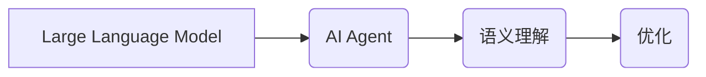
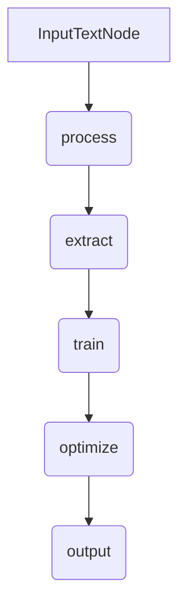
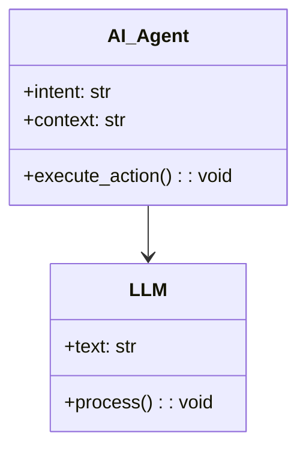
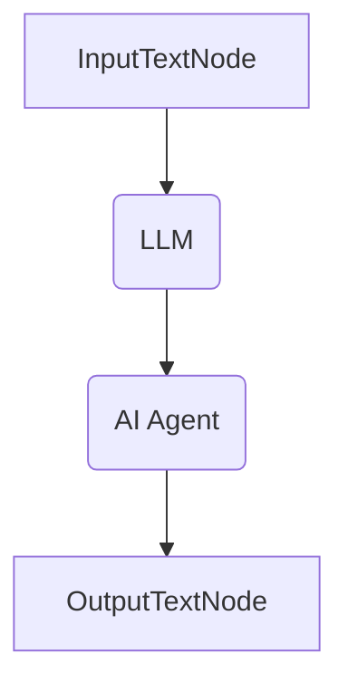
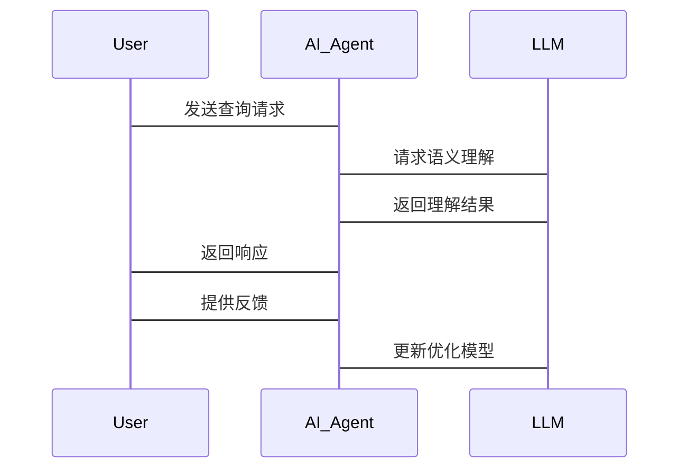

                 


# LLM支持的AI Agent语义理解优化

## 关键词：LLM, AI Agent, 语义理解, 优化, 人工智能, 自然语言处理

## 摘要：  
本文探讨了基于大语言模型（LLM）的AI代理（AI Agent）语义理解优化的技术细节。通过分析LLM与AI Agent的核心概念及其相互作用，本文详细介绍了语义理解优化的算法原理、系统架构设计、项目实战案例以及最佳实践策略。文章旨在为技术开发者和研究人员提供深入的技术洞察，帮助他们更好地理解和优化AI Agent的语义理解能力。

---

# 第1章: LLM与AI Agent概述

## 1.1 问题背景与问题描述

在人工智能快速发展的今天，AI Agent（智能代理）被广泛应用于各种应用场景中，如智能助手、自动化系统和智能客服等。然而，AI Agent的核心能力——语义理解，仍面临诸多挑战。传统的语义理解方法往往依赖于预定义的规则或浅层特征，难以应对复杂多变的语境和用户意图。这导致AI Agent在实际应用中表现出准确性不足、响应不够智能等问题。

大语言模型（LLM）的崛起为AI Agent的语义理解能力带来了革命性的提升。LLM通过海量数据的预训练，掌握了丰富的语义知识和上下文理解能力。然而，如何有效地将LLM与AI Agent结合，进一步优化语义理解，仍是一个值得深入研究的课题。

## 1.2 LLM与AI Agent的核心概念

### LLM的基本概念  
大语言模型（LLM）是指基于深度学习技术构建的大型神经网络模型，如GPT系列、BERT系列等。这些模型通过在大量文本数据上的预训练，能够理解和生成自然语言文本。LLM的核心优势在于其强大的语义理解和生成能力，能够在多种任务中表现出色。

### AI Agent的基本概念  
AI Agent是一种智能代理系统，能够感知环境、理解用户需求，并通过自主决策和执行操作来实现目标。AI Agent可以是软件程序，也可以是机器人，其核心能力包括感知、推理、规划和执行。

### 语义理解的核心机制  
语义理解是AI Agent实现智能化交互的关键环节。通过语义理解，AI Agent能够将用户的自然语言输入转化为可计算的结构化信息，从而准确理解用户的意图和需求。

---

## 1.3 语义理解优化的目标与意义

语义理解优化的目标是提高AI Agent对用户输入的理解准确性，减少误解和错误响应，提升用户体验。具体而言，优化的目标包括：

1. **意图识别的准确性**：准确识别用户的意图，避免将“订机票”误认为“订酒店”。
2. **上下文理解的深度**：能够理解对话中的上下文关系，保持连贯的交互。
3. **多模态信息的融合**：结合语音、文本、图像等多种信息源，提升理解能力。
4. **实时性和响应速度**：在保证理解准确性的前提下，提升响应速度。

通过优化语义理解能力，AI Agent能够更好地服务于用户，提升其智能化水平和用户满意度。

---

# 第2章: LLM支持的AI Agent核心概念与联系

## 2.1 LLM与AI Agent的核心概念原理

### LLM在AI Agent中的角色  
LLM作为AI Agent的核心模块，负责处理用户的自然语言输入，生成理解和响应。LLM通过其强大的语言处理能力，为AI Agent提供高质量的语义分析结果。

### AI Agent的语义理解需求  
AI Agent的语义理解需求主要体现在以下几个方面：
- **意图识别**：准确识别用户的意图。
- **实体识别**：提取文本中的关键实体信息。
- **情感分析**：理解用户的情感倾向。
- **对话上下文**：保持对话的连贯性。

### 语义理解的核心机制  
语义理解的核心机制包括文本预处理、特征提取、模型训练和结果优化。LLM通过深度学习技术，能够自动提取文本特征，并通过模型优化提升理解能力。

---

## 2.2 核心概念属性特征对比表

下表对比了LLM与AI Agent在核心概念上的属性特征：

| 属性         | LLM                     | AI Agent               |
|--------------|-------------------------|-------------------------|
| 核心功能      | 生成和理解自然语言文本  | 感知、推理、规划和执行  |
| 输入          | 文本数据                | 用户输入、环境反馈     |
| 输出          | 文本生成结果            | 行动指令、反馈信息     |
| 依赖技术      | 深度学习、自然语言处理  | 机器学习、强化学习     |
| 应用场景      | 智能对话、文本生成      | 智能助手、自动化系统     |

---

## 2.3 实体关系图

下图展示了LLM与AI Agent之间的核心关系：



---

## 2.4 本章小结

本章详细介绍了LLM与AI Agent的核心概念及其相互关系。通过对比分析，我们明确了LLM在AI Agent语义理解中的关键作用，并探讨了优化语义理解的重要性。下一章将深入探讨语义理解优化的算法原理。

---

# 第3章: LLM支持的AI Agent语义理解优化算法原理

## 3.1 算法原理概述

语义理解优化的算法原理主要包括以下几个步骤：
1. **文本预处理**：对输入文本进行分词、停用词处理等预处理操作。
2. **特征提取**：利用深度学习模型提取文本的语义特征。
3. **模型训练**：基于标注数据，训练语义理解模型。
4. **结果优化**：通过后处理技术，提升模型的准确性和流畅性。

---

## 3.2 算法流程图

下图展示了语义理解优化的算法流程：



---

## 3.3 算法实现代码示例

以下是一个基于Python的语义理解优化算法实现示例：

```python
import torch
import torch.nn as nn
from torch.utils.data import Dataset, DataLoader

class SemanticOptimizer(nn.Module):
    def __init__(self, input_dim, hidden_dim, output_dim):
        super(SemanticOptimizer, self).__init__()
        self.fc1 = nn.Linear(input_dim, hidden_dim)
        self.fc2 = nn.Linear(hidden_dim, output_dim)
        self.relu = nn.ReLU()

    def forward(self, x):
        x = self.fc1(x)
        x = self.relu(x)
        x = self.fc2(x)
        return x

# 数据准备
class SemanticDataset(Dataset):
    def __init__(self, inputs, targets):
        self.inputs = inputs
        self.targets = targets

    def __len__(self):
        return len(self.inputs)

    def __getitem__(self, idx):
        return self.inputs[idx], self.targets[idx]

# 训练函数
def train_model(model, dataloader, criterion, optimizer, num_epochs):
    for epoch in range(num_epochs):
        model.train()
        for inputs, targets in dataloader:
            outputs = model(inputs)
            loss = criterion(outputs, targets)
            loss.backward()
            optimizer.step()
            optimizer.zero_grad()

# 主函数
def main():
    # 参数设置
    input_dim = 100
    hidden_dim = 50
    output_dim = 10
    num_epochs = 10

    # 模型初始化
    model = SemanticOptimizer(input_dim, hidden_dim, output_dim)
    criterion = nn.CrossEntropyLoss()
    optimizer = torch.optim.Adam(model.parameters(), lr=0.001)

    # 数据加载
    inputs = torch.randn(100, input_dim)
    targets = torch.randint(0, output_dim, (100,))
    dataset = SemanticDataset(inputs, targets)
    dataloader = DataLoader(dataset, batch_size=32, shuffle=True)

    # 模型训练
    train_model(model, dataloader, criterion, optimizer, num_epochs)

    # 模型评估
    model.eval()
    with torch.no_grad():
        outputs = model(inputs)
        print(outputs)

if __name__ == "__main__":
    main()
```

---

## 3.4 数学模型与公式

### 语义理解模型的数学表示  
语义理解模型通常基于概率论，假设每个词的出现概率依赖于其上下文。具体公式如下：

$$P(word|context) = \frac{P(context, word)}{P(context)}$$

其中，$P(context, word)$表示词和上下文同时出现的概率，$P(context)$表示上下文出现的概率。

### 优化算法的数学模型  
优化算法的目标是最小化预测结果与真实结果之间的误差。常用的目标函数包括交叉熵损失函数：

$$\text{Loss} = \sum_{i=1}^{n} \text{CE}(y_i, y_{i}')$$

其中，$\text{CE}(y_i, y_{i}')$表示第$i$个样本的真实标签$y_i$与预测标签$y_{i}'$之间的交叉熵损失。

---

## 3.5 本章小结

本章详细介绍了语义理解优化的算法原理，包括文本预处理、特征提取、模型训练和结果优化等步骤。通过Python代码和数学公式的展示，我们明确了优化算法的具体实现方式。下一章将从系统架构设计的角度，进一步探讨优化方案的实现细节。

---

# 第4章: 系统分析与架构设计方案

## 4.1 问题场景介绍

在实际应用中，AI Agent需要处理多种复杂的语义理解场景。例如，在智能客服系统中，用户可能提出各种问题，AI Agent需要准确理解用户意图并提供相应的解决方案。然而，由于语言的歧义性和用户输入的多样性，AI Agent的语义理解能力面临严峻挑战。

---

## 4.2 系统功能设计

### 领域模型设计

下图展示了AI Agent的领域模型：



---

## 4.3 系统架构设计

下图展示了AI Agent的系统架构：



---

## 4.4 系统接口设计

AI Agent需要与外部系统进行交互，主要包括以下接口：

1. **输入接口**：接收用户的自然语言输入。
2. **输出接口**：返回处理后的结果或响应。
3. **反馈接口**：接收用户反馈，用于模型优化。

---

## 4.5 系统交互流程

下图展示了AI Agent的系统交互流程：



---

## 4.6 本章小结

本章从系统架构设计的角度，探讨了AI Agent的实现方案。通过领域模型和系统架构图的展示，我们明确了AI Agent的各个组件及其相互关系。下一章将通过实际案例，展示如何在具体项目中实现语义理解优化。

---

# 第5章: 项目实战

## 5.1 环境安装

为了实现基于LLM的AI Agent语义理解优化，需要安装以下环境：

1. **Python 3.8及以上**
2. **PyTorch**
3. **Hugging Face Transformers**

安装命令如下：

```bash
pip install torch transformers
```

---

## 5.2 系统核心实现

以下是AI Agent语义理解优化的核心代码实现：

```python
from transformers import AutoTokenizer, AutoModelForMaskedLM
import torch

class SemanticOptimizer:
    def __init__(self, model_name):
        self.tokenizer = AutoTokenizer.from_pretrained(model_name)
        self.model = AutoModelForMaskedLM.from_pretrained(model_name)

    def optimize_semantic(self, input_text):
        # 分词
        inputs = self.tokenizer(input_text, return_tensors="pt")
        # 模型处理
        outputs = self.model(**inputs)
        # 获取优化结果
        optimized_result = outputs.last_hidden_state
        return optimized_result

# 使用示例
optimizer = SemanticOptimizer("bert-base-cased")
result = optimizer.optimize_semantic("Hello, how are you?")
print(result)
```

---

## 5.3 案例分析

以智能客服系统为例，用户输入“我需要取消订单”，AI Agent需要准确理解用户的意图并执行相应的操作。通过语义理解优化，AI Agent能够识别出用户的意图是“取消订单”，并调用后端系统完成操作。

---

## 5.4 本章小结

本章通过具体项目案例，展示了如何在实际应用中实现基于LLM的AI Agent语义理解优化。通过环境安装和代码实现，我们明确了优化方案的具体步骤。

---

# 第6章: 最佳实践与注意事项

## 6.1 优化策略

1. **模型选择**：选择适合任务的LLM模型，如BERT、GPT等。
2. **数据质量**：确保训练数据的多样性和代表性。
3. **模型调优**：通过微调（Fine-tuning）提升模型在特定任务上的性能。
4. **实时优化**：利用用户反馈持续优化模型。

---

## 6.2 注意事项

1. **数据隐私**：确保用户数据的安全和隐私。
2. **性能优化**：优化模型的计算效率，降低响应时间。
3. **错误处理**：建立完善的错误处理机制，提升用户体验。

---

## 6.3 拓展阅读

1.《Deep Learning》——Ian Goodfellow  
2.《Natural Language Processing with PyTorch》——阿桑·阿斯普里亚格

