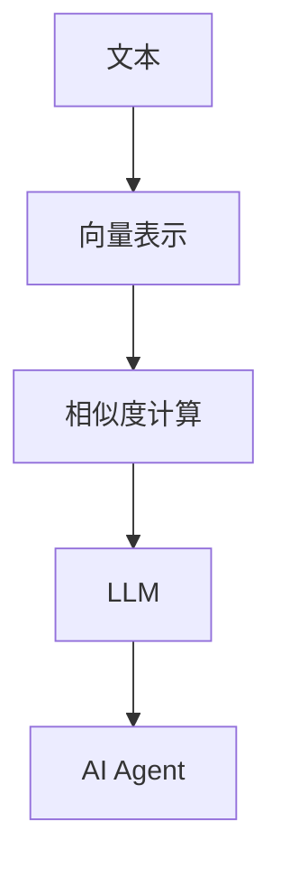
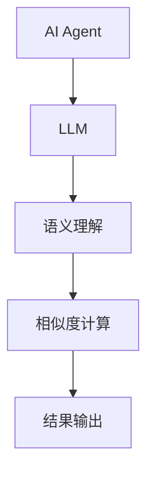
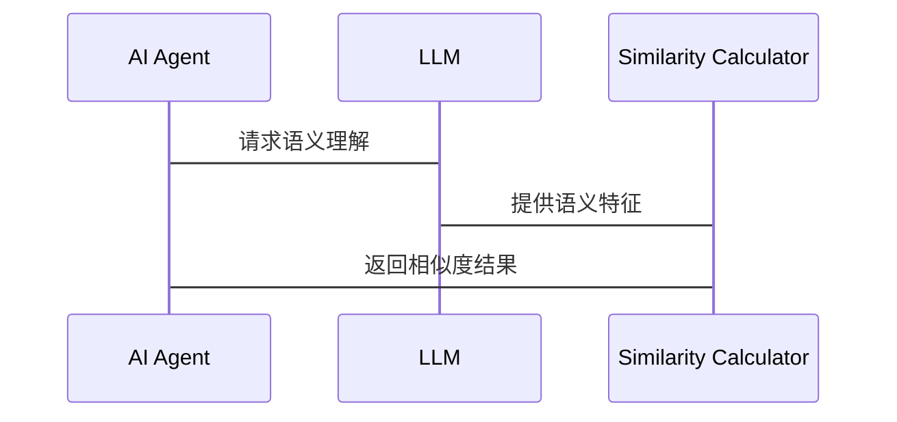

                 


```
# LLM支持的AI Agent语义相似度计算

> 关键词：LLM，AI Agent，语义相似度计算，自然语言处理，大语言模型

> 摘要：本文将详细介绍基于LLM支持的AI Agent语义相似度计算的原理、算法、系统架构和项目实现。通过分析语义相似度计算的核心概念、算法实现和系统设计，结合实际案例和最佳实践，为读者提供全面的技术指导。

---

# 第一部分: 背景介绍

## 第1章: 问题背景与核心概念

### 1.1 问题背景
- **语义相似度计算的重要性**：在自然语言处理中，语义相似度是衡量文本之间语义接近程度的关键指标。
- **LLM的优势**：大语言模型在语义理解方面的强大能力，为AI Agent提供了强大的语义分析工具。
- **AI Agent的应用场景**：从对话系统到智能助手，AI Agent需要理解用户的意图，语义相似度计算是其核心能力之一。

### 1.2 核心概念
- **语义相似度**：文本之间的语义接近程度。
- **LLM**：大语言模型，如GPT、BERT等。
- **AI Agent**：具备自主决策和执行能力的智能体。

### 1.3 问题描述
- **问题一**：如何利用LLM支持的AI Agent进行高效的语义相似度计算？
- **问题二**：语义相似度计算的边界条件和外延是什么？

### 1.4 问题解决
- **解决方案一**：结合LLM的语义理解能力，设计高效的相似度计算模型。
- **解决方案二**：通过AI Agent的协同作用，优化语义相似度计算的效率和准确性。

## 1.5 概念结构与核心要素
- **核心要素**：文本、向量表示、相似度计算模型、LLM、AI Agent。
- **实体关系图**：展示各核心要素之间的关系。

---

# 第二部分: 核心概念与联系

## 第2章: 语义相似度计算的核心原理

### 2.1 语义相似度计算的原理
- **向量空间模型**：将文本转换为向量表示，计算向量之间的相似度。
- **深度学习模型**：利用预训练的模型（如BERT）提取语义特征。
- **LLM的优势**：大语言模型在语义理解上的优势。

### 2.2 核心概念对比与特征分析
- **对比分析**：不同模型（如TF-IDF、BM25、BERT）的特征对比。
- **对比表格**：列出各种模型的优缺点。

### 2.3 实体关系图


---

# 第三部分: 算法原理

## 第3章: 基于向量的语义相似度算法

### 3.1 余弦相似度算法
- **数学公式**：
  $$\cos\theta = \frac{\vec{A} \cdot \vec{B}}{|\vec{A}| |\vec{B}|}$$
- **算法步骤**：
  1. 文本预处理。
  2. 文本向量化。
  3. 计算余弦相似度。
- **代码示例**：
  ```python
  from sklearn.metrics.pairwise import cosine_similarity

  def compute_cosine_similarity(vector1, vector2):
      return cosine_similarity([vector1], [vector2])[0][0]
  ```

### 3.2 BM25算法
- **数学公式**：
  $$BM25 = \sum_{i=1}^{n} \frac{f_i q_i (k + 1)}{f_i + k(1 - \alpha)}$$
- **算法步骤**：
  1. 文本分词。
  2. 计算词频。
  3. 计算BM25相似度。
- **代码示例**：
  ```python
  from rank_bm25 import BM25 

  def compute_bm25_similarity(documents):
      bm25 = BM25(documents)
      return bm25.get_scores(documents)
  ```

### 3.3 深度学习模型的相似度计算
- **模型选择**：使用预训练的BERT模型提取语义特征。
- **代码示例**：
  ```python
  import torch
  from transformers import BertModel, BertTokenizer

  def compute_bert_similarity(text1, text2):
      tokenizer = BertTokenizer.from_pretrained('bert-base-uncased')
      model = BertModel.from_pretrained('bert-base-uncased')

      inputs = tokenizer(text1 + text2, return_tensors='pt', padding=True, truncation=True)
      outputs = model(**inputs)
      embeddings = outputs.last_hidden_state.mean(dim=1)
      
      similarity = torch.cosine_similarity(embeddings[:1], embeddings[1:]).item()
      return similarity
  ```

---

# 第四部分: 系统分析与架构设计

## 第4章: 问题场景与系统设计

### 4.1 问题场景
- **需求分析**：AI Agent需要快速理解用户输入的语义，并与已有知识库进行对比。
- **功能需求**：支持多种语义相似度计算方法，实时响应用户请求。

### 4.2 系统功能设计
- **领域模型**：
  ```mermaid
  classDiagram
      class TextPreprocessing {
          - input_text
          - processed_text
          + preprocess()
      }
      class Vectorizer {
          - vector_mapping
          + vectorize(text: str) -> List[float]
      }
      class SimilarityCalculator {
          - similarity_matrix
          + compute_similarity(vector1: List[float], vector2: List[float]) -> float
      }
      class LLMIntegration {
          - model
          + generate(context: str, input: str) -> str
      }
      TextPreprocessing <--> Vectorizer
      Vectorizer <--> SimilarityCalculator
      SimilarityCalculator <--> LLMIntegration
  ```

### 4.3 系统架构设计


### 4.4 系统接口设计
- **输入接口**：接收用户输入的文本。
- **输出接口**：返回语义相似度计算结果。

### 4.5 系统交互设计


---

# 第五部分: 项目实战

## 第5章: 项目实现与案例分析

### 5.1 环境安装
- **Python环境**：安装必要的库，如scikit-learn、transformers。
- **代码示例**：
  ```bash
  pip install scikit-learn transformers
  ```

### 5.2 核心代码实现
- **文本预处理**：
  ```python
  def preprocess(text):
      return text.lower().replace('.', '').split()
  ```

- **向量化**：
  ```python
  from sklearn.feature_extraction.text import TfidfVectorizer

  vectorizer = TfidfVectorizer()
  vectors = vectorizer.fit_transform(corpus)
  ```

- **相似度计算**：
  ```python
  def compute_similarity(vectors):
      return cosine_similarity(vectors)
  ```

### 5.3 案例分析
- **案例一**：计算两个句子的相似度。
  ```python
  sentence1 = "What is the weather like today?"
  sentence2 = "Can you tell me today's weather?"
  similarity = compute_bert_similarity(sentence1, sentence2)
  print(f"Similarity: {similarity}")
  ```

### 5.4 项目小结
- **关键点**：文本预处理、向量化、相似度计算。
- **注意事项**：选择合适的模型和参数调优。

---

# 第六部分: 最佳实践

## 第6章: 小结与注意事项

### 6.1 小结
- **总结**：语义相似度计算是AI Agent实现智能交互的核心能力。
- **关键点**：结合LLM和深度学习模型，优化计算效率和准确性。

### 6.2 注意事项
- **模型选择**：根据具体场景选择合适的模型。
- **数据预处理**：确保数据清洗和特征提取的有效性。
- **性能优化**：通过并行计算和缓存优化提升效率。

### 6.3 拓展阅读
- **推荐书籍**：《Deep Learning for NLP》。
- **推荐博客**：关注前沿技术博客，获取最新动态。

---

作者：AI天才研究院 & 禅与计算机程序设计艺术

---

感谢您的阅读！如果对内容有任何疑问或建议，请随时联系作者。
```

