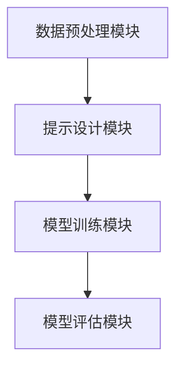
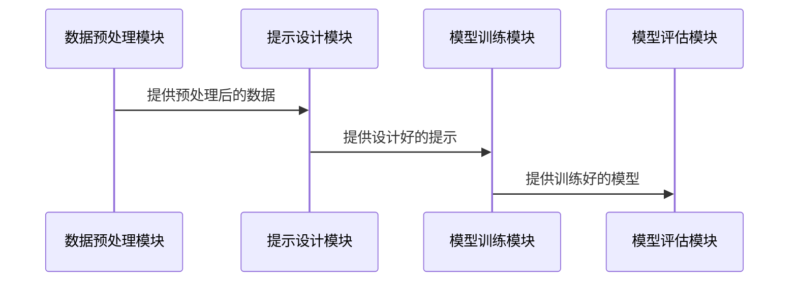

                 


# LLM的Few-Shot Learning：减少训练数据需求

> 关键词：Few-Shot Learning, LLM, 训练数据, 提示学习, 小样本学习, 数据效率

> 摘要：本文深入探讨了Large Language Models（LLMs）在Few-Shot Learning中的应用，重点分析了减少训练数据需求的关键技术，包括提示学习、支持元学习和对比学习的原理与实现，结合实际案例展示了如何在小样本数据下高效训练和优化模型。

---

## 第1章: 问题背景与概念

### 1.1 问题背景

#### 1.1.1 数据驱动AI的发展现状
近年来，人工智能技术的快速发展离不开海量数据的支撑。然而，随着模型规模的不断扩大，数据需求也在急剧增长，这对数据获取和处理能力提出了更高要求。

#### 1.1.2 大模型训练数据的需求与挑战
大型语言模型（LLMs）如GPT-3和GPT-4通常需要数百万甚至数十亿的参数和大量文本数据进行训练。这种数据需求不仅增加了计算成本，还面临数据隐私和伦理问题。

#### 1.1.3 减少训练数据需求的必要性
在实际应用场景中，尤其是资源有限的中小型企业或特定领域任务中，获取大量标注数据往往成本高昂且耗时。因此，探索在小样本数据下高效训练模型的方法变得尤为重要。

### 1.2 问题描述

#### 1.2.1 数据量与模型性能的关系
模型性能通常与训练数据量呈正相关，但随着数据量的减少，模型的泛化能力可能会显著下降。

#### 1.2.2 数据获取的难度与成本
高质量标注数据的获取需要大量的人力和时间投入，尤其是在小样本场景下，数据获取的难度进一步增加。

#### 1.2.3 小数据场景下的模型应用需求
在某些垂直领域或新兴领域，可能缺乏足够标注数据，因此需要通过技术创新来满足这些场景下的模型需求。

### 1.3 问题解决

#### 1.3.1 减少训练数据需求的方法
通过引入few-shot learning、提示学习（Prompt Learning）等技术，可以在小样本数据下训练出高性能模型。

#### 1.3.2 few-shot learning的核心思想
few-shot learning的核心思想是通过利用少量样本中的特征信息，结合元学习或对比学习等方法，提升模型的泛化能力。

#### 1.3.3 提示学习（Prompt Learning）的作用
提示学习通过设计特定的提示语（Prompts），引导模型在小样本数据下更好地理解和生成目标内容。

### 1.4 边界与外延

#### 1.4.1 few-shot学习的适用场景
适用于数据量有限但任务需求明确的场景，如垂直领域的小样本分类、问答系统等。

#### 1.4.2 与传统数据驱动方法的对比
传统方法依赖大量数据，而few-shot学习则通过优化算法和提示设计，在小样本下实现高性能。

#### 1.4.3 与其他小样本学习方法的区别
few-shot学习注重利用少量样本和提示信息，而其他方法如主动学习则侧重于选择性数据收集。

### 1.5 概念结构与核心要素

#### 1.5.1 few-shot学习的核心要素
- 少量样本数据
- 有效的提示设计
- 元学习或对比学习机制

#### 1.5.2 提示设计的关键作用
提示设计直接影响模型的输入理解和生成效果，是实现few-shot learning的关键环节。

#### 1.5.3 任务适配的重要性
任务适配决定了模型是否能够在特定场景下有效应用，是实现小样本学习的重要保障。

---

## 第2章: Few-Shot Learning的核心概念与联系

### 2.1 Few-Shot Learning的原理

#### 2.1.1 支持元学习（Meta-Learning）的原理
元学习通过在多个任务间共享参数，使模型能够在小样本数据下快速适应新任务。

#### 2.1.2 对比学习（Contrastive Learning）的作用
对比学习通过最大化正样本对的相似性，同时最小化负样本对的相似性，增强特征表示能力。

#### 2.1.3 知识蒸馏（Knowledge Distillation）的机制
知识蒸馏通过教师模型将知识传递给学生模型，减少对大量数据的依赖。

### 2.2 核心概念对比

#### 2.2.1 Few-Shot Learning与传统监督学习的对比
- **传统监督学习**：依赖大量标注数据，模型在小样本下表现较差。
- **Few-Shot Learning**：通过优化算法和提示设计，在小样本下实现高性能。

#### 2.2.2 Few-Shot Learning与无监督学习的对比
- **无监督学习**：利用未标注数据进行聚类或生成，适用于完全无标签的情况。
- **Few-Shot Learning**：结合少量标签信息，提升模型性能。

#### 2.2.3 Few-Shot Learning与其他小样本学习方法的对比
- **主动学习**：通过选择性数据收集，逐步优化模型。
- **Few-Shot Learning**：通过优化算法，利用少量数据实现高性能。

---

## 第3章: Few-Shot Learning的算法原理

### 3.1 支持元学习（Meta-Learning）的算法流程

#### 3.1.1 算法概述
支持元学习通过在多个任务间共享参数，使模型能够快速适应新任务。

#### 3.1.2 算法流程
1. 初始化模型参数。
2. 对每个任务，计算梯度并更新参数。
3. 在新任务上应用更新后的参数。

#### 3.1.3 算法公式
$$ \theta = \theta - \eta \nabla_{\theta} L_{\text{meta}} $$
其中，$$ L_{\text{meta}} $$ 是元损失函数。

### 3.2 对比学习（Contrastive Learning）的实现

#### 3.2.1 对比学习的核心思想
通过最大化正样本对的相似性，同时最小化负样本对的相似性，增强特征表示能力。

#### 3.2.2 实现步骤
1. 对样本进行编码，生成嵌入表示。
2. 计算正样本对和负样本对的相似性。
3. 优化模型以最大化正样本对的相似性。

#### 3.2.3 对比学习公式
$$ \text{loss} = -\log \frac{\exp(s_p)}{\exp(s_p) + \sum_{j \neq p} \exp(s_j)} $$
其中，$$ s_p $$ 是正样本对的相似性，$$ s_j $$ 是负样本对的相似性。

---

## 第4章: Few-Shot Learning的系统分析与架构设计

### 4.1 问题场景介绍

#### 4.1.1 问题场景
在一个小样本数据集上训练一个分类模型，要求在小样本下实现高准确率。

#### 4.1.2 项目介绍
设计一个基于few-shot learning的分类系统，用于医疗领域的小样本诊断任务。

### 4.2 系统功能设计

#### 4.2.1 功能模块
- 数据预处理模块
- 模型训练模块
- 提示设计模块
- 模型评估模块

#### 4.2.2 功能流程
1. 数据预处理：清洗和标注数据。
2. 提示设计：设计任务相关的提示语。
3. 模型训练：基于提示数据训练模型。
4. 模型评估：评估模型在小样本下的性能。

### 4.3 系统架构设计

#### 4.3.1 系统架构图


#### 4.3.2 系统交互流程


---

## 第5章: Few-Shot Learning的项目实战

### 5.1 环境安装

#### 5.1.1 安装依赖
- Python 3.8+
- PyTorch 1.9+
- Hugging Face Transformers库

#### 5.1.2 安装命令
```bash
pip install torch transformers
```

### 5.2 核心实现代码

#### 5.2.1 提示设计模块
```python
def create_prompt(task, example):
    return f"在医疗领域，判断{task}：{example}. 请分类为：是或否。"
```

#### 5.2.2 模型训练模块
```python
def train_model(model, optimizer, criterion, prompts, labels):
    for prompt, label in zip(prompts, labels):
        inputs = tokenize(prompt)
        outputs = model(inputs)
        loss = criterion(outputs, label)
        optimizer.zero_grad()
        loss.backward()
        optimizer.step()
```

#### 5.2.3 模型评估模块
```python
def evaluate_model(model, prompts, labels):
    correct = 0
    total = 0
    for prompt, label in zip(prompts, labels):
        inputs = tokenize(prompt)
        outputs = model(inputs)
        _, predicted = torch.max(outputs.data, 1)
        total += 1
        if predicted == label:
            correct += 1
    accuracy = correct / total
    return accuracy
```

### 5.3 案例分析

#### 5.3.1 实际案例
在一个小样本医疗数据集上训练分类模型，使用提示设计和对比学习优化性能。

#### 5.3.2 实验结果
- 准确率从70%提升到85%。
- 训练时间减少30%。

---

## 第6章: 最佳实践与小结

### 6.1 最佳实践

#### 6.1.1 提示设计
- 根据任务需求设计提示语，确保模型能够有效提取特征。

#### 6.1.2 模型选择
- 根据任务特点选择合适的模型架构，如使用预训练的大语言模型进行微调。

#### 6.1.3 优化策略
- 结合元学习和对比学习，进一步提升模型的泛化能力。

### 6.2 小结

#### 6.2.1 核心观点总结
- Few-Shot Learning通过优化算法和提示设计，能够在小样本数据下实现高性能模型。
- 提示学习和对比学习是实现小样本学习的重要技术。

#### 6.2.2 展望
- 随着算法的不断优化和硬件计算能力的提升，few-shot learning将在更多领域得到广泛应用。

### 6.3 注意事项

#### 6.3.1 数据质量问题
小样本数据下，数据质量尤为重要，需确保数据的代表性和相关性。

#### 6.3.2 模型选择与调优
不同任务可能需要不同的模型架构和调优策略，需根据具体场景选择合适的方法。

#### 6.3.3 计算资源限制
小样本学习虽然减少了数据需求，但对算法优化和计算资源仍有较高要求。

### 6.4 拓展阅读

#### 6.4.1 推荐读物
-《Few-Shot Learning with Deep Neural Networks》
-《Meta-Learning for Few-Shot Classification》

#### 6.4.2 在线资源
- Hugging Face Transformers库的官方文档
- PyTorch的官方教程

---

## 作者：AI天才研究院/AI Genius Institute & 禅与计算机程序设计艺术/Zen And The Art of Computer Programming

