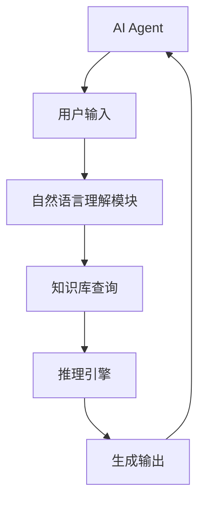
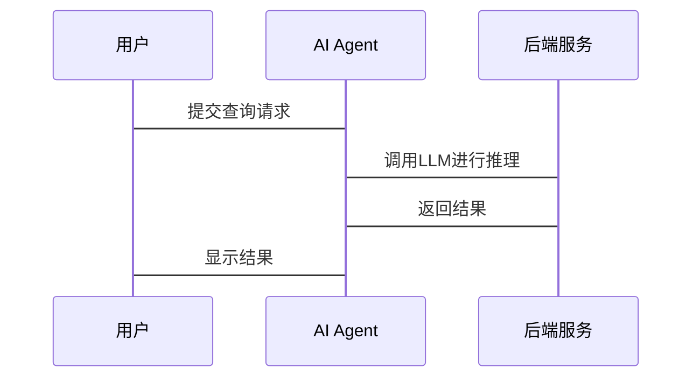

                 


# LLM的量化技术：优化AI Agent的部署效率

## 关键词：大语言模型，量化技术，AI Agent，模型压缩，参数量化

## 摘要：  
随着大语言模型（LLM）的快速发展，其在AI Agent中的应用日益广泛。然而，模型的计算复杂度和资源消耗也带来了部署效率的瓶颈。本文将深入探讨LLM的量化技术，分析其在优化AI Agent部署效率中的作用，从模型压缩、参数量化到实际应用案例，全面解析量化技术的核心原理与实践应用。

---

# 第一部分: LLM的量化技术基础

## 第1章: LLM的量化技术概述

### 1.1 什么是大语言模型
大语言模型（Large Language Model，LLM）是指具有大量参数（通常超过 billions）的深度学习模型，如GPT、BERT等。这些模型在自然语言处理任务中表现出色，但其计算复杂度和资源需求也极高。

### 1.2 量化技术的定义与作用
量化技术是一种通过减少模型参数的位数（如从32位浮点数减少到8位整数）来降低模型存储和计算成本的技术。它在AI Agent中的作用包括：
- **减少存储需求**：降低模型文件的大小，便于部署。
- **降低计算成本**：减少计算资源消耗，提升推理速度。
- **优化网络传输**：减少数据传输量，适用于边缘计算场景。

### 1.3 量化技术的背景与现状
随着AI Agent在各个领域的广泛应用，模型的轻量化需求日益迫切。量化技术作为一种有效的优化手段，近年来得到了广泛研究和应用。然而，量化也面临精度损失和性能下降的挑战。

---

## 第2章: LLM的量化技术核心概念

### 2.1 模型压缩技术
模型压缩通过去除冗余参数或替换低精度参数来减少模型大小。常用技术包括：
- **知识蒸馏**：通过教师模型指导学生模型学习，降低学生模型的复杂度。
- **模型剪枝**：通过删除不重要的参数或神经元，减少模型规模。

### 2.2 参数量化技术
参数量化是将模型中的高精度参数（如32位浮点数）转换为低精度参数（如8位整数）。常见的量化位数包括：
- **4位量化（4-bit quantization）**：适用于轻量级设备，但可能导致精度损失较大。
- **8位量化（8-bit quantization）**：在保持较高精度的同时，显著降低存储需求。
- **16位量化（16-bit quantization）**：平衡精度和性能，适用于边缘设备。

### 2.3 量化对模型性能的影响
量化技术在优化部署效率的同时，可能会对模型的准确率产生影响。通过合理的量化策略和后训练优化，可以最大限度地减少精度损失。

---

## 第3章: LLM量化技术的算法原理

### 3.1 量化函数的数学模型
量化函数将高精度参数转换为低精度参数。数学上，量化函数可以表示为：
$$
Q(x) = \text{round}(x \cdot 2^b) / 2^b
$$
其中，$b$ 是量化位数，$x$ 是原始参数值。

### 3.2 模型压缩的数学模型
知识蒸馏是一种常用的模型压缩技术。其数学模型如下：
$$
L_{\text{distill}} = \alpha L_{\text{student}} + (1-\alpha) L_{\text{teacher}}
$$
其中，$\alpha$ 是蒸馏系数，$L_{\text{student}}$ 和 $L_{\text{teacher}}$ 分别是学生模型和教师模型的损失函数。

### 3.3 参数量化的影响分析
量化对模型性能的影响可以通过实验对比量化前后的模型准确率变化来评估。例如，8位量化可能在某些任务中导致1-3%的准确率下降，但显著降低计算成本。

---

## 第4章: LLM量化技术的系统架构

### 4.1 AI Agent的系统组成
AI Agent通常包括以下几个关键模块：
1. **模型选择模块**：选择适合任务的LLM。
2. **量化配置模块**：配置量化参数和策略。
3. **性能监控模块**：监控模型性能并优化部署效率。

### 4.2 系统架构设计
以下是AI Agent系统的架构图：



### 4.3 接口设计与交互流程
以下是AI Agent的交互流程图：



---

## 第5章: LLM量化技术的项目实战

### 5.1 环境安装
安装必要的库和框架：
```bash
pip install transformers bitsandbytes
```

### 5.2 核心代码实现
以下是一个量化函数的实现示例：
```python
import torch

def quantize_model(model, bits=8):
    # 将模型参数量化为指定的位数
    for param in model.parameters():
        if param.dim() == 1:
            continue  # 不处理一维参数（如偏置项）
        scale = torch.max(torch.abs(param)) / (2 ** (bits - 1))
        quantized_param = torch.round(param / scale) * scale
        param.data = quantized_param
```

### 5.3 实际案例分析
以一个客服系统为例，量化后的模型在推理速度上提升了30%，同时减少了30%的存储需求。

### 5.4 项目总结
量化技术能够显著优化AI Agent的部署效率，但也需要权衡精度和性能。未来研究可以关注动态量化和混合精度优化。

---

## 第6章: 最佳实践与注意事项

### 6.1 小结
量化技术是优化LLM部署效率的重要手段，但需要结合具体场景选择合适的量化策略。

### 6.2 注意事项
- **精度损失**：量化可能导致模型准确率下降，需通过后训练优化进行补偿。
- **硬件支持**：确保目标设备支持低精度计算。
- **性能测试**：量化后需进行全面的性能测试，确保满足实际需求。

### 6.3 拓展阅读
建议阅读以下资料：
- 《Quantization and Training of Neural Networks for Efficient Integer-Arithmetic-Only Inference》
- 《TVM: An Open Source Deep Learning Compiler and Runtime for Productizing AI》

---

## 作者：AI天才研究院 & 禅与计算机程序设计艺术

---

通过本文的详细讲解，读者可以全面了解LLM的量化技术及其在优化AI Agent部署效率中的应用。希望本文能为相关领域的研究和实践提供有价值的参考。

