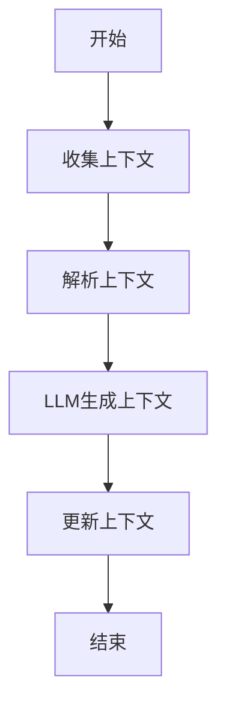
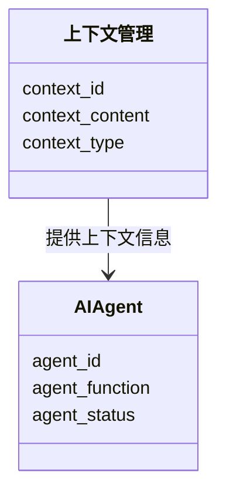

                 


# LLM驱动的AI Agent上下文管理技术

> 关键词：LLM，AI Agent，上下文管理，技术博客，AI编程，AI系统设计

> 摘要：本文深入探讨了LLM（大语言模型）驱动的AI Agent上下文管理技术，从背景、核心概念、算法原理、系统设计到项目实战，全面分析了这一领域的关键技术与实践。通过详细的技术分析和实际案例，本文为读者提供了从理论到实践的完整指南。

---

# 第一部分: 背景介绍

## 第1章: LLM驱动的AI Agent上下文管理技术背景

### 1.1 问题背景与描述
#### 1.1.1 当前AI Agent的发展现状
人工智能（AI）代理（AI Agent）作为实现人机交互的核心技术，近年来随着大语言模型（LLM）的崛起，得到了快速发展。传统的AI Agent主要依赖规则引擎或基于简单的上下文理解进行任务处理，但随着LLM的引入，AI Agent的能力得到了质的飞跃。

#### 1.1.2 上下文管理在AI Agent中的重要性
上下文管理是AI Agent实现智能交互的关键技术。通过管理对话历史、任务状态、用户偏好等信息，AI Agent能够更好地理解用户需求，并提供更精准的服务。然而，上下文管理的复杂性也在不断增加，尤其是在处理多轮对话和复杂任务时，传统的上下文管理方法往往力不从心。

#### 1.1.3 LLM与上下文管理的结合
LLM（如GPT系列模型）具备强大的自然语言理解和生成能力，能够通过上下文信息生成连贯且合理的回复。然而，LLM本身并不具备上下文管理的能力，需要通过外部机制来实现对上下文的收集、解析和更新。

### 1.2 问题解决与边界
#### 1.2.1 上下文管理的核心问题
上下文管理的核心问题包括：
- 如何高效地收集和解析上下文信息；
- 如何利用LLM生成上下文内容；
- 如何维护上下文的一致性和准确性。

#### 1.2.2 LLM在上下文管理中的应用边界
LLM在上下文管理中的应用边界包括：
- 上下文信息的生成与扩展；
- 上下文信息的理解与解析；
- 上下文信息的更新与维护。

#### 1.2.3 上下文管理的外延与限制
上下文管理的外延包括：
- 支持多轮对话；
- 支持复杂任务的分解与执行；
- 支持上下文的持久化存储。

上下文管理的限制包括：
- 对上下文信息的依赖性；
- 上下文信息的不完整性和不确定性；
- 上下文管理的计算资源消耗。

### 1.3 核心概念与结构
#### 1.3.1 上下文管理的定义与组成
上下文管理是指对AI Agent在与用户交互过程中产生的上下文信息进行收集、解析、生成、更新和维护的过程。其核心组成包括：
- 上下文信息的收集与解析；
- 上下文信息的生成与扩展；
- 上下文信息的更新与维护。

#### 1.3.2 LLM驱动的AI Agent工作原理
LLM驱动的AI Agent通过以下步骤实现上下文管理：
1. 收集用户的输入并解析上下文信息；
2. 利用LLM生成与上下文相关的回复或操作指令；
3. 更新上下文信息以支持后续的交互。

#### 1.3.3 核心要素与关系分析
上下文管理的核心要素包括：
- 上下文信息：包括对话历史、用户需求、任务状态等；
- LLM：用于生成上下文相关的回复或操作指令；
- AI Agent：负责协调上下文信息的收集、解析和生成。

---

## 第2章: 核心概念与联系

### 2.1 核心概念原理
#### 2.1.1 上下文管理的原理
上下文管理的原理包括：
- 基于LLM的上下文生成：通过LLM生成与当前上下文相关的回复或操作指令；
- 上下文信息的动态更新：根据用户的反馈不断更新上下文信息；
- 上下文信息的持久化存储：将上下文信息持久化存储以支持后续的交互。

#### 2.1.2 LLM在上下文管理中的作用
LLM在上下文管理中的作用包括：
- 生成上下文相关的回复；
- 解析用户的输入并提取上下文信息；
- 更新上下文信息以支持后续的交互。

#### 2.1.3 AI Agent与上下文管理的关系
AI Agent与上下文管理的关系是密不可分的。AI Agent通过上下文管理实现与用户的智能交互，而上下文管理则通过AI Agent实现对上下文信息的动态更新与维护。

### 2.2 概念对比与ER实体关系图
#### 2.2.1 实体关系图（ER图）展示
以下是上下文管理与AI Agent的实体关系图：

```mermaid
erd
    entity 上下文管理 {
        id
        context_id
        context_content
        context_type
    }
    entity AI Agent {
        agent_id
        agent_type
        agent_function
    }
    上下文管理 --> AI Agent: 提供上下文信息
```

#### 2.2.2 概念对比
以下是上下文管理与传统任务管理的对比：

| 对比维度 | 上下文管理 | 传统任务管理 |
|----------|------------|--------------|
| 核心目标 | 管理上下文信息 | 管理任务流程 |
| 实现方式 | 基于LLM生成上下文 | 基于规则引擎 |
| 适用场景 | 智能交互 | 任务调度 |

### 2.3 本章小结
通过本章的分析，我们了解了上下文管理的核心概念、原理以及与AI Agent的关系。接下来，我们将深入探讨上下文管理的算法原理。

---

## 第3章: 上下文管理的算法原理

### 3.1 算法流程与原理
#### 3.1.1 上下文收集与解析
上下文收集与解析的过程包括：
1. 收集用户的输入；
2. 解析输入中的上下文信息；
3. 将解析后的上下文信息存储到上下文管理模块。

#### 3.1.2 LLM驱动的上下文生成
LLM驱动的上下文生成的过程包括：
1. 根据当前上下文信息生成回复或操作指令；
2. 将生成的回复或操作指令返回给用户；
3. 根据用户的反馈更新上下文信息。

#### 3.1.3 上下文更新与维护
上下文更新与维护的过程包括：
1. 根据用户的反馈更新上下文信息；
2. 检查上下文信息的完整性和一致性；
3. 将更新后的上下文信息持久化存储。

### 3.2 算法流程图
以下是上下文管理的算法流程图：



### 3.3 核心算法代码实现
#### 3.3.1 环境安装与配置
为了实现上下文管理，我们需要安装以下依赖：
- Python 3.8+
- transformers库
- requests库

安装命令：
```bash
pip install transformers requests
```

#### 3.3.2 核心代码实现
以下是上下文管理的核心代码实现：

```python
from transformers import GPT2Tokenizer, GPT2LMHeadModel
import requests

def collect_context(context_id):
    # 收集上下文信息
    response = requests.get(f"http://example.com/context/{context_id}")
    return response.json()

def generate_context(context_id, context_content):
    # 初始化tokenizer和model
    tokenizer = GPT2Tokenizer.from_pretrained("gpt2")
    model = GPT2LMHeadModel.from_pretrained("gpt2")

    # 构建输入
    input_text = f"基于以下上下文内容：{context_content}，请生成与之相关的回复。"
    input_ids = tokenizer.encode(input_text, return_tensors="pt")

    # 生成回复
    outputs = model.generate(input_ids, max_length=50, num_beams=5, temperature=0.7)
    response = tokenizer.decode(outputs[0], skip_special_tokens=True)

    return response

def update_context(context_id, new_content):
    # 更新上下文信息
    response = requests.put(f"http://example.com/context/{context_id}", json={"content": new_content})
    return response.json()

def main():
    # 收集上下文信息
    context_id = "123"
    context_content = collect_context(context_id)
    print(f"收集到的上下文信息：{context_content}")

    # 生成上下文回复
    response = generate_context(context_id, context_content)
    print(f"生成的回复：{response}")

    # 更新上下文信息
    new_content = f"{context_content} + {response}"
    update_context(context_id, new_content)
    print(f"更新后的上下文信息：{new_content}")

if __name__ == "__main__":
    main()
```

---

## 第4章: 系统分析与架构设计

### 4.1 问题场景介绍
在本章中，我们将通过一个具体的场景来分析上下文管理的系统架构设计。假设我们正在开发一个智能客服系统，用户通过与AI Agent交互来解决他们的服务问题。

### 4.2 项目介绍
我们的目标是设计一个基于LLM的智能客服系统，该系统能够通过上下文管理技术实现多轮对话，并根据用户的需求提供个性化的服务。

### 4.3 系统功能设计
#### 4.3.1 领域模型
以下是智能客服系统的领域模型：



#### 4.3.2 系统架构设计
以下是智能客服系统的系统架构设计：


#### 4.3.3 系统接口设计
以下是系统接口设计：

1. 收集上下文接口：`GET /context/{context_id}`
2. 生成上下文接口：`POST /generate_context`
3. 更新上下文接口：`PUT /context/{context_id}`

#### 4.3.4 系统交互流程
以下是系统交互流程图：

```mermaid
sequenceDiagram
    用户 --> AI Agent: 发起请求
    AI Agent --> 上下文管理: 收集上下文信息
    上下文管理 --> LLM: 生成回复
    LLM --> AI Agent: 返回回复
    AI Agent --> 上下文管理: 更新上下文信息
    用户 <-- AI Agent: 收到回复
```

---

## 第5章: 项目实战

### 5.1 环境安装与配置
为了实现智能客服系统的上下文管理，我们需要安装以下依赖：
- Python 3.8+
- transformers库
- requests库

安装命令：
```bash
pip install transformers requests
```

### 5.2 核心代码实现
以下是上下文管理的核心代码实现：

```python
from transformers import GPT2Tokenizer, GPT2LMHeadModel
import requests
import json

def collect_context(context_id):
    # 收集上下文信息
    response = requests.get(f"http://example.com/context/{context_id}")
    return response.json()

def generate_context(context_id, context_content):
    # 初始化tokenizer和model
    tokenizer = GPT2Tokenizer.from_pretrained("gpt2")
    model = GPT2LMHeadModel.from_pretrained("gpt2")

    # 构建输入
    input_text = f"基于以下上下文内容：{context_content}，请生成与之相关的回复。"
    input_ids = tokenizer.encode(input_text, return_tensors="pt")

    # 生成回复
    outputs = model.generate(input_ids, max_length=50, num_beams=5, temperature=0.7)
    response = tokenizer.decode(outputs[0], skip_special_tokens=True)

    return response

def update_context(context_id, new_content):
    # 更新上下文信息
    response = requests.put(f"http://example.com/context/{context_id}", json={"content": new_content})
    return response.json()

def main():
    # 收集上下文信息
    context_id = "123"
    context_content = collect_context(context_id)
    print(f"收集到的上下文信息：{context_content}")

    # 生成上下文回复
    response = generate_context(context_id, context_content)
    print(f"生成的回复：{response}")

    # 更新上下文信息
    new_content = f"{context_content} + {response}"
    update_context(context_id, new_content)
    print(f"更新后的上下文信息：{new_content}")

if __name__ == "__main__":
    main()
```

---

## 第6章: 总结与展望

### 6.1 最佳实践
- 在实现上下文管理时，建议优先选择高效的上下文收集与解析方法；
- 在生成上下文内容时，建议结合LLM的特性，优化生成策略；
- 在维护上下文信息时，建议采用持久化存储技术，确保上下文信息的完整性和一致性。

### 6.2 小结
通过本文的分析与实践，我们深入探讨了LLM驱动的AI Agent上下文管理技术。从背景介绍到系统设计，再到项目实战，我们全面分析了这一领域的关键技术与实践方法。

### 6.3 注意事项
- 上下文管理的实现需要考虑系统的性能与可扩展性；
- 在处理复杂任务时，建议采用分层设计，确保系统的可维护性；
- 在实现上下文持久化时，建议采用数据库技术，确保数据的安全性和一致性。

### 6.4 拓展阅读
- 《Large Language Models for Dialogue Systems》
- 《Context-Driven AI Agent Design》
- 《Advanced Techniques for Context Management》

---

# 作者：AI天才研究院/AI Genius Institute & 禅与计算机程序设计艺术 /Zen And The Art of Computer Programming

