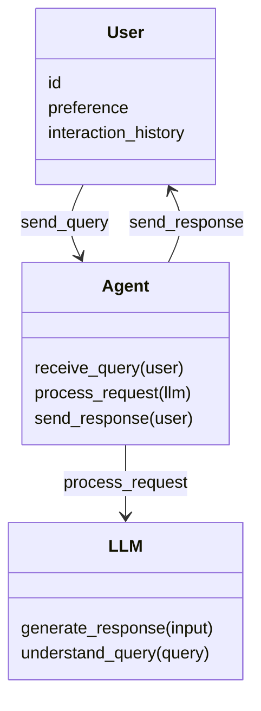
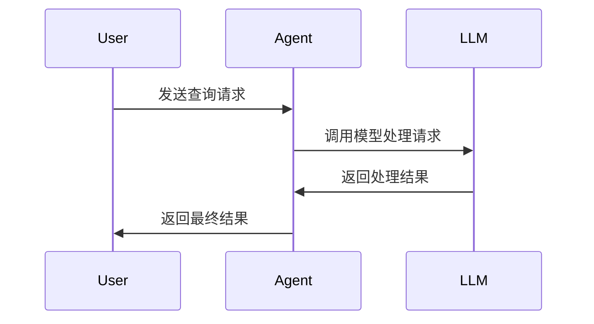

                 


# LLM驱动的AI Agent个性化：适应用户偏好

## 关键词：大语言模型、AI Agent、个性化、用户偏好、人机交互、自适应系统

## 摘要：
本文详细探讨了如何利用大语言模型（LLM）驱动AI Agent实现个性化服务，重点分析了LLM与AI Agent的核心原理、算法实现、系统架构及实际应用。通过案例分析和代码实现，展示了如何构建一个基于LLM的个性化AI Agent系统，为读者提供了从理论到实践的全面指导。

---

# 第一部分：背景介绍

## 第1章：LLM与AI Agent概述

### 1.1 LLM驱动的AI Agent基本概念

#### 1.1.1 大语言模型（LLM）的定义与特点
大语言模型（LLM，Large Language Model）是指基于大规模文本数据训练的深度学习模型，如GPT系列、BERT系列等。其特点包括：
- **大规模数据训练**：通常使用 billions 级别的参数，能够捕捉语言的复杂性。
- **生成能力强**：能够进行文本生成、翻译、问答等多种任务。
- **可微调性**：可以通过微调适应特定领域的任务需求。

#### 1.1.2 AI Agent的核心概念与功能
AI Agent（智能体）是指能够感知环境、做出决策并执行动作的智能系统。其核心功能包括：
- **感知**：通过传感器或 API 获取环境信息。
- **决策**：基于感知信息做出最优选择。
- **执行**：通过动作影响环境或与用户交互。

#### 1.1.3 LLM在AI Agent中的作用
LLM作为AI Agent的核心模块，负责理解和生成自然语言，能够显著提升Agent的对话能力和任务执行效率。

### 1.2 问题背景与需求分析

#### 1.2.1 当前AI Agent的局限性
传统AI Agent通常基于规则或简单机器学习模型，难以应对复杂多变的用户需求。

#### 1.2.2 用户个性化需求的多样性
用户对AI服务的需求日益多样化，例如个性化推荐、定制化对话等。

#### 1.2.3 LLM在个性化AI Agent中的作用
LLM能够通过大规模数据学习用户的偏好，从而提供更加个性化的服务。

### 1.3 问题解决与边界分析

#### 1.3.1 LLM驱动AI Agent的核心问题
如何利用LLM实现个性化服务，同时保证系统效率和准确性。

#### 1.3.2 个性化适应的边界与限制
用户的偏好可能变化频繁，且LLM的计算资源有限，需要在性能和个性化之间找到平衡。

#### 1.3.3 LLM驱动AI Agent的适用场景与外延
适用于需要自然语言交互的场景，如智能客服、个性化推荐系统等。

---

# 第二部分：核心概念与联系

## 第2章：LLM与AI Agent的核心原理

### 2.1 LLM的原理与实现机制

#### 2.1.1 大语言模型的训练与推理过程
LLM的训练通常采用Transformer架构，通过自监督学习优化模型参数。

#### 2.1.2 注意力机制与Transformer模型
注意力机制通过计算输入序列中每个词的重要性，帮助模型聚焦关键信息。

#### 2.1.3 LLM的可解释性与局限性
尽管LLM在生成文本方面表现出色，但其可解释性较差，且可能产生错误或不一致的结果。

### 2.2 AI Agent的决策与执行机制

#### 2.2.1 AI Agent的感知与理解能力
Agent通过LLM理解和解析用户的输入，生成相应的响应。

#### 2.2.2 基于LLM的决策逻辑
LLM为Agent提供决策支持，帮助其选择最优动作。

#### 2.2.3 Agent与环境的交互方式
Agent通过API或用户界面与环境交互，执行用户请求的任务。

### 2.3 LLM与AI Agent的关联与区别

#### 2.3.1 LLM作为AI Agent的核心模块
LLM为AI Agent提供语言理解和生成能力。

#### 2.3.2 AI Agent的其他功能模块
包括记忆模块、推理模块和执行模块，共同实现智能化服务。

#### 2.3.3 LLM与其他AI技术的结合
LLM可以与强化学习、计算机视觉等技术结合，拓展AI Agent的功能。

---

# 第三部分：算法原理与数学模型

## 第3章：LLM的算法原理

### 3.1 Transformer模型的数学基础

#### 3.1.1 自注意力机制的公式推导
自注意力机制的计算公式如下：

$$
\text{Attention}(Q, K, V) = \text{softmax}\left(\frac{QK^T}{\sqrt{d_k}}\right)V
$$

其中，$Q$、$K$、$V$分别为查询、键和值矩阵。

#### 3.1.2 编码器与解码器的结构分析
编码器负责将输入序列转换为固定长度的向量，解码器则根据编码结果生成输出序列。

#### 3.1.3 多头注意力的实现原理
多头注意力通过并行计算多个注意力头，提升模型的表达能力。

### 3.2 LLM的训练与优化

#### 3.2.1 梯度下降与参数优化
使用随机梯度下降（SGD）或Adam优化器更新模型参数。

#### 3.2.2 模型并行与分布式训练
通过数据并行或模型并行技术，提升训练效率。

---

# 第四部分：系统分析与架构设计

## 第4章：系统分析与架构设计方案

### 4.1 问题场景介绍
本文设计了一个基于LLM的个性化推荐系统，帮助用户发现感兴趣的内容。

### 4.2 系统功能设计（领域模型）



### 4.3 系统架构设计（架构图）


### 4.4 系统接口设计
系统主要接口包括：
- `send_query(user)`：用户发送查询请求。
- `process_request(llm)`：Agent调用LLM处理请求。
- `send_response(user)`：Agent向用户返回结果。

### 4.5 系统交互流程（序列图）



---

# 第五部分：项目实战

## 第5章：项目实战与案例分析

### 5.1 环境安装与配置

```bash
pip install transformers
pip install torch
pip install matplotlib
```

### 5.2 核心代码实现

```python
from transformers import AutoModelForCausalLM, AutoTokenizer
import torch

class LLMAgent:
    def __init__(self, model_name):
        self.model = AutoModelForCausalLM.from_pretrained(model_name)
        self.tokenizer = AutoTokenizer.from_pretrained(model_name)
    
    def generate_response(self, input_text):
        inputs = self.tokenizer(input_text, return_tensors="pt")
        outputs = self.model.generate(**inputs, max_length=50)
        return self.tokenizer.decode(outputs[0], skip_special_tokens=True)
```

### 5.3 代码应用解读与分析
上述代码定义了一个基于LLM的AI Agent类，通过预训练模型生成响应。

### 5.4 实际案例分析
以个性化推荐系统为例，展示如何通过LLM生成个性化推荐内容。

### 5.5 项目小结
本项目展示了如何利用LLM构建个性化AI Agent系统，为实际应用提供了参考。

---

# 第六部分：总结与展望

## 第6章：总结与展望

### 6.1 核心内容回顾
本文详细探讨了LLM驱动的AI Agent个性化服务的实现方法。

### 6.2 最佳实践 Tips
- 在实际应用中，建议根据具体需求选择合适的LLM模型。
- 定期更新模型以适应用户偏好变化。

### 6.3 小结与注意事项
- 注意模型的计算资源消耗。
- 定期监控模型性能，确保服务稳定性。

### 6.4 拓展阅读
推荐阅读相关领域的最新论文和技术博客，了解LLM与AI Agent的最新进展。

---

# 作者：
作者：AI天才研究院/AI Genius Institute  
作者：禅与计算机程序设计艺术/Zen And The Art of Computer Programming

