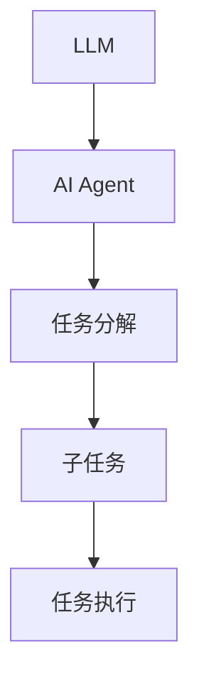
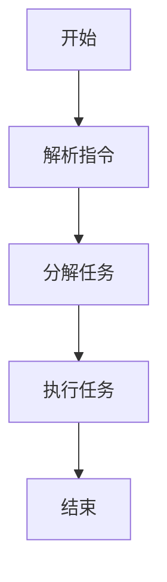
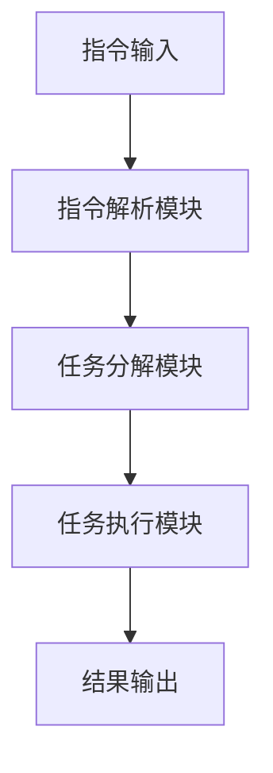

                 


# LLM驱动的AI Agent任务分解：处理复杂指令

> 关键词：LLM, AI Agent, 任务分解, 复杂指令, 大语言模型, AI智能体

> 摘要：本文将详细探讨如何利用大语言模型（LLM）驱动的AI Agent来分解和处理复杂指令。通过背景介绍、核心概念、算法原理、系统架构设计以及实际项目案例的分析，我们将深入理解LLM驱动AI Agent的任务分解机制，并掌握其在实际应用中的实现方法。

---

## 第一部分：背景介绍

### 第1章：问题背景与问题描述

#### 1.1 问题背景
随着人工智能技术的快速发展，AI Agent（智能体）在各个领域的应用日益广泛。AI Agent能够通过感知环境、分析任务并执行操作来实现特定目标。然而，面对复杂的指令时，传统的AI Agent往往难以有效地分解和执行任务。这主要因为复杂指令通常包含多个子任务，且这些子任务之间可能存在依赖关系，需要动态调整和协调。

大语言模型（LLM）的出现为AI Agent的任务分解提供了新的可能性。LLM具有强大的自然语言理解和生成能力，能够将复杂的指令分解为多个可执行的任务，并根据上下文动态调整执行策略。本文将探讨如何利用LLM驱动AI Agent来处理复杂指令，并通过任务分解来优化执行效率。

#### 1.2 问题描述
复杂指令的处理涉及以下几个关键问题：
1. **指令分解的准确性**：复杂的指令通常需要分解为多个子任务，每个子任务需要明确的目标和执行步骤。如何确保分解的准确性是关键。
2. **任务之间的依赖关系**：子任务之间可能存在依赖关系，例如某个子任务的结果可能影响其他子任务的执行顺序或参数。如何处理这种依赖关系是任务分解的核心挑战。
3. **动态调整能力**：在实际执行过程中，环境可能会发生变化，AI Agent需要能够根据新的信息动态调整任务分解和执行策略。

#### 1.3 问题解决思路
LLM驱动的AI Agent通过以下步骤实现复杂指令的处理：
1. **指令解析**：利用LLM对复杂指令进行语义解析，提取任务目标和执行要求。
2. **任务分解**：将复杂指令分解为多个子任务，并确定子任务之间的依赖关系。
3. **任务执行**：根据任务分解结果，动态调整执行策略，协调各个子任务的执行。
4. **结果整合与反馈**：整合子任务的结果，生成最终的执行报告，并根据反馈优化任务分解策略。

#### 1.4 边界与外延
- **边界**：LLM驱动的AI Agent主要关注任务分解和执行过程中的算法和策略设计，不涉及具体的硬件实现。
- **外延**：本文的方法可以扩展到多种应用场景，包括但不限于自然语言处理、机器人控制、分布式系统管理等。

#### 1.5 概念结构与核心要素
- **概念框架**：LLM驱动的AI Agent由任务分解模块、执行模块和反馈模块组成。
- **核心要素**：
  - 指令解析：将复杂指令分解为可执行的任务。
  - 任务分解：将任务分解为子任务，并建立依赖关系。
  - 任务执行：根据分解结果执行子任务，并根据反馈动态调整策略。

---

## 第二部分：核心概念与联系

### 第2章：LLM与AI Agent的核心概念

#### 2.1 LLM的基本原理
- **定义**：大语言模型（LLM）是一种基于深度学习的自然语言处理模型，能够理解和生成人类语言。
- **特点**：
  - **强大的上下文理解能力**：能够处理长文本，理解语义。
  - **多任务能力**：可以在多种任务（如翻译、问答、文本生成）中表现出色。
  - **可解释性有限**：LLM的决策过程通常难以解释。

#### 2.2 AI Agent的基本原理
- **定义**：AI Agent是一个智能实体，能够感知环境、分析问题并采取行动以实现目标。
- **特点**：
  - **自主性**：能够在没有外部干预的情况下独立工作。
  - **反应性**：能够根据环境变化动态调整行为。
  - **社交能力**：能够与其他系统或人类交互。

#### 2.3 LLM与AI Agent的联系
- **联系**：LLM为AI Agent提供了强大的语言理解和生成能力，使其能够更好地理解和分解复杂指令。
- **对比**：
  | 特性 | LLM | AI Agent |
  |------|------|-----------|
  | 核心能力 | 语言处理 | 任务执行 |
  | 应用场景 | NLP任务 | 自动化控制 |
  | 依赖性 | 需要大量数据训练 | 需要任务分解策略 |

#### 2.4 实体关系图


---

## 第三部分：算法原理讲解

### 第3章：任务分解算法的原理与实现

#### 3.1 算法原理
- **任务分解步骤**：
  1. **指令解析**：利用LLM对复杂指令进行语义分析，提取任务目标和约束条件。
  2. **任务分解**：将指令分解为多个子任务，并确定子任务之间的依赖关系。
  3. **任务执行**：根据分解结果，动态调整执行顺序和参数。

#### 3.2 算法实现


#### 3.3 数学模型与公式
- **任务分解的数学表示**：
  任务集合 \( T = \{T_1, T_2, ..., T_n\} \)
  依赖关系 \( D = (T_i, T_j) \) 表示 \( T_i \) 依赖 \( T_j \)。
  - 优先级排序：\( P(T_i) = 1/n \) ，其中 \( n \) 是任务的数量。

---

## 第四部分：系统分析与架构设计

### 第4章：系统架构设计

#### 4.1 问题场景
- **场景描述**：一个复杂的任务需要分解为多个子任务，并协调各个子任务的执行。

#### 4.2 系统功能设计
- **功能模块**：
  - 指令解析模块：解析复杂指令，提取任务目标。
  - 任务分解模块：分解任务并建立依赖关系。
  - 任务执行模块：根据分解结果执行任务。

#### 4.3 系统架构图


---

## 第五部分：项目实战

### 第5章：项目实战与案例分析

#### 5.1 项目环境安装
- **工具安装**：安装Python和相关库（如Hugging Face Transformers）。
  ```bash
  pip install transformers
  ```

#### 5.2 核心代码实现
```python
from transformers import AutoTokenizer, AutoModelForCausalLM

tokenizer = AutoTokenizer.from_pretrained('gpt2')
model = AutoModelForCausalLM.from_pretrained('gpt2')

def decompose_task(instruction):
    inputs = tokenizer(instruction, return_tensors='np')
    outputs = model.generate(**inputs)
    return tokenizer.decode(outputs[0], skip_special_tokens=True)

# 示例指令
instruction = "优化公司网站的用户体验"
print(decompose_task(instruction))
```

#### 5.3 案例分析
- **案例描述**：优化公司网站的用户体验。
- **任务分解**：
  1. 收集用户反馈。
  2. 分析反馈，找出问题。
  3. 设计改进方案。
  4. 实施改进并测试。

---

## 第六部分：最佳实践

### 第6章：总结与展望

#### 6.1 总结
- LLM驱动的AI Agent通过任务分解能够有效处理复杂指令，提升执行效率。
- 关键技术包括指令解析、任务分解和动态调整。

#### 6.2 最佳实践
- **指令解析**：使用高质量的LLM模型。
- **任务分解**：明确任务目标和依赖关系。
- **动态调整**：根据反馈优化执行策略。

#### 6.3 注意事项
- **数据质量**：任务分解的准确性依赖于LLM的训练数据质量。
- **性能优化**：在实际应用中需要考虑计算资源的限制。

#### 6.4 拓展阅读
- 推荐阅读相关领域的最新论文和书籍，深入理解任务分解的算法和优化方法。

---

## 作者信息

作者：AI天才研究院/AI Genius Institute & 禅与计算机程序设计艺术 /Zen And The Art of Computer Programming

---

这篇文章通过系统地介绍LLM驱动的AI Agent任务分解的背景、核心概念、算法原理、系统架构设计和实际案例，为读者提供了一个全面的理解框架。希望本文能够为相关领域的研究和实践提供有价值的参考。

