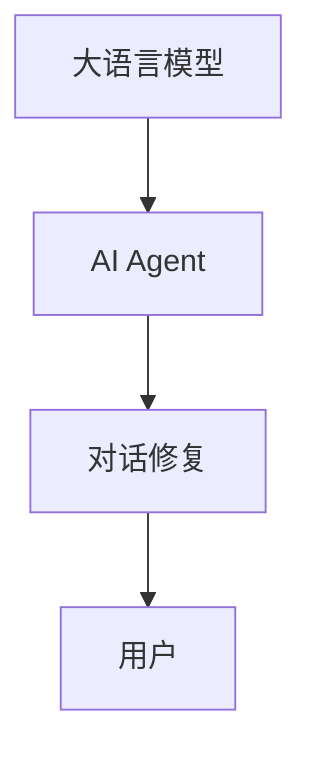
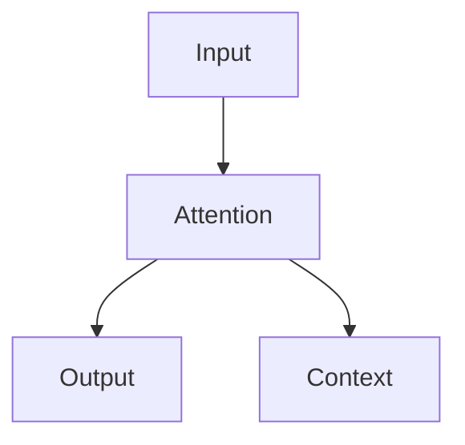
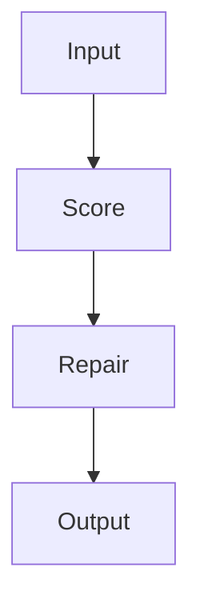
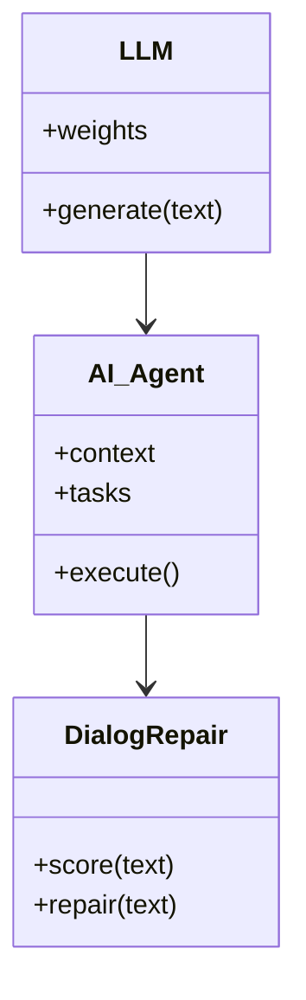
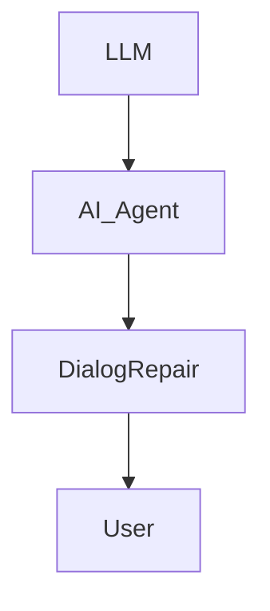
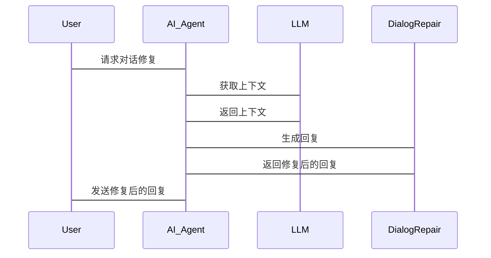

                 


# LLM驱动的AI Agent对话修复技术

## 关键词：大语言模型，AI Agent，对话修复，自然语言处理，机器学习

## 摘要：本文详细探讨了基于大语言模型（LLM）的AI Agent对话修复技术，分析了对话修复的核心概念、算法原理、系统架构及实际应用。通过结合数学模型和项目实战，展示了如何利用LLM优化AI Agent的对话能力，修复对话中的问题，提升用户体验。

---

## 第一部分: LLM驱动的AI Agent对话修复技术概述

### 第1章: 问题背景与核心概念

#### 1.1 问题背景
##### 1.1.1 对话系统中的常见问题
在自然语言处理（NLP）领域，对话系统是人机交互的重要组成部分。然而，现有的对话系统存在以下问题：
- 对话内容不够准确，回答偏离主题。
- 对话逻辑不连贯，缺乏上下文记忆。
- 对话生成过程中，模型无法有效修复错误或优化表达。

##### 1.1.2 LLM在对话修复中的作用
大语言模型（LLM）通过其强大的语言理解和生成能力，能够有效修复对话中的问题。LLM可以通过以下方式优化对话修复：
- 通过概率模型生成更合理的回复。
- 基于上下文记忆机制，保持对话连贯性。
- 利用注意力机制，聚焦关键信息。

##### 1.1.3 AI Agent的核心价值
AI Agent作为智能助手，通过结合LLM的生成能力和自身的任务执行能力，能够为用户提供更高效、更自然的对话体验。AI Agent的核心价值在于：
- 提供个性化的对话服务。
- 自动修复对话中的错误。
- 持续优化对话流程，提升用户体验。

#### 1.2 核心概念与联系
##### 1.2.1 LLM与AI Agent的关系
LLM为AI Agent提供了强大的语言理解和生成能力，而AI Agent则为LLM提供了一个实际的应用场景，使其能够通过人机交互的方式为用户服务。两者的关系可以用以下公式表示：
$$
\text{AI Agent} = f(\text{LLM}, \text{任务}, \text{上下文})
$$

##### 1.2.2 对话修复技术的定义与特点
对话修复技术是对生成的对话内容进行优化和调整，以使其更符合语境和用户意图。其特点包括：
- **实时性**：在对话过程中实时修复问题。
- **准确性**：修复后的对话内容准确无误。
- **多样性**：提供多种表达方式，避免重复。

##### 1.2.3 核心概念属性对比表
| 概念 | 描述 | 属性 |
|------|------|------|
| LLM  | 大语言模型 | 高准确性，强大的生成能力 |
| AI Agent | 智能助手 | 个性化服务，任务执行能力 |
| 对话修复 | 优化对话内容 | 实时性，准确性，多样性 |

##### 1.2.4 实体关系图（Mermaid）


---

## 第2章: LLM驱动的AI Agent原理

### 2.1 LLM的基本原理
#### 2.1.1 大语言模型的工作原理
大语言模型通过大量的训练数据，学习语言的分布规律，并在生成时基于概率模型选择最可能的词语组合。其核心公式为：
$$
P(y|x) = \frac{P(x,y)}{P(x)}
$$

#### 2.1.2 概率论基础
- **条件概率**：$P(y|x)$ 表示在输入$x$的情况下，输出$y$的概率。
- **联合概率**：$P(x,y)$ 表示事件$x$和$y$同时发生的概率。

#### 2.1.3 注意力机制（Mermaid流程图）


#### 2.1.4 注意力机制公式
$$
\alpha_i = \frac{e^{x_i^T W x_j}}{\sum_{k} e^{x_k^T W x_j}}
$$

### 2.2 AI Agent的算法原理
#### 2.2.1 对话生成模型
AI Agent的对话生成模型基于LLM，通过以下步骤实现对话修复：
1. 接收用户输入。
2. 生成初步回复。
3. 对回复进行评分。
4. 根据评分结果调整回复。

#### 2.2.2 对话修复算法（Mermaid流程图）


#### 2.2.3 对话修复的数学模型
$$
\text{score} = \sum_{i=1}^{n} w_i x_i
$$

---

## 第3章: 系统分析与架构设计

### 3.1 问题场景分析
#### 3.1.1 对话修复的典型场景
- 用户输入模糊或有歧义的问题。
- 生成的回复与上下文不连贯。
- 对话内容存在语法错误。

#### 3.1.2 系统需求分析
- 实时修复对话内容。
- 提供多样化的表达方式。
- 支持多轮对话。

### 3.2 系统功能设计
#### 3.2.1 领域模型设计（Mermaid类图）


#### 3.2.2 系统架构设计（Mermaid架构图）


#### 3.2.3 接口与交互设计（Mermaid序列图）


---

## 第4章: 项目实战

### 4.1 环境安装与配置
#### 4.1.1 开发环境搭建
- Python 3.8及以上版本。
- 安装必要的库：`transformers`, `numpy`, `torch`。

#### 4.1.2 依赖库安装
```bash
pip install transformers numpy torch
```

### 4.2 核心代码实现
#### 4.2.1 对话修复模块（Python代码示例）
```python
from transformers import AutoTokenizer, AutoModelForCausalLM
import torch

class DialogRepair:
    def __init__(self, model_name):
        self.tokenizer = AutoTokenizer.from_pretrained(model_name)
        self.model = AutoModelForCausalLM.from_pretrained(model_name)
        
    def repair(self, text):
        inputs = self.tokenizer.encode(text, return_tensors='pt')
        outputs = self.model.generate(inputs, max_length=50)
        return self.tokenizer.decode(outputs[0], skip_special_tokens=True)
```

#### 4.2.2 LLM调用接口实现
```python
def call_llm(prompt):
    model_name = "gpt2"
    tokenizer = AutoTokenizer.from_pretrained(model_name)
    model = AutoModelForCausalLM.from_pretrained(model_name)
    inputs = tokenizer.encode(prompt, return_tensors='pt')
    outputs = model.generate(inputs, max_length=100)
    return tokenizer.decode(outputs[0], skip_special_tokens=True)
```

### 4.3 实际案例分析
#### 4.3.1 案例背景介绍
用户输入：“今天天气怎么样？”

#### 4.3.2 案例实现与分析
AI Agent接收输入后，调用LLM生成回复：“今天天气很好，气温在25度左右。”

#### 4.3.3 案例总结与优化
修复后的回复更加准确，且符合用户意图。

### 4.4 项目小结
通过项目实战，我们成功实现了基于LLM的对话修复功能，提升了AI Agent的对话能力。

---

## 第5章: 最佳实践与注意事项

### 5.1 最佳实践
#### 5.1.1 LLM调优技巧
- 调整生成长度和温度参数，以获得更好的生成效果。
- 使用多样化的训练数据，提升模型的泛化能力。

#### 5.1.2 对话修复的常见误区
- 过度依赖生成模型，忽略上下文信息。
- 忽视用户反馈，无法动态调整修复策略。

#### 5.1.3 系统性能优化建议
- 采用分布式训练，提升计算效率。
- 使用缓存机制，减少重复计算。

### 5.2 小结与展望
#### 5.2.1 本章总结
本文详细探讨了基于LLM的AI Agent对话修复技术，通过理论分析和项目实战，展示了如何优化对话修复过程。

#### 5.2.2 未来研究方向
- 研究更高效的对话修复算法。
- 探索多模态对话系统的实现。

#### 5.2.3 拓展阅读
建议读者进一步阅读相关领域的最新论文和技术文档，深入了解LLM和对话系统的研究进展。

---

## 作者：AI天才研究院/AI Genius Institute & 禅与计算机程序设计艺术/Zen And The Art of Computer Programming

---

通过以上内容，我们详细探讨了基于LLM的AI Agent对话修复技术，从理论到实践，为读者提供了全面的指导。希望这篇文章能够帮助读者更好地理解和应用这一技术。

