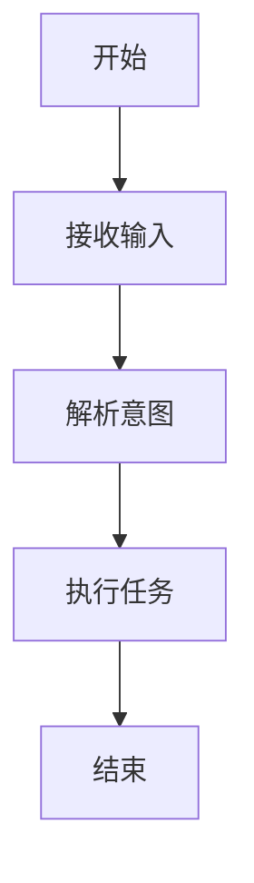
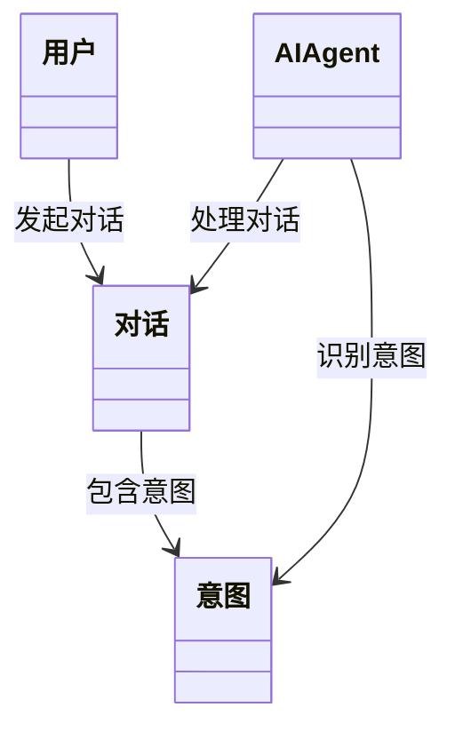
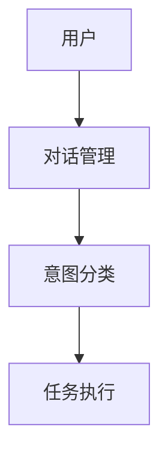
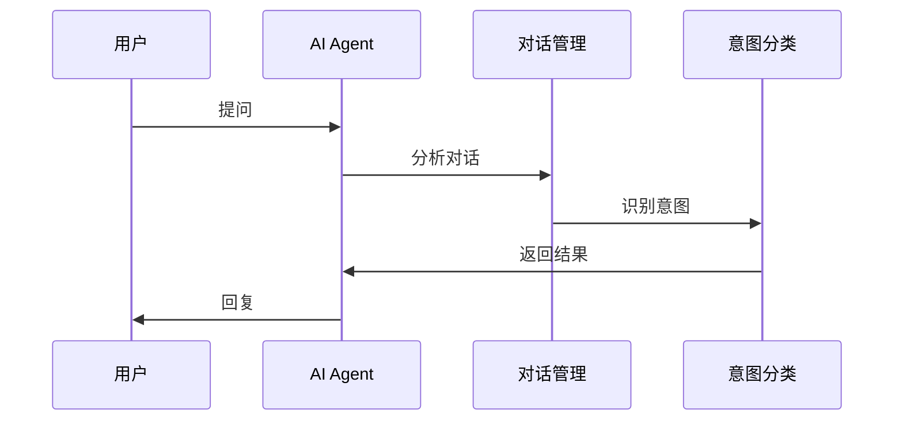

                 


# LLM驱动的AI Agent对话意图识别

**关键词**：LLM, AI Agent, 对话意图识别, 自然语言处理, 深度学习, 对话系统, 人机交互

**摘要**：本文深入探讨了LLM（大语言模型）驱动的AI Agent在对话意图识别中的应用。通过分析背景、核心概念、算法原理、数学模型、系统架构、项目实战及最佳实践，系统性地阐述了如何利用LLM技术提升对话系统的意图识别能力。文章从理论到实践，结合具体案例和代码实现，为读者提供了全面的技术指导。

---

## 第一部分: 背景介绍

### 第1章: LLM驱动的AI Agent对话意图识别概述

#### 1.1 问题背景与描述

对话意图识别是自然语言处理（NLP）中的重要任务，旨在理解用户在对话中的真实需求。随着LLM的崛起，AI Agent（智能体）能够更高效地处理复杂对话，提供个性化服务。本文将探讨LLM如何驱动AI Agent，实现精准的意图识别。

#### 1.1.1 对话意图识别的定义与重要性

- **定义**：对话意图识别是通过分析对话内容，推断用户的意图，如查询信息、预订服务等。
- **重要性**：准确识别意图可提升用户体验，优化对话流程，降低人工干预成本。

#### 1.1.2 LLM在对话系统中的作用

- **生成能力**：LLM能够生成自然流畅的回复，增强对话的连贯性。
- **理解能力**：通过上下文理解用户需求，提供精准服务。

#### 1.1.3 AI Agent的定义与特点

- **定义**：AI Agent是一种智能实体，能够感知环境并执行任务。
- **特点**：自主性、反应性、目标导向、社交能力。

#### 1.2 问题解决与边界

- **核心问题**：准确识别用户意图，处理复杂对话。
- **LLM的优势**：高精度、可扩展性、易于集成。
- **问题边界**：限定在特定领域，如客服、医疗咨询等。

#### 1.2.1 对话意图识别的核心问题

- **语义理解**：准确解析用户需求。
- **上下文处理**：结合对话历史，理解隐含意图。

#### 1.2.2 LLM驱动的AI Agent的优势

- **高效性**：快速响应，减少延迟。
- **适应性**：支持多语言、多领域应用。

#### 1.2.3 问题的边界与外延

- **边界**：专注于意图识别，不涉及情感分析。
- **外延**：可扩展至多轮对话、复杂任务处理。

#### 1.3 核心概念结构

- **概念属性对比**：通过表格展示LLM和AI Agent的关键区别与联系。
- **ER实体关系图**：展示用户、意图、对话之间的关联。

---

## 第二部分: 核心概念与联系

### 第2章: LLM与AI Agent的原理与联系

#### 2.1 核心概念原理

- **LLM原理**：基于Transformer架构，通过自注意力机制处理文本。
- **AI Agent原理**：通过感知和行动实现目标。
- **协作机制**：LLM提供语言理解，AI Agent执行任务。

#### 2.2 概念属性特征对比

| 概念    | LLM                          | AI Agent                        |
|---------|-------------------------------|---------------------------------|
| 定义    | 大语言模型，处理文本数据      | 智能体，执行任务                |
| 功能    | 生成文本，理解意图            | 感知环境，执行任务              |
| 依赖    | 大量训练数据                  | 传感器、API接口                 |
| 输出    | 文本、概率分布                | 动作、反馈                      |

#### 2.3 ER实体关系图架构

```mermaid
er
actor 用户
entity 对话
entity 意图
actor 用户 --> entity 对话: 发起对话
entity 对话 --> entity 意图: 包含意图
```

---

## 第三部分: 算法原理讲解

### 第3章: 对话意图识别的算法原理

#### 3.1 算法原理

- **基于规则的分类**：通过预定义规则匹配意图。
- **基于机器学习的分类**：使用SVM、随机森林等模型。
- **深度学习模型**：如BERT、GPT用于意图识别。

#### 3.2 Mermaid流程图展示



#### 3.3 Python源代码实现

```python
import numpy as np
from sklearn.svm import SVC

# 数据预处理
def preprocess(data):
    # 假设data为对话历史
    return data

# 模型训练
def train_model(X_train, y_train):
    model = SVC()
    model.fit(X_train, y_train)
    return model

# 意图分类
def classify(model, X_test):
    return model.predict(X_test)
```

#### 3.4 数学模型与公式

- **词嵌入**：使用Word2Vec生成词向量。
  $$ \text{word\_vector} = \text{Word2Vec}(word) $$
- **概率模型**：计算条件概率。
  $$ P(y|x) = \frac{P(x|y)P(y)}{P(x)} $$
- **深度学习模型**：如BERT的自注意力机制。
  $$ \text{Attention}(Q, K, V) = \text{softmax}(\frac{QK^T}{\sqrt{d}})V $$

---

## 第四部分: 系统分析与架构设计

### 第5章: 系统分析与架构设计

#### 5.1 问题场景介绍

- **项目背景**：设计一个客服AI Agent，处理用户咨询。
- **系统功能设计**：对话管理、意图分类、反馈优化。

#### 5.2 领域模型类图



#### 5.3 系统架构设计



#### 5.4 系统交互设计



---

## 第五部分: 项目实战

### 第6章: 项目实战

#### 6.1 环境安装

```bash
pip install numpy scikit-learn transformers
```

#### 6.2 系统核心实现源代码

```python
from transformers import pipeline

# 初始化模型
intent_classifier = pipeline("text-classification", model="snunlp/koala-7b-intention")

# 数据预处理
def preprocess(data):
    return data

# 意图分类
def classify(model, input_text):
    return model(input_text)
```

#### 6.3 实际案例分析

- **案例1**：用户询问订单状态，系统识别意图并查询数据库。
- **案例2**：用户请求推荐产品，系统调用API获取信息。

#### 6.4 项目小结

- **经验总结**：数据质量至关重要，模型调优可提升准确率。
- **性能优化**：采用缓存机制，减少重复计算。

---

## 第六部分: 最佳实践

### 第7章: 最佳实践

#### 7.1 小结

- **数据质量**：确保数据多样性和代表性。
- **模型调优**：使用交叉验证优化参数。
- **性能优化**：利用缓存和分布式计算提升效率。

#### 7.2 注意事项

- **隐私保护**：确保用户数据安全。
- **错误处理**：设计完善的错误处理机制。

#### 7.3 拓展阅读

- **推荐书籍**：《Deep Learning》、《自然语言处理入门》。
- **在线资源**：Hugging Face Transformers库文档。

---

## 结语

LLM驱动的AI Agent对话意图识别是一项复杂的任务，涉及多个技术领域。通过本文的系统性讲解，读者可以全面理解其原理、算法和实现方法。未来，随着技术的进步，对话系统将更加智能化，为用户带来更优质的服务体验。

---

**作者**：AI天才研究院/AI Genius Institute  
**座右铭**：*禅与计算机程序设计艺术*

