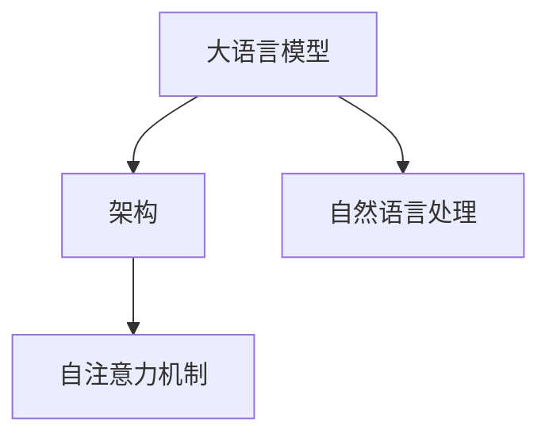
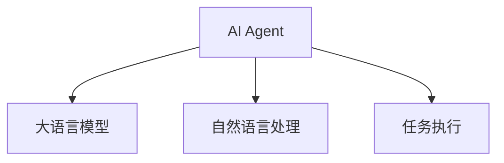
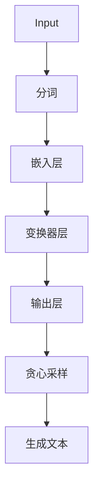
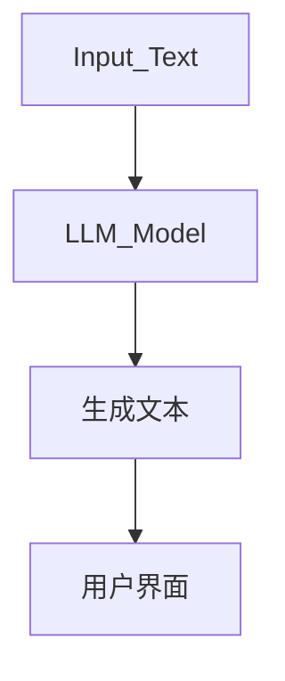
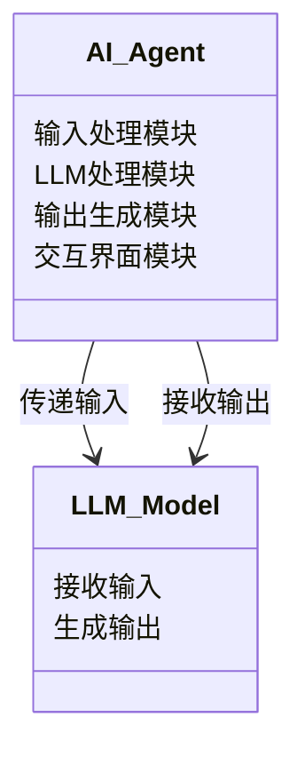
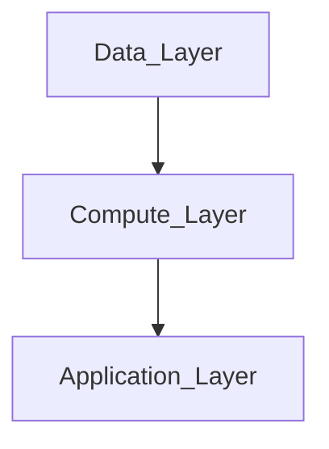
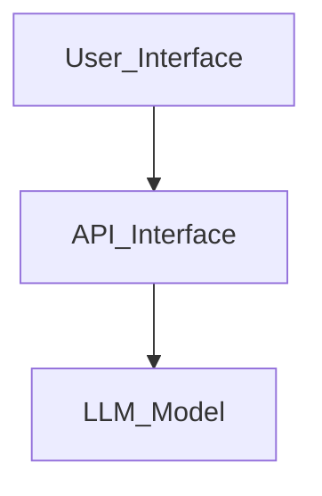
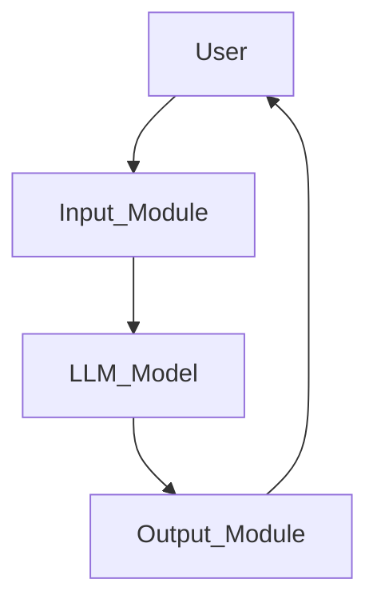

                 


# LLM驱动的AI Agent文本蕴含生成

> **关键词**：LLM、AI Agent、文本蕴含、自然语言处理、人工智能代理、大语言模型  
>
> **摘要**：本文深入探讨了如何利用大语言模型（LLM）驱动人工智能代理（AI Agent）进行文本蕴含生成。通过分析LLM与AI Agent的核心原理、算法实现、系统架构及实际应用场景，本文为读者提供了从理论到实践的全面指导。文章首先介绍了LLM和AI Agent的基本概念，随后详细阐述了文本蕴含生成的算法原理，包括模型训练、推理过程及具体实现方法。接着，从系统架构的角度，讨论了构建LLM驱动的AI Agent系统的功能设计、架构设计、接口设计及交互流程。通过一个具体的项目实战案例，展示了如何在实际应用中实现文本蕴含生成。最后，本文总结了当前技术的优势与挑战，并展望了未来的发展方向。

---

# 第一部分: LLM与AI Agent基础

## 第1章: LLM与AI Agent概述

### 1.1 LLM与AI Agent的基本概念

#### 1.1.1 大语言模型（LLM）的定义

大语言模型（Large Language Model, LLM）是一种基于深度学习的自然语言处理模型，通常采用Transformer架构，通过大量真实文本数据进行预训练，能够理解并生成人类语言。LLM的核心在于其庞大的参数量和强大的上下文理解能力，使其在多种任务中表现出色，如文本生成、问答系统、机器翻译等。

**关键术语对比表：**

| 概念          | 描述                                                                 |
|---------------|----------------------------------------------------------------------|
| LLM           | 基于深度学习的大规模语言模型，参数量通常超过 billions。               |
| Transformer    | 一种基于自注意力机制的神经网络架构，广泛应用于NLP任务。             |
| 自然语言处理  | 通过计算机对人类语言进行理解、分析和生成的理论与技术。               |

**ER实体关系图：**



#### 1.1.2 AI Agent的概念与特点

AI Agent（人工智能代理）是一种智能系统，能够感知环境、理解用户需求并执行任务。AI Agent的核心是具备自主性、反应性、目标导向和学习能力。通过LLM的自然语言处理能力，AI Agent能够与人类进行高效交互，理解用户意图并生成相应的文本内容。

**AI Agent的特点对比表：**

| 特性          | 描述                                                                 |
|---------------|----------------------------------------------------------------------|
| 自主性        | Agent能够独立决策并执行任务，无需外部干预。                           |
| 反应性        | Agent能够实时感知环境并做出反应，如对话中的实时反馈。                 |
| 目标导向      | Agent的行为以实现特定目标为导向，如完成用户查询或解决问题。           |
| 学习能力      | Agent能够通过经验或数据进行优化和改进，提升性能。                     |

**实体关系图：**



#### 1.1.3 LLM驱动AI Agent的核心要素

LLM驱动的AI Agent结合了大语言模型的自然语言理解和生成能力，以及AI Agent的自主决策和目标导向特性。核心要素包括：

1. **LLM的自然语言处理能力**：通过预训练掌握多种语言任务。
2. **AI Agent的行为决策机制**：基于用户输入生成合适的回应。
3. **交互界面**：提供用户与AI Agent交互的接口，如文本框或语音输入。

---

### 1.2 技术背景与应用前景

#### 1.2.1 当前AI技术的发展趋势

人工智能技术的快速发展，尤其是在自然语言处理领域，使得AI Agent的应用场景日益广泛。LLM的出现，如GPT-3、PaLM等，为AI Agent提供了强大的文本理解和生成能力，使其能够更自然地与人类交互。

#### 1.2.2 LLM在AI Agent中的作用

LLM作为AI Agent的核心模块，负责理解用户输入、生成回复，并提供决策支持。通过LLM的文本生成能力，AI Agent能够执行复杂的任务，如信息查询、对话生成、内容创作等。

#### 1.2.3 AI Agent的潜在应用场景

AI Agent的应用场景包括智能客服、智能助手、教育辅助、医疗咨询等。随着技术的进步，AI Agent将能够处理更复杂的任务，提供更智能化的服务。

---

## 第2章: 文本蕴含生成的算法原理

### 2.1 LLM的训练与推理过程

#### 2.1.1 LLM的训练目标函数

大语言模型的训练目标是通过最小化损失函数来优化模型参数。常用的损失函数包括交叉熵损失，其数学表达式为：

$$
\text{Loss} = -\frac{1}{N}\sum_{i=1}^{N} \sum_{j=1}^{M} y_{i,j} \log p(y_{i,j}|x_i)
$$

其中，$N$ 是训练样本的数量，$M$ 是每个样本的序列长度，$y_{i,j}$ 是标签，$p(y_{i,j}|x_i)$ 是模型在给定输入$x_i$下生成$y_{i,j}$的概率。

#### 2.1.2 LLM的推理过程

在生成文本时，模型通常采用贪心算法或蒙特卡洛采样方法。贪心算法选择在每个时间步概率最高的词，而蒙特卡洛采样则生成多个可能的序列，选择最合适的输出。

**LLM推理过程的mermaid图：**



### 2.2 文本蕴含生成的实现

#### 2.2.1 文本蕴含的定义与目标

文本蕴含是指从一段文本中推断出隐含的信息或生成相关的内容。LLM通过理解和生成文本，能够实现文本蕴含生成的任务。

#### 2.2.2 文本蕴含生成的算法实现

文本蕴含生成的关键在于模型对上下文的理解和生成能力。通过LLM的解码器，模型能够生成与输入文本相关的输出内容。

**文本蕴含生成的mermaid图：**



---

## 第3章: 系统架构设计

### 3.1 系统功能设计

#### 3.1.1 系统功能模块

LLM驱动的AI Agent系统通常包含以下几个功能模块：

1. **输入处理模块**：接收用户的输入，如文本或语音。
2. **LLM处理模块**：将输入传递给LLM进行处理。
3. **输出生成模块**：根据LLM的输出生成最终的文本内容。
4. **交互界面模块**：提供用户与系统交互的界面。

**系统功能模块的mermaid类图：**



### 3.2 系统架构设计

#### 3.2.1 系统架构设计

系统架构通常采用分层设计，包括数据层、计算层和应用层。数据层负责数据的存储和管理，计算层负责LLM的训练和推理，应用层负责与用户的交互。

**系统架构的mermaid图：**



#### 3.2.2 系统接口设计

系统接口主要分为用户接口和API接口。用户接口用于用户与系统的交互，API接口用于与其他系统的集成。

**系统接口的mermaid图：**



#### 3.2.3 系统交互流程

系统交互流程包括用户输入、模型处理和生成输出三个主要步骤。用户通过输入模块提交请求，模型处理后生成输出，最后通过输出模块返回结果。

**系统交互流程的mermaid图：**



---

## 第4章: 项目实战

### 4.1 项目背景与目标

#### 4.1.1 项目背景

本项目旨在开发一个基于LLM的AI Agent，用于智能客服场景，能够自动理解和生成用户对话内容。

#### 4.1.2 项目目标

通过本项目，读者能够掌握如何利用LLM驱动AI Agent进行文本蕴含生成，实现一个简单的智能客服系统。

### 4.2 项目实现

#### 4.2.1 环境搭建

项目需要以下环境：

1. Python 3.8+
2. PyTorch或TensorFlow
3. Hugging Face Transformers库

安装命令：

```bash
pip install torch transformers
```

#### 4.2.2 核心代码实现

以下是项目的实现代码：

```python
from transformers import GPT2LMHeadModel, GPT2Tokenizer

# 初始化模型和分词器
model_name = 'gpt2'
tokenizer = GPT2Tokenizer.from_pretrained(model_name)
model = GPT2LMHeadModel.from_pretrained(model_name)

# 定义生成函数
def generate_text(prompt, max_length=50):
    inputs = tokenizer.encode(prompt, return_tensors='pt')
    outputs = model.generate(inputs, max_length=max_length, do_sample=True)
    return tokenizer.decode(outputs[0], skip_special_tokens=True)

# 示例输入
prompt = "请描述一下人工智能的基本概念。"
result = generate_text(prompt)
print(result)
```

### 4.3 项目案例分析

#### 4.3.1 案例分析

通过上述代码，我们可以生成与输入文本相关的文本内容。例如，输入“请描述一下人工智能的基本概念。”，模型将生成一段关于人工智能的介绍。

### 4.4 项目总结

通过本项目，我们成功实现了基于LLM的AI Agent文本蕴含生成，验证了LLM在实际应用中的强大能力。读者可以根据需要扩展功能，如多轮对话、复杂任务处理等。

---

## 第5章: 高级主题与最佳实践

### 5.1 模型调优与优化

#### 5.1.1 参数调优

通过调整模型的超参数，如学习率、批量大小、生成长度等，可以提升生成结果的质量。

#### 5.1.2 模型压缩与优化

对于资源受限的场景，可以通过模型剪枝、蒸馏等技术进行模型压缩，降低计算资源消耗。

### 5.2 多模态应用

#### 5.2.1 视觉与语言的结合

通过结合视觉信息，如图像、视频等，可以提升AI Agent的理解和生成能力。

#### 5.2.2 听觉与语言的结合

通过结合语音识别和语音合成技术，可以实现更自然的语音交互。

### 5.3 伦理与安全

#### 5.3.1 生成内容的伦理问题

生成的内容需符合法律法规和道德规范，避免生成有害信息。

#### 5.3.2 模型的安全性

防止模型被恶意攻击或滥用，确保模型的安全性和稳定性。

### 5.4 开发中的注意事项

#### 5.4.1 数据质量

确保训练数据的质量和多样性，避免偏见和错误信息的传播。

#### 5.4.2 计算资源

根据需求选择合适的计算资源，如GPU加速、分布式训练等。

---

## 第6章: 总结与展望

### 6.1 总结

本文详细探讨了LLM驱动的AI Agent文本蕴含生成的实现方法，从基础概念到系统架构，再到项目实战，为读者提供了全面的知识体系。通过本文的学习，读者能够掌握如何利用LLM构建智能文本生成系统。

### 6.2 展望

随着AI技术的不断发展，LLM驱动的AI Agent将在更多领域得到应用。未来的研究方向包括模型的可解释性、多模态交互、伦理安全等。通过持续的技术创新，LLM驱动的AI Agent将为人类带来更智能、更高效的服务。

---

# 作者：AI天才研究院/AI Genius Institute & 禅与计算机程序设计艺术 /Zen And The Art of Computer Programming

---

**注**：本文旨在通过逐步分析和详细讲解，帮助读者全面理解LLM驱动的AI Agent文本蕴含生成的技术原理和实现方法。希望本文能为相关领域的研究和实践提供有价值的参考。

