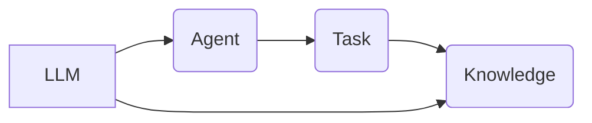
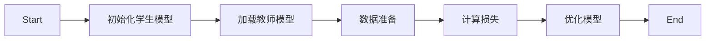
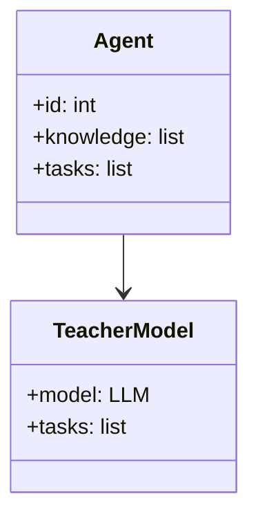
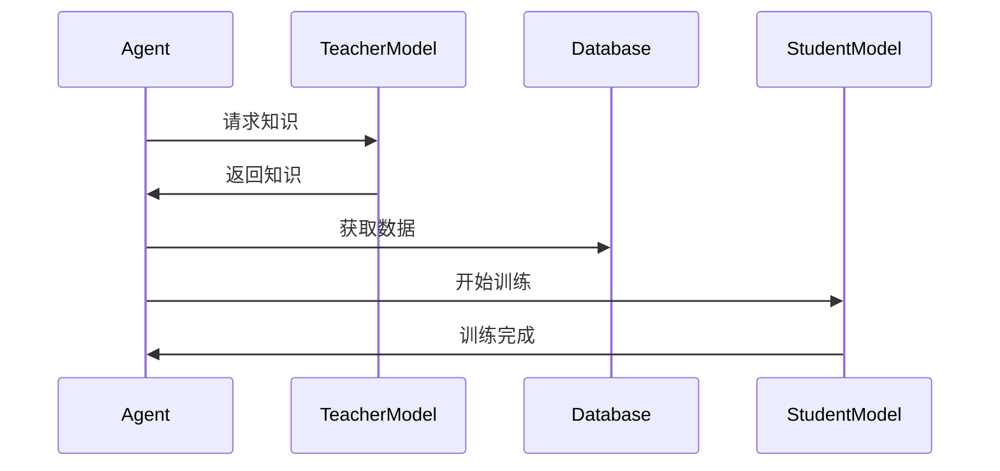

                 


# LLM驱动的AI Agent知识蒸馏技术

> 关键词：LLM，AI Agent，知识蒸馏，机器学习，人工智能

> 摘要：本文深入探讨了LLM驱动的AI Agent知识蒸馏技术，从背景、核心概念、算法原理到系统架构设计，结合实际案例，详细讲解了如何通过知识蒸馏技术优化AI Agent的性能和效率。

---

# 第一部分: LLM驱动的AI Agent知识蒸馏技术背景与基础

## 第1章: 问题背景与问题描述

### 1.1 问题背景
#### 1.1.1 大语言模型（LLM）的发展现状
近年来，大语言模型（LLM）如GPT-3、GPT-4等取得了显著进展，但在实际应用中，模型的体积和计算成本过高，限制了其在资源受限环境中的应用。

#### 1.1.2 AI Agent的定义与应用场景
AI Agent是一种能够感知环境、执行任务并做出决策的智能实体，广泛应用于自动化系统、智能助手、推荐系统等领域。

#### 1.1.3 知识蒸馏技术的背景与意义
知识蒸馏技术通过将大型模型的知识迁移到小型模型，解决了模型压缩和效率提升的问题，同时降低了计算成本。

### 1.2 问题描述
#### 1.2.1 LLM驱动的AI Agent的核心挑战
如何在保持性能的同时，将LLM的知识高效地迁移到AI Agent中，是当前面临的主要挑战。

#### 1.2.2 知识蒸馏技术的目标与边界
目标是通过蒸馏过程，将教师模型的知识迁移到学生模型，边界的确定包括数据选择和蒸馏策略。

#### 1.2.3 技术实现的难点与关键点
难点在于如何设计高效的蒸馏策略和优化算法，关键点在于平衡教师和学生模型的差异。

### 1.3 问题解决思路
#### 1.3.1 知识蒸馏技术的基本原理
通过教师模型的指导，学生模型学习其决策过程，实现知识迁移。

#### 1.3.2 LLM与AI Agent的结合方式
LLM作为教师模型，AI Agent作为学生模型，通过蒸馏技术实现知识传递。

#### 1.3.3 技术实现的总体框架
包括数据准备、教师模型选择、蒸馏策略设计、优化算法选择等步骤。

### 1.4 本章小结
本章介绍了LLM驱动的AI Agent知识蒸馏技术的背景、问题描述和解决思路，为后续内容奠定了基础。

---

# 第二部分: 核心概念与原理

## 第2章: 知识蒸馏技术的核心概念

### 2.1 核心概念原理
#### 2.1.1 知识蒸馏的定义与核心要素
知识蒸馏是通过教师模型的指导，将知识迁移到学生模型的过程，核心要素包括教师模型、学生模型和蒸馏策略。

#### 2.1.2 LLM在知识蒸馏中的角色
LLM作为教师模型，提供高质量的知识和决策支持。

#### 2.1.3 AI Agent的知识表示与传递机制
知识表示采用符号化或向量表示，传递机制通过蒸馏过程实现。

### 2.2 核心概念对比分析
#### 2.2.1 知识蒸馏与模型压缩的对比
知识蒸馏注重知识传递，模型压缩注重减少模型大小。

#### 2.2.2 知识蒸馏与模型迁移的对比
知识蒸馏适用于不同模型间的知识传递，模型迁移适用于任务间的适应。

#### 2.2.3 知识蒸馏与模型微调的对比
知识蒸馏通过教师模型指导，模型微调通过数据微调。

### 2.3 实体关系图（ER图）


### 2.4 本章小结
本章详细阐述了知识蒸馏技术的核心概念和相关对比，帮助读者理解其在LLM驱动的AI Agent中的应用。

---

# 第三部分: 算法原理与实现

## 第3章: 知识蒸馏算法原理

### 3.1 算法原理概述
#### 3.1.1 知识蒸馏的基本流程
数据准备 -> 教师模型生成伪标签 -> 学生模型学习 -> 蒸馏损失计算 -> 模型优化。

#### 3.1.2 LLM驱动的蒸馏过程
教师模型提供软标签，学生模型通过KL散度优化。

#### 3.1.3 AI Agent的知识更新机制
通过持续蒸馏，保持知识的更新和优化。

### 3.2 算法实现流程


### 3.3 数学模型与公式
#### 3.3.1 损失函数
$$L = \alpha L_{KL} + (1-\alpha)L_{CE}$$
其中，$L_{KL}$是KL散度，$L_{CE}$是交叉熵损失，$\alpha$是平衡系数。

#### 3.3.2 优化过程
$$\theta_{new} = \theta_{old} - \eta \cdot \nabla_{\theta} L$$
其中，$\theta$是模型参数，$\eta$是学习率。

### 3.4 代码实现示例
```python
import torch
import torch.nn as nn
import torch.optim as optim

class StudentModel(nn.Module):
    def __init__(self):
        super().__init__()
        self.fc = nn.Linear(100, 10)

def train_step(student, teacher, dataloader, alpha=0.5, epochs=10):
    criterion = nn.KLDivLoss(reduction='batchmean')
    optimizer = optim.Adam(student.parameters())
    for epoch in range(epochs):
        for inputs, labels in dataloader:
            optimizer.zero_grad()
            with torch.no_grad():
                teacher_outputs = teacher(inputs)
            student_outputs = student(inputs)
            loss_kl = criterion(student_outputs, teacher_outputs)
            loss_ce = nn.CrossEntropyLoss()(student_outputs, labels)
            loss = alpha * loss_kl + (1 - alpha) * loss_ce
            loss.backward()
            optimizer.step()
    return student

# 示例使用
teacher = torch.hub.load('...', 'teacher_model')
student = StudentModel()
dataloader = ...  # 数据加载器
student = train_step(student, teacher, dataloader, alpha=0.5, epochs=10)
```

### 3.5 本章小结
本章详细讲解了知识蒸馏的算法原理，包括流程、数学模型和代码实现，帮助读者理解技术细节。

---

# 第四部分: 系统分析与架构设计

## 第4章: 系统分析与架构设计

### 4.1 系统分析
#### 4.1.1 问题场景介绍
描述一个需要知识蒸馏的AI Agent系统，例如智能客服。

#### 4.1.2 项目介绍
本项目旨在通过知识蒸馏优化AI Agent的性能，降低计算成本。

### 4.2 系统功能设计
#### 4.2.1 领域模型


#### 4.2.2 系统架构设计
```mermaid
graph LR
    Agent --> [请求] TeacherModel
    TeacherModel --> [响应] Agent
    Agent --> [数据] Database
```

### 4.3 系统接口设计
#### 4.3.1 教师模型接口
```python
def get_teacher_output(input):
    return teacher_model(input)
```

#### 4.3.2 学生模型接口
```python
def train_student(student, dataloader, alpha=0.5, epochs=10):
    return train_step(student, teacher, dataloader, alpha, epochs)
```

### 4.4 系统交互流程


### 4.5 本章小结
本章通过系统分析与架构设计，展示了知识蒸馏技术在实际系统中的应用。

---

# 第五部分: 项目实战

## 第5章: 项目实战

### 5.1 项目环境与工具安装
安装必要的库：
```bash
pip install torch transformers mermaid4jupyter
```

### 5.2 项目核心代码实现
```python
import torch
from transformers import AutoModelForSequenceClassification, AutoTokenizer

def train_student(student, teacher, dataloader, alpha=0.5, epochs=10):
    # 实现训练过程
    pass

# 示例使用
teacher_model = AutoModelForSequenceClassification.from_pretrained('bert-base')
teacher_tokenizer = AutoTokenizer.from_pretrained('bert-base')
student_model = AutoModelForSequenceClassification.from_pretrained('bert-base')
dataloader = ...  # 数据加载器
student_model = train_student(student_model, teacher_model, dataloader, alpha=0.5, epochs=10)
```

### 5.3 代码解读与分析
详细解读代码结构和关键部分，说明每个步骤的作用和优化点。

### 5.4 案例分析与结果展示
通过实际案例展示训练结果，对比蒸馏前后的模型性能。

### 5.5 本章小结
本章通过实际项目，展示了知识蒸馏技术的应用，帮助读者理解理论与实践的结合。

---

# 第六部分: 最佳实践与总结

## 第6章: 最佳实践与总结

### 6.1 最佳实践
#### 6.1.1 技术实现上的注意事项
确保数据质量，选择合适的蒸馏策略。

#### 6.1.2 项目部署中的注意事项
优化计算资源，确保模型的高效运行。

### 6.2 经验总结与不足
总结项目中的经验和不足，提出改进建议。

### 6.3 未来展望
展望知识蒸馏技术的发展方向，如多教师蒸馏、动态蒸馏等。

### 6.4 本章小结
本章通过总结和展望，为读者提供了知识蒸馏技术的应用建议和未来方向。

---

# 作者

作者：AI天才研究院/AI Genius Institute & 禅与计算机程序设计艺术 /Zen And The Art of Computer Programming

