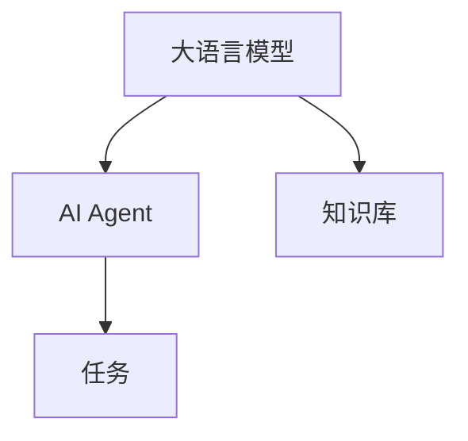
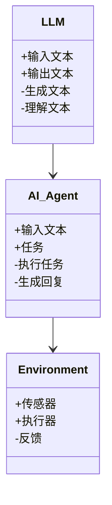
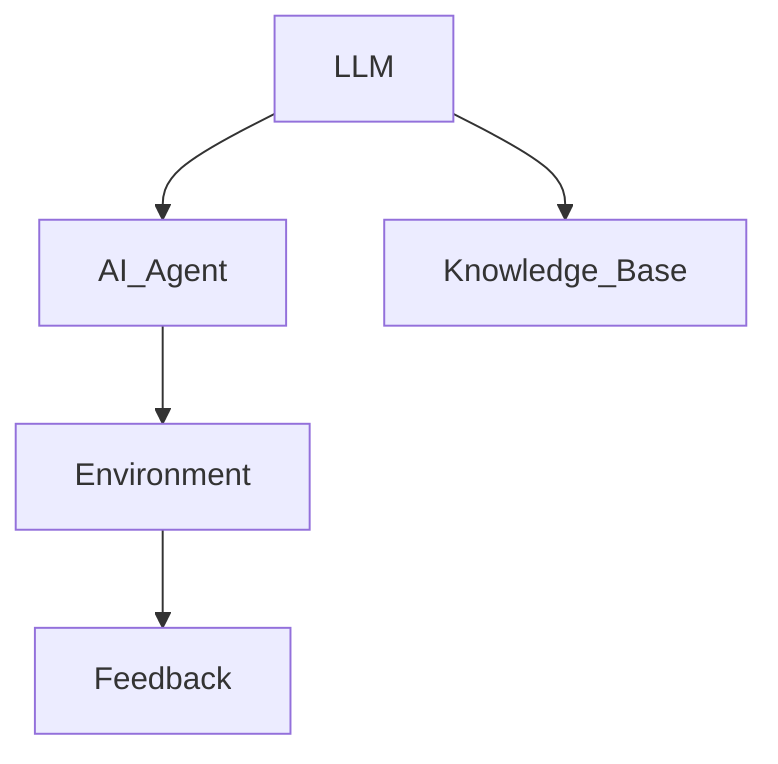
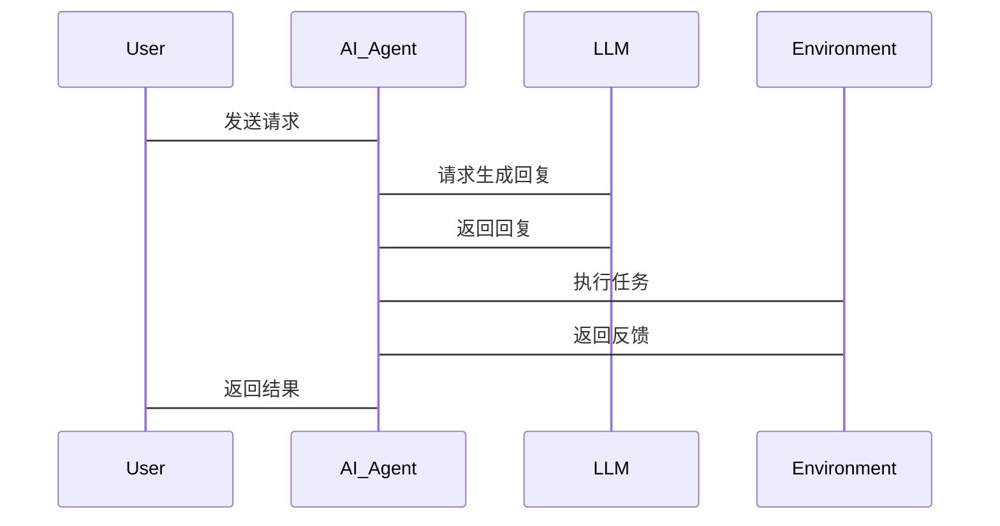

                 


# LLM驱动的AI Agent自然语言生成优化

## 关键词：LLM, AI Agent, 自然语言生成, 优化, 人工智能, 大语言模型, 智能体

## 摘要：  
随着大语言模型（LLM）的快速发展，AI Agent（人工智能代理）在自然语言生成（Natural Language Generation, NLG）领域展现出巨大的潜力。本文深入探讨了如何利用LLM优化AI Agent的自然语言生成能力，分析了LLM在AI Agent中的角色、工作原理以及优化策略。通过结合算法原理、系统架构和实际案例，本文为读者提供了全面的技术指导，帮助他们理解并应用LLM驱动的AI Agent来提升自然语言生成的效果。

---

# 第1章: LLM与AI Agent概述

## 1.1 LLM的基本概念与特点  
大语言模型（LLM）是一种基于深度学习的自然语言处理模型，具有以下特点：  
1. **大规模训练数据**：通常使用数百万甚至数十亿的文本数据进行训练，能够理解复杂的语言模式。  
2. **生成能力**：通过解码器结构，LLM可以生成连贯且符合语境的文本。  
3. **多任务能力**：LLM经过预训练，可以在多种任务（如翻译、问答、文本摘要）上表现优异。  
4. **上下文理解**：通过自注意力机制，LLM能够捕捉文本中的上下文信息，理解语义关联。  

### 1.1.1 LLM的核心特点总结  
- **大规模预训练**：利用海量数据进行无监督学习，提取语言特征。  
- **自注意力机制**：通过自注意力机制，模型可以理解长距离依赖关系。  
- **生成与理解的统一**：同一模型可以用于生成和理解任务。  

## 1.2 AI Agent的基本概念与特点  
AI Agent是一种智能代理，能够感知环境、执行任务并做出决策。其核心特点包括：  
1. **自主性**：AI Agent能够在没有外部干预的情况下自主运作。  
2. **反应性**：能够根据环境反馈实时调整行为。  
3. **目标导向**：通过设定目标，AI Agent可以有条不紊地完成任务。  
4. **学习能力**：通过与环境交互，AI Agent可以不断优化自身的策略。  

### 1.2.1 AI Agent的核心功能总结  
- **感知环境**：通过传感器或接口获取环境信息。  
- **决策制定**：基于当前状态和目标，选择最优动作。  
- **执行动作**：根据决策结果执行具体操作。  
- **学习优化**：通过强化学习等方法，优化决策策略。  

## 1.3 LLM驱动的AI Agent的优势  
LLM与AI Agent的结合为自然语言生成带来了显著优势：  
1. **提升生成质量**：LLM的强大生成能力使得AI Agent的输出更加自然和准确。  
2. **增强交互体验**：通过理解用户意图，AI Agent可以提供更个性化的服务。  
3. **降低开发复杂度**：LLM的通用性减少了AI Agent开发中的复杂性。  

### 1.3.1 提高自然语言理解能力  
- LLM通过预训练掌握了丰富的语言知识，能够帮助AI Agent更好地理解用户输入。  
- 例如，当用户输入“我需要一个意大利餐厅”，LLM能够理解隐含的“附近”条件，并建议合适的餐厅。  

### 1.3.2 增强生成能力  
- LLM生成文本的能力使得AI Agent的输出更加流畅和自然。  
- 例如，在客服场景中，LLM可以帮助AI Agent生成礼貌且专业的回复。  

### 1.3.3 提升交互体验  
- 通过结合LLM的生成能力和AI Agent的任务执行能力，用户可以获得更高效的交互体验。  
- 例如，在智能音箱中，用户可以通过对话与AI Agent互动，完成播放音乐、设置提醒等任务。  

## 1.4 本章小结  
本章介绍了LLM和AI Agent的基本概念及其特点，并重点阐述了LLM驱动的AI Agent的优势。通过LLM的强大生成能力和AI Agent的任务执行能力的结合，可以显著提升自然语言生成的效果和交互体验。  

---

# 第2章: LLM与AI Agent的关系

## 2.1 LLM在AI Agent中的角色  
LLM在AI Agent中扮演着多重角色：  
1. **知识库**：LLM经过海量数据训练，可以作为AI Agent的知识库，提供信息检索支持。  
2. **对话生成器**：LLM可以生成自然的对话文本，帮助AI Agent与用户交互。  
3. **决策支持工具**：LLM可以分析上下文，为AI Agent的决策提供支持。  

### 2.1.1 LLM作为知识库  
- LLM通过预训练掌握了大量知识，可以快速回答用户的问题。  
- 例如，当用户询问“如何制作蛋糕”，LLM可以生成详细的步骤说明。  

### 2.1.2 LLM作为对话生成器  
- LLM通过解码器生成自然的对话文本，使得AI Agent的回复更加人性化。  
- 例如，在智能客服场景中，LLM可以帮助生成礼貌且专业的回复。  

### 2.1.3 LLM作为决策支持工具  
- LLM可以分析用户意图，为AI Agent的决策提供支持。  
- 例如，当用户输入“我需要一个意大利餐厅”，LLM可以理解用户的意图，并建议附近的餐厅。  

## 2.2 LLM与AI Agent的协同工作原理  
LLM与AI Agent的协同工作主要体现在以下几个方面：  
1. **输入处理**：AI Agent接收用户的输入，并将其传递给LLM进行理解。  
2. **内部处理**：LLM生成初步的回复或决策建议，AI Agent根据建议执行任务。  
3. **输出生成**：AI Agent将任务执行结果反馈给LLM，生成最终的输出文本。  

### 2.2.1 输入处理流程  
- 用户输入：例如，“我需要一个意大利餐厅”。  
- LLM理解：LLM分析用户需求，理解用户需要意大利餐厅的位置。  
- 决策建议：LLM建议附近的意大利餐厅列表。  

### 2.2.2 内部处理流程  
- AI Agent接收用户的输入，解析需求。  
- 将需求传递给LLM，LLM生成餐厅列表。  
- AI Agent根据餐厅列表选择最优餐厅。  

### 2.2.3 输出生成流程  
- AI Agent执行任务，例如查询附近的意大利餐厅。  
- LLM根据任务结果生成回复文本，例如，“以下是附近三家意大利餐厅的推荐：...”。  

## 2.3 核心概念对比表  
以下是LLM与AI Agent的核心概念对比：  

| 比较维度 | LLM | AI Agent |  
|----------|-----|----------|  
| 核心功能 | 生成文本 | 执行任务 |  
| 输入 | 文本 | 文本+任务 |  
| 输出 | 文本 | 动作/结果 |  
| 应用场景 | 翻译、问答、生成 | 交互、决策、执行 |  

## 2.4 实体关系图  
以下是LLM与AI Agent的实体关系图：  



---

# 第3章: LLM驱动的AI Agent算法原理

## 3.1 LLM的算法流程  
LLM的算法流程主要包括以下步骤：  
1. **输入处理**：将输入文本转换为模型可处理的格式。  
2. **编码器处理**：编码器将输入文本转换为上下文表示。  
3. **解码器生成**：解码器根据上下文生成输出文本。  

### 3.1.1 LLM的编码器结构  
- LLM的编码器通常采用自注意力机制，能够捕捉输入文本中的长距离依赖关系。  
- 例如，使用Transformer的编码器结构，通过多头自注意力机制提取文本特征。  

### 3.1.2 LLM的解码器结构  
- LLM的解码器通过自注意力机制生成文本，同时利用交叉注意力机制与编码器的输出交互。  
- 例如，使用Transformer的解码器结构，通过位置前馈网络生成输出。  

## 3.2 AI Agent的算法流程  
AI Agent的算法流程主要包括以下步骤：  
1. **感知环境**：通过传感器或接口获取环境信息。  
2. **决策制定**：基于当前状态和目标，选择最优动作。  
3. **执行动作**：根据决策结果执行具体操作。  
4. **反馈学习**：通过环境反馈优化决策策略。  

### 3.2.1 AI Agent的决策算法  
- AI Agent的决策算法通常采用马尔可夫决策过程（MDP）模型，基于当前状态选择最优动作。  
- 例如，使用Q-learning算法，通过强化学习优化决策策略。  

## 3.3 LLM与AI Agent的协同算法  
LLM与AI Agent的协同算法主要包括以下步骤：  
1. **输入解析**：AI Agent解析用户输入，并将其传递给LLM。  
2. **生成回复**：LLM根据输入生成回复文本。  
3. **任务执行**：AI Agent根据回复结果执行任务。  
4. **反馈优化**：通过用户反馈优化LLM和AI Agent的生成和决策策略。  

### 3.3.1 输入解析流程  
- 用户输入：例如，“我需要一个意大利餐厅”。  
- AI Agent解析：理解用户需求，提取关键信息（如“意大利餐厅”）。  

### 3.3.2 生成回复流程  
- LLM生成回复：例如，“以下是附近的意大利餐厅推荐：...”。  
- AI Agent根据回复结果执行任务，例如查询餐厅位置。  

### 3.3.3 任务执行流程  
- AI Agent执行任务，例如查询附近的意大利餐厅。  
- LLM根据任务结果生成最终回复。  

---

# 第4章: LLM驱动的AI Agent系统架构设计

## 4.1 系统应用场景  
LLM驱动的AI Agent系统可以应用于多种场景，例如：  
1. **智能客服**：通过对话生成和任务执行，为用户提供服务。  
2. **智能音箱**：通过语音交互，帮助用户完成各种任务。  
3. **智能助手**：通过自然语言交互，帮助用户完成日程管理、信息查询等任务。  

## 4.2 系统功能设计  
以下是系统的功能模型：  



## 4.3 系统架构设计  
以下是系统的架构图：  



## 4.4 接口设计  
系统的接口设计主要包括以下内容：  
1. **输入接口**：接收用户的输入文本和任务需求。  
2. **输出接口**：生成回复文本或执行任务的结果。  
3. **反馈接口**：接收用户的反馈，优化系统性能。  

## 4.5 交互流程设计  
以下是系统的交互流程图：  



---

# 第5章: LLM驱动的AI Agent项目实战

## 5.1 环境安装与配置  
以下是项目环境的安装与配置步骤：  
1. **安装Python**：确保Python版本为3.8以上。  
2. **安装LLM框架**：例如，安装Hugging Face的Transformers库。  
3. **安装AI Agent框架**：例如，安装Rasa框架。  
4. **安装其他依赖**：根据具体需求安装相关库。  

## 5.2 核心代码实现  
以下是项目的核心代码实现：  

```python
from transformers import pipeline

# 初始化LLM管道
llm_pipeline = pipeline('text-generation', model='gpt2')

# AI Agent的核心逻辑
class AI_Agent:
    def __init__(self):
        self.llm_pipeline = llm_pipeline

    def generate_response(self, input_text):
        response = self.llm_pipeline(input_text)[0]['generated_text']
        return response

    def execute_task(self, task):
        # 具体任务执行逻辑
        pass

# 示例用法
agent = AI_Agent()
response = agent.generate_response("我需要一个意大利餐厅。")
print(response)
```

## 5.3 代码应用解读与分析  
1. **LLM管道初始化**：使用Hugging Face的Transformers库，初始化文本生成管道。  
2. **AI Agent类定义**：定义AI Agent类，包含生成回复和执行任务的方法。  
3. **生成回复方法**：调用LLM生成回复文本。  
4. **执行任务方法**：具体任务执行逻辑，根据实际需求实现。  

## 5.4 案例分析与详细讲解  
以下是项目的实际案例分析：  
1. **项目目标**：设计一个智能客服系统，帮助用户查询附近的意大利餐厅。  
2. **项目实现**：通过LLM生成回复，AI Agent执行任务，查询附近的意大利餐厅。  
3. **案例总结**：通过LLM的强大生成能力和AI Agent的任务执行能力，系统能够高效地完成用户需求。  

## 5.5 项目小结  
本章通过实际案例，详细讲解了如何利用LLM驱动的AI Agent实现自然语言生成优化。通过环境安装、代码实现和案例分析，读者可以深入了解项目的具体实现过程和优化策略。  

---

# 第6章: 最佳实践与小结

## 6.1 最佳实践  
1. **选择合适的LLM模型**：根据具体需求选择适合的LLM模型，例如GPT-3、GPT-4等。  
2. **优化系统架构**：设计合理的系统架构，确保系统的高效性和可扩展性。  
3. **加强反馈机制**：通过用户反馈不断优化系统的生成和决策能力。  
4. **关注模型的可解释性**：确保模型的决策过程可解释，避免“黑箱”问题。  

## 6.2 小结  
本文详细探讨了LLM驱动的AI Agent自然语言生成优化的实现方法，从核心概念、算法原理到系统架构和项目实战，为读者提供了全面的技术指导。通过本文的学习，读者可以深入了解如何利用LLM优化AI Agent的自然语言生成能力，并在实际项目中应用相关技术。

## 6.3 注意事项  
1. **数据隐私**：在实际应用中，需要注意数据隐私和安全问题。  
2. **模型选择**：选择合适的LLM模型，确保模型的性能和适用性。  
3. **系统优化**：通过优化系统架构和算法，提升系统的运行效率。  
4. **用户体验**：关注用户体验，确保系统的交互流程简洁流畅。  

## 6.4 拓展阅读  
1. **《深度学习》—— Ian Goodfellow  
2. **《机器学习实战》—— 周志华  
3. **《自然语言处理实战》—— 薛昱  

---

# 作者：AI天才研究院/AI Genius Institute & 禅与计算机程序设计艺术/Zen And The Art of Computer Programming

