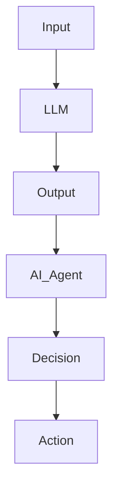

                 


# LLM驱动的AI Agent角色扮演能力增强

> 关键词：LLM，AI Agent，角色扮演，自然语言处理，强化学习，系统架构

> 摘要：本文详细探讨了如何利用大语言模型（LLM）增强AI Agent的角色扮演能力。通过分析LLM与AI Agent的核心概念、算法原理、系统架构以及实际项目案例，本文为读者提供了从理论到实践的全面指导。我们还将讨论角色扮演能力在AI Agent中的重要性，并通过实际案例展示如何构建一个基于LLM的AI Agent系统。

---

# 第一部分: 背景介绍

## 第1章: LLM与AI Agent的基本概念

### 1.1 大语言模型（LLM）的定义

大语言模型（Large Language Model，LLM）是指一种基于深度学习的自然语言处理模型，通常基于Transformer架构，能够处理和生成大量的文本数据。LLM的核心目标是理解和生成人类语言，从而在多种任务中表现出强大的能力，如文本生成、问答、翻译、摘要等。

$$LLM的输入输出关系可以用简单的数学表达式表示：$$

$$输出 = f_{LLM}(输入)$$

其中，$f_{LLM}$表示LLM的处理函数。

### 1.2 AI Agent的基本概念

AI Agent（人工智能代理）是指能够感知环境、自主决策并执行任务的智能实体。AI Agent可以是软件程序、机器人或其他智能设备，其核心能力包括感知、推理、规划和执行。

### 1.3 LLM与AI Agent的关系

LLM作为AI Agent的核心驱动力，为AI Agent提供了强大的自然语言处理能力。通过LLM，AI Agent能够理解用户输入的文本、生成自然的回复，并根据上下文进行推理和决策。

### 1.4 本章小结

本章主要介绍了LLM和AI Agent的基本概念，以及它们之间的关系。通过这些概念，我们可以理解LLM在AI Agent中的重要性。

---

## 第2章: 角色扮演能力在AI Agent中的重要性

### 2.1 角色扮演能力的定义

角色扮演能力是指AI Agent能够模拟和执行特定角色的能力，例如客服代表、教师、医生等。通过角色扮演，AI Agent可以在多种场景中提供个性化的服务。

### 2.2 角色扮演能力对AI Agent价值的影响

角色扮演能力的增强可以显著提升AI Agent的用户体验。通过模拟不同角色，AI Agent可以在特定领域中提供专业化的服务，从而增强用户的信任感和满意度。

### 2.3 LLM在角色扮演能力中的作用

LLM通过其强大的语言理解和生成能力，为AI Agent的角色扮演提供了技术支持。例如，LLM可以帮助AI Agent根据用户的需求生成合适的回复，并根据上下文调整语气和风格。

---

## 第3章: LLM驱动的AI Agent的应用背景

### 3.1 当前AI Agent的发展现状

AI Agent在各个领域中得到了广泛应用，例如智能家居、智能客服、虚拟助手等。然而，传统的AI Agent通常依赖于规则引擎或简单的关键词匹配，难以提供智能化的交互体验。

### 3.2 LLM在AI Agent中的应用优势

与传统AI Agent相比，基于LLM的AI Agent具有以下优势：

1. **强大的自然语言处理能力**：LLM能够理解和生成复杂的文本，支持多轮对话。
2. **自主学习能力**：LLM可以通过大量的数据进行自我优化，不断提升性能。
3. **灵活性**：LLM可以根据不同的场景和需求快速调整其行为。

### 3.3 本章小结

本章主要介绍了当前AI Agent的发展现状以及LLM在其中的应用优势，为后续章节奠定了基础。

---

## 第4章: LLM驱动的AI Agent的核心概念与联系

### 4.1 LLM与AI Agent的核心概念对比

| 概念 | LLM | AI Agent |
|------|------|-----------|
| 核心目标 | 理解和生成语言 | 感知环境、自主决策 |
| 输入 | 文本数据 | 环境信息、用户输入 |
| 输出 | 文本生成 | 行动、响应 |

### 4.2 LLM与AI Agent的联系与区别

- **联系**：LLM为AI Agent提供了强大的语言处理能力，使其能够与用户进行自然交互。
- **区别**：LLM专注于语言处理，而AI Agent注重整体的感知和执行能力。

### 4.3 实体关系图（ER图）


### 4.4 本章小结

本章通过对比分析LLM与AI Agent的核心概念，进一步明确了两者的关系和联系。

---

# 第二部分: LLM驱动的AI Agent的核心算法原理

## 第5章: LLM驱动的AI Agent的算法原理

### 5.1 LLM的核心算法

- **Transformer架构**：LLM通常基于Transformer模型，包括编码器和解码器两部分。
- **注意力机制**：注意力机制帮助模型关注输入中的重要部分，提升文本生成的准确性。

### 5.2 AI Agent的算法原理

- **感知与推理**：AI Agent通过传感器或API获取环境信息，并通过推理模块进行分析。
- **决策与执行**：AI Agent根据推理结果制定行动计划，并通过执行模块完成任务。

### 5.3 LLM驱动的AI Agent的算法流程



### 5.4 本章小结

本章详细介绍了LLM和AI Agent的核心算法原理，为后续章节的系统设计奠定了基础。

---

## 第6章: LLM驱动的AI Agent的系统架构设计

### 6.1 系统功能设计

- **输入处理**：接收用户的输入并进行预处理。
- **LLM调用**：通过API调用LLM进行文本生成。
- **决策与执行**：根据生成的文本制定行动计划并执行。

### 6.2 系统架构图


### 6.3 系统接口设计

- **输入接口**：接收用户的文本输入。
- **输出接口**：返回生成的文本或执行结果。

### 6.4 本章小结

本章通过系统架构设计，详细描述了基于LLM的AI Agent的整体结构和工作流程。

---

## 第7章: LLM驱动的AI Agent的项目实战

### 7.1 环境配置

- **Python环境**：建议使用Python 3.8及以上版本。
- **LLM模型**：可以选择开源的LLM模型，如GPT-2或GPT-3。

### 7.2 核心代码实现

```python
class AI_Agent:
    def __init__(self, llm_api):
        self.llm_api = llm_api
    
    def process_input(self, input_text):
        # 调用LLM进行文本生成
        response = self.llm_api.generate(input_text)
        return response

# 初始化AI Agent
llm_api = LLM_API()
agent = AI_Agent(llm_api)
# 调用角色扮演功能
response = agent.process_input("你是一个医生，诊断我的症状。")
print(response)
```

### 7.3 功能测试与优化

- **功能测试**：测试AI Agent在不同角色下的表现。
- **优化调整**：根据测试结果优化LLM的参数设置。

### 7.4 本章小结

本章通过一个具体的项目案例，展示了如何基于LLM构建一个AI Agent系统，并详细说明了其实现过程。

---

## 第8章: 最佳实践与注意事项

### 8.1 最佳实践

- **数据质量**：确保训练数据的多样性和代表性。
- **模型调优**：根据具体需求调整LLM的参数。
- **用户反馈**：通过用户反馈不断优化AI Agent的表现。

### 8.2 注意事项

- **数据隐私**：注意保护用户的隐私数据。
- **性能优化**：优化系统性能，确保用户体验。

### 8.3 未来展望

随着技术的发展，LLM驱动的AI Agent将在更多领域中得到应用，例如教育、医疗、金融等。

---

## 第9章: 小结与总结

### 9.1 总结

本文详细探讨了如何利用大语言模型（LLM）增强AI Agent的角色扮演能力。通过分析LLM与AI Agent的核心概念、算法原理、系统架构以及实际项目案例，我们为读者提供了从理论到实践的全面指导。

### 9.2 展望

未来，随着LLM技术的不断进步，AI Agent的角色扮演能力将更加智能化和个性化，为人类社会带来更多价值。

---

# 作者：AI天才研究院 & 禅与计算机程序设计艺术

