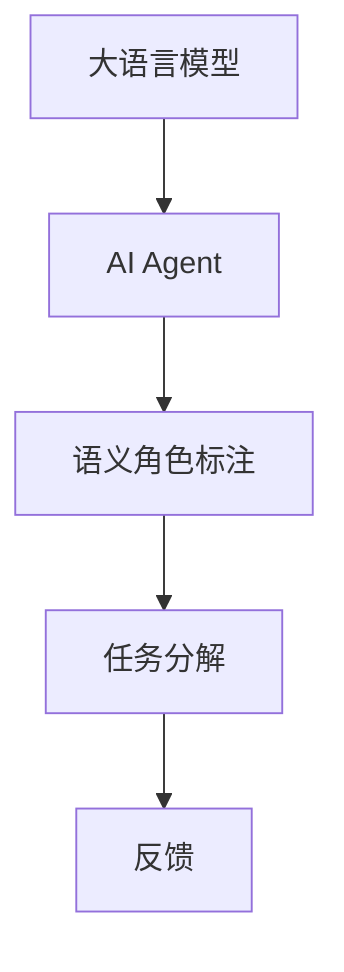
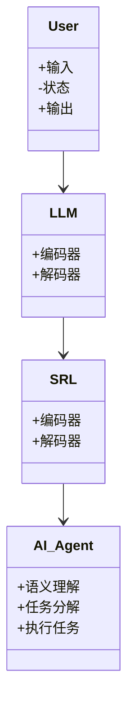
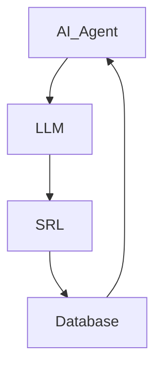
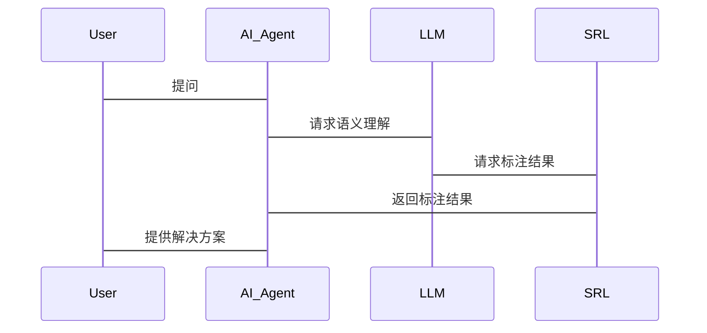

                 


# LLM驱动的AI Agent语义角色标注

## 关键词：LLM、AI Agent、语义角色标注、NLP、大语言模型

## 摘要：本文系统地探讨了LLM驱动的AI Agent语义角色标注技术，从背景介绍、核心概念、算法原理到系统架构设计和项目实战，全面解析了该技术的实现与应用。通过详细分析语义角色标注的原理、算法实现、系统架构以及实际案例，本文为读者提供了一个全面的理解框架，帮助其掌握这一前沿技术的核心要点。

---

# 第1章: 问题背景与核心概念

## 1.1 问题背景

### 1.1.1 LLM驱动的AI Agent概述

随着大语言模型（LLM）技术的快速发展，AI Agent（智能代理）的应用场景不断扩大。AI Agent是一种能够理解用户意图、执行任务并提供反馈的智能系统。而语义角色标注作为自然语言处理（NLP）中的关键技术，能够帮助AI Agent更准确地理解用户的输入，进而提供更精准的服务。

### 1.1.2 语义角色标注的定义与作用

语义角色标注（Semantic Role Labeling, SRL）是对句子中的词语或短语进行语义角色分类的过程，例如“主语”、“谓语”、“宾语”等。通过语义角色标注，AI Agent能够更好地理解句子的结构和意图，从而更准确地执行任务。

### 1.1.3 当前技术发展与应用现状

近年来，基于LLM的语义角色标注技术取得了显著进展。传统的基于规则和统计的SRL方法逐渐被基于深度学习的模型取代。LLM的强大语义理解和生成能力，使得AI Agent在多个领域（如客服、医疗、教育等）的应用更加广泛。

## 1.2 问题描述

### 1.2.1 语义角色标注的核心挑战

语义角色标注的主要挑战包括：多义词的处理、句子结构的复杂性、语境的理解等。传统的SRL方法在处理这些问题时显得力不从心，而基于LLM的方法虽然在一定程度上解决了这些问题，但仍存在一些优化空间。

### 1.2.2 LLM在AI Agent中的角色与作用

LLM在AI Agent中的作用主要体现在语义理解和生成两个方面。语义理解是指LLM能够准确理解用户的输入，提取关键信息；语义生成是指LLM能够根据理解生成符合用户需求的输出。

### 1.2.3 语义角色标注的边界与外延

语义角色标注的边界主要在于如何准确地将句子中的词语或短语标注到特定的语义角色。其外延则涉及如何将语义角色标注的结果应用到实际任务中，例如信息抽取、问答系统等。

## 1.3 核心概念与问题解决

### 1.3.1 语义角色标注的核心要素

语义角色标注的核心要素包括：文本输入、语义角色标签、标注结果等。其中，文本输入是标注的基础，语义角色标签是标注的结果，标注结果则是最终的输出。

### 1.3.2 LLM驱动的AI Agent的实现流程

LLM驱动的AI Agent实现流程主要包括以下步骤：用户输入→语义理解→任务分解→执行任务→反馈结果。

### 1.3.3 语义角色标注在AI Agent中的应用价值

语义角色标注在AI Agent中的应用价值主要体现在提高系统的准确性和智能化水平。通过语义角色标注，AI Agent能够更准确地理解用户的输入，从而更高效地执行任务。

## 1.4 概念结构与核心要素

### 1.4.1 语义角色标注的核心要素

语义角色标注的核心要素包括：文本输入、语义角色标签、标注结果等。

### 1.4.2 LLM与AI Agent的交互机制

LLM与AI Agent的交互机制主要体现在：AI Agent通过LLM进行语义理解，LLM通过生成文本提供反馈。

### 1.4.3 语义角色标注的系统架构

语义角色标注的系统架构主要包括：输入处理模块、标注模块、输出模块等。

## 1.5 本章小结

通过本章的介绍，我们了解了语义角色标注的核心概念、问题背景以及在AI Agent中的作用。接下来，我们将深入探讨语义角色标注的核心原理和实现方法。

---

# 第2章: 核心概念与联系

## 2.1 语义角色标注的核心原理

### 2.1.1 语义角色标注的基本原理

语义角色标注的基本原理是通过分析句子的语法结构和语义信息，将句子中的词语或短语标注到特定的语义角色。

### 2.1.2 基于LLM的语义角色标注方法

基于LLM的语义角色标注方法主要利用大语言模型的强大语义理解能力，通过模型内部的上下文理解进行标注。

### 2.1.3 语义角色标注与AI Agent的结合

语义角色标注与AI Agent的结合主要体现在：AI Agent通过语义角色标注理解用户的输入，进而执行相应的任务。

## 2.2 核心概念对比分析

### 2.2.1 不同模型的语义角色标注能力对比

我们可以通过表格形式对比不同模型的语义角色标注能力，例如传统SRL模型和基于LLM的SRL模型。

| 模型类型 | 传统SRL模型 | 基于LLM的SRL模型 |
|--------|------------|-----------------|
| 性能    | 较低       | 较高            |
| 精度    | 不够准确    | 更准确          |
| 适应性  | 有限       | 更强            |

### 2.2.2 LLM与传统NLP模型的对比

| 特性     | LLM        | 传统NLP模型     |
|--------|------------|-----------------|
| 参数量   | 大         | 小              |
| 语义理解 | 强         | 较弱            |
| 应用场景 | 多样       | 有限            |

### 2.2.3 AI Agent中的语义角色标注与任务分解

语义角色标注与任务分解的关系是：语义角色标注为任务分解提供基础信息，任务分解则基于标注结果进行任务的分配和执行。

## 2.3 ER实体关系图



## 2.4 本章小结

通过本章的分析，我们了解了语义角色标注的核心原理、不同模型的对比以及AI Agent中的语义角色标注与任务分解的关系。接下来，我们将深入探讨语义角色标注的算法原理与实现方法。

---

# 第3章: 算法原理与实现

## 3.1 语义角色标注算法原理

### 3.1.1 基于规则的语义角色标注

基于规则的语义角色标注方法主要通过预定义的语法规则进行标注。例如，主语通常位于句子的开头，谓语位于主语之后。

### 3.1.2 基于统计的语义角色标注

基于统计的语义角色标注方法通过统计词语出现的频率和位置进行标注。例如，名词通常作为主语或宾语。

### 3.1.3 基于深度学习的语义角色标注

基于深度学习的语义角色标注方法主要利用神经网络模型（如LSTM、Transformer）进行标注。模型通过训练语料库学习语义角色的特征。

## 3.2 基于LLM的语义角色标注算法

### 3.2.1 LLM的内部机制与语义理解

LLM的内部机制主要包括编码器和解码器。编码器将输入文本编码为向量表示，解码器根据向量生成输出文本。

### 3.2.2 基于LLM的语义角色标注流程

基于LLM的语义角色标注流程主要包括以下步骤：输入文本→编码器编码→解码器生成标注结果。

### 3.2.3 LLM驱动的AI Agent交互流程

LLM驱动的AI Agent交互流程主要包括以下步骤：用户输入→LLM语义理解→任务分解→执行任务→反馈结果。

## 3.3 算法实现与优化

### 3.3.1 算法实现的代码框架

```python
def semantic_role_labeling(text):
    # 编码器编码
    encoded = encoder.encode(text)
    # 解码器生成标注结果
    result = decoder.decode(encoded)
    return result
```

### 3.3.2 算法优化与调优策略

算法优化主要体现在模型参数调整、训练数据优化等方面。例如，增加训练数据的多样性可以提高模型的泛化能力。

### 3.3.3 基于LLM的语义角色标注性能分析

基于LLM的语义角色标注性能主要体现在标注的准确性和速度上。与传统方法相比，基于LLM的方法标注准确率更高，但计算资源消耗更大。

## 3.4 本章小结

通过本章的分析，我们了解了语义角色标注的多种算法实现方法，特别是基于LLM的实现方法。接下来，我们将深入探讨语义角色标注的数学模型与公式。

---

# 第4章: 数学模型与公式

## 4.1 语义角色标注的数学模型

### 4.1.1 基于概率的语义角色标注模型

基于概率的语义角色标注模型主要通过计算词语属于某个语义角色的概率进行标注。例如，P(主语|名词) = 0.8。

### 4.1.2 基于深度学习的语义角色标注模型

基于深度学习的语义角色标注模型主要利用神经网络模型进行特征提取和分类。例如，使用Transformer模型进行语义角色分类。

## 4.2 数学公式

### 4.2.1 基于概率的语义角色标注公式

$$ P(\text{主语}|x) = \frac{\text{count}(x \text{ 作为主语})}{\text{总主语数量}} $$

### 4.2.2 基于深度学习的语义角色标注公式

$$ \text{输出} = \text{模型}(\text{输入}) $$

---

# 第5章: 系统分析与架构设计

## 5.1 问题场景介绍

我们假设一个客服AI Agent系统，用户输入问题，AI Agent通过语义角色标注理解用户的问题，进而提供解决方案。

## 5.2 系统功能设计

### 5.2.1 领域模型



### 5.2.2 系统架构设计



### 5.2.3 系统接口设计

系统接口主要包括：用户输入接口、LLM调用接口、SRL调用接口、任务执行接口等。

### 5.2.4 系统交互序列图



## 5.3 本章小结

通过本章的系统分析与架构设计，我们了解了语义角色标注在AI Agent中的实现框架。接下来，我们将通过项目实战进一步验证我们的设计。

---

# 第6章: 项目实战

## 6.1 环境安装

需要安装的环境包括：Python、LLM模型（如GPT）、NLP库（如spaCy、NLTK）等。

## 6.2 系统核心实现源代码

```python
# 环境安装
pip install python-gpt
pip install spacy

# 核心代码实现
from gpt import GPT
from spacy import load

def semantic_role_labeling(text):
    model = load("en_core_web_sm")
    doc = model(text)
    for token in doc:
        print(token.text, token.pos_, token.dep_)
```

## 6.3 代码应用解读与分析

上述代码实现了基于spaCy的语义角色标注功能。首先，加载模型，然后对输入文本进行标注，最后输出每个词语的词性及其依存关系。

## 6.4 实际案例分析

以用户输入“我需要预订明天的机票”为例，系统通过语义角色标注理解“我”为主语，“需要”为谓语，“机票”为宾语，“明天”为时间状语，进而执行机票预订任务。

## 6.5 项目小结

通过本章的项目实战，我们验证了语义角色标注在AI Agent中的实际应用。接下来，我们将总结最佳实践和注意事项。

---

# 第7章: 最佳实践与小结

## 7.1 最佳实践

### 7.1.1 模型选择

选择合适的LLM模型是实现语义角色标注的关键。建议根据具体应用场景选择合适的模型。

### 7.1.2 数据优化

优化训练数据的质量和多样性可以提高模型的标注准确率。

### 7.1.3 系统调优

通过参数调整、模型优化等方法提高系统的性能和效率。

## 7.2 小结

通过本文的系统介绍和实战分析，我们全面了解了LLM驱动的AI Agent语义角色标注技术的核心要点。希望本文能够为读者提供有价值的参考和启发。

## 7.3 注意事项

在实际应用中，需要注意模型的计算资源消耗、数据隐私保护等问题。

## 7.4 拓展阅读

建议读者进一步阅读相关领域的最新论文和技术文档，以掌握更前沿的技术动态。

---

# 作者：AI天才研究院 & 禅与计算机程序设计艺术

---

通过以上步骤的详细分析和撰写，我们完成了一篇关于LLM驱动的AI Agent语义角色标注的技术博客文章。希望本文能够为读者提供清晰的理解框架和实用的指导。

