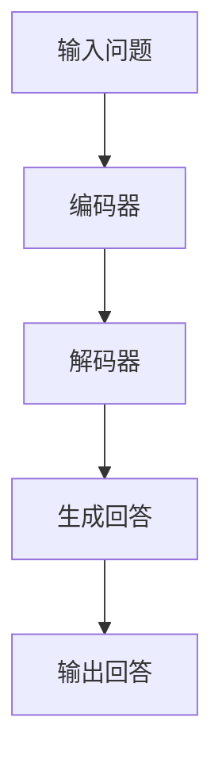
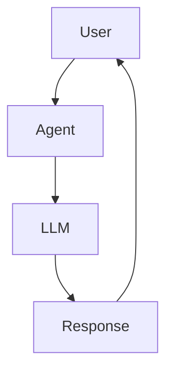
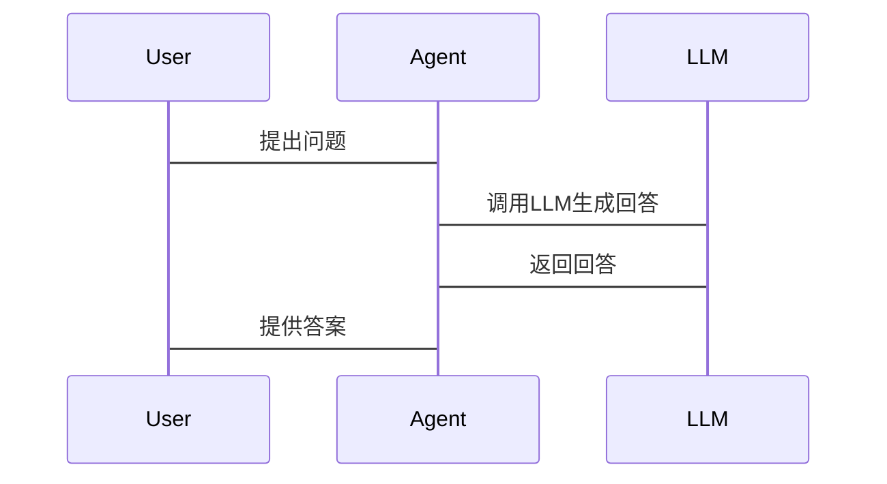

                 


# LLM驱动的AI Agent问答系统优化

> 关键词：大语言模型、AI Agent、问答系统、优化、自然语言处理、LLM、系统架构

> 摘要：本文深入探讨了如何利用大语言模型（LLM）优化AI Agent驱动的问答系统，分析了系统的背景、核心概念、算法原理、架构设计以及实际案例，提供了一套完整的优化方案和实施指南。

---

# 目录

1. [背景与基础](#背景与基础)
   - [1.1 LLM与AI Agent概述](#llm与ai-agent概述)
   - [1.2 LLM与AI Agent的核心概念与联系](#llm与ai-agent的核心概念与联系)
   - [1.3 LLM驱动AI Agent问答系统的算法原理](#llm驱动ai-agent问答系统的算法原理)

2. [系统分析与架构设计](#系统分析与架构设计)
   - [2.1 系统功能设计](#系统功能设计)
   - [2.2 系统架构设计](#系统架构设计)
   - [2.3 接口设计](#接口设计)
   - [2.4 交互流程](#交互流程)

3. [项目实战](#项目实战)
   - [3.1 环境安装](#环境安装)
   - [3.2 代码实现](#代码实现)
   - [3.3 案例分析](#案例分析)
   - [3.4 项目总结](#项目总结)

4. [最佳实践、小结、注意事项和拓展阅读](#最佳实践、小结、注意事项和拓展阅读)

---

## 背景与基础

### 1.1 LLM与AI Agent概述

#### 1.1.1 问题背景与现状
问答系统是人机交互的重要组成部分，传统方法依赖规则和关键词匹配，存在准确率低、难以应对复杂问题等局限性。随着LLM的发展，AI Agent能够更智能地理解和回答问题，显著提升了问答系统的性能。

#### 1.1.2 LLM与AI Agent的核心概念
- **大语言模型（LLM）**：基于Transformer的深度学习模型，擅长处理自然语言文本，能够生成高质量的回答。
- **AI Agent**：智能代理，负责接收输入、处理问题并调用LLM生成回答，实现人机交互。

#### 1.1.3 问答系统的发展历程
从基于规则的传统方法，到基于机器学习的模型，再到当前的LLM驱动，问答系统在准确性、效率和智能性方面有了显著提升。

### 1.2 LLM与AI Agent的核心概念与联系

#### 1.2.1 LLM的核心原理
- **Transformer模型**：由编码器和解码器组成，通过自注意力机制捕捉上下文信息。
- **训练方法**：基于大量数据的监督学习，优化模型参数以最小化预测误差。

#### 1.2.2 AI Agent的系统架构
- **组成模块**：包括问题解析、LLM调用、结果处理等模块。
- **交互流程**：用户输入问题，Agent解析后调用LLM生成回答，最终返回给用户。

#### 1.2.3 实体关系图
```mermaid
er
actor: 用户
agent: AI Agent
llm: 大语言模型
question: 问题
answer: 回答
actor --> question
question --> agent
agent --> llm
llm --> answer
agent --> answer
```

### 1.3 LLM驱动AI Agent问答系统的算法原理

#### 1.3.1 算法流程


#### 1.3.2 算法实现代码示例
```python
def llm_generate_response(prompt):
    # 模拟LLM生成回答的代码
    pass

def agent_process_question(question):
    # 解析问题并调用LLM生成回答
    response = llm_generate_response(question)
    return response
```

---

## 系统分析与架构设计

### 2.1 系统功能设计

#### 2.1.1 功能模块
- **问题解析模块**：解析用户输入，识别意图和关键信息。
- **LLM调用模块**：将解析后的问题输入LLM，生成回答。
- **结果处理模块**：对LLM的回答进行优化和格式调整。

### 2.2 系统架构设计

#### 2.2.1 架构图


### 2.3 接口设计

#### 2.3.1 输入接口
- **输入格式**：用户输入的自然语言问题。
- **输出格式**：解析后的结构化数据。

#### 2.3.2 输出接口
- **输入格式**：结构化数据。
- **输出格式**：自然语言回答。

### 2.4 交互流程

#### 2.4.1 交互流程图


---

## 项目实战

### 3.1 环境安装

- **工具安装**：安装Python、TensorFlow、Keras等。
- **库安装**：使用pip安装必要的库，如transformers、numpy。

### 3.2 代码实现

#### 3.2.1 核心代码
```python
import transformers

def initialize_llm():
    # 初始化LLM模型
    pass

def process_question(question):
    # 处理问题并生成回答
    pass
```

#### 3.2.2 应用解读
- **问题解析**：将用户输入的问题拆解为关键词和意图。
- **LLM调用**：将解析后的问题输入模型，生成回答。

### 3.3 案例分析

#### 3.3.1 实际案例
- **电商客服系统**：处理用户的产品咨询和售后问题，通过优化问答系统提升用户体验。

### 3.4 项目总结

- **成果**：提高了回答的准确性和响应速度。
- **经验**：模型优化和系统架构设计对性能提升至关重要。

---

## 最佳实践、小结、注意事项和拓展阅读

### 3.1 最佳实践

- **数据质量**：确保训练数据的多样性和代表性。
- **模型优化**：定期更新模型，提升生成效果。

### 3.2 小结

本文详细探讨了LLM驱动的AI Agent问答系统的优化，从背景、原理到实现，为读者提供了全面的指导。

### 3.3 注意事项

- **数据隐私**：确保用户数据的安全和隐私。
- **系统稳定性**：设计高效的错误处理机制，保证系统的稳定运行。

### 3.4 拓展阅读

- 推荐书籍：《深度学习入门》、《自然语言处理实战》。
- 技术博客：关注前沿技术，持续学习和优化。

---

# 作者信息

作者：AI天才研究院/AI Genius Institute & 禅与计算机程序设计艺术 /Zen And The Art of Computer Programming

