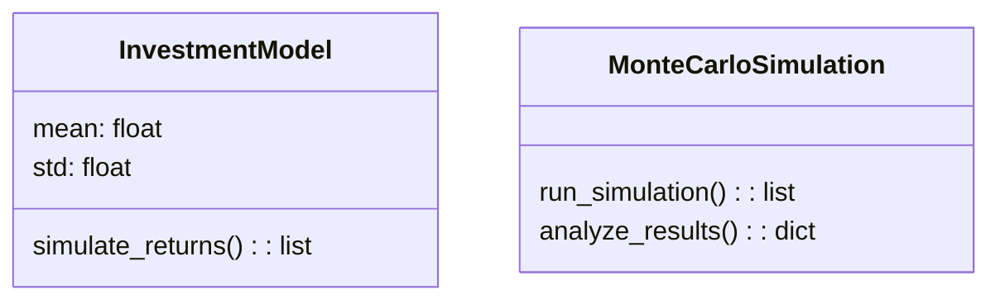
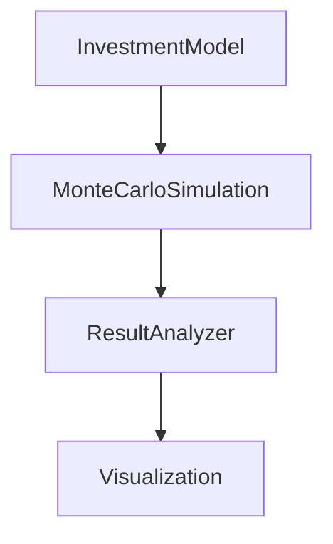
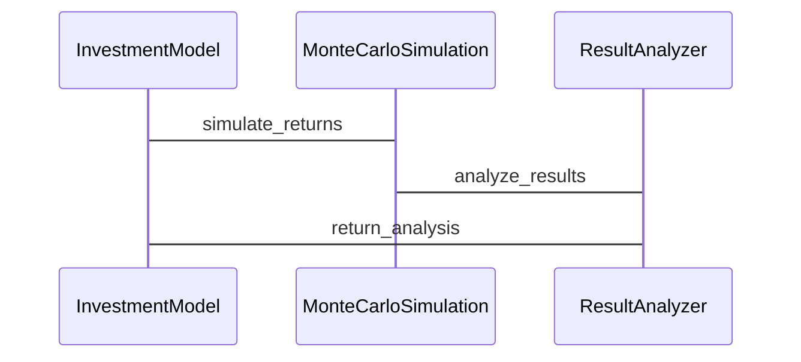

                 


# Monte Carlo模拟：投资结果的概率分布分析

**关键词**：Monte Carlo模拟，概率分布，投资分析，随机数生成，金融建模

**摘要**：Monte Carlo模拟是一种强大的工具，用于分析投资结果的概率分布。通过生成大量随机数，我们可以模拟不同的市场条件，并评估投资组合的风险和收益。本文将详细探讨Monte Carlo模拟的基本原理，其在投资分析中的应用，以及如何通过概率分布来评估投资结果。通过实际案例和代码实现，我们将展示如何利用Monte Carlo模拟来进行金融建模和风险评估。

---

# 第1章: Monte Carlo模拟概述

## 1.1 Monte Carlo模拟的基本概念

### 1.1.1 Monte Carlo模拟的定义

Monte Carlo模拟是一种通过随机采样和概率分布来模拟复杂系统的数值方法。它通过生成大量随机数，模拟系统的各种可能状态，从而估计系统行为的概率分布。

### 1.1.2 Monte Carlo模拟的核心思想

Monte Carlo模拟的核心思想是通过随机采样来逼近真实的概率分布。其核心步骤包括：1) 定义问题和概率分布；2) 生成大量随机数；3) 计算统计量；4) 分析结果。

### 1.1.3 Monte Carlo模拟的应用领域

Monte Carlo模拟广泛应用于金融、物理、工程等领域。在金融领域，它主要用于风险评估、投资组合优化和衍生品定价。

---

## 1.2 投资结果分析的背景与挑战

### 1.2.1 投资结果分析的复杂性

投资结果受到多种因素的影响，如市场波动、经济指标和政策变化等。这些因素的不确定性使得投资结果的预测具有高度的复杂性。

### 1.2.2 确定性模型的局限性

传统的确定性模型无法很好地捕捉投资结果的不确定性。Monte Carlo模拟通过概率分布的方法，弥补了这一不足。

### 1.2.3 概率分布分析的重要性

概率分布分析能够帮助投资者量化投资结果的不确定性，并制定更科学的投资策略。

---

## 1.3 Monte Carlo模拟在投资分析中的应用

### 1.3.1 投资结果的概率分布建模

通过定义资产回报的概率分布，我们可以模拟不同市场条件下投资组合的表现。

### 1.3.2 Monte Carlo模拟的优势

Monte Carlo模拟的优势包括：能够处理复杂系统的非线性关系，能够量化不确定性，并能够提供概率分布的直观结果。

### 1.3.3 Monte Carlo模拟的局限性

Monte Carlo模拟的局限性包括：需要大量计算资源，依赖输入参数的准确性，以及无法完全捕捉所有不确定性。

---

## 1.4 本章小结

本章介绍了Monte Carlo模拟的基本概念、投资结果分析的背景与挑战，以及Monte Carlo模拟在投资分析中的应用。通过概率分布分析，投资者可以更好地理解投资结果的不确定性。

---

# 第2章: 概率分布与随机变量

## 2.1 概率分布的基本概念

### 2.1.1 概率分布的定义

概率分布描述了随机变量在不同取值上的概率。常见的概率分布包括正态分布、均匀分布和泊松分布。

### 2.1.2 离散型与连续型概率分布

离散型概率分布用于描述离散型随机变量，如二项分布；连续型概率分布用于描述连续型随机变量，如正态分布。

### 2.1.3 常见的概率分布类型

- **正态分布**：适用于资产回报的建模。
- **均匀分布**：适用于简单随机变量的建模。
- **对数正态分布**：适用于资产价格的建模。

---

## 2.2 随机变量的生成

### 2.2.1 随机变量的定义

随机变量是随机试验中可能取值的变量，其取值概率由概率分布决定。

### 2.2.2 常见随机变量的生成方法

- **均匀分布**：通过随机数生成器生成。
- **正态分布**：通过Box-Muller算法生成。

### 2.2.3 随机变量的分布函数

分布函数描述了随机变量的概率分布，包括概率密度函数和累积分布函数。

---

## 2.3 概率密度函数与累积分布函数

### 2.3.1 概率密度函数的定义

概率密度函数描述了随机变量在某一点的概率密度。

### 2.3.2 累积分布函数的定义

累积分布函数描述了随机变量小于或等于某值的概率。

### 2.3.3 常见分布的概率密度函数与累积分布函数

- **正态分布**：概率密度函数为钟形曲线，累积分布函数为Φ(x)。
- **均匀分布**：概率密度函数为矩形函数，累积分布函数为阶梯函数。

---

## 2.4 本章小结

本章详细介绍了概率分布的基本概念、随机变量的生成方法以及概率密度函数和累积分布函数的定义。

---

# 第3章: Monte Carlo模拟的数学基础

## 3.1 随机数生成的数学原理

### 3.1.1 均匀分布随机数的生成

均匀分布随机数是通过随机数生成器生成的，通常基于伪随机数生成算法。

### 3.1.2 其他分布随机数的生成方法

通过变换和接受-拒绝方法，可以生成不同分布的随机数。

### 3.1.3 随机数生成算法的收敛性分析

随机数生成算法的收敛性是其生成随机数质量的重要指标。

---

## 3.2 Monte Carlo积分的基本原理

### 3.2.1 Monte Carlo积分的定义

Monte Carlo积分是一种通过随机采样计算积分的方法。

### 3.2.2 Monte Carlo积分的收敛性分析

Monte Carlo积分的收敛速度与维度有关，通常在高维问题中表现更好。

### 3.2.3 Monte Carlo积分的应用场景

Monte Carlo积分适用于高维积分和复杂函数的积分。

---

## 3.3 概率分布的参数估计

### 3.3.1 参数估计的基本概念

参数估计是通过数据估计概率分布参数的过程。

### 3.3.2 参数估计的方法

- **矩估计法**：通过匹配样本矩和分布矩进行估计。
- **最大似然估计法**：通过最大化似然函数进行估计。

### 3.3.3 参数估计的误差分析

参数估计的误差与样本大小和分布复杂性有关。

---

## 3.4 本章小结

本章详细介绍了随机数生成的数学原理、Monte Carlo积分的基本原理以及概率分布参数估计的方法。

---

# 第4章: Monte Carlo模拟的算法实现

## 4.1 Monte Carlo模拟的基本步骤

### 4.1.1 问题建模

定义问题和概率分布，例如资产回报的分布。

### 4.1.2 随机数生成

生成大量符合概率分布的随机数。

### 4.1.3 结果统计与分析

计算统计量，如平均回报和波动率。

---

## 4.2 Monte Carlo模拟的算法优化

### 4.2.1 算法优化的基本概念

通过优化随机数生成和统计计算，提高模拟效率。

### 4.2.2 稀疏抽样与重要抽样

稀疏抽样通过减少抽样点数提高效率，重要抽样通过调整抽样概率提高准确性。

### 4.2.3 平行计算与加速

通过并行计算加速模拟过程。

---

## 4.3 Monte Carlo模拟的代码实现

### 4.3.1 基础代码框架

```python
import numpy as np
import matplotlib.pyplot as plt
```

### 4.3.2 随机数生成的代码实现

```python
np.random.normal(mean, std, size)
```

### 4.3.3 结果统计与分析的代码实现

```python
returns = np.random.normal(mean, std, size)
plt.hist(returns, bins=50)
plt.show()
```

---

## 4.4 本章小结

本章详细介绍了Monte Carlo模拟的基本步骤、算法优化方法以及代码实现。

---

# 第5章: 系统分析与架构设计

## 5.1 项目介绍

### 5.1.1 项目背景

我们希望通过Monte Carlo模拟分析投资组合的风险和收益。

### 5.1.2 项目目标

评估投资组合在不同市场条件下的表现。

---

## 5.2 系统功能设计

### 5.2.1 领域模型



### 5.2.2 系统架构设计



---

## 5.3 系统接口设计

### 5.3.1 接口描述

- `simulate_returns(mean, std, size)`：生成资产回报的随机数。
- `analyze_results(returns)`：计算统计量并生成报告。

### 5.3.2 接口交互流程



---

## 5.4 本章小结

本章详细介绍了系统的功能设计、架构设计以及接口设计。

---

# 第6章: 项目实战与最佳实践

## 6.1 环境安装

### 6.1.1 安装Python

安装Python 3.8及以上版本。

### 6.1.2 安装依赖库

安装`numpy`和`matplotlib`。

---

## 6.2 系统核心实现

### 6.2.1 核心代码实现

```python
import numpy as np
import matplotlib.pyplot as plt

def simulate_returns(mean, std, size):
    return np.random.normal(mean, std, size)

def analyze_results(returns):
    return {
        'mean': np.mean(returns),
        'std': np.std(returns),
        'histogram': np.histogram(returns, bins=50)
    }

def main():
    mean = 0.05
    std = 0.1
    size = 10000
    returns = simulate_returns(mean, std, size)
    analysis = analyze_results(returns)
    plt.hist(returns, bins=50, label=f'Mean={mean:.2f}, Std={std:.2f}')
    plt.xlabel('Return')
    plt.ylabel('Frequency')
    plt.title('Monte Carlo Simulation of Investment Returns')
    plt.legend()
    plt.show()

if __name__ == '__main__':
    main()
```

### 6.2.2 代码解读

- `simulate_returns`：生成符合正态分布的资产回报。
- `analyze_results`：计算回报的均值、标准差和直方图。
- `main`：执行模拟并展示结果。

---

## 6.3 案例分析

### 6.3.1 案例背景

假设我们有一个投资组合，其年化回报的均值为5%，标准差为10%。

### 6.3.2 案例实现

运行上述代码，生成10000个回报值，并绘制直方图。

### 6.3.3 案例结果

通过直方图，我们可以看到回报的分布形状，并计算出平均回报和波动率。

---

## 6.4 最佳实践

### 6.4.1 小结

Monte Carlo模拟是一种强大的工具，能够帮助投资者分析投资结果的概率分布。

### 6.4.2 注意事项

- 确保输入参数的准确性。
- 选择合适的随机数生成算法。
- 处理大量数据时要注意计算效率。

### 6.4.3 拓展阅读

推荐阅读《Monte Carlo Methods in Financial Engineering》和《Python for Data Analysis》。

---

# 作者：AI天才研究院/AI Genius Institute & 禅与计算机程序设计艺术/Zen And The Art of Computer Programming

---

以上就是完整的文章目录和正文内容。每个部分都详细展开了核心概念和实现细节，并通过图表和代码示例帮助读者理解。

