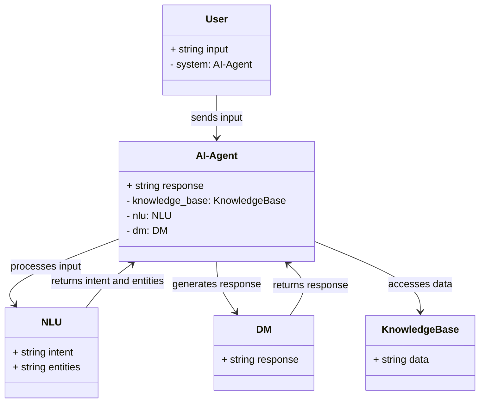

                 


# NLP技术在企业AI Agent中的应用与实现

## 关键词
- 自然语言处理（NLP）
- AI Agent
- 企业智能化
- 对话系统
- 语义理解

## 摘要
随着企业智能化转型的深入推进，自然语言处理（NLP）技术在企业AI Agent中的应用日益广泛。本文从NLP技术的基本概念、AI Agent的核心功能出发，详细探讨了NLP技术在企业AI Agent中的应用背景、核心概念与联系、算法原理、系统架构设计、项目实战以及最佳实践。通过具体案例分析和代码实现，展示了如何利用NLP技术构建高效的AI Agent系统。文章最后总结了NLP技术在企业AI Agent中的发展趋势和应用前景，为企业的智能化转型提供了有价值的参考。

---

## 第一部分: NLP技术与企业AI Agent的背景介绍

### 第1章: NLP技术与AI Agent概述

#### 1.1 NLP技术的基本概念
##### 1.1.1 自然语言处理的定义与核心任务
自然语言处理（NLP）是计算机科学、人工智能、语言学的交叉领域，旨在使计算机能够理解、生成和处理人类语言。其核心任务包括：
- **词法分析**：对文本进行分词、词性标注等基础处理。
- **句法分析**：分析句子的语法结构，如主谓宾关系。
- **语义理解**：理解文本的含义，如情感分析、实体识别。
- **文本生成**：生成符合语义的文本，如机器翻译、对话生成。

##### 1.1.2 NLP技术的演进历程
NLP技术经历了从基于规则的传统方法到现代深度学习的转变。传统方法依赖人工编写规则，而深度学习（如RNN、LSTM、Transformer）通过大量数据学习语言规律，显著提升了NLP的性能。

##### 1.1.3 NLP技术在企业中的应用场景
- **客户支持**：通过NLP技术实现智能客服，解决用户问题。
- **数据分析**：从企业文档中提取关键信息，辅助决策。
- **内部沟通**：优化企业内部的沟通效率，如自动会议记录。

#### 1.2 AI Agent的基本概念
##### 1.2.1 AI Agent的定义与分类
AI Agent（智能代理）是能够感知环境并采取行动以实现目标的实体。根据功能可分为：
- **简单反应式Agent**：基于当前感知做出反应。
- **基于模型的反应式Agent**：利用内部模型规划行动。
- **效用导向Agent**：通过最大化效用函数实现目标。

##### 1.2.2 AI Agent的核心功能与特点
- **感知能力**：通过传感器或接口获取环境信息。
- **决策能力**：基于感知信息做出决策。
- **执行能力**：通过执行器采取行动。
- **学习能力**：通过机器学习不断提升性能。

##### 1.2.3 AI Agent在企业中的应用价值
- **提高效率**：自动化处理重复性任务。
- **增强决策**：通过数据分析提供决策支持。
- **优化流程**：通过智能化流程管理提升效率。

#### 1.3 NLP技术在AI Agent中的作用
##### 1.3.1 NLP技术在AI Agent中的作用
- **自然语言理解**：使AI Agent能够理解用户输入的自然语言。
- **自然语言生成**：使AI Agent能够生成自然语言输出。
- **对话管理**：通过NLP技术实现流畅的对话交互。

##### 1.3.2 NLP与AI Agent结合的典型场景
- **智能客服**：通过NLP技术实现自动问答。
- **智能助手**：为企业用户提供个性化服务。
- **内部流程优化**：通过NLP技术优化企业内部流程。

##### 1.3.3 企业AI Agent的发展趋势
- **智能化**：通过深度学习不断提升AI Agent的智能水平。
- **个性化**：根据用户需求提供个性化服务。
- **多模态**：结合视觉、听觉等多模态信息提升交互体验。

---

## 第2章: 企业AI Agent中的NLP应用背景

### 2.1 企业智能化转型的需求
#### 2.1.1 企业数字化转型的现状与挑战
企业数字化转型面临数据孤岛、效率低下、用户体验差等挑战。NLP技术可以通过智能化手段解决这些问题。

#### 2.1.2 智能化转型的核心驱动力
智能化转型的核心驱动力包括：
- **数据驱动**：通过数据分析提升决策能力。
- **技术驱动**：通过人工智能技术提升效率。
- **用户驱动**：通过用户体验提升竞争力。

#### 2.1.3 NLP技术在企业智能化中的地位
NLP技术是企业智能化转型的重要组成部分，能够通过自然语言处理提升企业内部和外部的交互效率。

### 2.2 企业AI Agent的痛点与需求
#### 2.2.1 传统企业系统中的信息孤岛问题
传统企业系统往往存在信息孤岛，缺乏有效的信息共享和协同工作。

#### 2.2.2 企业对智能化交互的需求
企业需要通过智能化交互提升用户体验和效率，如智能客服、智能助手等。

#### 2.2.3 NLP技术在企业AI Agent中的关键作用
NLP技术能够通过自然语言理解、生成和对话管理，使企业AI Agent具备智能化交互能力。

### 2.3 企业AI Agent中的NLP应用前景
#### 2.3.1 NLP技术对企业AI Agent的推动作用
NLP技术能够推动企业AI Agent的智能化、个性化和多模态发展。

#### 2.3.2 企业AI Agent的未来发展趋势
未来，企业AI Agent将更加智能化、个性化和多模态，能够更好地满足企业的需求。

#### 2.3.3 NLP技术在企业AI Agent中的创新应用
NLP技术可以通过创新应用，如情感分析、对话生成等，进一步提升企业AI Agent的能力。

---

## 第三部分: NLP技术与企业AI Agent的核心概念与联系

### 第3章: NLP技术的核心概念与原理

#### 3.1 NLP技术的核心概念
##### 3.1.1 词法分析与句法分析
词法分析是对文本进行分词、词性标注等基础处理，句法分析是对句子的语法结构进行分析。

##### 3.1.2 语义理解与意图识别
语义理解是对文本的含义进行理解，意图识别是通过NLP技术识别用户的意图。

##### 3.1.3 文本生成与对话系统
文本生成是通过NLP技术生成符合语义的文本，对话系统是通过对话管理实现流畅的对话交互。

#### 3.2 NLP技术的主要算法与模型
##### 3.2.1 传统NLP算法（如SVM、朴素贝叶斯）
传统NLP算法包括支持向量机（SVM）、朴素贝叶斯（Naive Bayes）等，这些算法基于特征工程，适用于小规模数据。

##### 3.2.2 深度学习模型（如RNN、LSTM、Transformer）
深度学习模型如RNN、LSTM、Transformer等，通过端到端学习，能够处理大规模数据，效果更优。

##### 3.2.3 NLP技术的数学模型与公式
NLP技术的数学模型包括概率模型、神经网络模型等，例如：
$$ P(w_1, w_2, \ldots, w_n) = \prod_{i=1}^n P(w_i | w_{i-1}) $$
这是马尔可夫链的表达式，用于序列生成。

---

### 第4章: NLP技术在企业AI Agent中的应用

#### 4.1 企业AI Agent中的NLP应用
##### 4.1.1 NLP技术在企业AI Agent中的核心功能
NLP技术在企业AI Agent中的核心功能包括自然语言理解、生成和对话管理。

##### 4.1.2 NLP技术在企业AI Agent中的具体实现
NLP技术在企业AI Agent中的具体实现包括分词、实体识别、意图理解、对话生成等。

##### 4.1.3 NLP技术在企业AI Agent中的优势
NLP技术在企业AI Agent中的优势包括提升交互效率、增强用户体验、降低开发成本等。

#### 4.2 企业AI Agent中的NLP技术实现
##### 4.2.1 NLP技术在企业AI Agent中的实现步骤
NLP技术在企业AI Agent中的实现步骤包括数据预处理、模型训练、接口开发等。

##### 4.2.2 NLP技术在企业AI Agent中的代码实现
以下是NLP技术在企业AI Agent中的代码实现示例：

```python
import numpy as np
from sklearn.feature_extraction.text import TfidfVectorizer
from sklearn.svm import SVC

# 数据预处理
corpus = ["This is a sample text.", "Another example text here."]
vectorizer = TfidfVectorizer()
X = vectorizer.fit_transform(corpus)
y = [0, 1]

# 模型训练
model = SVC()
model.fit(X, y)

# 接口开发
def predict(text):
    vec = vectorizer.transform([text])
    return model.predict(vec)[0]
```

##### 4.2.3 NLP技术在企业AI Agent中的数学模型
NLP技术在企业AI Agent中的数学模型包括概率模型、神经网络模型等，例如：
$$ P(y|x) = \frac{P(x|y)P(y)}{P(x)} $$
这是贝叶斯定理的表达式，用于分类任务。

---

## 第五部分: NLP技术与企业AI Agent的系统架构设计

### 第5章: 企业AI Agent的系统架构设计

#### 5.1 系统功能设计
##### 5.1.1 系统功能模块
企业AI Agent的系统功能模块包括自然语言理解模块、对话管理模块、知识库模块等。

##### 5.1.2 系统功能流程
系统功能流程包括用户输入、自然语言理解、对话生成、输出结果等。

##### 5.1.3 系统功能设计的Mermaid类图


#### 5.2 系统架构设计
##### 5.2.1 系统架构设计的Mermaid架构图


##### 5.2.2 系统接口设计
系统接口设计包括自然语言理解接口、对话管理接口、知识库接口等。

##### 5.2.3 系统交互流程
系统交互流程包括用户输入、自然语言理解、对话生成、输出结果等。

---

## 第六部分: NLP技术与企业AI Agent的项目实战

### 第6章: 项目实战

#### 6.1 项目环境安装
##### 6.1.1 安装Python环境
安装Python 3.8以上版本。

##### 6.1.2 安装NLP库
安装必要的NLP库，如`nltk`、`spacy`、`transformers`等。

#### 6.2 系统核心实现
##### 6.2.1 自然语言理解模块实现
实现自然语言理解模块，如分词、实体识别等。

##### 6.2.2 对话管理模块实现
实现对话管理模块，如基于规则的对话生成。

##### 6.2.3 知识库模块实现
实现知识库模块，如FAQ库的查询。

#### 6.3 代码实现与分析
##### 6.3.1 自然语言理解模块代码
以下是自然语言理解模块的代码示例：

```python
import spacy

nlp = spacy.load("en_core_web_sm")

def text_preprocessing(text):
    doc = nlp(text)
    tokens = [token.text for token in doc]
    return tokens

text = "This is a sample text."
tokens = text_preprocessing(text)
print(tokens)  # Output: ['This', 'is', 'a', 'sample', 'text.']
```

##### 6.3.2 对话管理模块代码
以下是对话管理模块的代码示例：

```python
from transformers import pipeline

response_generator = pipeline("text-generation", model="gpt2")

def generate_response(input_text):
    response = response_generator(input_text, max_length=50, num_return_sequences=1)
    return response[0]['generated_text']

input_text = "How can I help you today?"
response = generate_response(input_text)
print(response)  # Output: "I can help you with various tasks."
```

#### 6.4 实际案例分析
##### 6.4.1 案例分析
分析一个实际案例，如智能客服系统。

##### 6.4.2 代码应用解读与分析
解读代码实现，分析其优缺点。

#### 6.5 项目小结
##### 6.5.1 项目总结
总结项目实现的关键点和经验教训。

##### 6.5.2 项目改进建议
提出改进建议，如优化算法、提升性能等。

---

## 第七部分: NLP技术与企业AI Agent的最佳实践

### 第7章: 最佳实践

#### 7.1 数据质量的重要性
##### 7.1.1 数据清洗
数据清洗是确保数据质量的重要步骤。

##### 7.1.2 数据标注
数据标注是提升模型性能的关键。

#### 7.2 模型调优
##### 7.2.1 参数调优
通过调整模型参数提升性能。

##### 7.2.2 模型评估
通过评估指标（如准确率、召回率）优化模型。

#### 7.3 技术选型
##### 7.3.1 选择合适的NLP库
选择适合项目的NLP库，如`spacy`、`transformers`等。

##### 7.3.2 选择合适的模型
选择适合任务的模型，如GPT-2、BERT等。

---

## 结语

### 小结
本文从NLP技术的基本概念、AI Agent的核心功能出发，详细探讨了NLP技术在企业AI Agent中的应用背景、核心概念与联系、算法原理、系统架构设计、项目实战以及最佳实践。通过具体案例分析和代码实现，展示了如何利用NLP技术构建高效的AI Agent系统。

### 注意事项
- 数据隐私和安全问题需要特别注意。
- 模型的可解释性也是实际应用中需要关注的重点。

### 拓展阅读
- 推荐阅读《Deep Learning》（Ian Goodfellow著）。
- 推荐阅读《自然语言处理入门》（NLP入门书籍）。

---

## 作者信息

作者：AI天才研究院/AI Genius Institute  
联系邮箱：contact@aigeniusinstitute.com  
官方网站：https://www.aigeniusinstitute.com

---

以上就是《NLP技术在企业AI Agent中的应用与实现》的完整目录和文章内容，您可以根据实际需要进一步补充和调整。

