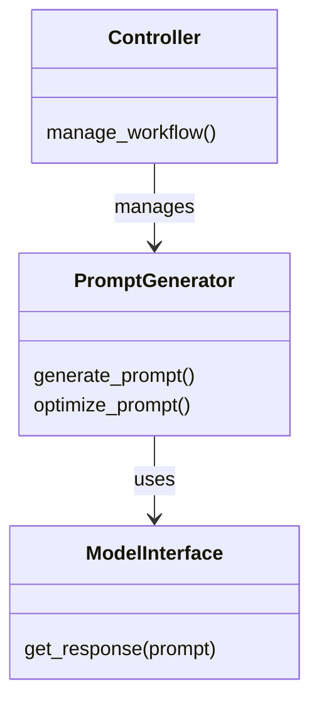
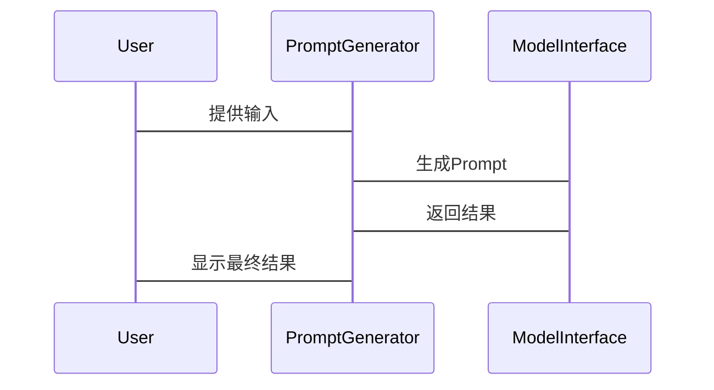

                 


# Prompt工程：设计高效指令的艺术

---

## 关键词：Prompt工程, AI大模型, 语言模型, 模型优化, Prompt设计, AI算法

---

## 摘要：本文深入探讨了Prompt工程的设计原理、核心算法以及实际应用，分析了Prompt工程在AI大模型中的重要性，结合具体案例，详细讲解了Prompt生成与优化的方法，最后总结了Prompt工程的发展趋势和最佳实践。

---

## 第一部分：Prompt工程基础与背景

### 第1章：Prompt工程概述

#### 1.1 Prompt工程的基本概念

##### 1.1.1 什么是Prompt工程
Prompt工程是AI大模型与用户交互的核心技术，通过设计高效的Prompt指令，优化模型输出结果的质量和效率。

##### 1.1.2 Prompt工程的核心目标
- 提供明确的指令，引导模型生成符合预期的输出。
- 优化模型的推理效率，减少计算资源消耗。

##### 1.1.3 Prompt工程的应用场景
- 自然语言处理：文本生成、问答系统。
- 机器翻译：跨语言通信。
- 代码生成：自动生成程序代码。
- 数据分析：从复杂数据中提取有用信息。

#### 1.2 Prompt工程的背景与现状

##### 1.2.1 AI大模型的发展与挑战
AI大模型的发展带来了强大的生成能力和理解能力，但如何高效地使用这些模型仍是一个挑战。

##### 1.2.2 Prompt工程的提出与意义
Prompt工程通过设计高效的指令，解决了模型使用中的低效和混乱问题，提高了模型的实用价值。

##### 1.2.3 当前Prompt工程的研究与实践
学术界和工业界都在积极探索Prompt工程的优化方法，推动其在实际应用中的广泛使用。

---

### 第2章：Prompt工程的核心概念与联系

#### 2.1 Prompt的结构与组成

##### 2.1.1 Prompt的构成要素
- 内容：指令的具体描述。
- 格式：指令的表达方式。
- 语境：上下文信息。

##### 2.1.2 Prompt的语法与语义分析
- 语法分析：解析指令的结构。
- 语义分析：理解指令的含义。

##### 2.1.3 Prompt与模型能力的关系
- 模型类型：决定Prompt的设计复杂度。
- 参数量：影响Prompt的表达能力。
- 推理速度：Prompt长度对推理时间的影响。

#### 2.2 Prompt设计的原则与方法

##### 2.2.1 明确性原则
- 避免歧义，确保指令清晰明确。

##### 2.2.2 简洁性原则
- 去除冗余信息，提高效率。

##### 2.2.3 一致性原则
- 保持风格统一，避免矛盾。

#### 2.3 Prompt与模型能力的对比分析

##### 2.3.1 不同模型对Prompt的处理能力
- 大模型：复杂指令处理能力强。
- 小模型：适合简单的指令。

##### 2.3.2 Prompt与模型参数量的关系
- 参数越多，Prompt的复杂度越高。

##### 2.3.3 Prompt与模型推理速度的对比
- 长Prompt会增加推理时间。

---

## 第二部分：Prompt工程的核心原理与算法

### 第3章：Prompt的生成与优化算法

#### 3.1 Prompt生成的基本原理

##### 3.1.1 基于语言模型的生成方法
- 使用语言模型生成符合语法的指令。

##### 3.1.2 基于规则的生成方法
- 利用预定义的规则生成指令。

##### 3.1.3 基于强化学习的生成方法
- 通过强化学习优化指令生成。

#### 3.2 Prompt优化的数学模型

##### 3.2.1 基于向量空间的优化
- 将Prompt转化为向量进行优化。

##### 3.2.2 基于梯度下降的优化
- 通过优化目标函数调整Prompt。

##### 3.2.3 基于贝叶斯的优化
- 利用概率模型进行优化。

#### 3.3 Prompt优化的算法实现

##### 3.3.1 基于梯度的优化算法
```python
def gradient_descent(prompt, model):
    while not converged:
        loss = calculate_loss(prompt, model)
        gradient = compute_gradient(loss, model)
        prompt = prompt - learning_rate * gradient
```

##### 3.3.2 基于规则的优化算法
```python
def rule_based_optimization(prompt):
    for rule in rules:
        if applies_to_rule(rule):
            prompt = apply_rule(rule, prompt)
```

##### 3.3.3 基于强化学习的优化算法
```python
def reinforce_learning_optimization(prompt, model):
    for episode in episodes:
        action = choose_action(prompt)
        reward = get_reward(action, model)
        update_policy(reward)
```

---

### 第4章：系统分析与架构设计

#### 4.1 系统功能设计

##### 4.1.1 项目介绍
- 项目目标：设计一个高效的Prompt生成系统。
- 项目范围：涵盖Prompt生成、优化、测试。

##### 4.1.2 领域模型


##### 4.1.3 系统架构设计


##### 4.1.4 接口设计
- 输入接口：接收用户指令。
- 输出接口：返回模型生成的结果。

##### 4.1.5 交互设计


---

### 第5章：项目实战

#### 5.1 环境安装

```bash
pip install numpy
pip install matplotlib
pip install transformers
```

#### 5.2 核心代码实现

```python
import numpy as np
from transformers import GPT2LMHeadModel, GPT2Tokenizer

def generate_prompt(prompt, model, tokenizer):
    inputs = tokenizer.encode(prompt, return_tensors="np")
    outputs = model.generate(inputs, max_length=50)
    return tokenizer.decode(outputs[0], skip_special_tokens=True)
```

#### 5.3 案例分析

##### 案例1：文本生成
- 输入：提供一个新闻标题，生成一篇新闻报道。
- Prompt设计：明确指令，减少冗余信息。
- 优化结果：生成高质量的新闻报道。

##### 案例2：问答系统
- 输入：用户查询问题。
- Prompt设计：引导模型生成准确的回答。
- 优化结果：提高问答系统的准确率。

#### 5.4 项目总结

- 项目经验：Prompt设计的关键性。
- 改进建议：结合上下文信息，提升生成效果。

---

## 第六部分：总结与展望

### 第6章：总结与展望

#### 6.1 关键点回顾

- 本文详细介绍了Prompt工程的设计原理和实际应用。
- 重点分析了Prompt生成与优化的算法。

#### 6.2 未来方向

- 研究更高效的Prompt生成方法。
- 探索Prompt在更多领域的应用。

#### 6.3 最佳实践

- 设计明确简洁的Prompt指令。
- 结合上下文信息，提高生成效果。

---

## 作者：AI天才研究院/AI Genius Institute & 禅与计算机程序设计艺术 /Zen And The Art of Computer Programming

