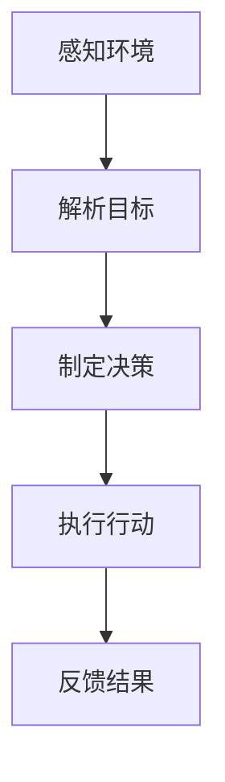
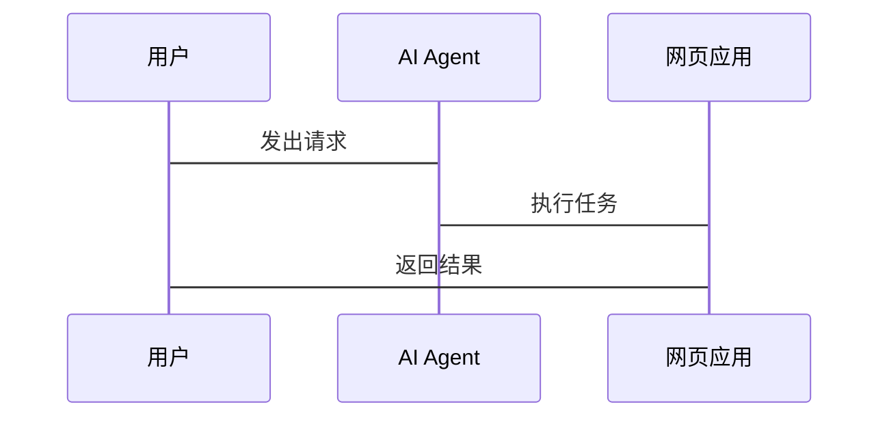

                 


# Web集成：将AI Agent嵌入到网页应用中

> 关键词：AI Agent、Web集成、人工智能、网页应用、算法原理、系统架构

> 摘要：本文详细探讨了如何将AI Agent嵌入到网页应用中的过程，从AI Agent的基本概念到其在Web集成中的应用价值，再到算法原理、系统架构设计和项目实战，全面解析了AI Agent在现代网页应用中的重要性和实现方法。

---

## 第1章: AI Agent的基本概念与Web集成的价值

### 1.1 AI Agent的基本概念
AI Agent（人工智能代理）是一种能够感知环境、自主决策并执行任务的智能实体。它通过与用户或系统的交互，实现特定的目标。AI Agent的核心特征包括自主性、反应性、目标导向性和社交能力。

### 1.2 Web集成的基本概念
Web集成是指将AI Agent与网页应用相结合，使其能够在网页环境中运行并提供智能化服务。这种集成通过技术手段将AI Agent嵌入到网页中，使其能够与用户直接交互，并为用户提供个性化的服务。

### 1.3 AI Agent在Web集成中的应用价值
AI Agent的嵌入为网页应用带来了显著的优势，包括提高用户体验、增强系统的智能化水平以及优化业务流程。通过AI Agent，网页应用能够实现智能推荐、自动化任务处理和实时反馈等功能。

---

## 第2章: AI Agent的核心概念与工作原理

### 2.1 AI Agent的分类与特点
AI Agent可以根据功能和应用场景分为多种类型，包括：
1. **简单反射型AI Agent**：基于预定义规则进行简单反应。
2. **基于模型型AI Agent**：利用内部模型进行复杂决策。
3. **目标驱动型AI Agent**：以实现特定目标为导向。
4. **实用驱动型AI Agent**：以效用最大化为目标。

不同类型的AI Agent在功能和复杂度上存在显著差异，适用于不同的应用场景。

### 2.2 AI Agent的工作原理
AI Agent的工作流程通常包括以下几个步骤：
1. **信息感知**：通过传感器或API获取环境中的数据。
2. **目标设定**：根据当前状态和环境信息设定目标。
3. **决策制定**：基于感知信息和目标，制定行动方案。
4. **行动执行**：将决策转化为具体行动，并反馈结果。

### 2.3 AI Agent与传统AI的区别
AI Agent具有自主性和目标导向性，能够独立决策和执行任务，而传统AI通常作为工具，依赖于外部指令进行计算和分析。

---

## 第3章: AI Agent的算法原理与数学模型

### 3.1 AI Agent的核心算法
AI Agent的核心算法包括：
1. **自然语言处理（NLP）**：用于理解和生成人类语言。
2. **模式识别**：用于从数据中提取有用的信息。
3. **决策树与随机森林**：用于分类和回归任务。
4. **强化学习**：用于通过试错优化策略。

### 3.2 AI Agent的数学模型
AI Agent的数学模型通常包括概率模型、图模型和神经网络模型。例如，自然语言处理中的词嵌入模型（如Word2Vec）通过向量表示单词，计算其相似度：
$$ \text{余弦相似度} = \frac{\vec{u} \cdot \vec{v}}{\|\vec{u}\| \|\vec{v}\|} $$

### 3.3 算法流程图
以下是AI Agent的决策流程图：



---

## 第4章: AI Agent的系统分析与架构设计

### 4.1 系统分析
AI Agent的系统分析包括：
1. **用户需求分析**：确定用户对AI Agent的功能需求。
2. **系统目标设定**：明确AI Agent需要实现的核心功能。
3. **约束条件与边界**：考虑技术限制和系统边界。

### 4.2 系统架构设计
AI Agent的系统架构通常包括以下几个部分：
1. **感知层**：负责数据的获取与处理。
2. **决策层**：负责策略的制定与执行。
3. **执行层**：负责将决策转化为具体行动。

### 4.3 系统接口设计
AI Agent需要与网页应用进行交互，常见的接口设计包括：
1. **HTTP API**：用于前后端数据通信。
2. **WebSocket**：用于实时通信。
3. **事件驱动**：用于响应用户的操作。

### 4.4 系统交互流程图
以下是AI Agent与网页应用的交互流程图：



---

## 第5章: AI Agent的项目实战

### 5.1 环境安装
要实现AI Agent的嵌入，需要安装以下工具：
- Python 3.8+
- pip
- PyTorch
- Flask

### 5.2 核心代码实现
以下是AI Agent的核心代码示例：

```python
import torch
from transformers import AutoTokenizer, AutoModelForSeq2Seq

# 初始化模型和tokenizer
tokenizer = AutoTokenizer.from_pretrained("facebook/pagnet")
model = AutoModelForSeq2Seq.from_pretrained("facebook/pagnet")

def generate_response(input_text):
    inputs = tokenizer(input_text, return_tensors="pt")
    outputs = model.generate(**inputs, max_length=100)
    return tokenizer.decode(outputs[0], skip_special_tokens=True)

# 示例
input_text = "如何将AI Agent嵌入到网页应用中？"
print(generate_response(input_text))
```

### 5.3 案例分析与详细解读
通过上述代码，AI Agent能够生成自然语言的响应，帮助用户解决问题。例如，在网页应用中，用户可以输入问题，AI Agent会根据训练好的模型生成相应的回答。

---

## 第6章: 总结与展望

### 6.1 本章小结
本文详细介绍了AI Agent的基本概念、工作原理、算法原理以及系统架构设计。通过项目实战，展示了如何将AI Agent嵌入到网页应用中，并提供了具体的代码实现和案例分析。

### 6.2 展望
随着AI技术的不断发展，AI Agent在网页应用中的应用前景广阔。未来，AI Agent将更加智能化，能够处理更复杂的问题，并与更多领域结合，为用户提供更优质的服务。

---

## 作者：AI天才研究院/AI Genius Institute & 禅与计算机程序设计艺术 /Zen And The Art of Computer Programming

