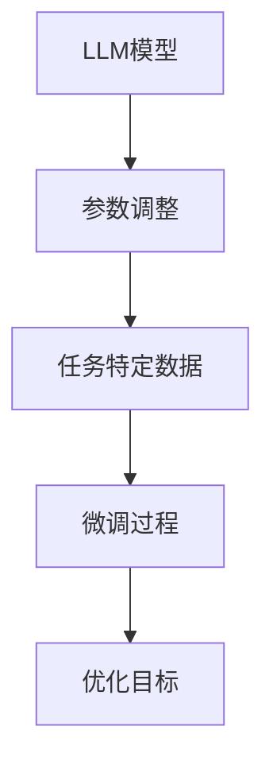
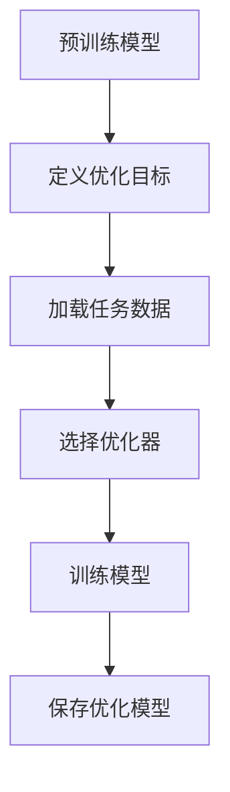
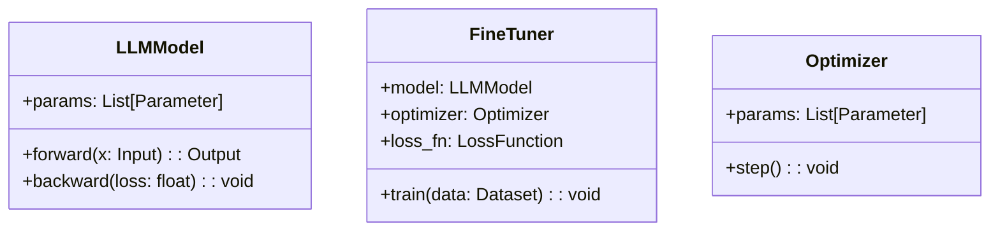
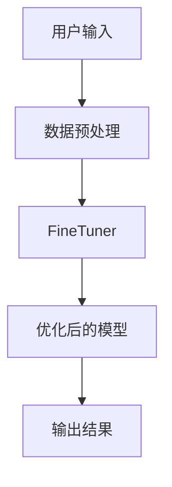
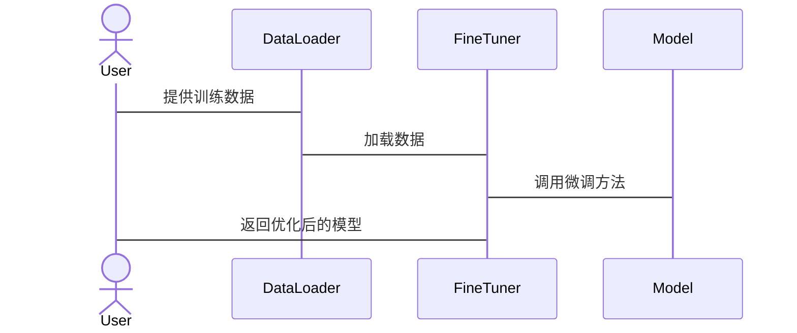

                 


# Fine-tuning LLM模型：提升AI Agent性能的关键

## 关键词：Fine-tuning, LLM模型, AI Agent, 模型微调, 人工智能

## 摘要：  
Fine-tuning LLM模型是提升AI Agent性能的关键技术。本文从背景、核心概念、算法原理、系统架构到项目实战，全面解析Fine-tuning LLM模型的方法与实践，帮助读者理解如何通过微调大语言模型，显著提升AI Agent的性能与应用场景的适应性。

---

# 第1章: Fine-tuning LLM模型的背景与基础

## 1.1 Fine-tuning LLM模型的背景

### 1.1.1 大语言模型的发展历程  
从自然语言处理（NLP）领域的角度来看，大语言模型（LLM，Large Language Models）的发展经历了从规则驱动到数据驱动的转变。近年来，以GPT系列模型为代表的生成式模型在学术界和工业界取得了巨大成功，但这些模型通常是在通用任务上进行预训练，难以直接适用于特定领域或特定场景的AI Agent任务。

### 1.1.2 Fine-tuning的概念与必要性  
Fine-tuning是指在预训练好的大模型基础上，针对特定任务或领域进行进一步的微调。这种技术可以显著提升模型在特定任务上的性能，同时降低从头训练模型的成本。对于AI Agent来说，Fine-tuning是实现任务适应性的关键步骤。

### 1.1.3 AI Agent的定义与应用场景  
AI Agent是一种能够感知环境、自主决策并执行任务的智能体。它可以应用于对话系统、智能客服、推荐系统、自动写作助手等多种场景。AI Agent的核心能力依赖于其底层模型的性能，而Fine-tuning则是优化这种性能的重要手段。

---

## 1.2 Fine-tuning LLM模型的核心概念

### 1.2.1 LLM模型的结构与工作原理  
大语言模型通常采用Transformer架构，通过自注意力机制和前馈网络处理输入文本。模型通过大量数据的预训练，掌握了语言的通用规律，但在特定任务上仍需进一步优化。

### 1.2.2 Fine-tuning与从头训练的对比  
从头训练需要从零开始训练一个模型，计算成本极高。而Fine-tuning只需要调整模型的尾部参数，是一种更高效的方法。对于AI Agent来说，Fine-tuning可以在保持模型通用能力的同时，增强其在特定任务上的表现。

### 1.2.3 AI Agent的性能评估标准  
AI Agent的性能可以从准确性、响应速度、用户体验等多个维度进行评估。Fine-tuning的目标是通过优化模型，显著提升这些性能指标。

---

## 1.3 Fine-tuning LLM模型的技术优势

### 1.3.1 降低训练成本  
Fine-tuning只需要调整部分参数，相比从头训练，计算资源消耗大幅减少。

### 1.3.2 提高模型适应性  
通过Fine-tuning，模型可以更好地适应特定任务或领域的需求，提升任务相关性。

### 1.3.3 增强模型的可解释性  
相比从头训练，Fine-tuning保留了模型的通用能力，使得模型的决策过程更具可解释性。

---

## 1.4 Fine-tuning LLM模型的挑战与解决方案

### 1.4.1 数据稀疏性问题  
在某些特定领域或任务中，数据可能较为稀疏，导致Fine-tuning效果有限。解决方案包括数据增强和引入领域知识。

### 1.4.2 模型过拟合风险  
过度Fine-tuning可能导致模型过拟合训练数据，影响泛化能力。解决方案包括使用正则化技术或选择更合适的微调策略。

### 1.4.3 解决方案与优化策略  
结合迁移学习和小样本学习等技术，可以有效缓解Fine-tuning中的挑战。

---

## 1.5 本章小结  
本章从背景、核心概念、技术优势和挑战四个方面，全面介绍了Fine-tuning LLM模型的必要性和重要性。下一章将深入探讨Fine-tuning的核心概念与联系。

---

# 第2章: Fine-tuning LLM模型的核心概念与联系

## 2.1 Fine-tuning的原理与实现

### 2.1.1 微调的基本原理  
Fine-tuning通过调整模型的参数，使得模型在特定任务上表现更好。通常包括任务特定数据的引入和优化目标的调整。

### 2.1.2 微调的实现步骤  
1. 加载预训练模型；2. 使用任务特定数据进行训练；3. 优化目标函数。

### 2.1.3 微调与迁移学习的关系  
Fine-tuning是迁移学习的一种具体实现，通过调整模型参数实现领域适应。

---

## 2.2 Fine-tuning与相关技术的对比

### 2.2.1 与模型压缩的对比  
模型压缩旨在减少模型大小，而Fine-tuning关注性能优化。

### 2.2.2 与模型蒸馏的对比  
模型蒸馏通过教师模型指导学生模型，而Fine-tuning直接调整模型参数。

### 2.2.3 与参数高效微调的对比  
参数高效微调是一种更高效的微调方法，通过引入新参数来减少计算成本。

---

## 2.3 Fine-tuning对AI Agent性能的影响

### 2.3.1 模型性能的提升  
通过Fine-tuning，AI Agent在特定任务上的准确性和生成质量显著提升。

### 2.3.2 模型泛化的增强  
Fine-tuning使模型在不同场景下更具适应性。

### 2.3.3 模型鲁棒性的优化  
通过Fine-tuning，模型对输入数据的噪声和不确定性更具鲁棒性。

---

## 2.4 Fine-tuning的实体关系图



---

## 2.5 本章小结  
本章从原理、技术对比和性能影响三个方面，详细阐述了Fine-tuning的核心概念及其对AI Agent性能的提升作用。下一章将深入解析Fine-tuning的算法原理。

---

# 第3章: Fine-tuning LLM模型的算法原理

## 3.1 微调算法的概述

### 3.1.1 微调的基本流程  
1. 加载预训练模型；2. 定义优化目标；3. 使用任务特定数据训练；4. 调整模型参数。

### 3.1.2 微调的主要方法  
包括全参数微调、部分参数微调和参数高效微调。

### 3.1.3 微调的数学模型  
微调的目标是最小化特定任务的损失函数：

$$L = \sum_{i=1}^{n} \text{loss}(x_i, y_i)$$

---

## 3.2 微调算法的数学模型

### 3.2.1 损失函数  
常用交叉熵损失函数：

$$\text{Loss} = -\sum_{i=1}^{n} y_i \log p(y_i|x_i)$$

### 3.2.2 优化器  
通常使用Adam优化器：

$$\theta_{t+1} = \theta_t - \eta \cdot \nabla_\theta L$$

### 3.2.3 评估指标  
准确率、F1分数等。

---

## 3.3 Fine-tuning的流程图



---

## 3.4 本章小结  
本章从数学模型和流程图的角度，详细讲解了Fine-tuning的算法原理。下一章将从系统角度分析Fine-tuning的实现。

---

# 第4章: Fine-tuning LLM模型的系统分析与架构设计

## 4.1 系统分析

### 4.1.1 项目背景  
通过Fine-tuning优化AI Agent的性能。

### 4.1.2 系统功能设计  
1. 数据加载模块；2. 模型微调模块；3. 性能评估模块。

### 4.1.3 领域模型类图  


---

## 4.2 系统架构设计

### 4.2.1 系统架构图  


### 4.2.2 系统交互图  


---

## 4.3 本章小结  
本章从系统分析和架构设计的角度，详细阐述了Fine-tuning的实现过程。下一章将通过项目实战进一步验证这些设计。

---

# 第5章: Fine-tuning LLM模型的项目实战

## 5.1 环境安装

### 5.1.1 安装依赖  
```
pip install torch transformers datasets
```

### 5.1.2 确保GPU支持  
检查是否安装了CUDA版本的PyTorch。

---

## 5.2 系统核心实现源代码

### 5.2.1 数据加载模块  
```python
from torch.utils.data import Dataset, DataLoader

class CustomDataset(Dataset):
    def __init__(self, texts, labels):
        self.texts = texts
        self.labels = labels
        
    def __len__(self):
        return len(self.texts)
    
    def __getitem__(self, idx):
        return self.texts[idx], self.labels[idx]
```

### 5.2.2 模型微调模块  
```python
from transformers import AutoModelForSequenceClassification, AutoTokenizer

class FineTuner:
    def __init__(self, model_name, num_labels):
        self.model = AutoModelForSequenceClassification.from_pretrained(model_name, num_labels=num_labels)
        self.tokenizer = AutoTokenizer.from_pretrained(model_name)
        
    def train(self, train_loader, epochs=3, learning_rate=2e-5):
        optimizer = torch.optim.AdamW(self.model.parameters(), lr=learning_rate)
        criterion = nn.CrossEntropyLoss()
        
        for epoch in range(epochs):
            for batch in train_loader:
                inputs, labels = batch
                inputs = self.tokenizer(inputs, padding=True, return_tensors="pt")
                outputs = self.model(**inputs)
                loss = criterion(outputs.logits, labels)
                loss.backward()
                optimizer.step()
                optimizer.zero_grad()
```

---

## 5.3 代码应用解读与分析

### 5.3.1 数据加载模块的解读  
该模块负责将训练数据加载为可迭代的批次，方便模型训练。

### 5.3.2 模型微调模块的解读  
该模块实现了模型的微调过程，包括定义模型、选择优化器和损失函数，以及训练循环。

---

## 5.4 实际案例分析

### 5.4.1 数据准备  
假设我们有一个文本分类任务，训练数据如下：

```
texts = ["This is a positive review.", "This is a negative review."]
labels = [0, 1]
```

### 5.4.2 模型微调  
使用上述代码，将训练数据加载为 DataLoader，并调用FineTuner的train方法。

### 5.4.3 模型评估  
训练完成后，可以使用测试数据评估模型的性能。

---

## 5.5 本章小结  
本章通过实际案例，详细讲解了Fine-tuning的实现过程。下一章将总结Fine-tuning的最佳实践和注意事项。

---

# 第6章: Fine-tuning LLM模型的最佳实践与注意事项

## 6.1 最佳实践

### 6.1.1 数据增强  
通过数据增强技术，提升模型的泛化能力。

### 6.1.2 优化器选择  
选择合适的优化器，如Adam或AdamW。

### 6.1.3 评估指标  
使用准确率、F1分数等指标评估模型性能。

---

## 6.2 小结与注意事项

### 6.2.1 小结  
Fine-tuning是一种高效优化AI Agent性能的重要技术。

### 6.2.2 注意事项  
1. 数据质量至关重要；2. 调参需谨慎；3. 模型评估需全面。

---

## 6.3 拓展阅读

### 6.3.1 参数高效微调技术  
探索更高效的微调方法。

### 6.3.2 最小化计算成本  
研究如何在有限资源下优化微调过程。

---

# 第7章: 结论与未来展望

## 7.1 结论  
Fine-tuning LLM模型是提升AI Agent性能的关键技术，通过合理的设计和优化，可以显著提升模型的适应性和性能。

## 7.2 未来展望  
未来，Fine-tuning技术将进一步与领域知识和小样本学习结合，推动AI Agent的发展。

---

# 附录: Fine-tuning LLM模型相关术语表

## 1. Fine-tuning  
微调，指在预训练模型基础上，针对特定任务调整模型参数。

## 2. LLM模型  
大语言模型，指经过大量数据预训练的大型语言模型。

## 3. AI Agent  
人工智能代理，指能够自主决策并执行任务的智能体。

## 4. 参数高效微调  
一种更高效的微调方法，通过引入新参数减少计算成本。

---

# 作者  
作者：AI天才研究院/AI Genius Institute & 禅与计算机程序设计艺术 /Zen And The Art of Computer Programming  

---

以上是《Fine-tuning LLM模型：提升AI Agent性能的关键》的完整目录和内容框架。希望对您有所帮助！

