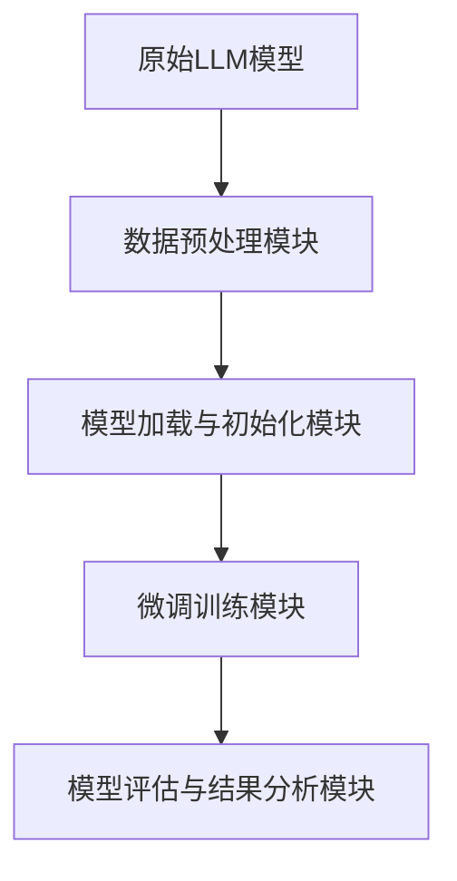

                 

# Fine-tuning技巧：如何让LLM更适应特定任务

---

## 关键词：Fine-tuning, Large Language Models, 机器学习, 自然语言处理, 参数微调, 任务适配

---

## 摘要：本文深入探讨了如何通过Fine-tuning技术使大型语言模型（LLM）更好地适应特定任务。文章从Fine-tuning的背景与基础出发，详细分析了其算法原理与数学模型，并结合系统架构与实现，提供了丰富的实战案例和优化技巧，帮助读者全面掌握Fine-tuning的核心思想与应用场景。

---

## 第一部分：Fine-tuning背景与基础

### 第1章：Fine-tuning的核心概念与背景

#### 1.1 Fine-tuning的定义与背景

**1.1.1 大语言模型（LLM）的基本概念**  
大型语言模型（LLM）是一种基于深度学习的自然语言处理模型，如GPT系列、BERT系列等。这些模型通过大量数据训练，具备理解上下文、生成文本的能力，能够处理多种NLP任务，如文本分类、机器翻译、问答系统等。

**1.1.2 Fine-tuning的定义与特点**  
Fine-tuning是指在预训练好的LLM基础上，针对特定任务进行进一步的微调训练。其特点是：  
- **任务适配性**：通过调整模型参数，使其更擅长特定任务。  
- **数据高效性**：通常需要少量特定任务的数据进行微调。  
- **性能提升**：相比直接使用预训练模型，Fine-tuning能够显著提高任务相关性。  

**1.1.3 Fine-tuning的必要性与应用场景**  
预训练模型虽然通用性强，但在特定领域或任务上可能表现不佳。例如，医疗领域的问答系统需要更准确的医学知识，而预训练模型可能不具备足够的领域知识。通过Fine-tuning，可以在保留模型通用能力的同时，提升其在特定任务上的性能。

---

#### 1.2 Fine-tuning与迁移学习的关系

**1.2.1 迁移学习的基本原理**  
迁移学习是一种通过将一个领域中学到的知识应用到另一个领域中的机器学习方法。其核心思想是利用源任务的数据或特征，辅助目标任务的学习。

**1.2.2 Fine-tuning作为迁移学习的一种方法**  
Fine-tuning可以看作是一种特殊的迁移学习方法，它通过在源任务（预训练）的基础上，对目标任务进行微调，使模型更好地适应目标任务。

**1.2.3 Fine-tuning的优势与局限性**  
- **优势**：  
  - 简单易实现，仅需调整部分参数。  
  - 可以利用已有模型的特征提取能力。  
- **局限性**：  
  - 需要特定任务的数据支持。  
  - 过度依赖微调数据的质量和数量。  

---

#### 1.3 Fine-tuning在LLM中的重要性

**1.3.1 LLM的通用性与适应性问题**  
预训练模型虽然通用性强，但在特定领域或任务上可能表现不足。例如，法律领域的文本分类需要特定的法律术语和知识，而预训练模型可能无法准确捕捉这些信息。

**1.3.2 Fine-tuning如何解决特定任务的需求**  
通过Fine-tuning，可以在预训练模型的基础上，进一步优化模型在特定任务上的性能。例如，针对医疗领域的问答系统，可以通过Fine-tuning使模型更好地理解医学术语和上下文。

**1.3.3 Fine-tuning在实际应用中的案例**  
- **案例1**：医疗领域的疾病诊断助手。通过Fine-tuning，模型可以更好地理解医学术语和诊断逻辑。  
- **案例2**：金融领域的风险评估系统。通过Fine-tuning，模型可以更准确地识别金融数据中的风险信号。

---

## 第二部分：Fine-tuning的算法原理与数学模型

### 第2章：Fine-tuning的算法原理

#### 2.1 Fine-tuning的基本原理

**2.1.1 参数微调的核心思想**  
Fine-tuning的核心思想是对预训练模型的参数进行进一步优化，使其更适应特定任务。通常只调整模型的顶层参数，而保持底层参数不变，以保留模型的通用特征提取能力。

**2.1.2 任务特定参数的初始化方法**  
在Fine-tuning过程中，通常会为特定任务初始化一些任务相关的参数，例如任务特定的输出层权重。

**2.1.3 Fine-tuning的训练流程**  
1. 加载预训练好的模型。  
2. 使用特定任务的数据进行训练。  
3. 优化目标函数，调整模型参数。  

---

#### 2.2 Fine-tuning的数学模型

**2.2.1 基于Transformer的LLM数学模型**  
预训练模型通常基于Transformer架构，其编码器和解码器的结构可以用以下公式表示：

$$
\text{Encoder} = \text{Stack}(n) \quad \text{Decoder} = \text{Stack}(n)
$$

其中，$n$表示堆叠的层数。

**2.2.2 Fine-tuning的损失函数**  
在Fine-tuning过程中，通常使用交叉熵损失函数：

$$
\mathcal{L}(\theta) = -\sum_{i=1}^{N} \sum_{j=1}^{V} y_{ij} \log p_{ij}
$$

其中，$y_{ij}$是真实标签，$p_{ij}$是模型预测的概率。

**2.2.3 参数更新的数学推导**  
使用梯度下降法更新参数：

$$
\theta_{t+1} = \theta_t - \eta \frac{\partial \mathcal{L}}{\partial \theta_t}
$$

其中，$\eta$是学习率。

---

#### 2.3 Fine-tuning的优化方法

**2.3.1 学习率的调整策略**  
在Fine-tuning过程中，通常会降低学习率，以避免参数更新幅度过大破坏预训练模型的特征提取能力。

**2.3.2 参数量与训练数据量的关系**  
Fine-tuning需要的参数量与任务数据量成正比，通常需要几百到几千个样本进行微调。

**2.3.3 正则化方法在Fine-tuning中的应用**  
可以使用L2正则化防止过拟合：

$$
\mathcal{L}_{\text{reg}} = \lambda \sum_{i} \theta_i^2
$$

其中，$\lambda$是正则化系数。

---

## 第三部分：Fine-tuning的系统架构与实现

### 第3章：Fine-tuning的系统架构设计

#### 3.1 系统架构概述

**3.1.1 系统输入：原始LLM模型与任务数据**  
- 预训练好的LLM模型（如BERT、GPT）。  
- 特定任务的数据集（如医疗领域的文本数据）。  

**3.1.2 系统输出：Fine-tuned模型**  
- 微调后的模型具备特定任务的优化性能。  

**3.1.3 系统模块划分：数据预处理、模型加载、微调训练、结果评估**  
- 数据预处理：将原始数据转换为模型可接受的格式。  
- 模型加载：加载预训练好的模型权重。  
- 微调训练：使用特定任务的数据训练模型。  
- 结果评估：评估模型在特定任务上的性能。  

---

#### 3.2 系统功能设计

**3.2.1 数据预处理模块**  
- 数据清洗：去除无关信息，保留任务相关数据。  
- 数据转换：将数据转换为模型输入格式（如Tensor）。  

**3.2.2 模型加载与初始化模块**  
- 加载预训练模型权重。  
- 初始化任务特定的参数。  

**3.2.3 微调训练模块**  
- 定义损失函数和优化器。  
- 进行微调训练，更新模型参数。  

**3.2.4 模型评估与结果分析模块**  
- 使用验证集评估模型性能。  
- 分析模型输出，优化参数。  

---

#### 3.3 系统架构图（Mermaid）

---

## 总结与展望

通过本文的详细讲解，我们了解了Fine-tuning的核心概念、算法原理和系统架构，以及如何通过Fine-tuning使LLM更好地适应特定任务。未来，随着AI技术的不断发展，Fine-tuning将在更多领域得到广泛应用，帮助模型更好地服务于人类需求。

---

**作者：AI天才研究院/AI Genius Institute & 禅与计算机程序设计艺术 /Zen And The Art of Computer Programming**

