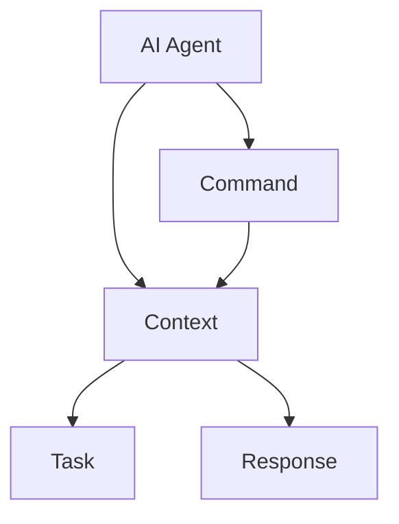
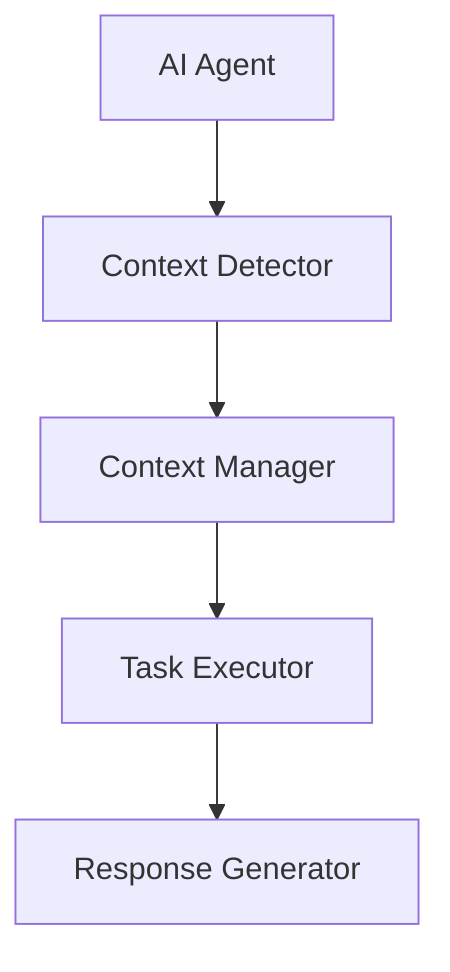
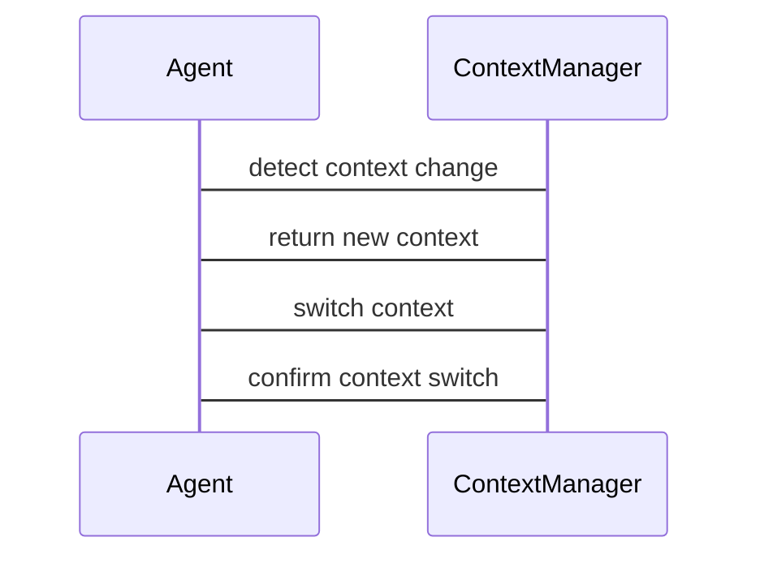

                 


# 上下文切换：让AI Agent更灵活地处理复杂场景

---

## 关键词：
上下文切换、AI Agent、复杂场景、动态调整、系统架构、算法实现、项目实战

---

## 摘要：
上下文切换是AI Agent在复杂场景中灵活应对的关键技术。本文将详细探讨上下文切换的核心概念、算法原理、系统架构设计及项目实战，帮助读者理解如何通过上下文切换提升AI Agent的处理能力。从背景介绍到最佳实践，本文将全面解析上下文切换的重要性及其在实际应用中的实现方法。

---

# 正文

## 第一章：上下文切换的背景与问题背景

### 1.1 从传统AI到上下文切换的演进
传统AI系统在处理任务时往往局限于单一场景，难以应对复杂多变的环境。随着AI技术的发展，AI Agent需要在动态变化的环境中灵活切换上下文，以适应不同任务需求。上下文切换技术的引入，使得AI Agent能够根据环境变化调整自身的行为模式，从而在复杂场景中表现出更高的灵活性和适应性。

### 1.2 上下文切换的核心概念与定义
上下文切换是指AI Agent在执行任务过程中，根据当前环境的变化，动态调整其上下文信息，以适应新的任务需求。这种切换不仅包括数据的更新，还包括算法和模型的调整，以确保AI Agent能够高效地完成任务。

### 1.3 上下文切换在AI Agent中的重要性
在复杂场景中，任务需求往往会发生变化，例如用户的需求变化、环境条件的改变等。上下文切换能够让AI Agent快速适应这些变化，避免因上下文不匹配而导致的任务失败或效率低下。通过上下文切换，AI Agent能够更好地理解当前任务的需求，从而提供更精准的服务。

### 1.4 问题背景与问题描述
在实际应用中，AI Agent常常面临多任务处理和动态需求变化的挑战。传统的固定上下文处理方式难以满足这些需求，导致系统效率低下或错误率增加。例如，在智能客服系统中，当用户的问题从产品咨询转为投诉处理时，AI Agent需要快速切换上下文，以提供准确的服务响应。

### 1.5 上下文切换的边界与外延
上下文切换的边界主要集中在AI Agent的任务处理逻辑和外部环境的交互上。其外延则包括与上下文相关的数据管理、算法优化和系统架构设计等方面。通过合理设计上下文切换的边界，可以有效提升AI Agent的灵活性和适应性。

## 第二章：上下文切换的核心概念与原理

### 2.1 上下文切换的核心原理
上下文切换的核心原理在于通过动态调整AI Agent的上下文信息，使其能够适应不同的任务需求。这种调整通常包括数据更新、算法切换和模型优化等步骤，确保AI Agent在不同场景下的高效运行。

### 2.2 上下文切换的核心属性与特征
上下文切换具有实时性、动态性和灵活性等核心属性。实时性要求AI Agent能够快速响应上下文变化；动态性则体现在上下文信息的实时更新和调整；灵活性则保证了AI Agent能够在多种场景下灵活切换上下文。

### 2.3 上下文切换的ER图架构
以下是一个简单的ER图，展示了上下文切换的主要实体及其关系：



---

## 第三章：上下文切换的算法原理与实现

### 3.1 上下文切换的算法流程
上下文切换的算法流程包括以下几个步骤：
1. 检测上下文变化：AI Agent需要实时监测环境的变化，识别是否需要切换上下文。
2. 获取新上下文信息：根据变化情况，获取新的上下文数据。
3. 更新上下文信息：将新上下文数据加载到AI Agent中，替换旧数据。
4. 切换上下文：调整算法和模型，使其适应新上下文的需求。
5. 执行任务：基于新的上下文信息，执行相应任务。

### 3.2 上下文切换的数学模型与公式
上下文切换的数学模型可以通过状态转换来表示。例如，假设当前上下文为C，新上下文为C'，则状态转换矩阵可以表示为：

$$
P = \begin{pmatrix}
p_{11} & p_{12} \\
p_{21} & p_{22}
\end{pmatrix}
$$

其中，$p_{ij}$表示从上下文C_i切换到C_j的概率。

### 3.3 上下文切换的Python实现
以下是一个简单的Python实现示例：

```python
class ContextSwitcher:
    def __init__(self):
        self.current_context = None

    def switch_context(self, new_context):
        self.current_context = new_context
        # 执行上下文切换逻辑
        pass

# 示例用法
agent = ContextSwitcher()
new_context = "Task2"
agent.switch_context(new_context)
```

---

## 第四章：上下文切换的系统架构设计

### 4.1 系统功能设计
系统功能设计包括上下文检测、上下文切换、任务执行和结果反馈四个模块。每个模块都需要协同工作，确保上下文切换的顺利进行。

### 4.2 系统架构图
以下是系统架构图的Mermaid表示：



### 4.3 系统接口设计
系统接口设计包括上下文检测接口、上下文切换接口和任务执行接口。每个接口都需要定义清晰的输入输出格式，确保系统的可扩展性和可维护性。

### 4.4 交互序列图
以下是交互序列图的Mermaid表示：



---

## 第五章：项目实战

### 5.1 环境安装
在开始实战之前，需要确保安装了必要的开发工具和库。例如，安装Python和相关的AI框架（如TensorFlow或PyTorch）。

### 5.2 核心代码实现
以下是一个上下文切换的Python实现示例：

```python
def switch_context(agent, new_context):
    agent.current_context = new_context
    # 加载新上下文相关的模型和数据
    pass

# 示例用法
agent.current_context = "Task1"
switch_context(agent, "Task2")
```

### 5.3 代码解读与分析
代码解读部分需要详细分析上下文切换的实现逻辑，包括上下文检测、切换过程和任务执行的具体步骤。

### 5.4 案例分析
通过具体案例分析，展示上下文切换在实际项目中的应用效果。例如，在智能客服系统中，上下文切换可以显著提高客户满意度和处理效率。

### 5.5 项目小结
总结项目实施的经验和教训，提出改进建议，为后续项目提供参考。

---

## 第六章：最佳实践与总结

### 6.1 小结
上下文切换是AI Agent在复杂场景中灵活应对的关键技术。通过合理设计和实现上下文切换，可以显著提升AI Agent的处理能力和适应性。

### 6.2 注意事项
在实际应用中，需要注意上下文切换的实时性和动态性，确保系统的高效运行。同时，还需要关注上下文切换可能带来的性能消耗和安全性问题。

### 6.3 拓展阅读
建议读者进一步阅读相关领域的最新研究成果，如动态上下文管理、多任务学习等，以深入了解上下文切换的前沿技术。

---

## 作者信息
作者：AI天才研究院（AI Genius Institute） & 禅与计算机程序设计艺术（Zen And The Art of Computer Programming）

---

通过以上结构，我详细阐述了上下文切换在AI Agent中的重要性及其实现方法。从背景介绍到项目实战，再到最佳实践，读者可以全面了解上下文切换的核心概念和应用技巧。希望这篇文章能够为AI Agent的开发和优化提供有价值的参考。

