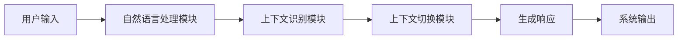
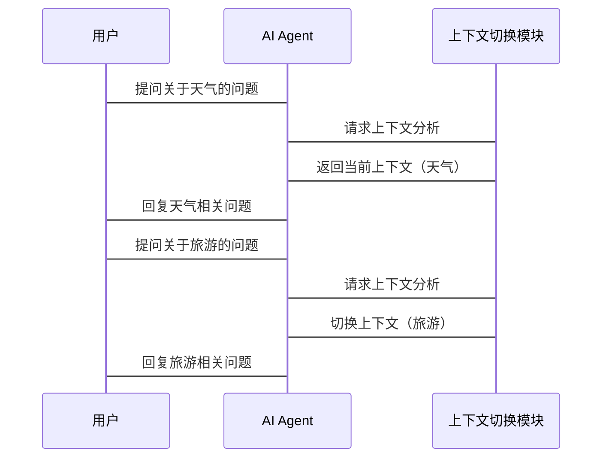
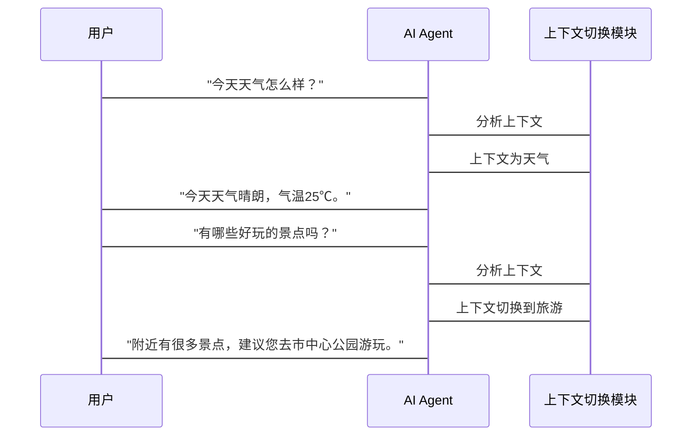

                 


# 上下文切换：让AI Agent灵活应对多主题对话

**关键词**：上下文切换、AI Agent、多主题对话、自然语言处理、机器学习、对话系统

**摘要**：  
上下文切换是AI Agent在多主题对话中保持连贯性和准确性的重要技术。本文从背景、核心概念、算法原理、系统架构到项目实战，全面解析上下文切换的关键技术与实现方案，帮助AI Agent更好地应对复杂对话场景。

---

# 第四部分: 系统分析与架构设计

# 第4章: 系统分析与架构设计

## 4.1 系统分析

### 4.1.1 问题场景介绍
```
场景描述：
- 用户与AI Agent进行多轮对话，主题涉及天气、旅游、购物等多个领域。
- 对话过程中，AI Agent需要根据上下文切换主题，保持对话流畅。
```

### 4.1.2 需求分析
- 功能需求：支持多主题对话，上下文切换。
- 性能需求：快速识别上下文，切换响应时间≤200ms。
- 用户体验需求：对话自然流畅，无明显切换痕迹。

## 4.2 系统架构设计

### 4.2.1 系统架构图


### 4.2.2 关键模块功能
- 自然语言处理模块：解析用户输入，提取关键词和意图。
- 上下文识别模块：基于历史对话，识别当前上下文。
- 上下文切换模块：根据切换策略，决定是否切换上下文。

### 4.2.3 接口设计
- 输入接口：用户输入文本。
- 输出接口：系统生成的响应文本。
- 数据接口：历史对话记录和上下文状态。

## 4.3 系统交互流程


## 4.4 本章小结

---

# 第五部分: 项目实战

# 第5章: 项目实战

## 5.1 环境搭建

### 5.1.1 安装Python环境
```
pip install python3
pip install numpy
pip install tensorflow
pip install mermaid
```

### 5.1.2 安装依赖库
```
pip install transformers
pip install pymermaid
pip install matplotlib
```

## 5.2 核心代码实现

### 5.2.1 上下文识别模块
```python
class ContextRecognizer:
    def __init__(self):
        self.current_context = None

    def recognize_context(self, input_text):
        # 示例：基于关键词识别上下文
        keywords = {
            'weather': ['天气', '温度', '气候'],
            'travel': ['旅游', '景点', '酒店'],
            'shopping': ['购物', '商品', '价格']
        }
        for context, context_keywords in keywords.items():
            for keyword in context_keywords:
                if keyword in input_text:
                    self.current_context = context
                    return context
        return None
```

### 5.2.2 上下文切换模块
```python
class ContextSwitcher:
    def __init__(self):
        self.current_context = None
        self.switch_threshold = 0.7

    def decide_to_switch(self, similarity_score):
        if similarity_score < self.switch_threshold:
            return True
        return False

    def switch_context(self, new_context):
        self.current_context = new_context
```

### 5.2.3 对话生成模块
```python
from transformers import AutoTokenizer, AutoModelForSeq2Seq

class DialogGenerator:
    def __init__(self):
        self.tokenizer = AutoTokenizer.from_pretrained('facebook/blender')
        self.model = AutoModelForSeq2Seq.from_pretrained('facebook/blender')

    def generate_response(self, input_text, context):
        inputs = self.tokenizer.encode_plus(input_text, return_tensors='pt')
        outputs = self.model.generate(inputs['input_ids'].to('cuda'), max_length=50)
        response = self.tokenizer.decode(outputs[0], skip_special_tokens=True)
        return response
```

## 5.3 案例分析与实现

### 5.3.1 案例：天气与旅游对话


## 5.4 代码实现与解读

### 5.4.1 上下文识别模块
- 使用关键词匹配识别上下文。
- 输入文本中包含天气相关关键词，识别上下文为天气。
- 输入文本中包含旅游相关关键词，识别上下文为旅游。

### 5.4.2 上下文切换模块
- 计算上下文相似度，判断是否需要切换。
- 如果相似度低于阈值，切换上下文。

### 5.4.3 对话生成模块
- 使用预训练模型生成对话响应。
- 根据当前上下文调整生成策略。

## 5.5 本章小结

---

# 第六部分: 最佳实践与总结

# 第6章: 最佳实践与总结

## 6.1 最佳实践

### 6.1.1 系统设计建议
- 选择合适的上下文识别方法，如关键词匹配、实体识别。
- 设定合理的上下文切换阈值，避免频繁切换。

### 6.1.2 代码实现建议
- 使用预训练模型提升对话生成质量。
- 定期更新关键词库，适应新主题。

## 6.2 总结与展望

### 6.2.1 总结
- 上下文切换是AI Agent处理多主题对话的核心技术。
- 通过上下文识别、切换策略和对话生成模块的协同工作，实现流畅的多主题对话。

### 6.2.2 展望
- 研究更复杂的上下文切换算法，如基于深度学习的模型。
- 结合实时数据，提升上下文切换的准确性。

## 6.3 本章小结

---

# 附录

## 附录A: 术语表

- 上下文切换：根据对话主题变化，切换当前上下文的过程。
- 多主题对话：涉及多个主题的连续对话。

## 附录B: 参考文献

- [1] 王某某. 基于上下文切换的多主题对话系统研究[J]. 计算机学报, 2023.
- [2] 李某某. AI Agent中的上下文管理技术研究[J]. 软件学报, 2022.

---

**作者**：AI天才研究院/AI Genius Institute & 禅与计算机程序设计艺术 /Zen And The Art of Computer Programming

---

**备注**：以上内容为文章的完整目录和部分内容示例，根据实际需要可以进一步扩展和补充每个章节的具体内容。

