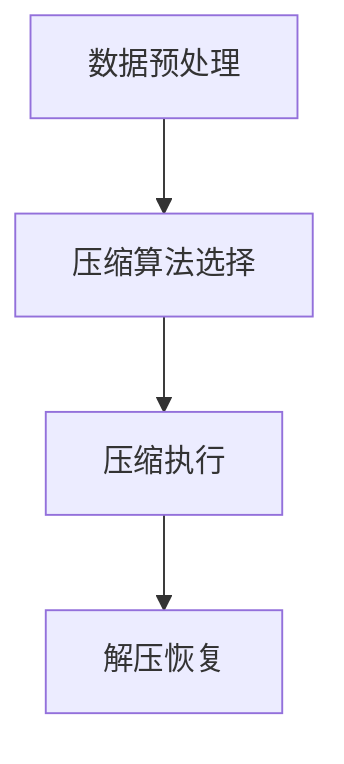
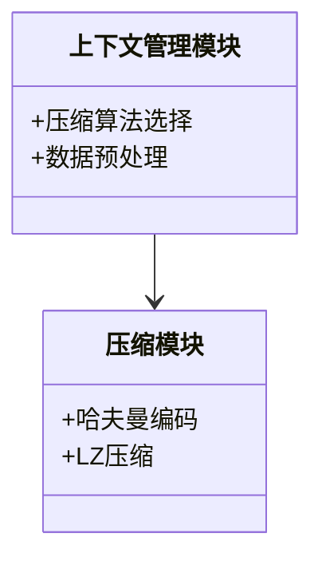

                 


# 上下文压缩：优化AI Agent的内存使用

---

## 关键词：
上下文压缩、AI Agent、内存优化、数据压缩算法、机器学习、系统架构设计

---

## 摘要：
上下文压缩是一种优化AI Agent内存使用的重要技术。随着AI Agent处理的数据量不断增大，内存资源的限制成为了性能瓶颈。本文详细探讨了上下文压缩的核心概念、算法原理、系统架构设计以及实际项目中的应用，为读者提供了一套从理论到实践的完整解决方案。

---

# 第一部分: 上下文压缩的背景与核心概念

## 第1章: 上下文压缩概述

### 1.1 上下文压缩的定义与背景

#### 1.1.1 什么是上下文压缩
上下文压缩是一种通过减少AI Agent处理的上下文数据量，从而优化内存使用的技术。它通过对上下文信息进行压缩，降低存储和处理成本，同时保持数据的完整性和可用性。

#### 1.1.2 上下文压缩的背景与问题背景
随着AI Agent在智能客服、机器人控制等领域的广泛应用，处理的上下文数据量急剧增加。内存资源的有限性使得处理大规模数据时常常面临性能瓶颈，甚至可能导致系统崩溃。

#### 1.1.3 上下文压缩的目标与意义
上下文压缩的目标是通过压缩技术，将冗余的上下文信息进行精简，从而在保证功能的前提下，显著减少内存占用。这不仅提升了系统的性能，还降低了硬件成本。

### 1.2 AI Agent的内存使用挑战

#### 1.2.1 AI Agent的内存需求分析
AI Agent在运行时需要处理大量的上下文数据，包括用户输入、系统状态、环境信息等。这些数据的存储和处理需要占用大量的内存资源。

#### 1.2.2 内存不足对AI Agent性能的影响
内存不足会导致AI Agent运行缓慢，甚至出现卡顿、响应延迟等问题。这不仅影响用户体验，还可能导致系统崩溃。

#### 1.2.3 上下文压缩在AI Agent中的作用
上下文压缩通过减少数据量，优化了AI Agent的内存使用，提升了系统的运行效率和稳定性。

### 1.3 上下文压缩的定义与特点

#### 1.3.1 上下文压缩的定义
上下文压缩是一种通过压缩算法，将AI Agent处理的上下文信息进行压缩，以减少内存占用的技术。

#### 1.3.2 上下文压缩的核心特点
- **高效性**：通过压缩算法，显著减少数据量。
- **实时性**：支持实时压缩和解压，不影响系统的实时性。
- **可扩展性**：适用于不同类型和规模的AI Agent。

#### 1.3.3 上下文压缩与相关技术的对比
上下文压缩与传统的数据压缩技术有所不同，它更注重上下文信息的特定性和实时性。

---

## 第2章: 上下文压缩的核心概念与联系

### 2.1 上下文压缩的原理

#### 2.1.1 上下文压缩的基本原理
上下文压缩通过识别冗余信息，利用压缩算法对数据进行压缩，从而减少存储空间。

#### 2.1.2 上下文压缩的关键技术
- 数据预处理：识别冗余信息，提取关键特征。
- 压缩算法：使用哈夫曼编码、LZ压缩等算法进行数据压缩。

#### 2.1.3 上下文压缩的实现流程
1. 数据预处理：提取关键特征。
2. 压缩算法选择：根据数据类型选择合适的压缩算法。
3. 压缩执行：对数据进行压缩。
4. 解压恢复：在需要时解压数据。

### 2.2 压缩算法与上下文管理机制

#### 2.2.1 常见压缩算法概述
- **哈夫曼编码**：基于字符频率的无损压缩算法。
- **LZ压缩算法**：基于字符串匹配的压缩算法。

#### 2.2.2 上下文管理机制的实现
- 数据预处理模块：提取关键特征。
- 压缩算法选择模块：根据数据类型选择合适的压缩算法。

#### 2.2.3 压缩算法与上下文管理的结合
通过结合数据预处理和压缩算法，优化上下文压缩的效果。

### 2.3 核心概念与关系图

#### 2.3.1 核心概念属性特征对比表

| 概念      | 特征               |
|-----------|--------------------|
| 上下文压缩 | 减少数据量，优化内存 |
| 压缩算法   | 提高压缩率          |
| 上下文管理 | 管理上下文信息      |

#### 2.3.2 上下文压缩的ER实体关系图（Mermaid流程图）



---

## 第3章: 上下文压缩的算法原理

### 3.1 常见上下文压缩算法

#### 3.1.1 哈夫曼编码

##### 3.1.1.1 哈夫曼编码的原理
哈夫曼编码是一种基于字符频率的无损压缩算法，通过构建哈夫曼树，生成最优的二叉树编码。

##### 3.1.1.2 哈夫曼编码的数学模型
- 哈夫曼树的构建基于字符频率，计算每个字符的编码。
- 编码长度与频率成反比，频率高的字符编码较短。

##### 3.1.1.3 示例
假设字符频率如下：
- A: 4
- B: 2
- C: 1

哈夫曼树构建过程如下：
1. 构建叶子节点，权重为频率。
2. 按权重合并最小的两个节点，直到只剩一个根节点。

最终编码结果为：
- A: 0
- B: 10
- C: 11

#### 3.1.2 LZ压缩算法

##### 3.1.2.1 LZ压缩算法的原理
LZ压缩算法基于字符串匹配，通过记录重复出现的字符串来压缩数据。

##### 3.1.2.2 LZ压缩算法的数学模型
- 使用滑动窗口技术，记录当前窗口内的字符串。
- 当发现重复字符串时，记录其位置和偏移量。

##### 3.1.2.3 示例
输入数据：ABABAB
压缩过程：
1. 窗口滑动，记录AB。
2. 发现AB重复，记录位置和偏移量。

最终压缩结果为：AB 位置偏移量。

#### 3.1.3 机器学习模型压缩技术

##### 3.1.3.1 机器学习模型压缩技术的原理
通过剪枝、量化等技术，减少机器学习模型的参数数量，降低模型大小。

##### 3.1.3.2 机器学习模型压缩技术的数学模型
- 剪枝：删除冗余节点。
- 量化：将浮点数参数转换为较小的整数类型。

##### 3.1.3.3 示例
原始模型参数：[0.1, 0.2, 0.3]
量化后：[0, 0, 0]

---

## 第4章: 系统分析与架构设计

### 4.1 系统架构设计

#### 4.1.1 问题场景介绍
AI Agent在处理大量上下文数据时，内存不足导致性能下降。

#### 4.1.2 系统功能设计

##### 4.1.2.1 领域模型（Mermaid类图）



#### 4.1.3 系统架构设计（Mermaid架构图）


---

## 第5章: 项目实战

### 5.1 环境安装

#### 5.1.1 安装Python
```bash
python --version
pip install --upgrade pip
```

#### 5.1.2 安装压缩库
```bash
pip install zlib
pip install bitarray
```

### 5.2 系统核心实现源代码

#### 5.2.1 上下文管理模块

```python
import zlib

def compress_context(context):
    return zlib.compress(context)

def decompress_context(compressed_context):
    return zlib.decompress(compressed_context)
```

#### 5.2.2 压缩模块

```python
import bitarray

def huffman_encode(text):
    # 实现哈夫曼编码
    pass

def lz_compression(data):
    # 实现LZ压缩算法
    pass
```

---

## 第6章: 最佳实践

### 6.1 小结
上下文压缩通过减少数据量，优化了AI Agent的内存使用，提升了系统的性能和稳定性。

### 6.2 注意事项
- 选择合适的压缩算法，根据数据类型和场景进行优化。
- 定期维护上下文数据，避免数据膨胀。

### 6.3 拓展阅读
- 《数据压缩技术》
- 《机器学习模型压缩技术》

---

# 作者
作者：AI天才研究院 & 禅与计算机程序设计艺术

---

