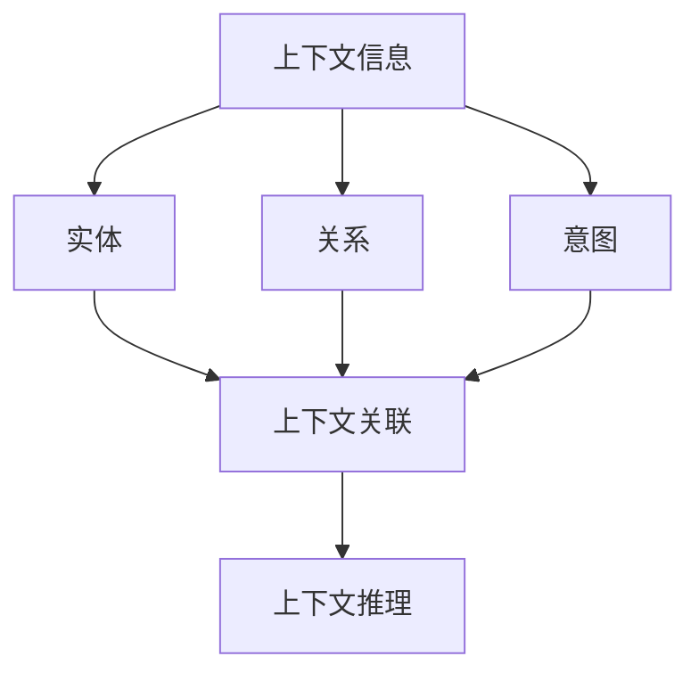
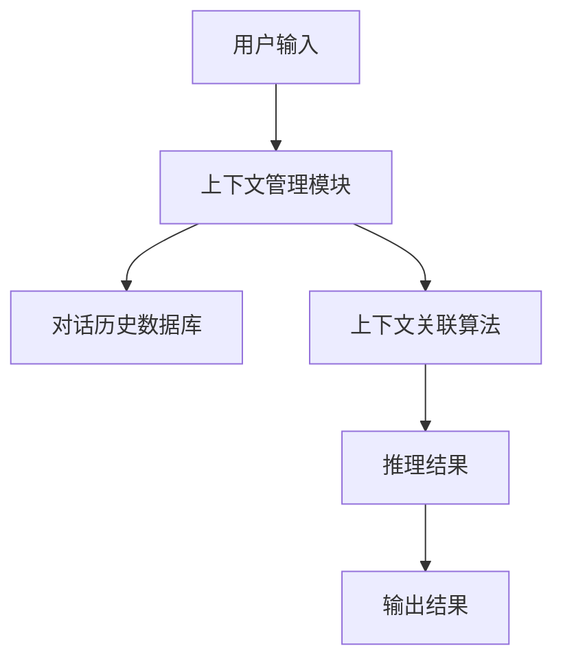

                 


# 上下文管理：增强AI Agent的对话连贯性

## 关键词：
上下文管理, AI Agent, 对话连贯性, 自然语言处理, 对话系统

## 摘要：
上下文管理是实现AI Agent对话连贯性的关键技术。本文将深入探讨上下文管理的核心概念、算法原理、系统架构以及实际应用，通过案例分析和代码实现，展示如何利用上下文管理提升对话系统的连贯性和智能性。文章内容包括问题背景、核心原理、系统设计和项目实战，旨在为读者提供全面的理论与实践指导。

---

# 第一部分: 上下文管理与AI Agent对话连贯性概述

## 第1章: 上下文管理的核心概念

### 1.1 问题背景与描述

#### 1.1.1 对话连贯性问题的提出
在自然语言处理（NLP）领域，对话系统的连贯性是衡量其智能水平的重要指标。然而，当前许多对话系统在处理多轮对话时，容易出现上下文丢失或信息断层的问题，导致对话不连贯，用户体验差。例如，用户在对话中提到“我需要预订一张去北京的机票”，接着又提到“我周末有空”，AI Agent需要理解“北京”和“周末”之间的关联，才能正确推荐机票。

#### 1.1.2 问题描述
AI Agent在处理多轮对话时，缺乏有效的上下文管理机制，导致以下问题：
1. 对话内容割裂，无法理解上下文关系。
2. 无法记忆和关联历史对话信息，导致重复询问或错误回应。
3. 对话体验差，用户感受不到智能系统的连贯性和记忆力。

#### 1.1.3 问题解决方法
通过引入上下文管理技术，AI Agent可以实时捕捉、存储和关联对话中的上下文信息，从而实现对话的连贯性。

#### 1.1.4 上下文管理的边界与外延
上下文管理的边界包括：
- 对话历史记录的采集与存储。
- 上下文信息的关联与推理。
- 对话上下文的有效性和实时性管理。

上下文管理的外延包括：
- 结合知识图谱和对话记忆网络，提升上下文理解能力。
- 支持多模态数据（文本、语音、图像）的上下文管理。
- 应用于智能客服、虚拟助手、教育机器人等场景。

### 1.2 上下文管理的核心概念与结构

#### 1.2.1 核心概念
- **上下文信息**：对话中需要关注的关键信息，如实体（时间、地点、人物）、关系（因果、并列）和意图（查询、预订）。
- **上下文关联**：通过算法计算上下文之间的相关性，建立关联关系。
- **上下文推理**：基于上下文关联，推断出下一步对话的方向或内容。

#### 1.2.2 核心概念的结构化分析
使用Mermaid图展示上下文管理的核心概念结构：



#### 1.2.3 核心概念之间的关系
- 实体、关系和意图共同构成上下文信息的核心要素。
- 上下文关联是连接这些要素的桥梁，通过计算相关性建立联系。
- 上下文推理是基于关联关系的高级逻辑推理，用于指导对话的下一步动作。

---

## 第2章: 上下文管理的原理与机制

### 2.1 上下文管理的基本原理

#### 2.1.1 上下文信息的采集与处理
- **采集**：通过NLP技术提取对话中的实体、关系和意图。
- **处理**：将采集到的信息转化为结构化的数据，便于存储和关联。

#### 2.1.2 上下文信息的存储与管理
- 使用数据库或知识图谱存储上下文信息。
- 管理上下文的有效性和时效性，确保信息的准确性和相关性。

#### 2.1.3 上下文信息的关联与推理
- 通过算法计算上下文之间的相关性，建立关联关系。
- 基于关联关系进行推理，推断出下一步对话的内容或方向。

### 2.2 上下文管理的算法机制

#### 2.2.1 状态转移矩阵
状态转移矩阵用于表示上下文信息之间的转移概率。例如：

$$
P(i \rightarrow j) = \frac{count(i \rightarrow j)}{\sum_{k} count(i \rightarrow k)}
$$

其中，$P(i \rightarrow j)$ 表示从状态 $i$ 转移到状态 $j$ 的概率。

#### 2.2.2 概率计算模型
基于马尔可夫链的上下文关联概率计算公式：

$$
P(j | i) = \frac{P(i \rightarrow j)}{\sum_{k} P(i \rightarrow k)}
$$

#### 2.2.3 上下文关联算法
通过状态转移矩阵和概率计算公式，实现上下文关联算法。例如：

1. 采集对话历史，提取上下文信息。
2. 计算上下文之间的转移概率。
3. 基于概率计算，确定上下文的关联关系。

---

## 第3章: 上下文管理系统的架构设计

### 3.1 系统功能需求分析

#### 3.1.1 对话历史记录管理
- 采集和存储对话历史记录。
- 提供历史记录的查询和检索功能。

#### 3.1.2 上下文信息提取与存储
- 提取对话中的实体、关系和意图。
- 存储上下文信息到数据库或知识图谱。

#### 3.1.3 上下文关联与推理
- 计算上下文之间的关联关系。
- 基于关联关系进行推理，指导对话的下一步动作。

### 3.2 系统架构设计

#### 3.2.1 分层架构设计
系统分为数据层、业务逻辑层和应用层。

1. 数据层：负责数据的存储和管理。
2. 业务逻辑层：负责上下文信息的采集、关联和推理。
3. 应用层：负责与用户的交互和结果输出。

#### 3.2.2 组件交互流程
使用Mermaid图展示组件交互流程：



#### 3.2.3 系统接口设计
- 输入接口：接收用户的对话输入。
- 输出接口：输出对话的上下文信息和推理结果。

---

## 第4章: 上下文管理算法的实现

### 4.1 环境安装与配置

#### 4.1.1 Python环境的安装
安装Python 3.8或更高版本。

#### 4.1.2 相关库的安装
安装numpy、pandas等库：

```bash
pip install numpy pandas
```

### 4.2 算法实现代码

#### 4.2.1 状态转移矩阵的实现
```python
import numpy as np

def create_transition_matrix(states):
    n = len(states)
    transition_matrix = np.zeros((n, n))
    for i in range(n):
        for j in range(n):
            transition_matrix[i, j] = np.random.rand()  # 示例数据
    return transition_matrix

# 示例
states = ['A', 'B', 'C']
matrix = create_transition_matrix(states)
print(matrix)
```

#### 4.2.2 概率计算与上下文关联
```python
def calculate_probability(transition_matrix, current_state):
    current_index = np.where(states == current_state)[0][0]
    total_prob = np.sum(transition_matrix[current_index])
    if total_prob == 0:
        return {}
    probabilities = {}
    for i in range(len(states)):
        prob = transition_matrix[current_index][i] / total_prob
        probabilities[states[i]] = prob
    return probabilities

# 示例
states = ['A', 'B', 'C']
current_state = 'A'
print(calculate_probability(matrix, current_state))
```

### 4.3 实际案例分析

#### 4.3.1 案例描述
用户与AI Agent的对话：

1. 用户：我需要预订一张去北京的机票。
2. 用户：我周末有空。

AI Agent需要理解“北京”和“周末”之间的关联，推荐合适的机票。

#### 4.3.2 系统实现
1. 采集对话历史，提取上下文信息。
2. 使用状态转移矩阵计算上下文关联概率。
3. 输出推荐结果。

### 4.4 项目小结
通过实现上下文管理算法，可以显著提升对话系统的连贯性和智能性。实际案例表明，上下文管理能够有效解决对话中的信息断层问题，为AI Agent提供更强的对话能力。

---

## 第五部分: 上下文管理的未来展望与注意事项

### 5.1 未来发展方向
- 结合知识图谱，增强上下文理解能力。
- 引入强化学习，优化上下文管理算法。
- 支持多模态数据，提升上下文管理的智能化水平。

### 5.2 注意事项
- 上下文管理需要考虑数据隐私和安全问题。
- 算法的实时性和效率是实际应用中的重要挑战。
- 需要结合具体场景，灵活调整上下文管理策略。

---

## 结语
上下文管理是实现AI Agent对话连贯性的关键技术。通过本文的详细讲解和实战案例，读者可以全面理解上下文管理的核心原理、系统架构和算法实现。未来，随着NLP和机器学习技术的不断发展，上下文管理将为对话系统带来更多的创新和突破。

---

## 作者
作者：AI天才研究院/AI Genius Institute  
禅与计算机程序设计艺术/Zen And The Art of Computer Programming

