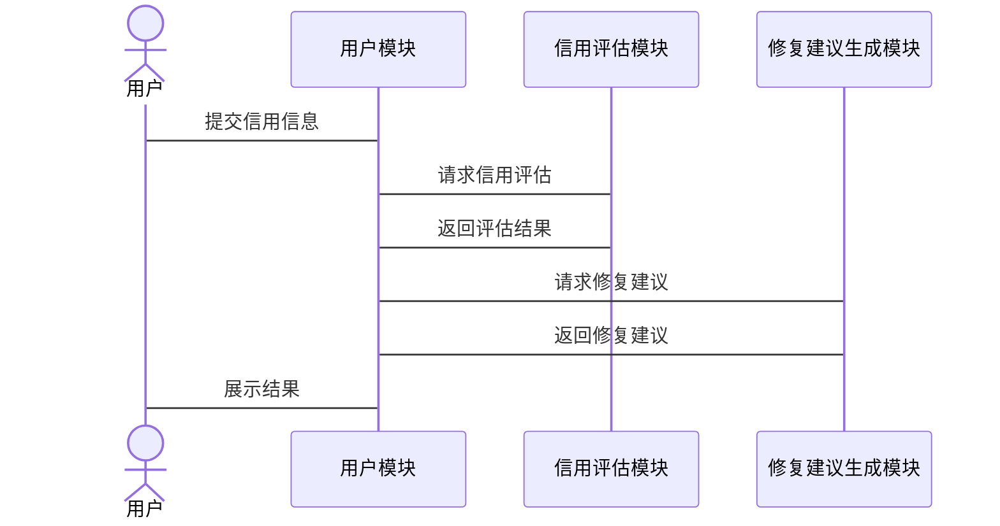

                 


# 个人信用修复建议生成器

## 关键词：个人信用修复、信用评估模型、信用修复算法、系统架构设计、数据隐私保护

## 摘要：  
随着个人征信体系的不断完善，信用修复成为了一个重要的话题。本文将从技术角度详细探讨个人信用修复的实现方法，包括信用修复生成器的核心概念、算法原理、系统架构设计以及实际案例分析。本文旨在为技术人员和用户提供一个全面的技术视角，帮助他们更好地理解和实现个人信用修复。

---

# 第1章: 个人信用修复的背景与问题背景

## 1.1 信用修复的概念与重要性

### 1.1.1 信用修复的定义  
信用修复是指通过合法手段，修正或改善个人信用记录的过程。其目的是帮助个人从负面信用记录中恢复，重新建立良好的信用评分。

### 1.1.2 个人信用修复的必要性  
随着信用评分在金融、贷款、就业等方面的重要性日益增加，个人信用修复的需求也逐渐凸显。例如，信用评分低可能导致贷款被拒，影响个人的生活和事业发展。

### 1.1.3 信用修复与个人征信的关系  
信用修复是对个人征信记录的一种修正和优化，但需注意，信用修复并不意味着删除负面记录，而是通过合法手段改善信用评分。

---

## 1.2 信用修复的核心问题

### 1.2.1 个人信用记录的评估标准  
信用记录的评估标准包括信用历史、还款能力、信用行为等多个维度。不同机构可能采用不同的评估标准，这使得信用修复的策略需要具有灵活性。

### 1.2.2 信用修复的难点与挑战  
- 数据隐私保护：修复过程中需要处理个人敏感信息，如何确保数据安全是一个重要挑战。  
- 算法复杂性：信用修复需要结合多种算法，例如基于机器学习的信用评分模型，这增加了技术实现的难度。  
- 法律与伦理问题：信用修复必须遵守相关法律法规，同时避免对他人造成不公平影响。

### 1.2.3 信用修复的边界与外延  
信用修复的边界在于合法性和合规性，而外延则涉及信用评分的提升、信用记录的优化等。

---

## 1.3 个人信用修复的技术解决方案

### 1.3.1 信用修复的技术手段  
- 数据清洗：通过技术手段清理负面信用记录。  
- 信用评分模型优化：通过改进算法提高信用评分的准确性。  
- 信用修复建议生成：基于算法生成个性化的信用修复建议。

### 1.3.2 信用修复的系统架构  
- 用户模块：用户输入信用记录，系统进行评估。  
- 信用评估模块：基于算法生成信用评分。  
- 修复建议生成模块：根据评估结果提出修复建议。

### 1.3.3 信用修复的法律与伦理问题  
- 遵守相关法律法规，确保数据合规性。  
- 避免对他人造成不公平影响，确保信用修复的公正性。  

---

## 1.4 本章小结  
本章从背景和概念入手，详细介绍了个人信用修复的定义、重要性、核心问题及技术解决方案。接下来的章节将深入探讨信用修复的核心概念与联系、算法原理及系统架构设计。

---

# 第2章: 个人信用修复的核心概念与联系

## 2.1 信用评估模型

### 2.1.1 信用评估模型的定义  
信用评估模型是一种用于评估个人信用状况的数学模型，通常基于历史数据和行为特征进行建模。

### 2.1.2 信用评估模型的分类  
- 传统评分模型：基于统计分析的传统信用评分模型。  
- 机器学习模型：基于机器学习算法的信用评分模型。  
- 综合评分模型：结合多种方法的综合评分模型。

### 2.1.3 信用评估模型的属性特征对比  

| 特性      | 传统评分模型         | 机器学习模型         |
|-----------|----------------------|----------------------|
| 数据要求   | 结构化数据           | 结构化和非结构化数据   |
| 算法复杂度 | 较低                 | 较高                 |
| 可解释性   | 较高                 | 较低                 |

---

## 2.2 信用修复策略

### 2.2.1 信用修复策略的定义  
信用修复策略是指通过调整个人信用行为，改善信用评分的具体方法。

### 2.2.2 信用修复策略的分类  
- 时间修复策略：通过时间的推移，改善信用记录。  
- 行为修复策略：通过改变信用行为，提升信用评分。  
- 综合修复策略：结合多种方法的综合修复策略。

### 2.2.3 信用修复策略的ER实体关系图  

```mermaid
er
actor: 用户
model: 信用评估模型
strategy: 修复策略
```

---

## 2.3 信用修复与数据隐私保护

### 2.3.1 数据隐私保护的重要性  
信用修复过程中，数据隐私保护是至关重要的一环。任何未经授权的数据泄露都可能导致严重的法律和伦理问题。

### 2.3.2 信用修复中的数据隐私保护措施  
- 数据加密：确保数据传输和存储的安全性。  
- 权限控制：严格控制数据访问权限。  
- 匿名化处理：对敏感数据进行匿名化处理。

### 2.3.3 数据隐私保护与信用修复的平衡  
在确保数据隐私的同时，如何最大化信用修复的效果是一个需要权衡的问题。

---

## 2.4 本章小结  
本章通过对比和分析，详细探讨了信用评估模型、修复策略和数据隐私保护的核心概念及联系。接下来的章节将重点讲解信用修复生成器的算法原理。

---

# 第3章: 个人信用修复生成器的算法原理

## 3.1 信用修复算法的原理

### 3.1.1 信用修复算法的基本原理  
信用修复算法的核心目标是通过优化信用评分模型，改善个人信用评分。通常采用基于机器学习的算法进行建模和优化。

### 3.1.2 信用修复算法的核心步骤  


### 3.1.3 信用修复算法的数学模型  

信用修复算法的数学模型可以表示为：  
$$ \text{信用评分} = w_1 x_1 + w_2 x_2 + ... + w_n x_n + b $$  
其中，$w_i$ 是特征$x_i$的权重，$b$ 是偏置项。

---

## 3.2 信用修复算法的实现

### 3.2.1 算法实现的步骤  
1. 数据清洗与预处理。  
2. 特征提取与选择。  
3. 模型训练与优化。  
4. 信用评分预测与修复建议生成。

### 3.2.2 算法实现的代码示例  

```python
import pandas as pd
from sklearn.model_selection import train_test_split
from sklearn.linear_model import LinearRegression

# 数据加载与预处理
data = pd.read_csv('credit_data.csv')
X = data[['feature1', 'feature2']]
y = data['credit_score']

# 数据分割
X_train, X_test, y_train, y_test = train_test_split(X, y, test_size=0.2)

# 模型训练
model = LinearRegression()
model.fit(X_train, y_train)

# 预测与修复建议生成
y_pred = model.predict(X_test)
修复建议 = y_pred + 0.1  # 示例修复策略
```

### 3.2.3 算法实现的数学公式  
修复后的信用评分公式：  
$$ \text{修复后评分} = y_{\text{pred}} + \epsilon $$  
其中，$\epsilon$ 是修复的增量。

---

## 3.3 信用修复算法的优化

### 3.3.1 算法优化的目标  
- 提高信用评分预测的准确性。  
- 降低算法的计算复杂度。  
- 提升修复建议的可行性。

### 3.3.2 算法优化的方法  
- 使用更复杂的模型，如随机森林或神经网络。  
- 调整模型超参数，优化预测效果。  
- 增加数据样本量，提高模型泛化能力。

### 3.3.3 算法优化的效果  
- 预测准确率提高。  
- 计算时间减少。  
- 修复建议更具针对性。

---

## 3.4 本章小结  
本章通过详细讲解信用修复生成器的算法原理，展示了如何通过技术手段实现信用评分的优化。接下来的章节将重点讲解系统架构设计。

---

# 第4章: 个人信用修复生成器的系统分析与架构设计

## 4.1 系统问题场景介绍

### 4.1.1 信用修复生成器的功能需求  
- 支持多种信用评估模型。  
- 提供个性化的修复建议。  
- 具备数据隐私保护功能。

### 4.1.2 信用修复生成器的用户需求  
- 用户希望快速获得信用评分。  
- 用户希望得到具体的修复建议。  
- 用户关注数据隐私保护。

### 4.1.3 信用修复生成器的性能需求  
- 响应时间快。  
- 支持高并发请求。  
- 系统稳定性高。

---

## 4.2 系统功能设计

### 4.2.1 用户模块设计  
- 用户输入信用信息。  
- 用户查看信用评分。  
- 用户获取修复建议。

### 4.2.2 信用评估模块设计  
- 数据清洗与特征提取。  
- 模型训练与评分预测。

### 4.2.3 信用修复建议模块设计  
- 根据评分结果生成修复建议。  
- 提供修复建议的可视化展示。

---

## 4.3 系统架构设计

### 4.3.1 系统架构的分层  
- 数据层：存储信用数据。  
- 业务逻辑层：处理信用评估和修复建议生成。  
- 用户交互层：展示结果和提供用户输入。

### 4.3.2 系统架构图  


---

## 4.4 系统接口设计  

### 4.4.1 API接口设计  
- `/api/v1/credit_assessment`：信用评估接口。  
- `/api/v1/repair_recommendation`：修复建议接口。

### 4.4.2 接口交互流程  



---

## 4.5 本章小结  
本章通过系统架构设计，详细描述了个人信用修复生成器的实现方案。接下来的章节将重点讲解项目实战和最佳实践。

---

# 第5章: 项目实战

## 5.1 环境安装与配置

### 5.1.1 安装Python环境  
- 安装Python 3.x。  
- 安装必要的库，如`pandas`、`scikit-learn`等。

### 5.1.2 安装机器学习框架  
- 安装`scikit-learn`、`xgboost`等机器学习库。

## 5.2 系统核心实现

### 5.2.1 数据加载与预处理  
```python
import pandas as pd

data = pd.read_csv('credit_data.csv')
data = data.dropna()
```

### 5.2.2 模型训练与修复建议生成  
```python
from sklearn.model

