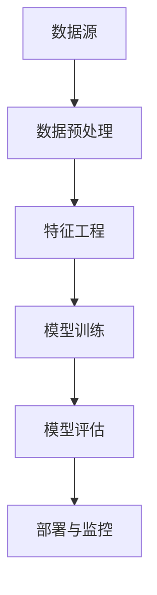

                 


# 个人信用评分系统优化

---

## 关键词
个人信用评分、评分模型优化、机器学习、评分系统设计、评分算法、信用风险控制

---

## 摘要
个人信用评分系统是现代金融风险管理的重要组成部分，其优化对于提高信用评估的准确性和效率具有重要意义。本文系统地探讨了个人信用评分系统的优化策略，从数学模型、算法原理、系统架构到项目实战，详细分析了如何通过数据预处理、特征选择、模型调优等方法提升评分系统的性能。文章还结合实际案例，展示了基于机器学习的信用评分系统设计与实现，并提出了优化过程中的注意事项与最佳实践。通过本文的分析，读者可以全面掌握个人信用评分系统优化的核心技术和实践方法。

---

# 目录

1. [个人信用评分系统概述](#个人信用评分系统概述)
2. [个人信用评分系统的数学模型与算法原理](#个人信用评分系统的数学模型与算法原理)
3. [个人信用评分系统的优化策略](#个人信用评分系统的优化策略)
4. [基于机器学习的个人信用评分系统设计](#基于机器学习的个人信用评分系统设计)
5. [个人信用评分系统的项目实战](#个人信用评分系统的项目实战)
6. [个人信用评分系统优化的注意事项与最佳实践](#个人信用评分系统优化的注意事项与最佳实践)
7. [总结与展望](#总结与展望)

---

## 1. 个人信用评分系统概述

### 1.1 信用评分的基本概念

个人信用评分是通过对个人的信用历史、财务状况、消费行为等多方面信息的综合分析，评估其信用风险的量化指标。信用评分越高，表明个人的信用状况越好，违约风险越低。

### 1.2 信用评分系统的作用

信用评分系统在金融行业中的作用不可忽视。它不仅帮助金融机构评估客户的信用风险，还能提高贷款审批的效率，降低不良贷款率。此外，信用评分还为个人提供了便捷的信用服务，如信用贷款、信用卡额度调整等。

### 1.3 信用评分系统的演变

传统的信用评分主要依赖于人工审核和简单的统计模型。随着大数据和机器学习技术的发展，信用评分系统逐渐向智能化、自动化方向发展，模型的复杂性和准确性也得到了显著提升。

---

## 2. 个人信用评分系统的数学模型与算法原理

### 2.1 逻辑回归模型

#### 2.1.1 模型原理

逻辑回归是一种常用的二分类算法，适用于将连续型变量映射到二分类目标（如违约与非违约）。其核心思想是通过Logit函数将线性回归的结果转化为概率。

公式如下：
$$ P(y=1|x) = \frac{e^{\beta_0 + \beta_1x_1 + \cdots + \beta_nx_n}}{1 + e^{\beta_0 + \beta_1x_1 + \cdots + \beta_nx_n}} $$

#### 2.1.2 优缺点

优点：
- 模型简单，易于解释。
- 训练速度快，适合小规模数据。

缺点：
- 仅适用于二分类问题，无法处理多分类场景。
- 对非线性关系的建模能力有限。

### 2.2 支持向量机（SVM）

#### 2.2.1 模型原理

SVM通过寻找一个超平面，将数据点分成两类。对于非线性问题，SVM可以通过核函数将数据映射到高维空间，从而找到一个非线性决策边界。

公式如下：
$$ y = sign(w \cdot x + b) $$

其中，$w$ 是权重向量，$b$ 是偏置项。

#### 2.2.2 优缺点

优点：
- 对高维数据表现良好。
- 对噪声数据具有较强的鲁棒性。

缺点：
- 参数选择复杂，训练时间较长。

### 2.3 随机森林

#### 2.3.1 模型原理

随机森林是一种基于决策树的集成学习算法。通过构建多棵决策树，并对结果进行投票或平均，随机森林能够有效降低单棵决策树的过拟合风险。

#### 2.3.2 优缺点

优点：
- 抗过拟合能力强。
- 对特征工程依赖较低。

缺点：
- 解释性较差。

---

## 3. 个人信用评分系统的优化策略

### 3.1 数据预处理

#### 3.1.1 数据清洗

- 删除缺失值。
- 处理异常值。

#### 3.1.2 特征工程

- 对特征进行标准化或归一化处理。
- 删除无关特征，提取关键特征。

---

## 4. 基于机器学习的个人信用评分系统设计

### 4.1 系统架构设计

使用Mermaid绘制系统架构图：



### 4.2 系统功能设计

#### 4.2.1 数据采集

从数据库中提取客户的信用历史、收入、消费记录等信息。

#### 4.2.2 特征工程

通过PCA（主成分分析）或LASSO回归等方法进行特征选择，减少特征维度。

---

## 5. 个人信用评分系统的项目实战

### 5.1 实战案例

#### 5.1.1 环境搭建

安装必要的库：
```bash
pip install numpy pandas scikit-learn
```

#### 5.1.2 核心代码实现

逻辑回归模型实现：
```python
from sklearn.linear_model import LogisticRegression
from sklearn.metrics import accuracy_score

# 训练模型
model = LogisticRegression()
model.fit(X_train, y_train)

# 预测与评估
y_pred = model.predict(X_test)
print("Accuracy:", accuracy_score(y_test, y_pred))
```

---

## 6. 个人信用评分系统优化的注意事项与最佳实践

### 6.1 数据隐私保护

在处理个人数据时，必须遵守相关法律法规，确保数据的安全性和隐私性。

### 6.2 模型解释性

选择具有较高解释性的模型，如线性回归或决策树，以便更好地理解和优化模型。

### 6.3 公平性问题

避免模型在评分过程中存在性别、种族等歧视问题，确保评分标准的公平性。

---

## 7. 总结与展望

### 7.1 总结

本文系统地探讨了个人信用评分系统的优化策略，从模型选择到系统设计，再到项目实战，全面分析了如何提升信用评分系统的性能和准确性。

### 7.2 展望

随着人工智能技术的不断发展，信用评分系统将更加智能化和个性化。未来，我们可以期待基于深度学习的评分模型，以及更加智能化的风险控制手段。

---

## 作者

作者：AI天才研究院 & 禅与计算机程序设计艺术

