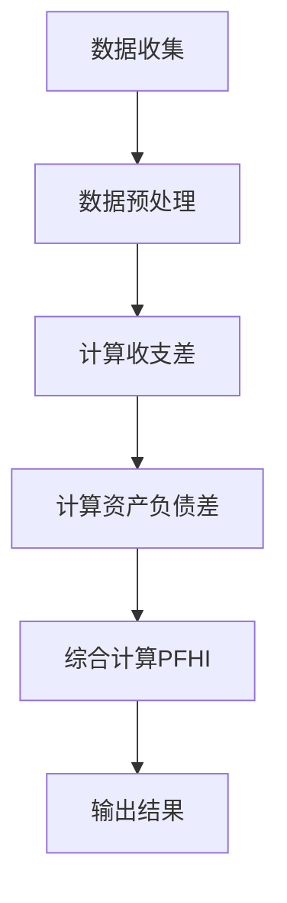
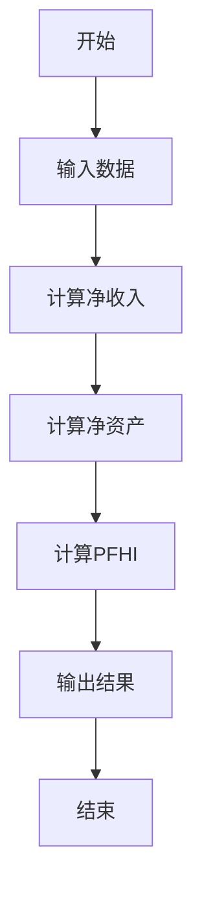
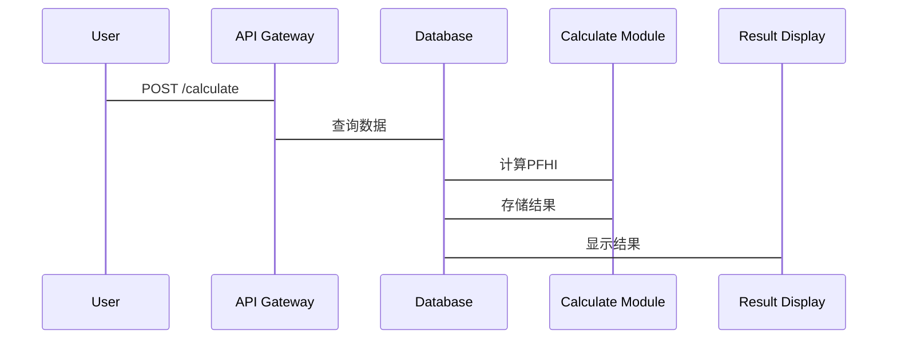

                 


# 个人财务健康指数开发与应用

## 关键词：个人财务健康指数、财务健康评估、数据分析、算法实现、系统架构设计、项目实战

## 摘要：  
本文详细介绍个人财务健康指数的开发与应用，从定义到核心概念，再到算法实现和系统架构设计，结合项目实战，为读者提供全面的指导。文章通过详细的理论分析和实际案例，帮助读者理解如何有效管理和优化个人财务状况。

---

# 第一部分: 个人财务健康指数的背景与核心概念

## 第1章: 个人财务健康指数的定义与背景

### 1.1 个人财务健康指数的定义
#### 1.1.1 财务健康指数的核心概念  
个人财务健康指数（Personal Financial Health Index，PFHI）是衡量个人财务状况健康程度的综合指标，基于收入、支出、资产和负债等多维度数据进行评估。

#### 1.1.2 财务健康指数的计算依据  
- **收入**：包括工资、投资收益等。
- **支出**：包括日常生活开支、债务还款等。
- **资产**：包括现金、存款、房产、投资等。
- **负债**：包括贷款、信用卡欠款等。

#### 1.1.3 财务健康指数的行业标准  
根据行业标准，PFHI的取值范围通常在0到1之间，0表示财务状况极差，1表示财务状况非常健康。

### 1.2 个人财务健康指数的重要性
#### 1.2.1 财务健康指数对企业的影响  
企业可以通过分析员工的PFHI，制定针对性的福利政策，提升员工满意度和工作效率。

#### 1.2.2 财务健康指数对个人的影响  
帮助个人识别财务风险，优化收支结构，实现财务自由。

#### 1.2.3 财务健康指数在金融领域的应用  
金融机构可以利用PFHI评估客户信用风险，制定个性化金融产品。

### 1.3 个人财务健康指数的开发背景
#### 1.3.1 当前个人财务管理的痛点  
- 信息分散：财务数据分布在不同平台，难以整合。
- 缺乏量化工具：缺乏统一标准衡量财务健康状况。

#### 1.3.2 传统财务健康评估的局限性  
传统评估方法通常只关注单一指标，无法全面反映财务状况。

#### 1.3.3 个人财务健康指数开发的目标  
开发一个综合、动态、可操作的个人财务健康评估工具。

---

# 第二部分: 个人财务健康指数的核心概念与联系

## 第2章: 个人财务健康指数的核心要素

### 2.1 财务健康指数的核心概念
#### 2.1.1 收入与支出的关系  
收入是资金来源，支出是资金去向，收支平衡是财务健康的基础。

#### 2.1.2 资产与负债的平衡  
资产是未来收入的来源，负债是未来支出的承诺，平衡两者至关重要。

#### 2.1.3 财务健康指数的计算公式  
$$ \text{PFHI} = \frac{\text{收入} - \text{必要支出} + (\text{资产} - \text{负债})}{\text{总收入}} $$

### 2.2 财务健康指数的属性特征对比
| 财务指标 | 稳定性 | 波动性 | 影响权重 |
|----------|--------|--------|----------|
| 收入     | 高     | 中     | 0.3      |
| 支出     | 中     | 高     | 0.2      |
| 资产     | 高     | 低     | 0.4      |
| 负债     | 低     | 高     | 0.1      |

### 2.3 财务健康指数的计算流程


### 2.4 财务健康指数的优化策略
#### 2.4.1 收入优化  
增加收入来源，如投资理财。

#### 2.4.2 支出优化  
减少非必要开支，优化债务结构。

#### 2.4.3 资产与负债平衡  
合理配置资产，降低负债比例。

---

# 第三部分: 个人财务健康指数的算法实现

## 第3章: 财务健康指数的算法原理

### 3.1 算法核心步骤
#### 3.1.1 数据预处理  
清洗数据，处理异常值。

#### 3.1.2 加权评分  
根据各指标的重要性进行加权评分，例如：
$$ \text{收入权重} = 0.3 $$
$$ \text{支出权重} = 0.2 $$

### 3.2 算法实现
```python
def calculate_PFHI(income, expenses, assets, liabilities):
    net_income = income - expenses
    net_assets = assets - liabilities
    total_income = income
    pfhi = (net_income + net_assets) / total_income
    return pfhi
```

### 3.3 算法流程图


---

# 第四部分: 系统架构与设计

## 第4章: 系统架构设计

### 4.1 系统功能模块
#### 4.1.1 数据输入模块  
用户输入财务数据。

#### 4.1.2 数据处理模块  
清洗和预处理数据。

#### 4.1.3 计算模块  
执行PFHI计算。

#### 4.1.4 结果展示模块  
以图表形式展示结果。

### 4.2 系统架构图
```mermaid
graph LR
    Client --> API Gateway
    API Gateway --> Database
    Database --> Calculate Module
    Calculate Module --> Result Display
```

### 4.3 接口设计
定义RESTful API：
- POST /calculate  
- 输入：JSON格式的财务数据。

### 4.4 交互序列图


---

# 第五部分: 项目实战与案例分析

## 第5章: 项目实战

### 5.1 环境安装
安装Python和必要的库：
```bash
pip install numpy pandas
```

### 5.2 核心代码实现
```python
import pandas as pd

def main():
    data = pd.read_csv('financial_data.csv')
    income = data['income'].mean()
    expenses = data['expenses'].mean()
    assets = data['assets'].mean()
    liabilities = data['liabilities'].mean()
    pfhi = calculate_PFHI(income, expenses, assets, liabilities)
    print(f'PFHI: {pfhi}')

if __name__ == '__main__':
    main()
```

### 5.3 实际案例分析
案例：某用户年收入10万元，支出6万元，资产50万元，负债20万元。
计算结果：PFHI = (10 - 6 + (50 - 20)) / 10 = 0.7。

### 5.4 案例解读
- 0.7表示财务状况良好，但仍有优化空间。

---

# 第六部分: 最佳实践与总结

## 第6章: 最佳实践

### 6.1 小结
个人财务健康指数是衡量财务状况的重要工具，通过科学的算法和系统的架构设计，可以有效帮助个人和企业优化财务管理。

### 6.2 注意事项
- 数据隐私保护
- 定期更新财务数据
- 结合其他财务指标进行综合评估

### 6.3 拓展阅读
推荐书籍：
- 《个人财务管理的艺术》
- 《数据驱动的财务分析》

---

# 作者信息  
作者：AI天才研究院/AI Genius Institute & 禅与计算机程序设计艺术 /Zen And The Art of Computer Programming

