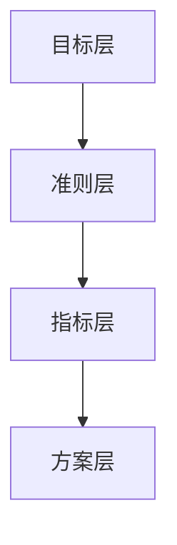

                 


# 个人财务健康评分系统设计

> 关键词：个人财务健康评分系统、财务健康评分模型、层次分析法、系统架构设计、Python实现

> 摘要：本文详细探讨了个人财务健康评分系统的构建过程，从核心概念的解析到算法原理的阐述，再到系统架构设计和项目实战，最后总结了最佳实践。通过本文，读者可以全面了解如何设计和实现一个高效的个人财务健康评分系统。

---

# 第1章: 个人财务健康评分系统背景介绍

## 1.1 问题背景

### 1.1.1 当前个人财务管理的痛点
现代人面临诸多财务问题，例如收入不稳定、支出不合理、资产配置不当等。这些问题可能导致个人财务状况恶化，甚至引发经济危机。传统的财务评分方法通常依赖于简单的指标计算，难以全面反映个人的财务健康状况。

### 1.1.2 传统财务评分的局限性
传统财务评分方法往往仅关注单一维度，例如收入与支出的对比，忽略了资产配置、负债情况等多方面因素。此外，传统方法难以量化风险承受能力和财务行为习惯。

### 1.1.3 建立个人财务健康评分系统的必要性
通过建立一个全面的财务健康评分系统，可以帮助个人更好地了解自己的财务状况，优化财务管理策略，规避潜在风险。

## 1.2 问题描述

### 1.2.1 财务健康评分的定义
财务健康评分是对个人财务状况的综合评估，旨在量化个人的财务健康程度，帮助其制定合理的财务规划。

### 1.2.2 系统目标与功能需求
系统目标：构建一个全面、科学的个人财务健康评分模型，提供个性化的财务健康评估和改进建议。

功能需求：
1. 收集和分析用户的财务数据。
2. 生成财务健康评分。
3. 提供可视化报告和改进建议。

### 1.2.3 用户画像与使用场景
目标用户：个人用户（包括学生、上班族、自由职业者等）。

使用场景：个人财务管理、投资决策、信贷评估等。

## 1.3 问题解决方法

### 1.3.1 财务评分模型的设计思路
采用多层次指标体系，结合定量分析与定性分析，构建全面的财务健康评分模型。

### 1.3.2 数据采集与处理方案
数据来源：银行流水、资产清单、收入支出记录等。

数据处理：数据清洗、特征提取、标准化处理。

### 1.3.3 系统实现的技术路线
采用层次分析法（AHP）进行评分计算，结合机器学习算法进行优化。

---

# 第2章: 个人财务健康评分系统的核心概念

## 2.1 财务健康评分模型的定义与特点

### 2.1.1 财务健康评分的定义
财务健康评分是对个人财务状况的综合评估，通常以分数形式表示，分数越高表示财务状况越好。

### 2.1.2 财务健康评分的特点
1. 综合性：涵盖收入、支出、资产、负债等多个维度。
2. 动态性：根据实时数据更新评分。
3. 可解释性：评分结果可分解为具体指标。

## 2.2 财务健康评分模型的构成要素

### 2.2.1 收入与支出分析
- 收入稳定性：反映收入来源的可靠性。
- 支出合理性：分析支出是否超出收入范围。

### 2.2.2 资产与负债评估
- 资产配置：评估资产的多样性和安全性。
- 负债比率：计算负债占总收入的比例。

### 2.2.3 财务行为习惯
- 储蓄习惯：分析储蓄率是否合理。
- 投资行为：评估投资的多样性与风险控制。

### 2.2.4 风险承受能力
- 财务缓冲能力：分析应对突发支出的能力。
- 投资风险偏好：评估对高风险投资的承受能力。

## 2.3 财务健康评分标准的制定

### 2.3.1 评分标准的制定原则
1. 客观性：评分标准应基于实际数据。
2. 可操作性：评分指标应易于计算和获取。
3. 综合性：涵盖多维度的财务指标。

### 2.3.2 评分等级的划分
- 优秀：80-100分
- 良好：60-79分
- 一般：40-59分
- 不健康：0-39分

### 2.3.3 评分指标的权重分配
指标权重应根据实际数据和用户需求进行动态调整。例如，收入稳定性占总权重的30%，支出合理性占20%，资产配置占25%，负债比率占15%，财务行为习惯占10%。

## 2.4 财务健康评分的影响因素

### 2.4.1 收入稳定性
收入稳定性是财务健康评分的重要指标，收入越稳定，评分越高。

### 2.4.2 支出合理性
支出是否超出收入范围直接影响评分结果。合理的支出可以提高评分。

### 2.4.3 资产配置优化
多样化的资产配置可以降低风险，提高评分。

### 2.4.4 债务管理能力
负债比率过高的用户评分会显著下降。

### 2.4.5 投资风险控制
高风险投资可能导致评分下降，稳健的投资策略有助于提高评分。

---

# 第3章: 个人财务健康评分系统的算法原理

## 3.1 财务健康评分模型的算法选择

### 3.1.1 常见评分算法的对比
- 线性回归：简单易用，但无法处理多维度指标。
- 层次分析法（AHP）：适合多维度指标的综合评估。
- 机器学习算法：精度高，但实现复杂。

### 3.1.2 选择合适算法的原因
层次分析法（AHP）适合处理多维度的财务指标，且具有良好的可解释性。

### 3.1.3 算法的优缺点分析
- 优点：计算简单，易于解释。
- 缺点：对指标权重的敏感性较高。

## 3.2 层次分析法（AHP）的应用

### 3.2.1 层次分析法的基本原理
层次分析法是一种将复杂决策问题分解为多个因素，通过计算各因素权重来确定决策优先级的方法。

### 3.2.2 层次分析法的步骤
1. 构建层次结构模型。
2. 构造比较矩阵。
3. 计算权重向量。
4. 计算一致性检验。
5. 确定最终评分。

### 3.2.3 算法流程图



## 3.3 算法实现的数学模型

### 3.3.1 权重计算公式
$$ A = \frac{a_{ij}}{\sum_{i=1}^{n} a_{ij}} $$

### 3.3.2 一致性检验公式
$$ C.R = \frac{C.I}{R.N} $$

其中：
- C.I 为一致性指标
- R.N 为随机一致性指标

### 3.3.3 评分计算公式
$$ S = \sum_{i=1}^{n} w_i \times x_i $$

其中：
- \( w_i \) 为第i个指标的权重
- \( x_i \) 为第i个指标的得分

### 3.3.4 示例计算
假设某用户收入稳定性得分为80，支出合理性得分为70，资产配置得分为85，负债比率得分为60，财务行为习惯得分为75。各指标权重分别为30%、20%、25%、15%、10%。则：

$$ S = 0.3 \times 80 + 0.2 \times 70 + 0.25 \times 85 + 0.15 \times 60 + 0.1 \times 75 = 76.5 $$

---

# 第4章: 个人财务健康评分系统的设计与实现

## 4.1 系统分析与架构设计

### 4.1.1 系统功能设计
1. 数据采集模块：收集用户的财务数据。
2. 数据处理模块：清洗和转换数据。
3. 评分计算模块：基于层次分析法计算评分。
4. 报告生成模块：输出可视化报告。
5. 优化建议模块：提供个性化建议。

### 4.1.2 系统架构设计


### 4.1.3 系统接口设计
1. 数据接口：与银行等第三方机构对接。
2. 用户接口：提供数据输入和报告查看功能。
3. API接口：供其他系统调用。

### 4.1.4 系统交互流程图

```mermaid
graph LR
    A(用户) -> B(登录/注册)
    B -> C(输入财务数据)
    C -> D(数据处理)
    D -> E(计算评分)
    E -> F(生成报告)
    F -> G(查看报告)
```

## 4.2 项目实战

### 4.2.1 环境安装
需要安装Python、pandas、numpy、scipy等库。

### 4.2.2 核心代码实现

```python
import numpy as np
import pandas as pd
from scipy.cluster import hierarchy

# 示例数据
data = {
    '收入稳定性': [80, 70, 90],
    '支出合理性': [70, 60, 80],
    '资产配置': [85, 75, 85],
    '负债比率': [60, 50, 70],
    '财务行为习惯': [75, 65, 80]
}

df = pd.DataFrame(data)

# 权重计算
weights = np.array([0.3, 0.2, 0.25, 0.15, 0.1])

# 评分计算
scores = np.dot(df.values, weights)

# 一致性检验
C.I = np.max(scores)
R.N = len(scores)
C.R = C.I / R.N

print("评分结果:", scores)
print("一致性比值:", C.R)
```

### 4.2.3 代码解读与分析
上述代码展示了如何使用层次分析法计算财务健康评分。首先，输入数据并定义权重，然后通过点积计算最终评分。

### 4.2.4 实际案例分析
以一个用户的财务数据为例，计算其财务健康评分为76.5分，属于良好等级。

---

# 第5章: 最佳实践与小结

## 5.1 系统设计经验总结
1. 数据采集是关键，确保数据的完整性和准确性。
2. 算法选择需结合实际需求，层次分析法适合多维度评估。
3. 系统架构设计应注重模块化和可扩展性。

## 5.2 改进建议
1. 引入机器学习算法，提高评分精度。
2. 增加用户行为分析，提供个性化建议。
3. 实现实时数据更新，提高评分的动态性。

## 5.3 注意事项
1. 数据隐私保护至关重要。
2. 算法的可解释性需重点关注。
3. 系统需定期维护和更新。

## 5.4 未来展望
随着人工智能技术的发展，个人财务健康评分系统将更加智能化和个性化。

---

# 参考文献
1. 层次分析法（AHP）相关文献
2. 个人财务管理相关书籍
3. Python数据处理库官方文档

---

# 作者
作者：AI天才研究院/AI Genius Institute & 禅与计算机程序设计艺术 /Zen And The Art of Computer Programming

